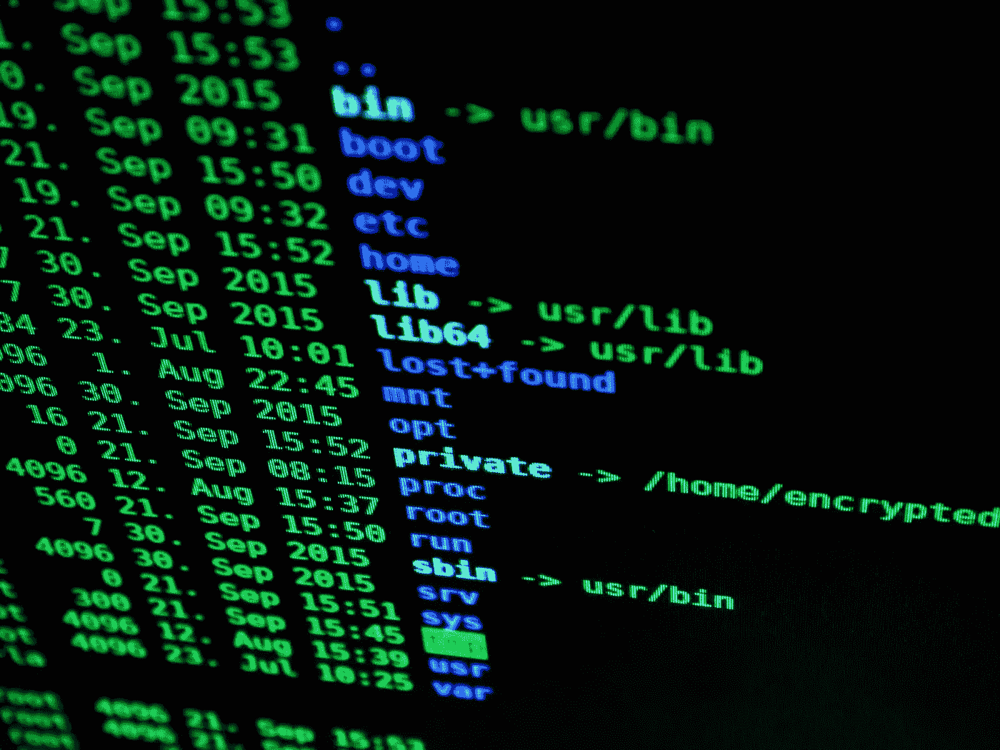

# 2020 年的数据工程

> 原文：<https://towardsdatascience.com/data-engineering-in-2020-e46910786eda?source=collection_archive---------2----------------------->

照片由[像素](https://www.pexels.com/photo/abstract-art-blur-bright-373543/?utm_content=attributionCopyText&utm_medium=referral&utm_source=pexels)的[皮克斯拜](https://www.pexels.com/@pixabay?utm_content=attributionCopyText&utm_medium=referral&utm_source=pexels)拍摄

数据处理工具和技术的发展速度之快令人难以置信。随之而来的是，数据工程学科的本质也在发生变化。我今天使用的工具与我十年前甚至五年前使用的工具有很大不同，然而，许多经验教训在今天仍然适用。

早在[数据工程成为一件事](https://medium.com/free-code-camp/the-rise-of-the-data-engineer-91be18f1e603)和[数据科学家成为 21 世纪最性感的工作](https://hbr.org/2012/10/data-scientist-the-sexiest-job-of-the-21st-century)之前，我就已经开始在数据领域工作了。六年前，我“正式”成为一名大数据工程师，我直接了解具有“传统”数据开发背景的开发人员在这一过程中所面临的挑战。当然，这种转变对软件工程师来说也不容易，只是不同而已。

尽管技术在不断变化——这是在技术行业工作的任何人的现实——我必须学习的一些技能仍然相关，但经常被刚刚开始向数据工程过渡的数据开发人员忽略。这些通常是软件开发人员认为理所当然的技能。

在这篇文章中，我将谈论数据工程的演变以及“传统”数据开发人员今天可能需要学习的技能(提示:它不是 Hadoop)。

# 数据工程师的诞生。

大数据热潮之前的数据团队是由商业智能和 ETL 开发人员组成的。典型的 BI / ETL 开发人员活动包括将数据集从位置 A 移动到位置 B (ETL ),并使用该数据构建 web 托管的仪表板(BI)。这些活动都有专门的技术，知识集中在 IT 部门。然而，除此之外，BI 和 ETL 开发与软件工程几乎没有什么关系，软件工程是在本世纪初非常成熟的学科。

随着数据量的增长和对数据分析兴趣的增加，在过去的十年中，新技术不断涌现。他们中的一些人死了，其他人被广泛采用，这反过来改变了对技能和团队结构的需求。随着现代 BI 工具允许分析师和业务人员在 IT 团队支持最少的情况下创建仪表板，数据工程成为一门新的学科，使用一套新的工具将软件工程原则应用于 ETL 开发。

# 挑战。

亚历山大·杜默摄于[佩克斯](https://www.pexels.com/photo/people-laptop-industry-internet-132700/?utm_content=attributionCopyText&utm_medium=referral&utm_source=pexels)

创建数据管道听起来很容易，但是在大数据规模下，这意味着将十几种不同的技术(或者更多！).数据工程师必须深入了解各种技术，为工作选择正确的工具，并用 Scala、Java 或 Python 编写代码来创建弹性和可伸缩的解决方案。数据工程师必须了解他们的数据，才能创造出受益于分布式处理能力的工作。数据工程师必须了解基础架构，才能确定失败作业的原因。

从概念上讲，这些数据管道中有许多是典型的 ETL 作业——从许多数据源收集数据集，将它们放在一个集中的数据存储中，准备进行分析，并为商业智能或机器学习进行转换。然而，“传统的”ETL 开发人员不具备在大数据世界中执行这些任务的必要技能。

# 今天还是这样吗？

我看过很多描述数据工程师应该具备哪些技能的文章。他们大多建议学习像 Hadoop、Spark、Kafka、Hive、HBase、Cassandra、MongoDB、Oozie、Flink、Zookeeper 这样的技术，这样的例子不胜枚举。

虽然我同意了解这些技术不会有什么坏处，但我发现在今天的许多情况下，在 2020 年，“了解它们”就足够了——它们旨在解决哪些特定的用例，它们应该或不应该在哪里使用，以及有哪些替代方案。近年来，快速发展的云技术带来了大量的云原生应用和服务。正如几年前现代 BI 工具使数据分析更容易为更广泛的业务所用一样，现代云原生数据堆栈简化了数据接收和转换任务。

> 我不认为像 Apache Spark 这样的技术在未来几年内会变得不流行，因为它们非常适合复杂的数据转换。
> 
> 尽管如此，像雪花和谷歌 BigQuery 这样的云数据仓库的高采用率表明它们提供了某些优势。其中之一是 Spark 需要高度专业化的技能，而基于云数据平台的 ETL 解决方案严重依赖 SQL 技能，即使对于大数据也是如此——这样的角色更容易胜任。

# 数据开发人员需要具备哪些技能？

照片由[像素](https://www.pexels.com/photo/blur-bright-business-codes-207580/?utm_content=attributionCopyText&utm_medium=referral&utm_source=pexels)的[皮克斯拜](https://www.pexels.com/@pixabay?utm_content=attributionCopyText&utm_medium=referral&utm_source=pexels)拍摄

BI / ETL 开发人员通常对数据库基础、数据建模和 SQL 有很强的理解。这些技能今天仍然很有价值，并且大多数可以转移到现代数据堆栈中，这比 Hadoop 生态系统更精简、更容易学习。

以下是我经常观察到的“传统”数据开发人员在知识方面存在差距的三个领域，因为在很长一段时间里，他们没有软件工程师拥有的工具和方法。理解和修复这些差距不会花费很多时间，但可能会使向一组新工具的过渡更加顺利。

1.  **版本控制(Git)和对 CI/CD 管道的理解**

SQL 代码是一种代码，因此，应该应用软件工程原则。

*   了解谁、何时以及为什么更改了代码是很重要的
*   代码应该与可以自动运行的测试一起提供
*   代码应该很容易部署到不同的环境中

我是 [DBT](https://www.getdbt.com/) 的忠实粉丝——这是一个开源工具，它将软件工程的最佳实践带到了 SQL 世界，并简化了所有这些步骤。它比那要多得多，所以我强烈建议去看看。

**2。对现代云数据分析体系有很好的理解**

我们倾向于坚持使用我们熟悉的工具，因为它们通常会让我们更有效率。然而，我们面临的许多挑战并不是独一无二的，而且通常可以在今天更有效地解决。

一开始尝试在云生态系统中导航可能会令人生畏。一个解决办法是学习其他公司的经验。

许多成功的创业公司都非常开放他们的数据堆栈和他们在旅程中学到的经验教训。如今，采用云数据仓库版本和其他几个组件进行数据摄取(如 Fivetran 或 Segment)和数据可视化是很常见的。看到一些架构通常足以获得 10，000 英尺的视野，并知道在需要时进一步研究什么—例如，处理事件或流数据可能是一个全新的概念。

**3。除了 SQL 之外还要知道一门编程语言**

尽管我很喜欢 Scala，但 Python 似乎是今天开始的一个安全的赌注。它相当容易掌握，受到数据科学家的喜爱，并且几乎得到云生态系统所有组件的支持。SQL 非常适合许多数据转换，但有时在将复杂的数据结构吸收到表中或使用它自动化数据管道中的特定步骤之前，用 Python 解析复杂的数据结构更容易。

> 这不是一个详尽的列表，不同的公司可能需要不同的技能，这就是我的最后一点…

# 数据工程师的角色正在发生变化。

照片由[克里斯蒂娜·莫里路](https://www.pexels.com/@divinetechygirl?utm_content=attributionCopyText&utm_medium=referral&utm_source=pexels)从[派克斯](https://www.pexels.com/photo/woman-holding-laptop-beside-glass-wall-1181316/?utm_content=attributionCopyText&utm_medium=referral&utm_source=pexels)拍摄

在过去的几年里，数据处理工具和技术有了很大的发展。他们中的许多人已经发展到可以随着数据量的增长轻松扩展，同时也能很好地处理“小数据”的程度。这可以显著简化数据分析堆栈和使用它所需的技能。

是否意味着数据工程师的角色正在发生变化？我也这么认为这并不意味着它变得更容易—业务需求随着技术的进步而增长。然而，看起来这个角色可能会变得更加专业化或者分成几个不同的学科。

新工具使数据工程师能够专注于核心数据基础设施、性能优化、定制数据接收管道和整体管道编排。同时，那些管道中的数据转换代码可以由熟悉 SQL 的任何人拥有。比如[分析工程](https://www.datacouncil.ai/blog/emerging-data-roles-the-analytics-engineer)开始成为一个东西。这个角色位于数据工程和数据分析的交叉点，专注于数据转换和数据质量。云数据仓库工程是另外一个。

不管职称的区别是否会被广泛采用，我相信“传统的”数据开发人员拥有许多基本技能，可以在当今许多与数据工程相关的活动中取得成功——强大的 SQL 和数据建模是其中的一部分。通过了解现代云分析数据堆栈以及不同组件如何组合在一起，学习编程语言并习惯版本控制，这种过渡可以相当无缝。