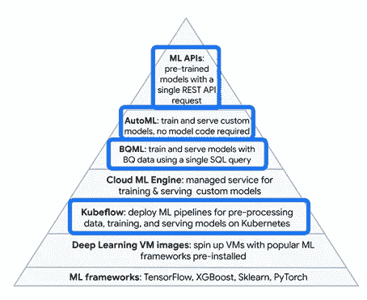

# GCP 专业化的数据工程

> 原文：<https://towardsdatascience.com/data-engineering-on-gcp-specialisation-a-comprehensive-guide-for-data-professionals-4bb8bae8a1c7?source=collection_archive---------26----------------------->

## 数据专业人员综合指南

## 从 Coursera 专业化到认证考试

如果你是一名考虑提升技能的数据专业人士，学习选项并不缺乏，但如果你正在寻找将数据和分析迁移到云的方法，你只能在有限的公共云提供商之间进行选择。

本指南关注谷歌云，更具体地说是谷歌云上的[数据工程](https://www.coursera.org/professional-certificates/gcp-data-engineering)专业化(正式名称为谷歌云上的数据工程专业证书)，并为您提供最新信息和实用建议。

它是基于我自己完成专业化的经验，以及从在该领域工作的其他数据工程师那里收集的信息。

如果你对[谷歌云专业数据工程师认证考试](https://cloud.google.com/certification/data-engineer)感兴趣，那么无论如何**专业将会是你的起点**。还将讨论认证考试。

该指南包括以下内容:

1.  **相关学习选项概述**
2.  **材料涵盖的内容**
3.  **为什么要考虑数据工程专业化**
4.  **回顾:有什么好/缺什么/有什么亮点**
5.  **专业化的实用技巧**
6.  **完成专业化后的后续步骤**
7.  **认证考试**

阅读完这些信息后，你应该能更好地决定这门课程是否适合你。

# 关于专业化

首先，让我们确定你在正确的地方。

谷歌云专业化的[数据工程是属于谷歌云](https://www.coursera.org/professional-certificates/gcp-data-engineering)[数据轨道](http://loadhtml/%20https:/cloud.google.com/training/data-ml)的几个按需专业化之一。

它有一个“孪生兄弟”，一个叫做[数据工程、大数据和谷歌云上的机器学习](https://www.coursera.org/specializations/gcp-data-machine-learning)的专业。两个专业都在 2020 年 2 月接受了一次[大修](https://cloud.google.com/blog/topics/training-certifications/google-clouds-data-engineering-learning-path-is-now-updated)。本指南适用于两者的**改款**。我将解释两者之间的细微差别(以及如何一石二鸟，如果你想这么做的话)。

# 1.谷歌云的学习选项

这一部分将帮助你把专业化放在上下文中，并了解它如何与各种学习选项相关联。由于有多种选择，找到最佳学习路径并不总是显而易见的。

谷歌云的选项包括:

1.  实验室
2.  探索
3.  课程
4.  特化作用
5.  专业认证。

几个主题，如 BigQuery、Data Studio 和 AI 笔记本，涵盖在多个实验室、课程和专业中，尽管深度各不相同。

为了简单起见，把一门课程想象成你将用来**有意义地“学习一些东西”**的标准单元。然后将所有其他上游或下游选项与该课程概念相关联。

*   **课程**由谷歌制作，但通过外部提供商提供，如 Coursera 和 Pluralsight。
*   一门课程，连同视频和阅读材料，将让你有机会进入几个**实验室**，这将作为家庭作业的一部分。这些实验室由 Qwiklabs 托管，qwik labs 是一家被谷歌收购的培训公司。
*   如果你想要更多的练习，你通常可以在 Qwiklabs 网站上找到与感兴趣的特定主题相关的附加实验。有 400 多个实验室覆盖了几乎所有的谷歌云产品。
*   许多实验室结合了不止一个谷歌云产品。这些相关的实验室组成小组，所谓的**任务，**任务可以有不同的难度。
*   一个**专业**通常是四到五门课程的集合，这些课程基于一个更广泛的主题，例如数据工程。
*   一旦你成功完成了专业化，你就可以开始考虑相应的**谷歌认证考试**(阅读下文了解更多)。

# 2.**覆盖什么材料**

**处于高水平**

专业化教会你如何设计和管理云上的数据管道:从**访问来自各种来源的数据**和**转换**并存储它们，到**执行分析**以获得商业见解或机器学习以进行预测。然后，它会教你如何打包所有这些步骤，并使数据管道自动化。工作流必须适应任何类型的数据量、速度和多样性。

数据是成批到达**还是流式传输**进入？是**结构化还是非结构化**？是很小还是特别大？这些都是数据工程师必须知道如何处理好的工作方面，它们都在本课程中得到了全面的阐述。

最终目标是通过为企业提供基于数据的决策来增加价值。

由 [roman pentin](https://unsplash.com/@romanenko29061983?utm_source=medium&utm_medium=referral) 在 [Unsplash](https://unsplash.com?utm_source=medium&utm_medium=referral) 上拍摄的照片

**产品**

例如，当可视的最终产品是交互式实时仪表板或自适应 ML 驱动的 web 应用程序时，数据工程师通常是使这一切成为可能的**隐形英雄**。

然而，要实现这一切，你必须熟悉越来越多的谷歌云工具，这些工具在构成专业的 **6 门课程**中逐渐被涵盖。

以下是涵盖的一些**关键产品:**

云存储，BigQuery 包括 BigQuery ML 和 Data Studio，Dataflow，Dataproc，Pub/Sub，Composer，Datafusion，Kubeflow，ML APIs，AutoML，AI 笔记本。

如果你想了解更多关于这些产品的信息，有一本**方便的指南**描述了每一个产品，还有很多其他的谷歌云产品，篇幅不超过 [4 个字](https://github.com/gregsramblings/google-cloud-4-words)。

学习使用所有这些产品就像是将不同的谷歌云产品拼在一起，你需要决定哪些部分最适合在性能、实用性和成本效益之间取得合理的平衡。

# 3.为什么选择专业化？

如果你在专业上朝着数据工程的方向发展(有[很好的理由](https://www.datanami.com/2020/02/12/demand-for-data-engineers-up-50/)这么做)，这个问题的答案很明显。

如果您想知道为什么要在云上进行，那么[无运营/无服务器](https://www2.deloitte.com/us/en/insights/focus/tech-trends/2019/noops-serverless-computing-transforming-it-operations.html)的自动化承诺可能会非常有吸引力。

此外，**如果你是数据分析师、数据科学家或领导这种类型团队的人**，如果你想了解云+人工智能+数据结合在一起时创造的可能性，这种专业化将与你非常相关。如果这符合你的特点，我推荐你去看看专业学院的以下 **3 门课程**:

*   [大数据和 ML 基础知识](https://www.coursera.org/learn/gcp-big-data-ml-fundamentals?specialization=gcp-data-machine-learning)
*   [数据湖和数据仓库](https://www.coursera.org/learn/data-lakes-data-warehouses-gcp?specialization=gcp-data-machine-learning)
*   [GCP 的智能分析、人工智能和人工智能](https://www.coursera.org/learn/smart-analytics-machine-learning-ai-gcp)

# 4.回顾

# 4.1 关于专业化的基本信息

[twinsfisch](https://unsplash.com/@twinsfisch?utm_source=medium&utm_medium=referral) 在 [Unsplash](https://unsplash.com?utm_source=medium&utm_medium=referral) 上拍摄的照片

**难度:**与其他 Coursera 编程课程相比，难度属于中等水平，因为你实际上并不需要调试代码。

**时间承诺:**和上面的原因一样，如果你想的话，你可以相当快的完成六门课程。但不建议把所有课程都挤在一两周内。最好给自己一些时间来吸收这些概念，并边走边练习。

成绩:通过测验和实验需要 80%或更多的分数，但是你可以尝试多次。最终结果不包含数字或字母等级(只是及格)。

**必备知识:**

*   **SQL** 了解数据库管理/提取-转换-加载/大数据的概念和术语
*   **基本命令行**
*   **脚本语言**基础知识(部分实验室使用 Python)

熟悉一般云(虚拟机、存储等。)和机器学习概念也很有用，尽管入门课程将帮助您快速掌握这些概念。

**基础知识足够**。在上述任何领域都不需要深厚的专业知识。

# 4.2 有什么好的？

*   **高质量的生产**和易于跟进的材料，在课程和不同部分之间自然流动。
*   **2020 更新内容，**包括一些仍在 alpha 中的酷功能。
*   良好的**平衡**概念**和**实践方面的**。**
*   所有课程中都有大量的**动手实验**和演示。
*   **关于各种工具和技术如何随时间演变的背景和观点**。
*   所有内容要么是 SQL 要么是 Python(不需要 java 编程，这使得课程更具包容性**)。**
*   ****提示和技巧**如何降低账单，尤其是针对 BigQuery**

# **4.3 缺少什么？**

*   **编写代码的机会越来越多，随着进展，实验室通常会变得更加自主。**
*   **更多**活跃论坛**对话**
*   **更多**详细测验**有助于更好地理解概念。**
*   **更多的 **TensorFlow** ，至少是一个概述或者介绍。尽管 TensorFlow 是谷歌的一个标志性项目，但它实际上已经消失了。**
*   **更多内容超出了构建机器学习模型所需的几行 SQL 代码。它还应该涵盖机器学习过程的**基础知识、可能的陷阱以及评估结果的方法，以便数据工程师能够更自信地应用它。****
*   **更多关于**服务成本的讨论以及**与其他可用选项的比较。例如，“如果在课程之外进行，运行实验室的平均成本是多少？”**

# **4.4 亮点**

**根据我的专业经验，以下是我个人关于谷歌云数据分析和工程的*亮点*:**

****1。BigQuery 的普遍存在****

**BigQuery 提供了比数据仓库更多的功能。它存在于每一门课程中，并与数据工程管道中的几乎每个阶段相联系。随着数据湖和数据仓库之间的界限变得模糊，传统的 ETL 开始看起来更像 ELT，它的地位可能仍然是中心。**

****2。多层次机器学习的可及性****

**通过像 BigQuery 和 **BigQuery ML** (一个集成到 BigQuery 中的框架)这样的产品，以及结合 **AutoML** 和**预先训练的 ML API**，在机器学习的可访问性和可扩展性方面出现了一个新的现实。现在，开发人员、数据分析师和数据科学家可以从不同角度来研究机器学习。**

****3。机器学习流水线的自动化****

**在第 1 点和第 2 点之后，通过人工智能平台上 Kubleflow 管道的管理体验，达到了下一个抽象层次。 **Kubeflow pipelines** 在完整的机器学习工作流程(数据预处理、特征工程、模型训练和部署)中协调 BigQuery 和 BigQuery ML 以及多个其他步骤，使可扩展和可重用的机器学习解决方案的生产成为可能。**

****注意**:在本课程中，您只能感受到其中的一点点味道，但是无需管理 Kubernetes 集群就能实现这一点的前景无疑是充满希望的。**

****

**上面讨论的 Kubeflow、BQML、AutoML 和 ML APIs 代表了 Sara Robinson 金字塔中的不同抽象层次，它展示了 GCP 上可用的各种 ML 选项，以适应不同的用例及技能组合。**

# **5.实用技巧**

****1。获得离线访问。****

**如果你想在离线状态下不受干扰地学习课程，同时建立一个包含所有相关内容的图书馆，你可以使用 [Coursera-dl](https://github.com/coursera-dl/coursera-dl) ，这是一个开源工具，可以自动下载所有可用的视频和幻灯片。**

****2。获取代码。****

**如果你没有时间完成整个专门化，但是你仍然希望看到例子和使用的代码，你可以在这个 [GitHub repo](https://github.com/GoogleCloudPlatform/training-data-analyst/tree/master/courses/data-engineering/demos) 中找到实验室使用的所有代码——布局很像食谱库。**

****3。获取资源****

**每个实验给你 1.5-2 个小时的时间，这通常是绰绰有余的，剩下的时间可以用来试验谷歌云，而不需要从你的信用卡上收费。**

> ****将 GitHub repos 中的幻灯片、视频、演示、实验和代码结合起来，以一种对您有意义的方式进行组织。这样，你可以建立一个食谱库，帮助你解决一些常见的使用案例——非常有用，尤其是在课程结束后的第一步。****

****4。1 个**中的 2 个认证**

**你更喜欢你的最终证书上写着“GCP 的数据工程、大数据和机器学习”而不是“数据工程”吗？这两个专业实际上是相同的。唯一的区别是，数据工程专业包含一门额外的课程，旨在为专业考试做准备。一旦你完成了数据工程专业，你可以注册另一个，你将立即收到其他认证(没有额外的费用，也没有额外的课程或实验室)。**

****5。第一个月免费。****

**如果你没有赞助商，谷歌通常会通过 [CloudOnAir](https://cloudonair.withgoogle.com/) 网上研讨会或其他[促销活动](https://inthecloud.withgoogle.com/training-discount/register.html)提供第一个月的免费或大幅折扣——小心他们。或者，您也可以在购买课程前对其进行编辑(在您注册时寻找此选项，因为它可能不太明显)。无论如何，如果你考虑到在离线环境中提供的相同内容的价格可以超过 2000 美元，那么这笔钱是非常值得的。**

# **6.后续步骤—认证考试**

## **专业考试成功秘诀**

***本部分提示由认证工程师* [*Suraj Pabari 提供。*](https://www.linkedin.com/in/suraj-pabari-55aa7021)**

**通过专业的 6 门课程当然不能保证你会精通这个主题。**

**完成专业学习并积累大量实践经验后，下一步可能是准备[专业数据工程师考试](https://cloud.google.com/certification/data-engineer)。这是一个向你的客户和雇主展示你的经验的正式资格。**

**完成专科后如何准备考试？**

**以下是三个很好的建议:**

**1.**理解为什么:**在做练习考试题时，与其跳到‘感觉对’的答案，不如试着理解为什么答案可能是对的。例如，应该使用 BigTable 而不是 BigQuery 吗？在什么情况下可以使用 BigQuery？为什么不用谷歌云存储？浏览给出的所有选项，并尝试理解每个选项的适用范围。如果你犯了一个错误，试着理解你为什么错了，这样你就不会犯同样的错误两次。**

**2.**用例研究**:专门化包括一些有用的用例研究:回顾这些并尝试开发一个在给定约束条件下能够工作的基础设施。这将测试你的理解能力，也非常适用于你可能面临的潜在现实生活挑战。思考每个阶段的权衡，并提出选择。您还可以考虑与您合作的公司的需求，并尝试提出最合适的基础架构。**

**3.**练习应用你的知识:**确保你真正理解概念，给自己设定挑战，测试你是否能使用谷歌云产品完成挑战。Kaggle 有一些很棒的例子(也有笔记本答案)。思考公共数据源的有用示例:例如，您能否使用 BQML 来预测 COVID 案例数量和股票价格之间的关系，或者使用 Google Analytics 数据建立购买倾向模型。**

**关于额外的提示，我推荐查看 [Panagiotis Tzamtzis 的博客文章](https://tzamtzis.gr/2018/digital-analytics/becoming-gcp-data-engineer/)和 [Vinoaj Vijeyakumaar 的幻灯片](https://www.slideshare.net/vinoaj/measure-camp-how-to-pass-your-gcp-professional-data-engineer-exam-20181020)。**

**另请注意，截至 2020 年 5 月，[官方谷歌云认证专业数据工程师学习指南](https://www.wiley.com/en-us/Official+Google+Cloud+Certified+Professional+Data+Engineer+Study+Guide-p-9781119618454)已有印刷版本。**

# **7.后续步骤—更多建议**

**或者，您可以跟进数据跟踪的另一个专门化，例如[从数据到洞察](https://cloud.google.com/training/courses/data-to-insights)或[使用 TensorFlow 的机器学习](https://www.coursera.org/specializations/machine-learning-tensorflow-gcp)。一些主题，如 BigQuery 或 AI 平台，在这些其他专业中有更深入的讨论。**

**另一个选择是**追求深度**而不是广度，专注于你发现与你自己的工作最相关的**数据工程的各个方面，同时也要意识到全貌。****

**您可以关注与您在数据工程领域感兴趣的特定领域共享内容的社区和个人。**

**例如，如果你对 BigQuery 和 BigQuery ML 感兴趣，你会发现谷歌人 [Lak Lakshmanan](https://twitter.com/lak_gcp) 、 *BigQuery 权威指南*的作者和专业讲师，以及谷歌开发者倡导者 [Felipe Hoffa](https://twitter.com/felipehoffa) (以及他的 BigQuery [twitter 列表](https://twitter.com/i/lists/1169153843462135808))和 [Polong Lin](https://twitter.com/polonglin) 分享的精彩内容。**

****更多建议:****

*   **查看 [GCP slack 社区](https://googlecloud-community.slack.com/messages)(有一个频道专门讨论#数据工程)。**
*   **注册专业证书持有人的私人 Coursera 社区(通过所有课程后，您将收到 Coursera 的信息)。**
*   **寻找当地的[谷歌开发者社区](https://developers.google.com/community/gdg)，探索这些团体专门提供的培训选项。**
*   **由于每周都会有产品更新，所以关注[谷歌云博客](https://cloud.google.com/blog/products/gcp)或其他相关资源来保持更新是一个好主意(随着时间的推移，培训的某些方面会变得过时)。**

****

**练习你刚刚学到的东西。凯利·西克玛在 [Unsplas](https://unsplash.com?utm_source=medium&utm_medium=referral) 拍摄的照片**

# **最后**

**对于任何想学习如何在谷歌云上设计和开发数据管道的人来说，数据工程专业是一个很好的选择。**

**无论你是想成为一名数据工程师，还是只想更好地了解这一令人兴奋的领域，我的建议是从某门课程的内容**开始，感受一下它在实践中的样子。查看剩余课程的详细教学大纲，决定是否有一门或多门或者全部专业课程适合你。****

****非常感谢**经验丰富的 GCP 开发者[Suraj Pabari](https://www.linkedin.com/in/suraj-pabari-55aa7021) 和 [Panagiotis Tzamtzis](http://www.tzamtzis.gr) 对指南的贡献和反馈。**

****特别感谢**Mark Edmondson，他的[开源软件和文章](https://code.markedmondson.me/)向我介绍了数字营销领域的 Google Cloud。**

**关于专业化或通往认证考试的道路，你有更多的建议吗？请在下面的评论区留下它们。**

**亚历克斯·帕帕乔治**

***我是营销分析和数据科学领域的独立顾问，帮助转化驱动型数字企业做出明智的营销决策。我在我的* [*博客*](http://alex-papageo.com/blog) *和* [*上，通过 Twitter*](https://twitter.com/alex_papageo) *和*[*LinkedIn*](https://www.linkedin.com/in/alexandrospapageorgiou/)*分享我关于数字、营销和数据分析的故事。***

** [## Alex Papageorgiou 营销分析顾问，前谷歌员工| www.alex-papageo.com | LinkedIn

www.linkedin.com](https://www.linkedin.com/in/alexandrospapageorgiou/) 

我在 Medium 上发表的故事，你可能也会喜欢:

 [## 用最新的维基百科探索人工智能、数据科学和机器学习的意义…

### 数据科学、机器学习和人工智能等术语已经在互联网上找到了它们应得的位置

towardsdatascience.com](/exploring-the-meaning-of-ai-data-science-and-machine-learning-with-the-latest-wikipedia-5fea5f0a2d46)  [## 内核、点击和提升的树:第一届 Google Analytics Kaggle 竞赛集锦

### 我参加了上周结束的广受欢迎的谷歌分析竞赛。

medium.com](https://medium.com/innovation-machine/google-analytics-kaggle-competition-highlights-eaa046737ac4)  [## 在 R 和 Python 之间选择:数字分析师指南

### “R 还是 Python？一个数字分析师应该选择什么？

medium.com](https://medium.com/innovation-machine/choosing-between-r-and-python-a-digital-analysts-guide-b7103f80aa4e)**