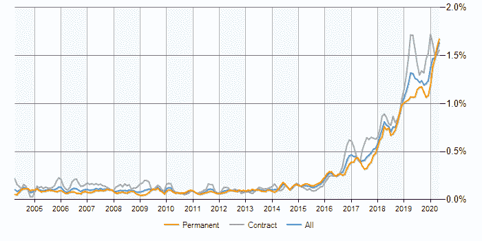
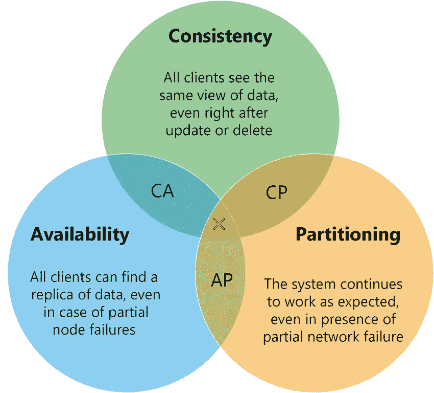
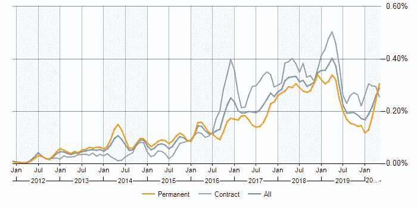
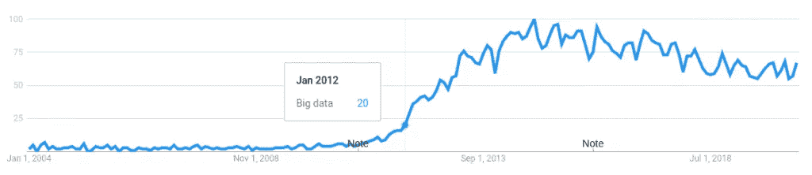
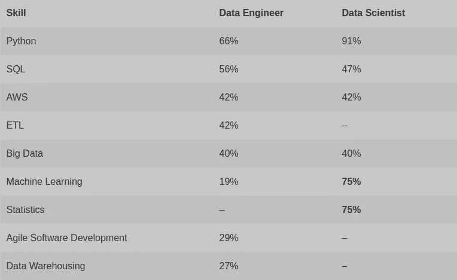

# 数据工程:是什么？

> 原文：<https://towardsdatascience.com/data-engineering-what-is-it-ebd8e32df589?source=collection_archive---------54----------------------->

## 基于数据和历史背景的定义

来源: [Cdd20](https://pixabay.com/users/Cdd20-1193381/) ，via [pixabay](https://pixabay.com/illustrations/cartoons-paintings-girls-mirrors-5123405/) (CC0)

数据工程正在*迅速崛起。在过去的两年里，数据工程在英国招聘的职位中所占的比例增加了一倍多。在 1.5%的水平上，有近 2200 个未平仓头寸。相比之下，“软件工程师”约占 4.6%。以及“项目经理”3.1%。*

数据工程甚至比网页开发更受欢迎(1.2%)。

**更新【2020 年 11 月 09 日】:**在 11 月 09 日之前的六个月期间，这一比例目前为 1.86%，高于本文最初发表日期 2020 年 5 月 11 日之前的 1.5%，也高于 2019 年同期的 1.13%。然而，由于疫情期间就业市场整体放缓，1.86%现在仅代表约 900 个开放职位。

英国数据工程师职位空缺趋势来源: [IT 职位观察](https://www.itjobswatch.co.uk/) (CC BY-NC-SA 4.0)

很明显，数据工程是一项有价值的技能，但它是什么呢？和其他类似的技能组合有什么不同？

## 概述

大多数职位描述都提到了 **Python** (66%)和 **SQL** (56%)。许多人提到像 AWS 这样的平台(42%)和像 T21 这样的过程(42%)。但是数据工程的本质是创建移动数据的管道。

你的每一个人、每一项业务都会不断产生数据。每个事件记录公司的功能(和功能障碍)——显示赚到的钱和损失的钱；社交媒体、第三方合作伙伴、收到的货物、发货的订单。但是，如果这些数据从未被看到，就不会有任何见解。

数据工程要求知道如何从数据中获取价值，以及将数据从 A 点移动到 B 点而不掺杂的实际工程技能。

对于数据工程师来说，知道如何访问所有这些数据(无论其来源或格式如何)是一项关键技能。访问数据可能需要抓取 web、pdf 或半打不同风格的 SQL 和非 SQL 数据库。另一项技能是知道如何高效地移动和存储数据(在时间和成本方面)。处理大量数据是一项专业技能。然而，最重要的是保存数据的价值。

## 并非所有的数据都是信息

数据只有能被理解才有价值。如果我告诉你今天的天气是 0 级，气温是 0.756743 度，T4 会打我一巴掌。电脑通常会给出更隐晦的回应。解密它们需要两样东西:背景和专业知识。

此外，将数据从一个系统转移到另一个系统会删除大量上下文。专家解释数据时通常需要这种环境。许多不同的系统，许多不同的专家，许多解释。好的数据工程是关于收集解释和数据，并呈现所有用户都能理解的统一视图。

## 数据工程是商业智能的发展

另一个用来描述上述概念的术语是 **BI** 或“商业智能”。

商业智能是大型国际公司的领域。很久以前，只有他们有钱存储大量数据，也有足够的经济实力这么做。巨大的 SQL 服务器在由巨大的存储区域网络(SAN)支持的大型企业主机上飞速运转。数据将从纽约、洛杉矶、伦敦、香港和新加坡的系统中被转储进来，因为每个人都去睡觉了，以便在第二天早上之前进行处理。分析师会使用 PowerBI 和 Crystal Reports 等成熟供应商提供的昂贵工具来分析数据。

但是，如果“商业智能”这个术语如此成熟，为什么会出现重复的术语呢？简短的回答是互联网。

随着互联网的兴起，出现了许多使用和收集数据的新应用。对于其中的一些应用程序，数据量对于任何一台数据库服务器来说都太大了。它们被称为 ***webscale*** 应用。与此同时，存储数据的价格呈指数级下降(已经下降了一段时间)。然后在 2002 年，[塞斯·吉尔伯特](https://en.wikipedia.org/w/index.php?title=Seth_Gilbert&action=edit&redlink=1)和[南希·林奇](https://en.wikipedia.org/wiki/Nancy_Lynch)发表了一份现在被称为[上限定理](https://dl.acm.org/doi/10.1145/564585.564601)的正式证明。

资料来源:Khazaei、Hamzeh & Fokaefs、Marios & Zareian、Saeed & Beigi、Nasim & Ramprasad、Brian & Shtern、Mark & Gaikwad、Purwa & Litoiu、Marin。(2015).[我如何选择合适的 NoSQL 解决方案？全面的理论和实验调查](https://www.researchgate.net/publication/282679529_How_do_I_choose_the_right_NoSQL_solution_A_comprehensive_theoretical_and_experimental_survey)。大数据和信息分析杂志(BDIA)。2.10.3934/bdia

它指出，当您跨多个服务器对数据进行分区时，在数据立即可用和跨这些分区获得一致之间存在不可避免的权衡。为了利用这些新的 webscale 机会，需要新的工具。由此开始了 ***大数据*** 的时代。

## 大数据工程师的崛起

最初的成功是像谷歌的大桌子这样的科技巨头的内部解决方案；但很快，开源解决方案如 Memcached(2003)、CouchDB(2005)和 Hadoop(2006)充斥了这个领域。第二波浪潮在 2008-2009 年出现，出现了 ***No-SQL*** 数据库，如 HBase、Cassandra、Redis、Riak 和 MongoDB。销售硬件和服务来支持这些开源软件，对于像 Datastax 和 Hortonworks 这样的公司来说，过去和现在都是有利可图的。

那么，你如何称呼为大数据问题设计解决方案的人呢？当然，你称他们为“大数据工程师”。

## 数据工程和大数据的相对衰落

英国大数据工程师的职位空缺趋势来源: [IT 职位观察](https://www.itjobswatch.co.uk/) (CC BY-NC-SA 4.0)

随着这么多人用“大数据”赚了这么多钱，它变得不仅仅是值得讨论的了。宣传列车开足马力，所有人都上车了。许多销售“大数据”的公司没有 webscale 数据。其他更便宜的解决方案会更好地服务于一些客户——回避这个问题，“大数据到底有多大”？

来源:谷歌趋势，[大数据，美国 2004–2020](https://trends.google.com/trends/explore?date=all&geo=US&q=%2Fm%2F0bs2j8q)

冷静的头脑现在将这些工具视为工具箱的一部分，并明智地使用它们。将“大”从“大数据工程师”中去掉，重新关注寻找正确的*解决方案。这也更符合“数据科学家”这个术语——我从未听到有人自称为“大数据科学家”。*

## 数据工程师 Vs 数据科学家

有些人喜欢狗。还有人爱猫。许多人两样都喜欢。

所有的数据工程师都会做一些分析。所有的数据科学家都会做一些编程。有的人两者兼而有之；他们进行复杂的分析*和*编写生产质量的软件。再看一下就业统计数据，差异就很明显了。

技能在招聘广告中出现的频率，数据来源: [IT 职位观察](https://www.itjobswatch.co.uk/) (CC BY-NC-SA 4.0)

数据科学家被期望精通机器学习和统计学，但不是敏捷软件工程师。他们应该知道 SQL，但不是数据库专家(因此没有 ETL 或数据仓库)。

## 数据工程仍在发展

随着技术的发展和我们面临的挑战的变化，这些术语将继续变化。这个行业的乐趣在于它是动态的。总有新的东西要学。

让我们保持联系。你可以在[*data unbound*](https://www.dataunbound.co.uk/)*[*Twitter*](https://twitter.com/data_unbound)*[*LinkedIn*](https://www.linkedin.com/in/david-matthew-layton/)*找到我。感谢阅读。***