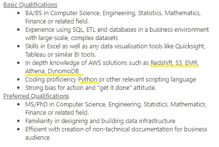
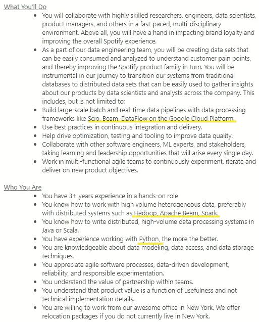
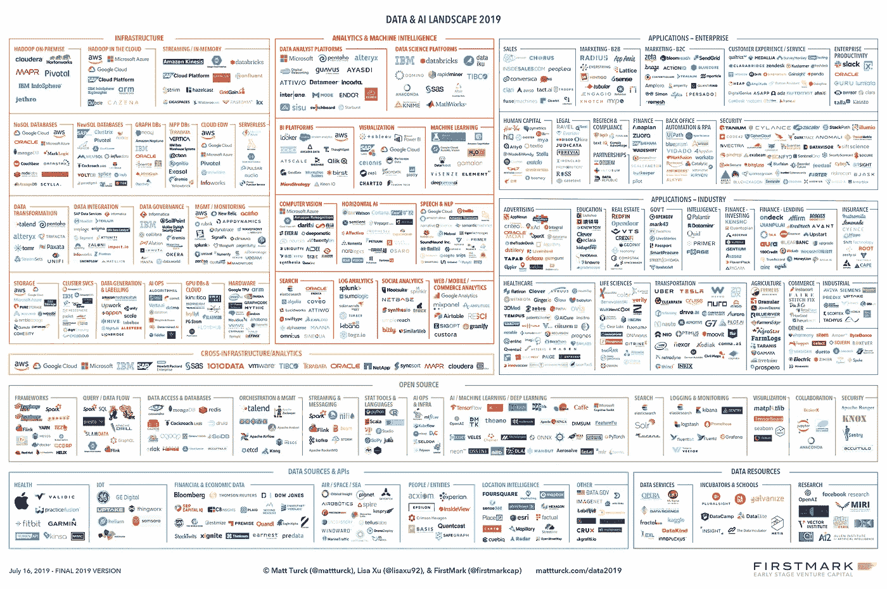
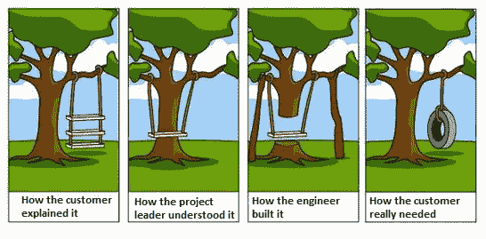

# 数据工程师不仅仅是技术专家

> 原文：<https://towardsdatascience.com/data-engineers-are-not-just-technology-experts-45d03b14adb?source=collection_archive---------21----------------------->

## 为什么数据工程师不仅仅是某项特定技术的专家

数据工程师通常被描述为所有数据角色中的*“专注于技术/技术专家”*角色。然而，如果这是真的，那么一个数据工程师应该专注于什么技术呢？这个角色是如何在技术的发展中存活下来的？

嗯，我认为这并不简单，*这个角色不仅仅是“专注于技术”*，*这个角色的一些核心方面随着时间的推移保持不变，即使技术不再存在。*

# 不同的技术

数据工程可能涉及不同的技术取决于你工作的公司/团队，范围可能相当大: [Spark](https://spark.apache.org/) ， [Apache Beam](https://beam.apache.org/) ， [Step functions](https://aws.amazon.com/step-functions/) ， [Airflow](https://airflow.apache.org/) ， [Google Dataprep](https://cloud.google.com/dataprep/?utm_source=google&utm_medium=cpc&utm_campaign=emea-fr-all-en-dr-bkws-all-all-trial-b-gcp-1007176&utm_content=text-ad-none-any-DEV_c-CRE_253510076551-ADGP_Hybrid+%7C+AW+SEM+%7C+BKWS+~+BMM_M:1_FR_EN_Data_DataPrep_SEO-KWID_43700021003902732-kwd-316837043214-userloc_1006094&utm_term=KW_%2Bdataprep%20%2Bgoogle-ST_%2Bdataprep+%2Bgoogle&ds_rl=1242853&ds_rl=1245734&ds_rl=1245734&gclid=CjwKCAiA9JbwBRAAEiwAnWa4Q3CJnVNL6Q-yruYRcLJ3_WRPjufJFqsi2_M1l6pvSbj0xGsNBk7S5BoCTBQQAvD_BwE) ， [Kafka](https://kafka.apache.org/) ， [Hive](https://hive.apache.org/) ， [Python](https://www.python.org/) ， [Java](https://www.java.com/en/) ，

出于演示的目的，我将从 [Linkedin Jobs](https://www.linkedin.com/jobs/) 获取两个标题为亚马逊数据工程师的职位，我将用黄色强调需要的技术。

*   亚马逊英国公司的数据工程师

来源:[亚马逊英国的 Linkedin 工作数据工程师](https://www.linkedin.com/jobs/view/1618056691/)

*   Spotify 的一名数据工程师

来源: [Linkedin 乔布斯数据工程师 Spotify](https://www.linkedin.com/jobs/view/1580542673)

如果我继续举更多的例子，我可能会填充[数据& AI 景观](https://mattturck.com/data2019/)

[数据& AI 山水 2019](http://mattturck.com/wp-content/uploads/2019/07/2019_Matt_Turck_Big_Data_Landscape_Final_Fullsize.png)

正如你所猜测的，没有人，没有数据工程师可以在他的简历中包含所有这些技术。即使某人的简历上有其中的三分之一，你会认为他是所有这些方面的专家吗？而如果他不是所有这些技术的专家，又怎么可能专注于技术呢？

*不同技术之间有一些共享的核心软件工程方面，可以帮助从一种技术转换到另一种技术。*

例如，airflow 和 spark 可以用同一种语言 python 编写，尽管它们的目的不同:spark 用于数据处理，airflow 用于工作流管理。

另一个基于语言的例子是在 Hive、 [Presto](https://prestodb.io/) 、 [Athena](https://aws.amazon.com/athena/) 、Postgres、 [InfluxDB](https://www.influxdata.com/products/) 、 [Impala](https://impala.apache.org/) 、 [BigQuery](https://cloud.google.com/bigquery/) 和 [SparkSQL](https://spark.apache.org/sql/) …

技术不仅共享语言，还共享核心概念，例如:

*   数据建模技术:分区、索引…
*   数据争论方法:过滤、清理、正则表达式...
*   优化技术，如执行计划
*   设计模式: [python 和 java 设计模式](https://refactoring.guru/design-patterns/)，[数据处理模式](/4-design-principles-for-data-processing-964d6a45cb7c)
*   [批量数据处理的范例](https://medium.com/@maximebeauchemin/functional-data-engineering-a-modern-paradigm-for-batch-data-processing-2327ec32c42a)

语言/框架/技术之间的共同联系有助于工程师转向更新、更有效的技术。这就像使用 android 手机一样，如果你学会了如何使用 android 手机，你就会很容易知道如何使用 iPhone。

# 技术、术语和产品生命周期

来源:[丹尼尔·弗雷斯·派克斯](https://www.pexels.com/photo/photo-of-dslr-cameras-lying-on-the-ground-surrounded-by-people-1654510/)

技术，就像任何其他商业产品一样，会出现，直到更好的出现，然后，如果没有创新出现，它们就会慢慢消失。

在数据处理领域，如果我们查找 2010 年至 2014 年用于数据处理的技术，我们会看到大多数平台/ERP，如 SAP 或 Oracle。

如今，数据处理更多地是通过 spark、hive、kafka 和其他运行在 AWS 或 Google 等平台上的“大数据”技术来完成的。这些技术允许我们像以前一样处理数据，但让我们更加灵活，以更低的成本处理更多的数据，实时处理数据，点击一下就可以进行机器学习， [A/B 测试](https://medium.com/@InVisionApp/a-b-and-see-a-beginner-s-guide-to-a-b-testing-a16406f1a239)等等。

用于处理和分析数据的人的数据角色或术语也遵循相同的“生命周期”:如果我们之前谈论 ETL 开发人员或数据集成专家，我们现在谈论的是数据工程师。

这个“以技术为中心”的角色发生了什么变化？工具改变了，它们进化了，它们遵循了[技术生命周期](https://en.wikipedia.org/wiki/Technology_life_cycle)，但是这个角色的核心方面仍然存在。作为数据工程师的 ETL 开发人员必须处理数据，对数据处理管道进行质量检查，提取数据并使其可用于其他平台。就编码语言而言，是的，数据工程师必须知道至少一种编程语言，但他还必须对 SQL 有深入的了解。

# 笑点是

随着人类能够处理的数据处理工具越来越多，技术的不断发展，数据工程师仍然被认为是“以技术为中心”的。当然，数据工程师必须使用技术来完成事情，但*他使用技术并不只是为了好玩，他使用技术来收集、存储和处理某个* ***用例*** *的数据，以一种* ***工业化的方式*** *。*

*用例*、数据量及其速度、数据收集频率和数据交付方法将帮助您*定义所使用的技术*。例如，实时可视化不能基于 Hive 表，其他数据库和数据处理框架适合这种用例。

*工业化的方式*意味着数据工程师通常不负责特别分析，但是他参与为特别分析负责人创建/建立一个平台。

最后但同样重要的是，处理数据是为一个*特定用例*完成的。因此，如果您想避免[树摇摆案例](https://knowyourmeme.com/photos/475749-tree-swing-cartoon-parodies)，数据工程师必须了解业务需求。

来源:[树摇摆迷因的简短修改版](https://knowyourmeme.com/photos/475749-tree-swing-cartoon-parodies)