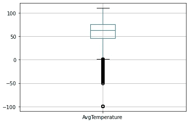
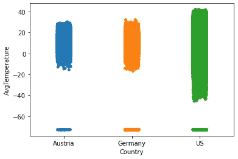
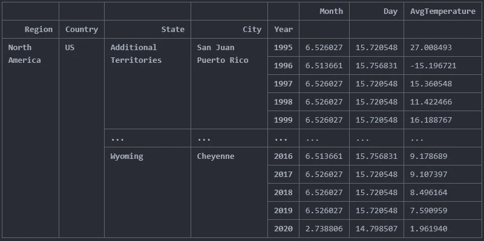
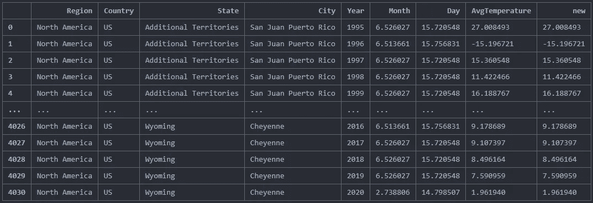
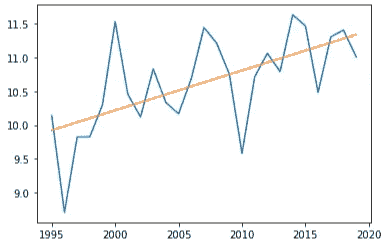

# 熊猫数据探索 101

> 原文：<https://towardsdatascience.com/data-exploration-101-with-pandas-e059d0661313?source=collection_archive---------18----------------------->

## Pandas 是访问和使用数据的最强大的图书馆之一。有大量的功能涵盖数据操作，快速绘图以及读取和写入数据。

如果你是数据科学的新手，一个考试前时间不多的学生，或者你只是想看看其他人如何使用熊猫来**探索和分析** **数据**，请跟随我。对于这个快速介绍，我们将使用通过 Kaggle.com[获得的主要城市的每日气温数据集。](https://www.kaggle.com/sudalairajkumar/daily-temperature-of-major-cities/data?select=city_temperature.csv)

作为每个数据探索任务的起点，导入数据集是必要的。Python 通过“open()”函数使这变得非常容易，然而不管怎样，因为我们要使用 pandas 库，传统的开放不是办法。Pandas 提供了各种各样的 read_ 函数，允许同时打开文件并将其转换成数据帧。

## 输入数据

只用两行代码，您就可以导入数据并创建一个 dataframe 对象，这个对象非常适合使用。除了常见的 Python 数据结构(比如字典)，操作可以在所有数据点上执行，也可以在经过过滤甚至分组的数据点上执行。想象一下，你必须只用普通的数据结构来完成这项任务，这将是一场噩梦。


不要错过任何关于熊猫的数据细节

Pandas 为您提供了令人难以置信的方便和易于应用的预览、修改和导出数据的可能性。在接下来的几行中，我们将通过几个非常有用的例子来操作数据帧。您可能会观察到， [pandas 相当一致](/julia-r-and-python-7cd50c2b0fe4)(过滤、访问行等。)和其他著名的 Python 库，还有像 r。

## 描述数据

几乎每次分析新数据集时，您都可能会考虑两件事:

1.  您的数据点位于什么范围内——这对于获得数据的“感觉”以及检查一致性、可靠性和异常值至关重要
2.  您是否在数据框架中看到无效或缺失的值

仅使用这些 to 行将允许您检查您的数据集并估计您是否需要做更多的数据清理。明确描述()对月、日或年没有意义，但掌握 AvgTemperature 是必不可少的。正如我们在这里看到的，这个度量很可能不是摄氏度(平均温度是 56 度)，而是华氏度。

```
 Month        Day          Year          AvgTemperature
count 2.906327e+06 2.906327e+06 2.906327e+06  2.906327e+06
mean  6.469163e+00 1.571682e+01 2.006624e+03  5.600492e+01
std   3.456489e+00 8.800534e+00 2.338226e+01  3.212359e+01
min   1.000000e+00 0.000000e+00 2.000000e+02 -9.900000e+01
25%   3.000000e+00 8.000000e+00 2.001000e+03  4.580000e+01
50%   6.000000e+00 1.600000e+01 2.007000e+03  6.250000e+01
75%   9.000000e+00 2.300000e+01 2.013000e+03  7.550000e+01
max   1.200000e+01 3.100000e+01 2.020000e+03  1.100000e+02
```

有时，有些用例要求数据提取可以很容易地复制和插入，我推荐使用 *to_markdown()* 函数，它为此提供了很好的结果——确实是我的最爱之一。

```
|         | Country   |   AvgTemperature |
|--------:|:----------|-----------------:|
| 2906322 | US        |             28   |
| 2906323 | US        |             27.6 |
| 2906324 | US        |             29   |
| 2906325 | US        |             28.8 |
| 2906326 | US        |             28.7 |
```

我们需要进一步检查是否有“非数字”值。如我们所见，只有 State 有缺失字段，这对我们来说完全没问题。请记住，对于机器学习等更复杂的任务，删除以及内插或外推丢失的数据可能是数据科学家的一项关键工作。

```
Region            False
Country           False
State              True
City              False
Month             False
Day               False
Year              False
AvgTemperature    False
dtype: bool
```

为了获得一列的唯一值, *unique()* 函数非常有用——我们也可以在分组对象上使用它。

```
data.Region.unique()array(['Africa', 'Asia', 'Australia/South Pacific', 'Europe',
       'Middle East', 'North America',
       'South/Central America & Carribean'], dtype=object)
```

当数据被图解或总结时，你可能会对数据有更好的感觉。如果您的数据是数字，您可能会发现散点图或箱线图非常方便。



箱线图中的平均温度。包括异常值。

旁白:有许多不同的库允许以非常漂亮和快速的方式绘制数据。从个人的角度来看，没有可视化的数据探索通常是困难的，而且要花费更多的时间，因为数据的不规则性可能会在过程的后期被发现。

这是另一个直观的例子，它能让你立即感受到异常值，一个结合了数字和分类变量的非常密集的散点图:



## 修改数据

正如我们在最初创建的描述表中看到的，温度以华氏温度为单位，对于非美国居民来说，处理数据可能会有点困难，尤其是当涉及到“这里似乎有什么不对劲”这一部分时。

Pandas 允许我们以一种非常简单直接的方式在列上执行操作。

更通用的方法是对列应用函数。结果和上面一样，但是，我们可以通过这种方式更有创造性地应用函数。

*Apply( )* 允许用户创建复杂的函数，并将它们应用到一列甚至几列上。还要注意，除了定义一个函数(如我们的 to_celsius 函数)， **lambda 表达式**也可以很容易地使用——这可能是**只使用一次**时最有用的。

如果您更频繁地面对**复杂的修改任务**，您可能希望构建能够通过正则表达式解析单元格值的**函数。在这种情况下，你可能想把正则表达式和 pandas 的应用函数结合起来。如果您觉得需要复习一下数据科学的正则表达式，可以看看下面的链接:**

[](/mastering-regular-expressions-for-your-day-to-day-tasks-b01385aeea56) [## 掌握日常任务的正则表达式

### 可以使用正则表达式的用例非常多。不管你是不是数据科学家收藏…

towardsdatascience.com](/mastering-regular-expressions-for-your-day-to-day-tasks-b01385aeea56) 

## 分组数据— *groupby()*

当数据被分组在一起时，Pandas 创建一个 groupby 对象。有很多函数可以应用到一个分组的对象上，比如 *unique()、mean()、min()或 max()*——仅举几个例子。请注意，您不能直接“显示”groupby 对象，因为这将导致如下输出:

```
<pandas.core.groupby.generic.DataFrameGroupBy object at 0x000001F2B6879CD0>
```

为了获得平均值，下面这条线将有所帮助:

```
data.groupby([‘Region’,’Country’,’State’,’City’,’Year’]).mean()
```



显示平均值的重新编制索引的分组对象

同样，平均值对于月或日没有任何意义，因此省略这些列是有用的。还请注意，上表需要重置索引，以便正确显示每行条目。



更干净的输出

## 过滤数据

通常，您可能只对给定数据的一小部分感兴趣。为此，可以通过简单的过滤操作将数据帧最小化为较小的数据帧:

```
vienna = data[data['City']=='Vienna'].copy() # great city
```

数据帧的创建副本将只包含“城市”为“维也纳”的值。如果我们需要额外的过滤要求，pandas 允许通过“与”或“管道”来连接标准。

一般来说，我们可以使用主数据框架来绘制相关信息，但是我更喜欢在较小的数据集上使用简单的绘制操作。plot 函数中的过滤数据使其难以阅读和理解。当我们看下面几行代码时，使用数据帧的专用副本的优势变得非常明显:

只需 3 行代码，我们就能生成一个包含线性趋势的折线图:



1995 年至 2020 年维也纳平均气温的简单线形图

如果我们计算一下我们在这里使用的代码行数和我们用这些代码进行的数据操作次数，毫无疑问 **Pandas 是一个非常强大的数据操作工具**，不需要大量的文档阅读和实践。

## 有用的文档

如果您想更好地理解我们在本文中所涉及的内容，我建议您从下面的文档开始，仔细阅读与您相关的细节。请记住，就像每一项学习任务一样，做比(仅仅)阅读要好。

 [## 熊猫。数据框架- pandas 1.0.5 文档

### 数据结构还包含带标签的轴(行和列)。算术运算在行和列上都对齐…

pandas.pydata.org](https://pandas.pydata.org/pandas-docs/stable/reference/api/pandas.DataFrame.html) [](https://matplotlib.org/tutorials/introductory/pyplot.html) [## Pyplot 教程- Matplotlib 3.2.2 文档

### pyplot 接口介绍。是一个命令风格函数的集合，它使 matplotlib 像…

matplotlib.org](https://matplotlib.org/tutorials/introductory/pyplot.html) [](https://www.w3schools.com/python/numpy_array_filter.asp) [## NumPy 滤波器阵列

### 从现有数组中取出一些元素，然后用它们创建一个新数组，这叫做过滤。在 NumPy，你…

www.w3schools.com](https://www.w3schools.com/python/numpy_array_filter.asp) 

> 一如既往，下次再见，注意安全！

图片由古斯塔夫·古尔斯特兰德提供，谢谢！