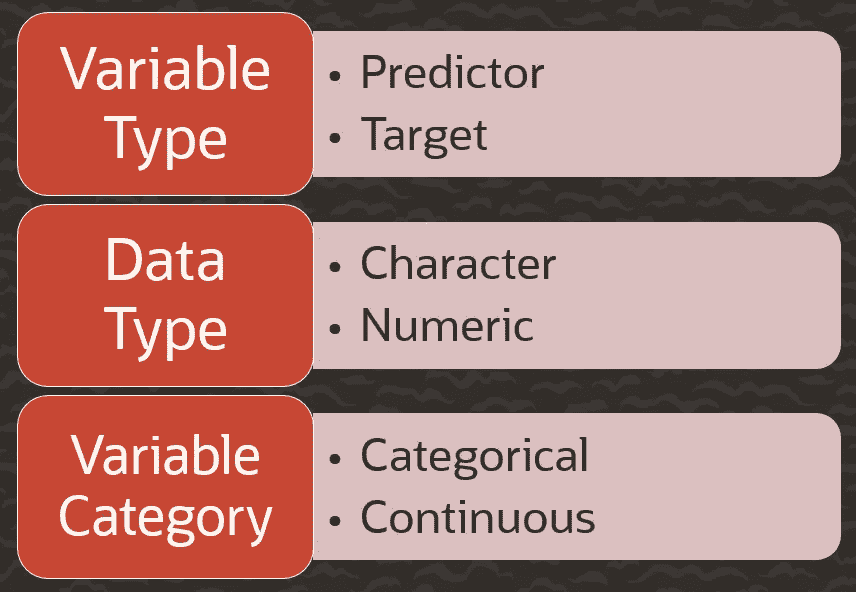
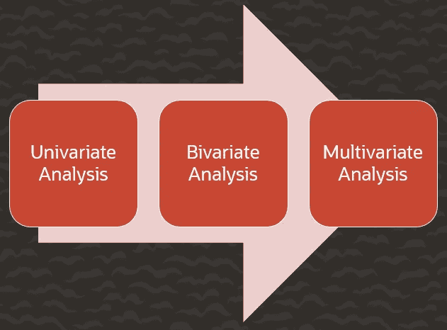
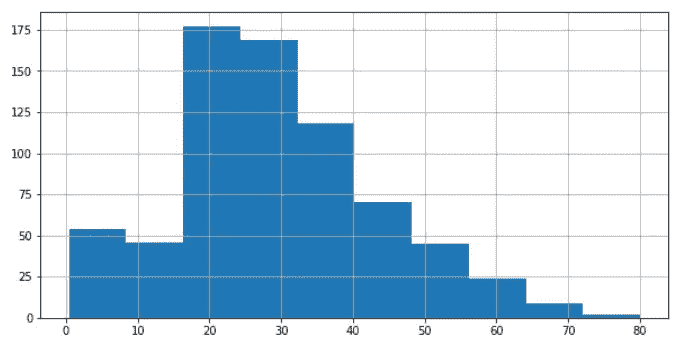
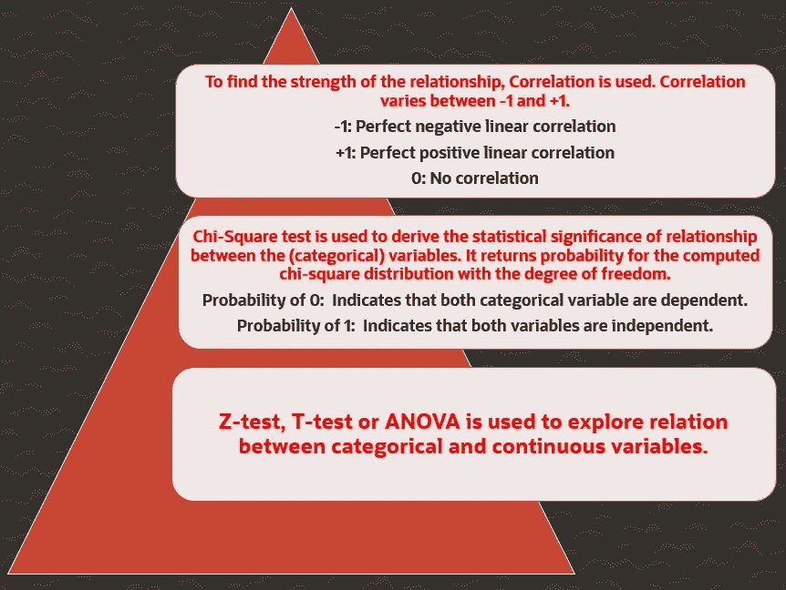
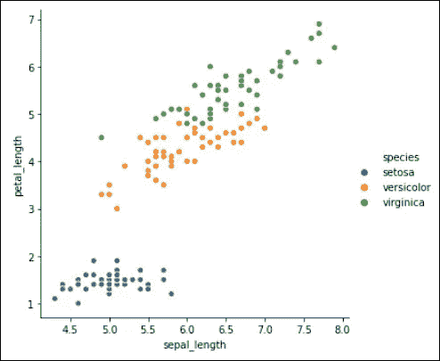
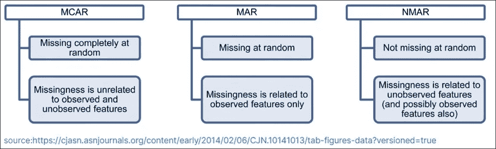
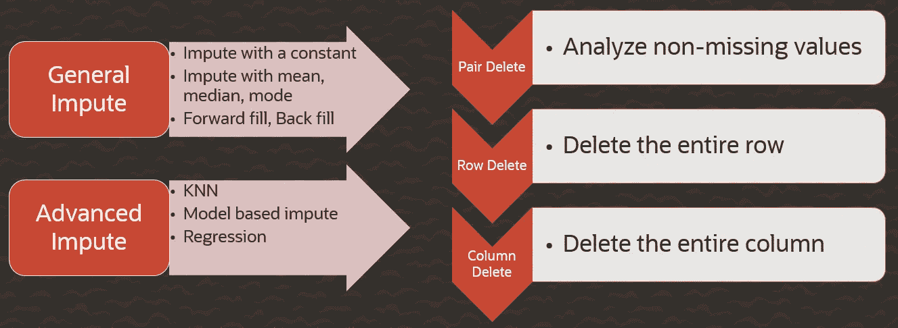
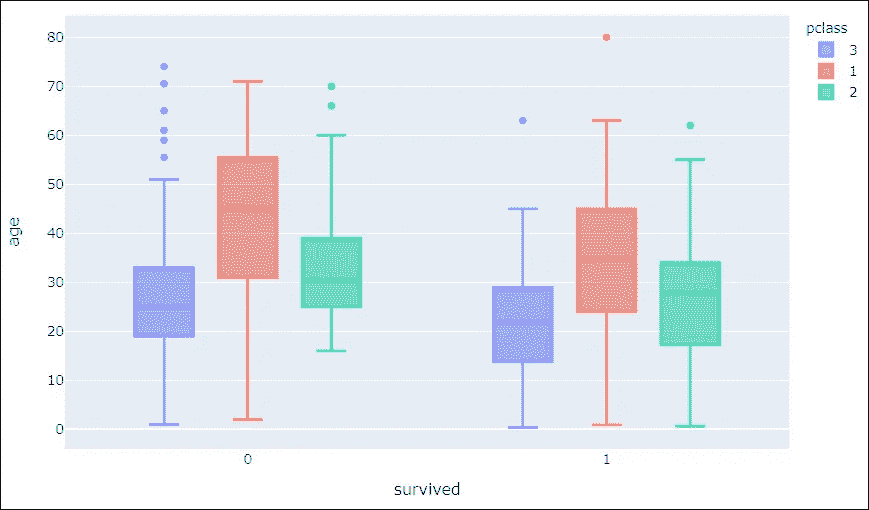
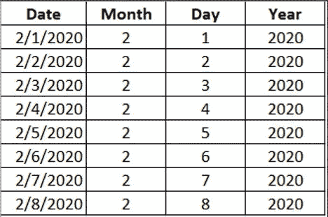
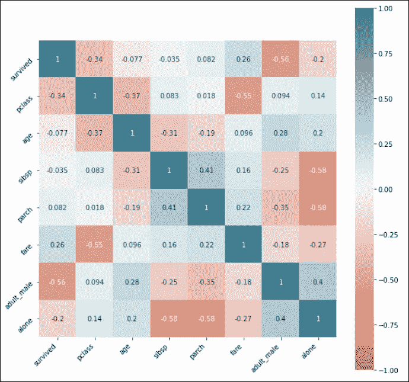

# 使用 Python 进行数据探索和分析

> 原文：<https://towardsdatascience.com/data-exploration-and-analysis-using-python-e564473d7607?source=collection_archive---------10----------------------->

## 让您的数据说话的简单方法

数据探索是数据分析和模型构建的一个关键方面。如果不花大量时间去理解数据及其模式，就无法构建高效的预测模型。在由数据清理和预处理组成的数据科学项目中，数据探索占据了大部分时间。

在本文中，我将通过简单的解释和 Python 代码片段来解释数据探索中涉及的各个步骤。数据探索中涉及的关键步骤有:

> >加载数据
> >识别变量
> >变量分析
> >处理缺失值
> >处理离群值
> >特征工程

**加载数据并识别变量**:

数据来源可能因数据库和网站而异。数据源被称为原始数据。原始数据不能直接用于建模，因为它不一致，不适合预测。必须对异常和缺失值进行处理。**变量可以是不同的类型，如字符、数字、分类和连续**。



可变类型

确定预测值和目标变量也是建立模型的关键步骤。 **Target 是因变量，predictor 是独立变量，基于该变量进行预测。**分类变量或离散变量是那些无法用数学方法处理的变量。它由 0 和 1 等固定值组成。另一方面，连续变量可以用数学函数来解释，比如求所有值的平均值或总和。您可以使用一系列 Python 代码来理解数据集中的变量类型。

```
**#Import required libraries**
import pandas as pd
import numpy as np
import matplotlib.pyplot as plt
import seaborn as sns**#Load the data**
titan=pd.read_csv("../input/titan.csv")**#get an overview of the data**
titan.head()
titan.tail()
titan.sample(10)

**#identify variable type**
titan.dtypes
titan.info()
titan.describe()
```

**变量分析:**

变量分析有三种方式，**单变量分析，双变量分析，多变量分析**。



变量分析

**单变量分析**用于突出缺失值和异常值。这里对每个变量的范围和分布进行单独分析。**分类变量和连续变量的单变量分析不同。**对于分类变量，您可以使用频率表来了解每个类别的分布情况。对于连续变量，你必须了解变量的中心趋势和扩散。可以用均值、中值、众数等来衡量。它可以使用箱线图或直方图来可视化。

```
**#Understand various summary statistics of the data**
include =['object', 'float', 'int'] 
titan.describe(include=include)
titan.describe()**#Get count of values in a categorical variable**
titan.survived.value_counts()titan.age.hist(figsize=(10,5))
```



柱状图

**双变量分析**用于找出两个变量之间的关系。可以对分类变量和连续变量的组合进行分析。**散点图适合分析两个连续变量。**表示变量之间的线性或非线性关系。**条形图有助于理解两个分类变量之间的关系。**某些统计测试也用于有效理解双变量关系。Scipy 库有大量的模块可以在 Python 中执行这些测试。



双变量分析

Matplotlib 和 Seaborn 库可用于绘制不同的关系图，帮助可视化不同类型变量之间的二元关系。



散点图

```
**iris = sns.load_dataset("iris")**
sns.relplot(x = 'sepal_length', y = 'petal_length', hue='species',data = iris)relplot = sns.catplot(x="pclass", hue="who", col="survived",  
      data=titan, kind="count",  
    height=4, aspect=.7);  
relplot
```

**处理缺失值:**

数据集中缺少的值会降低模型拟合度。**由于无法对数据进行全面分析，这可能会导致模型出现偏差。**行为以及与其他变量的关系无法正确推导。它会导致错误的预测或分类。缺失值可能是由于数据提取或数据收集中的问题造成的，这些问题可分为 MCAR、马尔和 NMAR。



缺少值

缺失值可以通过删除、均值/众数/中位数插补、KNN 插补或使用预测模型来处理。



处理缺失值

**您可以使用 Python 中名为 Missingno 的库直观地分析缺失的数据。**

```
import missingno as msno
msno.bar(titan)
msno.heatmap(titan)np.mean(titan['age'])from scipy import stats
stats.mode(titan['embarked'])titancopy['age'].fillna(29,inplace=True)
titancopy['embarked'].fillna("S", inplace=True)
```

**处理异常值:**

异常值可能自然出现在数据中，也可能是由于数据输入错误造成的。它们可以彻底改变数据分析和统计建模的结果。**异常值很容易通过可视化方法检测，如箱线图、直方图和散点图。**异常值的处理类似于缺失值，通过删除观察值、转换观察值、宁滨或分组观察值、将其视为单独的组或输入值。



箱形图

```
import plotly.express as px
fig = px.box(titan,x='survived',y='age', color='pclass')
fig.show()px.box(titan, y='age')px.box(titan,x='survived',y='fare', color='pclass')*#Adding trendline to the data*
x=iris.sepal_length
y=iris.petal_width
plt.scatter(x, y)

z = np.polyfit(x, y, 1)
p = np.poly1d(z)
plt.plot(x,p(x),"y--")

plt.show()
```

**特征工程:**

特征工程是从现有数据中提取更多信息的过程。特征选择也可以是它的一部分。特征工程的两种常用技术是变量转换和变量创建。在变量转换中，使用特定函数转换现有变量。例如，一个数可以用它的对数值来代替。另一种技术是从现有变量创建一个新变量。例如，将 dd/mm/yy 格式的日期字段拆分为日期、月份和年份列。



变量变换

```
titancopy = titan.copy()**#variable transformation**
titancopy['alive'].replace({'no':0,'yes':1}, inplace=True)**#Convert boolean to integer**
titancopy["alone"]=titancopy["alone"].astype(int)
```

另外两种数据转换技术是对分类变量进行编码和对连续变量进行缩放以使数据标准化。这取决于用于评估的模型，因为有些模型接受分类变量。

**不相关的特征会降低模型的准确性。**可以自动或手动选择功能。相关矩阵用于可视化特征之间的相互关系或与目标变量的关系。



相关矩阵

```
titancopy.corr()plt.figure(figsize=(10,10))
corr = titan.corr()
ax = sns.heatmap(
    corr, 
    vmin=-1, vmax=1, center=0,
    cmap=sns.diverging_palette(20, 220, n=200),
    square=True, annot=True
)
ax.set_xticklabels(
    ax.get_xticklabels(),
    rotation=45,
    horizontalalignment='right'
)
ax.set_yticklabels(
    ax.get_yticklabels(),
    rotation=45,

);
```

[scikit-learn 库](https://scikit-learn.org/stable/modules/generated/sklearn.feature_selection.SelectKBest.html#sklearn.feature_selection.SelectKBest)提供了一些好的类，比如 SelectBest，用于从给定的数据集中选择特定数量的特征。同一库中的基于树的分类器可用于获得特征重要性分数。

这涵盖了数据探索中涉及的一些关键步骤。根据数据的大小和模型的要求，每个步骤都可以重复。**数据科学家在数据预处理上花费的时间最多，因为数据质量直接影响模型的成功。**

这里显示的所有代码片段都在[探索性数据分析和可视化 Kaggle 笔记本](https://www.kaggle.com/krrai77/exploratory-data-analysis-and-visualization)中执行。