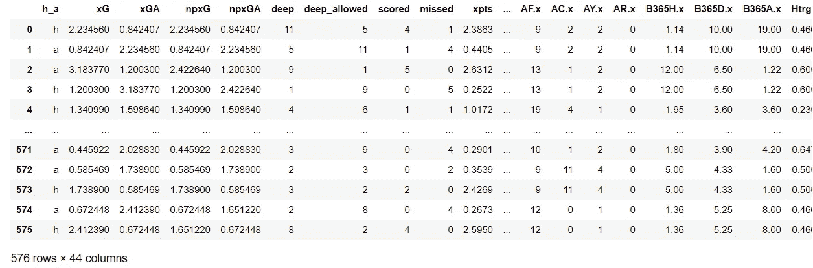
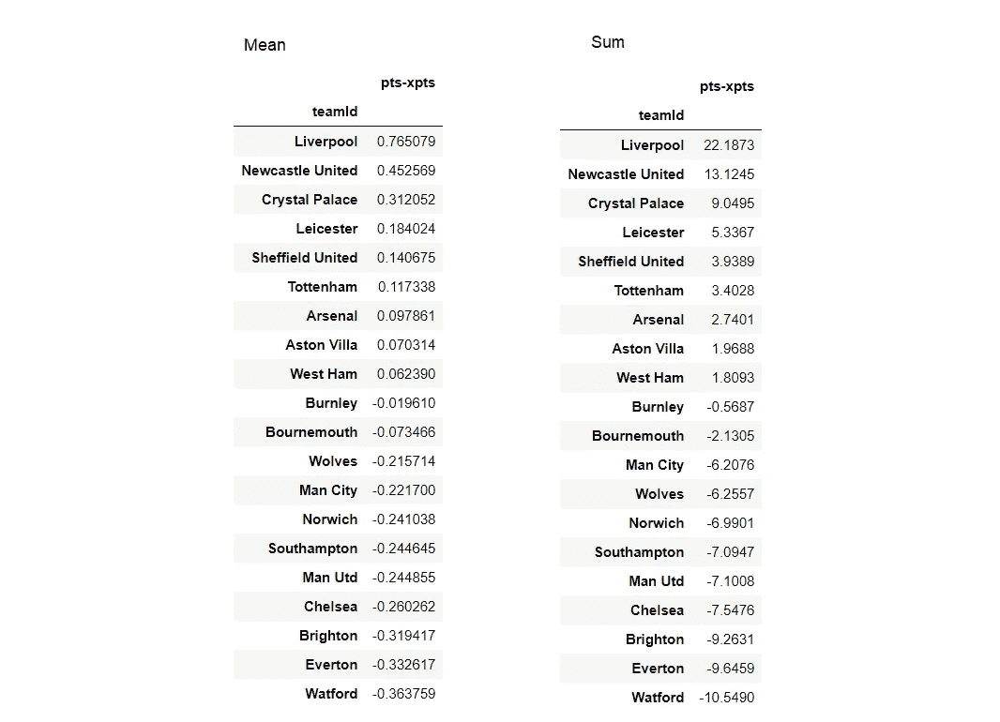
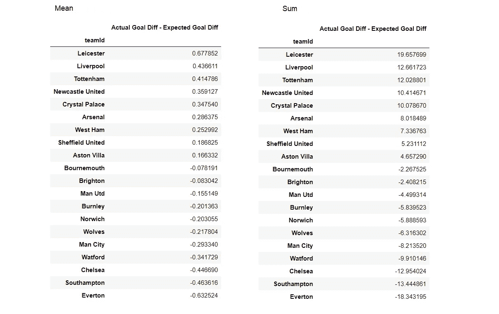
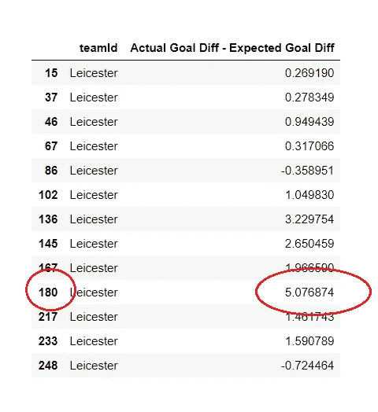

# 利物浦足球俱乐部 2019–2020 EPL 赛季的数据探索

> 原文：<https://towardsdatascience.com/data-exploration-for-liverpool-football-clubs-2019-2020-epl-season-88594e2a669?source=collection_archive---------36----------------------->

## 确定“运气”并使用“预期”指标


肖恩·唐纳利在 [Unsplash](https://unsplash.com?utm_source=medium&utm_medium=referral) 上的照片

受到 Soner Yildirim 的文章([链接](https://medium.com/r?url=https%3A%2F%2Ftowardsdatascience.com%2Fa-practical-guide-for-exploratory-data-analysis-english-premier-league-cac1e2695d30))的启发，他谈到了 EPL 2019-2020 赛季的一些探索性数据分析，我想看看我是否能收集到任何专门针对利物浦的见解。毕竟这是他们赢得冠军的赛季！

我用了他从 kaggle 那里得到的同样的数据集。

[](https://www.kaggle.com/idoyo92/epl-stats-20192020) [## 2019-2020 英超联赛统计

### 2019-2020 赛季所有英超联赛的球队和球员统计数据

www.kaggle.com](https://www.kaggle.com/idoyo92/epl-stats-20192020) 

当我浏览数据集时，我脑海中有一个问题——利物浦真的赢得了胜利吗？有量化的证据来支持或反驳利物浦这个赛季只是运气好的说法吗？

# 准备环境

最初的比特相对简单。我使用 Jupyter 笔记本作为我的主要分析环境，并导入了常用的工具(numpy，pandas)。然后，像 Sonor 一样，我从 kaggle 下载了 csv 文件，并将其读入 dataframe。

```
import numpy as np
import pandas as pd
df_epl = pd.read_csv(“epl2020.csv”)
df_epl = df_epl.reset_index(drop=True)
df_epl.drop([‘Unnamed: 0’], axis=1)
```

结果是这样的:



576 行和 44 列的数据。从一个团队的角度来看，每一行都代表一场特定比赛的数据。这意味着每场比赛实际上都是两行数据，而不是一行。使用该数据集时需要记住的一些事情。

# 关键指标

在浏览数据集时，我决定关注 6 个特定的列——进球、失球、预期进球、预期失球、得分和预期得分。

围绕“预期”指标的一些解释可能是必要的。

*   **预期进球得分—**Opta(EPL 官方统计追踪器)根据几个变量(助攻类型、射门角度、距离球门的距离等)来衡量一场比赛中一个球队特定射门的质量。).这给出了“每次射门的预期目标*”指标。在一场比赛中，将一个球队的每杆预期进球加起来，我们就得到了每场比赛的预期进球*，这是我们数据集中的统计数据。([链接](https://www.optasports.com/services/analytics/advanced-metrics/))**
*   ****预期失球** —基本上是预期失球的反序。注意，对于一场比赛来说，每支球队的预期进球得分就是对方球队的预期失球。**
*   ****期望分数** —一个队在一场比赛中应该获得的期望分数。我找到了这个指标的一个合适的[解释](https://ryo-n7.github.io/2019-11-21-visualize-EPL-part-1/)，但是它基本上是预期目标指标的一个衍生物。**

> **预期点数(预期点数、xPts 等。)是预期目标(xG)模型的扩展…给定每支球队在比赛中创造的预期目标值，人们可以取这些值并模拟它数千次，以计算比赛将导致赢/平/输的概率。从这些概率(比赛赔率)中，我们可以将它们转换成一个团队在给定他们和他们的对手累积的 xG 的情况下可以赢得多少分(0 到 3 之间的任何值)**

# **点数减去预期点数**

**因此，为了尝试回答这个问题——“利物浦幸运吗”，我需要找出一个可能“代表”运气的指标，看看利物浦与同行相比如何。**

**我的第一个想法是用“点数减去预期点数”。这似乎很合理。如果“分数”是一个团队*实际上*获得了多少分，而“预期分数”是一个团队*认为*获得了多少分，那么两者之差将代表一个团队是幸运(正数)还是不幸(负数)。任何一个方向上的大量数据都代表着与“应该”发生的情况的重大偏离。**

**有了这个想法，我可以开始分析了:**

**步骤 1:创建一个标签为“点数-预期点数”的列。这反映了团队在每场*比赛*中低于或超过预期的程度。**

**第二步:得出每个团队的平均值和总和(即一个团队整个赛季的平均和总“分数减去预期分数”)**

```
**//Step 1
df_epl['pts-xpts'] = df_epl['pts']-df_epl['xpts']//Step 2 - Mean
df_epl[['teamId','pts-xpts']].groupby('teamId').mean().sort_values(by='pts-xpts', ascending=False)//Step 2 - Sum
df_epl[['teamId','pts-xpts']].groupby('teamId').sum().sort_values(by='pts-xpts', ascending=False)**
```

****

**每个团队的平均值(“pts-xpts”)和总和(“pts-xpts”)的递减比较**

**如你所见，结果相当惊人。利物浦和下一个最幸运的竞争对手纽卡斯尔之间有着巨大的差距。在整个赛季中，利物浦每场比赛的得分都大大超出了预期。**

# **实际净胜球(每场比赛)减去预期净胜球(每场比赛)**

**在看了积分-期望积分比较之后，我觉得有必要做更多的工作。毕竟，预期分数看起来仍然是一个相当不透明的指标，因为它是预期目标统计的衍生物。**

**因此，我决定评估“运气”的下一个基准是“实际净胜球减去预期净胜球”。**

**背后的想法很简单:**

*   **一个队在一场比赛中的实际净胜球仅仅是他们进的球和丢的球之差。如果你进的球比失球多，你自然会表现得更好。**
*   **考虑到创造的得分机会的数量和质量，一支球队的**预期净胜球**将是一支球队*应该*取得的进球和他们*应该*取得的失球之间的差异。**
*   **实际净胜球和预期净胜球之间的差异可能再次指向“运气”因素。像以前一样，一个大的正数将代表一个队在特定比赛中的幸运(正数)或不幸(负数)。**

**清楚了这一点，我们可以开始分析了。**

**第一步:创建一个标签为“实际目标差异减去预期目标差异”的列。这反映了球队在每场比赛中低于或高于净胜球期望值的程度。**

***请记住，数据集不会直接给出目标差异和预期目标差异。这些必须从(1)进球数，(2)失球数，(3)预期进球数(xG)，(4)预期失球数(xGA)中得出，其方式如下:* ***(进球数-失球数)——(xG-xGA)*****

**步骤 2:得出每个团队的平均值和总和**

```
**//Step 1
df_epl['Expected Goal Difference per Match'] = df_epl['xG']-df_epl['xGA']df_epl['Actual Goal Difference per Match'] = df_epl['scored']-df_epl['missed']df_epl['Actual Goal Diff - Expected Goal Diff'] = df_epl['Actual Goal Difference per Match']- df_epl['Expected Goal Difference per Match']//Step 2
df_epl[['teamId','Actual Goal Diff - Expected Goal Diff']].groupby('teamId').mean().sort_values(by='Actual Goal Diff - Expected Goal Diff', ascending=False)df_epl[['teamId','Actual Goal Diff - Expected Goal Diff']].groupby('teamId').sum().sort_values(by='Actual Goal Diff - Expected Goal Diff', ascending=False)**
```

****

**每个团队的平均值(“实际目标差异-预期目标差异”)和总和(“实际目标差异-预期目标差异”)的降序比较**

**这种方法讲述了一个类似于“积分减去预期积分”方法的故事，利物浦在这些积分榜上仍然接近榜首。在整个赛季中，利物浦大大超出了预期的净胜球。**

**这里的一个特点是莱斯特。我不记得他们有一个特别出色的赛季，那么为什么他们在这个指标上遥遥领先呢？**

```
**leicester_results = df_epl[df_epl['teamId']=='Leicester']leicester_results[['teamId', 'Actual Goal Diff - Expected Goal Diff']]**
```

****

**莱斯特的每场比赛数据(不完整)**

**很明显，有一场比赛确实扭曲了数据。这是他们 9 比 0 战胜南安普顿的比赛——英格兰顶级足球历史上最大的客场胜利。这场比赛的“实际进球差异——预期进球差异”高达 5.07。**

# **限制**

> **这些数字无法说明问题。我们为他们说话，我们赋予他们意义。—内特·西尔弗**

**那么经过这么多的分析之后，我们是否有了利物浦是否“幸运”的答案呢？乍一看，似乎是这样。尽管是莱斯特，利物浦在相关的“运气”指标上领先于竞争对手。**

**然而，如果我们再深入一点，就可以清楚地看到，这些“运气”指标并不一定反映随机机会。生成的两个基准“分数减去预期分数”和“目标差异减去预期目标差异”都严重依赖于预期进球得分(xG)和预期失球(xGA)统计数据。虽然运气肯定会影响 xG 和 xGA 的偏差，但其他因素也会起作用。**

**例如，如果一支球队创造了相对较少的高质量机会(低 xG)，但成功地打进了大量进球(高实际进球)，这*可以*解释为运气，但*也可以*解释为一支球队只是拥有转换速度很快的伟大前锋。**

**反之亦然——如果一支球队给了对手很多高质量的机会(高 xGA ),但实际上并没有失球太多(失球率低),这*可能*是运气使然，但*也可能*是一支防守令人难以置信的球队或世界级门将阻止了实际失球。**

# **结论**

**所以如果数据没有告诉我们利物浦是幸运的，我们能从中得出什么合理的结论呢？**

**对我来说，分析表明，利物浦在 2019-2020 赛季期间，没有创造出大量“高质量”的机会，也没有独特地扼杀对手。**

**这似乎与视力测试相一致——当我实际观看利物浦本赛季的比赛时，我记得有很多艰难的胜利。利物浦通过创造大量高质量的机会将对手轰下球场的情况并不常见。**

**然而，仅仅从数据上来看，很难断定是什么样的运气、精彩的射门或精彩的停球组合让利物浦获得了冠军。**

**我希望你喜欢这个！请随意发表评论。我也喜欢任何关于我将来可以使用的有趣数据集的建议！**