# Airbnb 新加坡数据探索:01

> 原文：<https://towardsdatascience.com/data-exploration-on-airbnb-singapore-01-40698c54cac3?source=collection_archive---------9----------------------->

## **用 Python 对 Airbnb 新加坡数据进行探索性数据分析**


[鲍梦龙](https://unsplash.com/@__menglong?utm_source=unsplash&utm_medium=referral&utm_content=creditCopyText)在 [Unsplash](https://unsplash.com/?utm_source=unsplash&utm_medium=referral&utm_content=creditCopyText) 上的照片

# 介绍

嗨！我叫阿格拉，我是一名建筑师，对建筑、城市设计、房地产和技术知识的整合感兴趣。本文是我在使用 python 编程语言学习数据科学的几个星期中，对我的个人数据科学项目的一个总结。

如今，我们生活在一个数据大量产生和流通的时代。这些数据可以收集起来，让我们推断出有意义的结果，并做出明智的决定。然而，随着数据数量的增加，我们需要将数据可视化，以帮助我们进行数据分析。通过使用可视化工具，我们能够向我们的观众传递信息，并告知他们我们的发现。

本文的目的是探索一家技术公司的公开数据集，通过可视化工具清晰地绘制结果，并为公众和其他相关方提供新的见解。为了使每篇文章的主题更加集中，本文将分成一系列的几篇文章。

对于第一篇文章，我们将使用基本的探索性数据分析技术来探索和可视化来自新加坡 Airbnb 的数据集。我们将根据每个 Airbnb 房源的位置找出它们的分布，包括价格范围、房间类型、房源名称和其他相关因素。

**什么是探索性数据分析？**

我指的是数据科学家 Terence S 对探索性数据分析的[解释。](/an-extensive-guide-to-exploratory-data-analysis-ddd99a03199e)简而言之，探索性数据分析(EDA)，也称为数据探索，是数据分析过程中的一个步骤，其中使用了多种技术来更好地了解所使用的数据集。

一些技术是:

*   提取重要变量，留下无用变量
*   识别异常值、缺失值和人为错误
*   理解数据，最大限度地提高我们对数据集的洞察力，并最大限度地减少流程后期可能出现的潜在错误

通过进行 EDA，我们可以将几乎可用或不可用的数据集变成可用的数据集。

探索性数据分析的主要组成部分:

1.  获取和加载数据
2.  清洗数据集
3.  探索和可视化数据

**为什么选择 Airbnb？**

自 2008 年以来，客人和主人一直使用 Airbnb 来拓展旅行的可能性，并提供一种更独特、更个性化的体验世界的方式。今天，Airbnb 成为一种被全世界使用和认可的服务。通过 Airbnb 提供的数百万房源的数据分析对该公司来说是一个至关重要的因素。这些数以百万计的列表产生了大量的数据——可以分析的数据。

**为什么选择新加坡？**

Airbnb 在新加坡有着长期且相当复杂的关系。从五年前开始，新加坡政府就将 Airbnb 提供的短租贴上了非法服务的标签。虽然被贴上了这样的标签，但是到目前为止，只有两个案例发现房东因违反租赁法而被罚款。

此外，在疫情危机冲击全球旅游业之前。Airbnb 在新加坡发展迅速，并在东南亚范围内产生了高度综合的数据。

# 1.获取和加载数据

对于这个项目，我们使用 jupyter 笔记本 IDE 和 python 编程语言来编写我们的脚本。IDE 或集成开发环境是用于软件开发的软件应用程序。

为了获取数据，我们使用 Airbnb 数据，这些数据是在知识共享许可下在互联网上公开共享的。在我们能够将数据加载到我们的 IDE 之前，首先我们需要导入可视化和分析所需的各种外部库/模块。

**a .加载 python 库**

*   用于数据分析的**熊猫**和 **Numpy** 库
*   用于数据可视化的 **Matplotlib** 和 **Seaborn** 库

```
import pandas as pd
import numpy as np
import matplotlib.pyplot as plt
import matplotlib.image as mpimg
%matplotlib inline
import seaborn as sns
```

**b .加载数据集**

为了加载数据集，我们使用 pandas 库和函数从[http://insideairbnb.com/](http://insideairbnb.com/)读取新加坡 Airbnb 2019–2020 数据集的 CSV 文件，将其转换为 DataFrame 并检查排名前 5 的索引数据。

```
airbnb = pd.read_csv('listings_sum.csv')
**airbnb.head()**
```

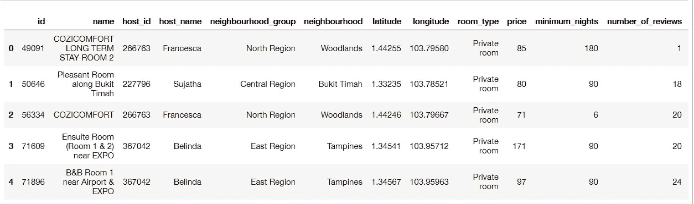

**c .了解数据**

在我们加载数据集之后，我们需要通过使用各种技术来理解数据集。首先，我们需要寻找关于我们的数据集有多大的信息。通过使用 **shape** 属性，我们从包含列表索引的若干行和包含与该索引相关的每个特征的内容的若干列中了解我们的数据大小。

```
airbnb.shape
```

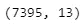

(行数、列数)

然后我们检查每一列的所有数据类型，如果它已经符合我们的要求。例如，我们需要经度和纬度上的数字数据类型(整数和浮点),为了列出名称，我们需要确保数据使用的是字符串/对象数据类型。

```
airbnb.dtypes
```

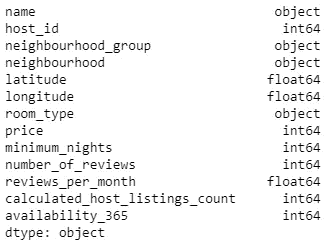

数据类型信息

我们发现我们的数据集有 **7395 个列表**。这些特性包括列表名称、主机 id、位置信息、位置坐标、房间类型、每晚价格等等。

接下来，我们查找由所有新加坡地区列表组成的“neighbourhood _ group”的所有唯一值

```
airbnb['neighbourhood_group'].unique()
```

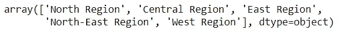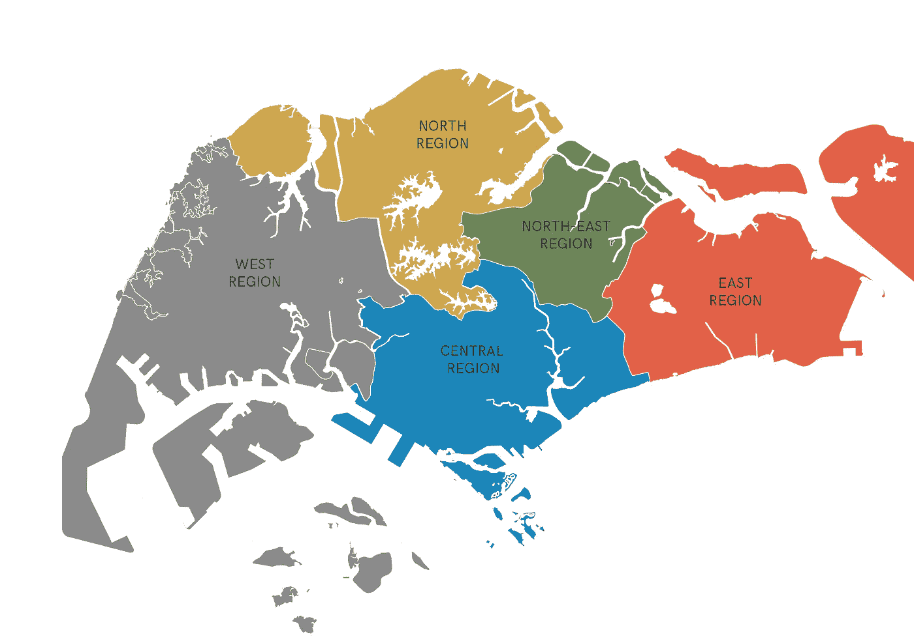

区域地图

从上面的列表中，我们看到新加坡有 5 个区域。

城市重建局(URA)将该地区进一步划分为 55 个区域，称为城市规划区。我们将使用“邻居”列来查看哪个规划区域有 Airbnb 列表。

```
airbnb['neighbourhood'].unique()
```

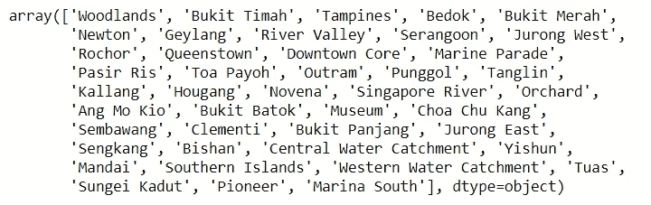

邻近

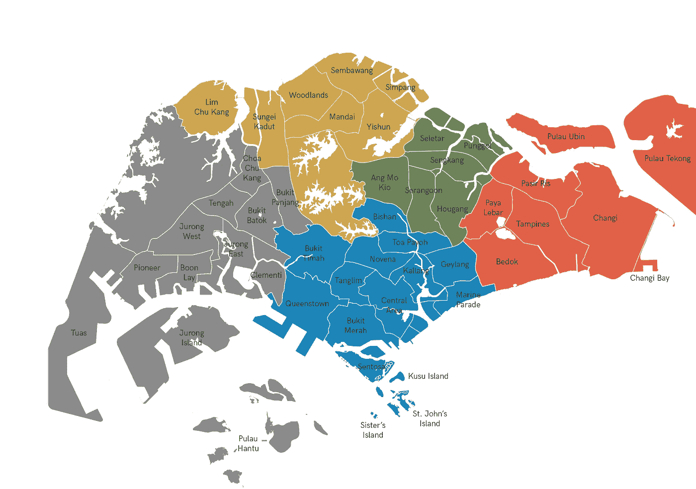

规划区地图

现在，我们知道有 43 个规划区有 Airbnb 房源。

我们还查找列表中每个房间类型的“房间类型”列

```
airbnb['room_type'].unique()
```

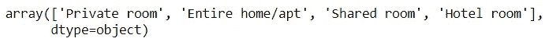

房间类型

从上面的列表中，我们看到 Airbnb 有 4 种房型。根据 Airbnb 网站上的信息，每种房间类型的定义如下:

*   **包间**

客人可以单独进入酒店的卧室/睡眠区。其他区域如客厅、厨房和浴室也可能对主人开放，甚至对其他客人开放。

*   **整个家/公寓**

客人们可以独享整个地方。它通常包括卧室、浴室和厨房。

*   **共享房间**

游客睡在卧室或可以与他人共享的公共区域。

*   **酒店房间**

典型的酒店房间及其设施。自 2018 年以来，Airbnb 允许一些精品酒店和高评级独立酒店在其网站上列出他们的房间。

# 2.清洗数据集

下一步是清理数据，我们加载的数据经常会有各种各样的错误，比如打字错误、缺少值、数据不完整等等。通过清理，数据质量将有更好的质量用于进一步的分析。

**a .检查缺少值的列**

让我们首先检查我们的数据集中是否有任何丢失的值

```
**airbnb.isnull().sum()**
```

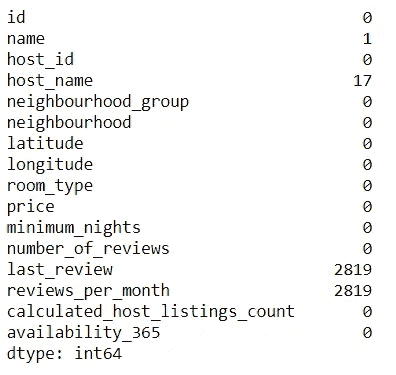

**b .删除冗余变量**

在我们的例子中，观察到的缺失值不需要过多的处理。查看我们的数据集，我们可以声明列“name”和“host_name”，“last_review”对于进一步的数据探索分析是不相关和不道德的。因此，我们可以去掉那些列。

```
airbnb.drop(['id','host_name','last_review'],axis=1,inplace=True)
**airbnb.head()**
```

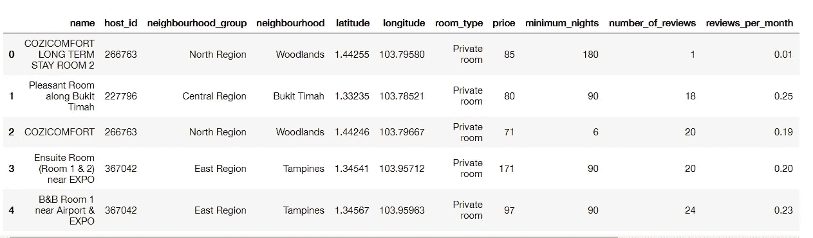

**c .替换所有缺失值**

接下来，我们需要用 0(零)替换“review_per_month”列中所有缺失的值，以确保缺失的值不会干扰我们的分析

```
airbnb['reviews_per_month'].fillna(0,inplace=True)
```

# 3.探索和可视化数据

清理完数据后，下一步是通过可视化和分析要素值来探索数据，解释过程和结果。

对于我们的例子，我们将查找由每个最大值组成的各种列表类别，使用地图可视化列表分布，为每个区域创建房间类型比例，从列表名称中查找销售值，并找到最受欢迎的列表的平均价格。

**a .热门列表计数**

首先，我们跳过“名称”的第一列，从“主机 id”列开始。然后，我们根据列表计数对前 10 个主机进行切片

```
top_host_id = airbnb['host_id'].value_counts().head(10)
```

接下来，我们设置图形大小，并使用条形图为数据可视化绘图进行设置

```
sns.set(rc={'figure.figsize':(10,8)})viz_bar = top_host_id.plot(kind='bar')
viz_bar.set_title('Hosts with the most listings in Singapore')
viz_bar.set_xlabel('Host IDs')
viz_bar.set_ylabel('Count of listings')
viz_bar.set_xticklabels(viz_bar.get_xticklabels(), rotation=45)
```

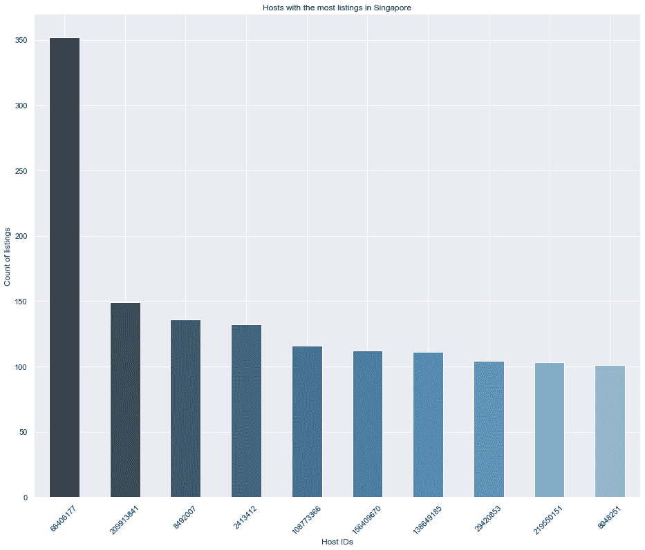

从上面的图表中，我们可以看到**前 10 名主机的总数几乎是整个数据集(7395 个列表)**的 20%( 1416 个列表)。甚至其中一个主机有 350 多个房源！

**b .顶部区域面积**

接下来，我们使用“neighbourhood _ group”列来可视化每个区域中列表计数的比例

```
labels = airbnb.neighbourhood_group.value_counts().index
colors = ['#008fd5','#fc4f30','#e5ae38','#6d904f','#8b8b8b']
explode = (0.1,0,0,0,0)shape = airbnb.neighbourhood_group.value_counts().valuesplt.figure(figsize=(12,12))
plt.pie(shape, explode = explode, labels=shape, colors= colors, autopct = '%1.1f%%', startangle=90)
plt.legend(labels)
plt.title('Neighbourhood Group')
**plt.show()**
```

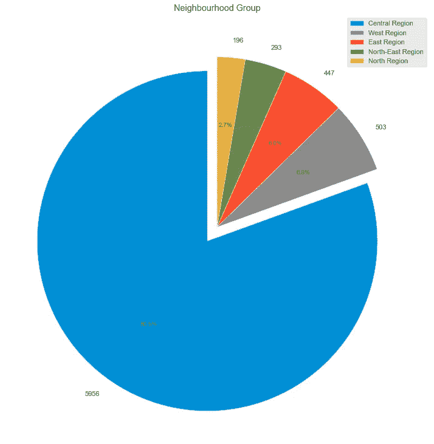

从上面的图表中，我们可以看到**中心区域拥有最多的房源**，有近 6000 个房源，占全部房源的 80%以上。

**c .顶级规划领域**

接下来，我们查找列表数量最多的前 10 个规划区域

```
airbnb.neighbourhood.value_counts().head(10)
```

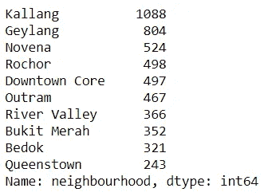

我们可以看到， **Kallang 的列表数最高。**我们还发现**前 10 个规划区中有 9 个位于中部地区**，Bedok 位于东部地区是个例外。

**d .列表图**

为了创建列表位置的地图，我们将使用“经度”和“纬度”列。但是首先，我们需要检查列中的值

```
coord = airbnb.loc[:,['longitude','latitude']]
**coord.describe()**
```

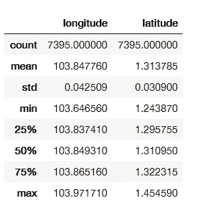

从上面的数据中，我们可以看到**最小**和**最大**指标的**经度**和**纬度**的外值。

接下来，我们可视化每个列表的散点图，并根据每个不同区域的颜色对其进行分组

```
plt.figure(figsize=(18,12))
plt.style.use('fivethirtyeight')BBox = (103.5935, 104.0625, 1.1775, 1.5050)sg_map = plt.imread('map_bnw.png')
plt.imshow(sg_map,zorder=0,extent=BBox)
ax = plt.gca()groups = airbnb.groupby('neighbourhood_group')
for name,group in groups :
    plt.scatter(group['longitude'],group['latitude'],label=name,alpha=0.5, edgecolors='k')plt.xlabel('Longitude')
plt.ylabel('Latitude')
plt.legend()
```

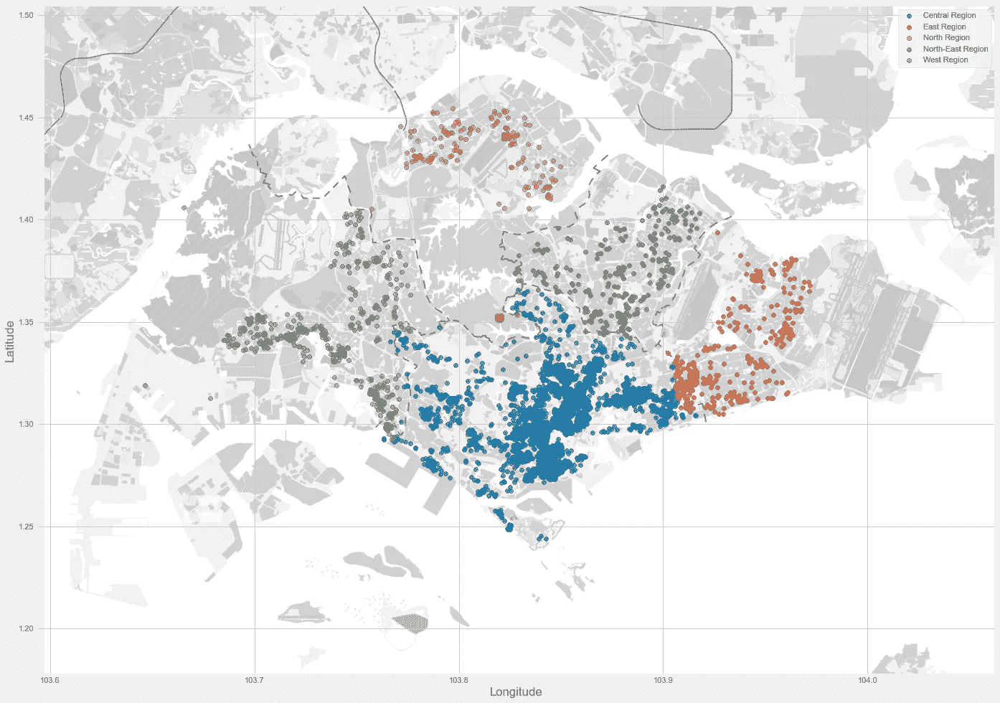

列表映射

现在我们可以看到列表是如何被绘制到地图中的。为了更好地理解列表密度，我们可以使用 follow 热图

```
**import folium
from folium.plugins import HeatMap**map_folium = folium.Map([1.35255,103.82580],zoom_start=11.4)HeatMap(airbnb[['latitude','longitude']].dropna(),radius=8,gradient={0.2:'blue',0.4:'purple',0.6:'orange',1.0:'red'}).add_to(map_folium)
display(map_folium)
```

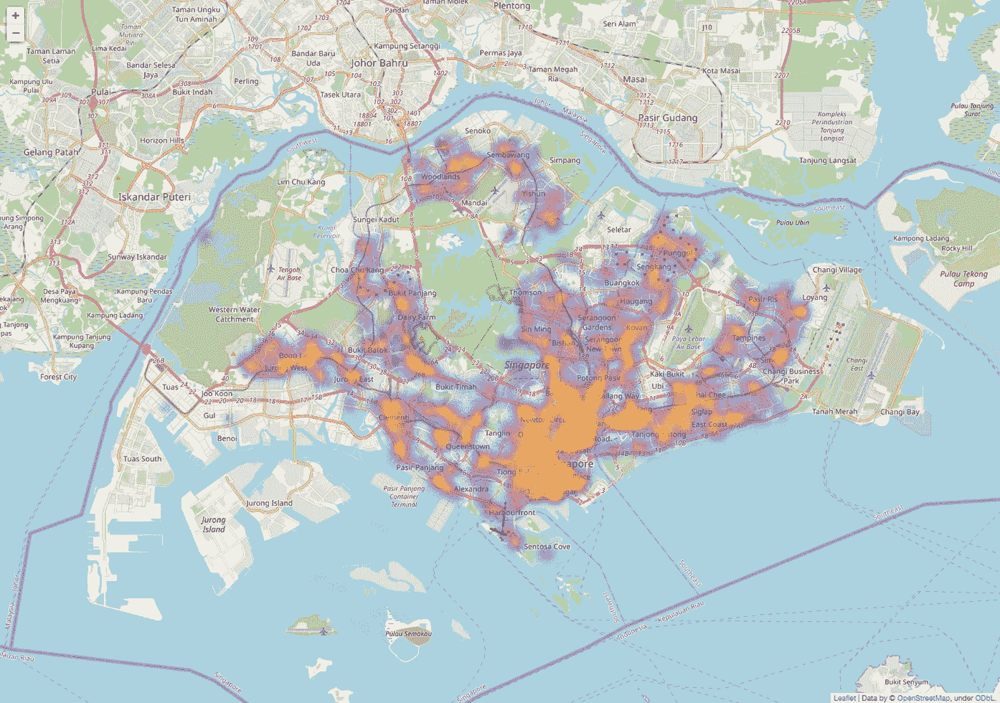

列表密度图

从上面的地图中，我们可以清楚地看到**最密集的列表**所在的位置，在中央区域的**南部区域用红色显示。离中心区域越远，上市密度越低。**

**e .价格图**

在我们可视化价格图之前，我们需要通过移除一些异常数据来更新数据集，因为一些数据价格的值远离 IQR(四分位数范围)。

```
airbnb_1 = airbnb[airbnb.price < 300]
```

接下来，我们使用价格热图中的经度和纬度点来可视化每个列表的散点图和价格范围的差异。

```
plt.figure(figsize=(18,12))sg_map = plt.imread('map_bnw.png')
plt.imshow(sg_map,zorder=0,extent=BBox)
ax = plt.gca()airbnb_1.plot(kind='scatter',x='longitude',y='latitude',label='Listing Location', c='price', ax=ax, cmap=plt.get_cmap('jet'), colorbar=True, alpha=0.4, zorder=5)**plt.legend()
plt.show()**
```

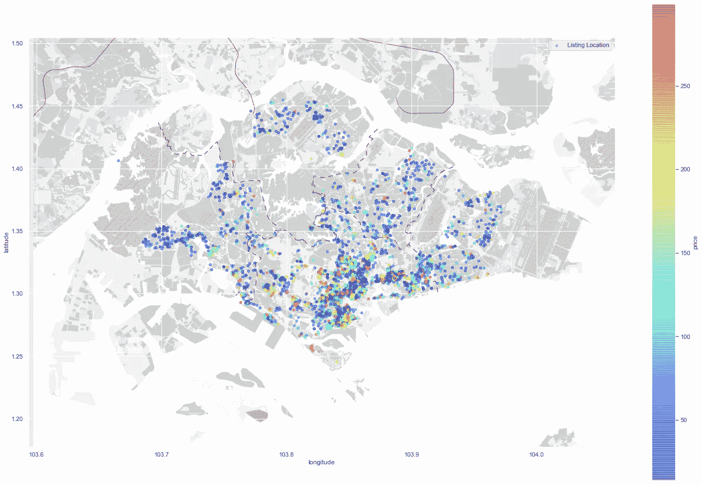

列表价格图

从上面的地图中，我们观察到**价格朝着中心区域**的中心部分相对上升，因为该区域是新加坡的 CCR 区域。

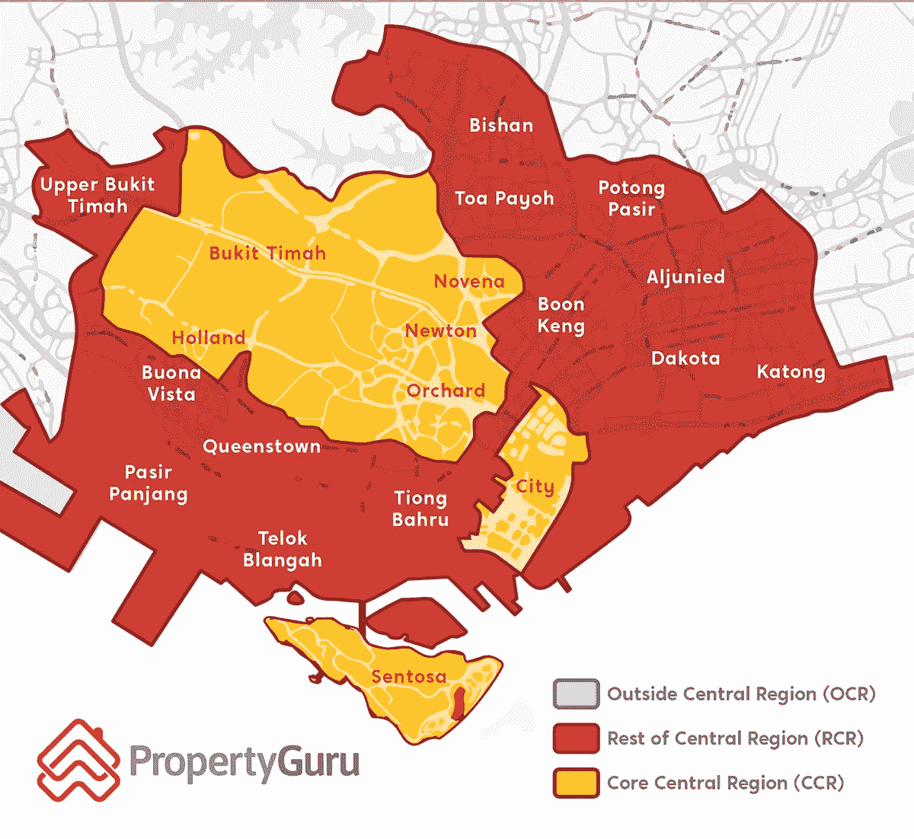

[PropertyGuru 市场细分图](https://www.propertyguru.com.sg/property-guides/ccr-ocr-rcr-region-singapore-ura-map-21045)

从房地产的角度来看，URA 将新加坡分为三个主要区域，他们称之为“细分市场”。核心中心区(CCR)，用黄色表示，是中心区的主要区域，在这里可以找到大多数高端和豪华的物业。中部地区(RCR)其余部分的红色被视为位于外部中部地区(OCR)的大众市场公寓和 CCR 中的高价值物业之间的中间层市场。最后一个是 OCR，由灰色表示，覆盖了新加坡四分之三的面积，基本上是低端大众市场公寓所在的区域。

通过查看上面的两张地图，我们可以认为 Airbnb 的挂牌价格与房地产细分市场有关。但要得出这样的结论，我们需要更多的数据来做进一步的分析。

**f .价格分布**

根据我们对价格热图的观察，我们需要使用一个方框图来显示价格分布，以便更好地了解按“neighborhood _ group”/region 区域分组的标价范围。

```
plt.style.use('fivethirtyeight')
plt.figure(figsize=(14,12))
sns.boxplot(y='price',x='neighbourhood_group',data = airbnb_1)
plt.title('Neighbourhood Group Price Distribution < S$ 300')
**plt.show()**
```

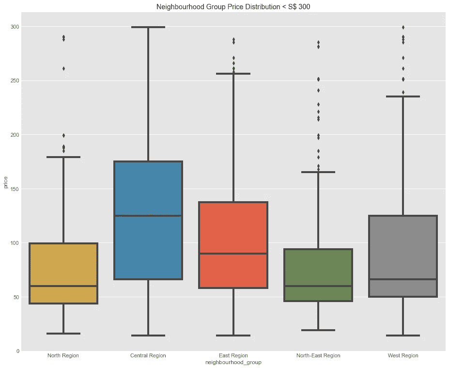

从上面的数据中，我们看到**中部地区每晚的价格最贵**，中位数为**130**新元。

**g .顶级列表词**

接下来，我们将通过找出清单名称中最常用的词来更深入地探索属性细节。最常用的词可以代表他们的财产对潜在客人的销售价值。首先，我们将创建一个收集单词的函数。

```
**#Crete empty list where we are going to put the name strings**
names=[]**#Getting name string from 'name' column and appending it to the empty list**
for name in airbnb.name:
    names.append(name)**#Setting a function to split name strings into seperate words**
def split_name(name):
    s = str(name).split()
    return s**#Create empty list where we are going to count the words**
names_count = []**#Getting name string to appending it to the names_count list**
for n in names:
    for word in split_name(n):
        word = word.lower()
        names_count.append(word)
```

我们需要导入**计数器**库来计数并生成包含主机使用的前 25 个字的原始数据

```
**from collections import Counter**top_25 = Counter(names_count).most_common()
top_25 = top_25[:25]
```

然后，我们将数据转换成数据帧，并将我们的发现可视化

```
word_count_data = pd.DataFrame(top_25)
word_count_data.rename(columns={0:'Words',1:'Counts'},inplace=True)viz_count = sns.barplot(x='Words',y='Counts', data = word_count_data)
viz_count.set_title('Top 25 used words for listing names')
viz_count.set_ylabel('Count of words')
viz_count.set_xlabel('Words')
viz_count.set_xticklabels(viz_count.get_xticklabels(),rotation = 90)
```

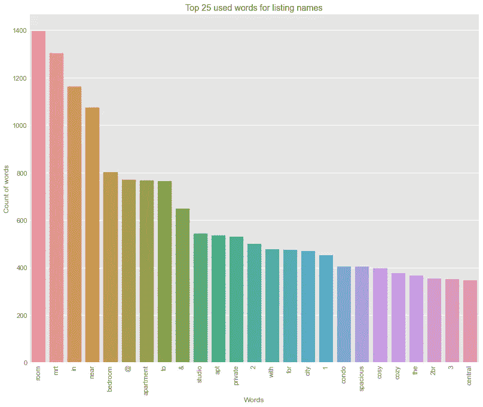

列出姓名时最常用的 25 个单词

从上面的图表中，我们看到了列表名称中使用的前 25 个单词。我们可以用文字云可视化的方法来帮助我们更好地理解图表。

```
**from wordcloud import WordCloud, ImageColorGenerator**text = ' '.join(str(n).lower() for n in airbnb.name)**#Generate wordcloud image**
wordcloud = WordCloud(max_words=200, background_color = 'white').generate(text)
plt.figure(figsize=(25,20))**#Display the image**
plt.imshow(wordcloud, interpolation='bilinear')
plt.axis('off')
plt.show()
```

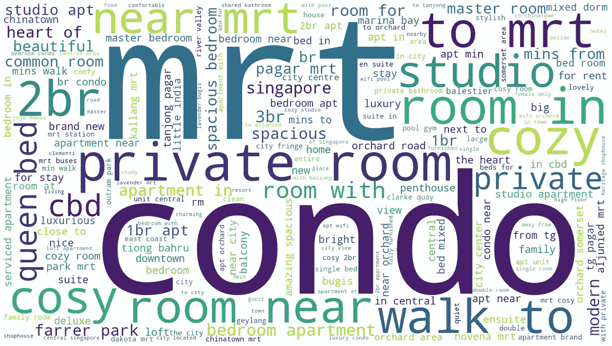

正如我们所看到的，大多数列表销售价值与公共设施(如 mrt 和活动中心)的邻近度或连接度有关，通过“MRT”、“near”、“to”、“city”、“walk to”关键字显示。有趣的是，看到房间条件如何落后于这些值，在图表的较低等级上显示为“宽敞”、“舒适”、“惬意”。

**h .房型详情**

接下来，我们将使用 Plotly API 图形可视化库来可视化每个地区的所有房型比例

```
**import plotly.offline as pyo
import plotly.graph_objs as go****#Setting up the color pallete**
color_dict = {'Private room': '#cc5a49', 'Entire home/apt' : '#4586ac', 'Shared room' : '#21908d', 'Hotel room' : '#C0C0C0' }**#Group the room type using 'neighbourhood_group' as an index**
airbnb_types=airbnb.groupby(['neighbourhood_group', 'room_type']).size()**#Create function to plot room type proportion on all region area**for region in airbnb.neighbourhood_group.unique():

    plt.figure(figsize=(24,12))

    airbnb_reg=airbnb_types[region]
    labels = airbnb_reg.index
    sizes = airbnb_reg.values

    colors = [color_dict[x] for x in labels]

    plot_num = 321
    plt.subplot(plot_num)
    reg_ch = go.Figure(data = [go.Pie(labels = labels, values = sizes, hole = 0.6)])
    reg_ch.update_traces(title = reg, marker=dict(colors=colors))
    reg_ch.show()

    plot_num += 1
```

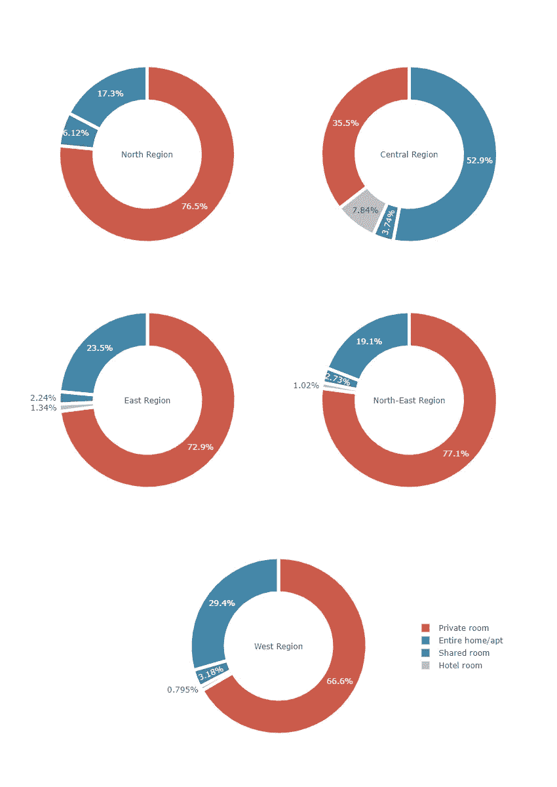

房间类型

我们可以看到，中心区域是唯一由整个住宅/公寓类型主导的区域，其余区域由私人房间类型主导。总体而言，酒店类型是每个地区上最少的房源，因为 Airbnb 在 2018 年才开始接受酒店房源。

一.最受关注的 10 个名单

我们将根据评论数量找出前 10 名的房源，以了解新加坡最受欢迎的 Airbnb 房源。

```
airbnb.nlargest(10, 'number_of_reviews')
```

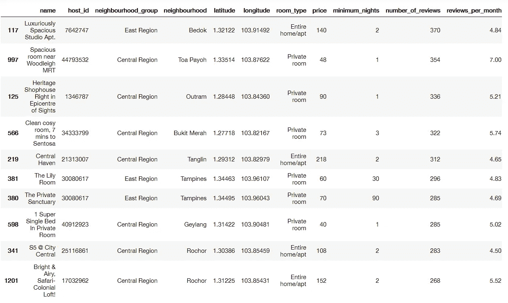

瞧啊。这是 10 个最受欢迎的列表。同样，我们发现大多数最受关注的列表位于中部地区，10 个列表中有 7 个位于中部地区。

**j .每晚平均价格**

最后，我们将计算 10 个最受欢迎的房源每晚的平均价格

```
price_avg = top_review.price.mean()
print('Average price per night: S$ {}'.format(price_avg))
```

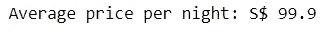

从这个输出中，我们可以观察到**Airbnb Singapore 上最受欢迎的前 10 个房源的平均价格为 99.9 新元**，大多数房源的价格都低于 90 新元，其中 6/10 是“私人房间”类型，热门评论房源总共有 3111 条评论。

# **结论**

简单地通过对数据集执行 EDA，我们已经识别出关于 Airbnb 房源如何在新加坡分布的各种新见解，我们知道房源位于哪里，发现中心区域支配着房源数量并具有最高的价格范围，房源价格可能如何与周围的房地产价格相关，并发现房源与其周围的连接性成为共同的销售价值之一。

在下一篇文章中，我们将使用更详细的版本来探索数据集。我们将重点关注中心区域，以了解更深层次的背景，了解该区域每个房源之间的关系，以及它们与外部变量的关系，例如与公共设施的连接，以及房地产价格对房源租赁价格的影响。

感谢您的阅读！请随时给予任何反馈！

**参考:**

1.  [https://towards data science . com/an-extensive-guide-to-explorative-data-analysis-DDD 99 a 03199 e](/an-extensive-guide-to-exploratory-data-analysis-ddd99a03199e)
2.  [https://www . channelnewsasia . com/news/business/Airbnb-records-30-第一季度预订增长率-11817260](https://www.channelnewsasia.com/news/business/airbnb-records-30-growth-rate-in-first-quarter-on-booking-11817260)
3.  [https://www . property guru . com . SG/property-guides/CCR-ocr-rcr-region-Singapore-ura-map-21045](https://www.propertyguru.com.sg/property-guides/ccr-ocr-rcr-region-singapore-ura-map-21045)
4.  [https://www . Airbnb . com/help/article/5/the room-type-of-a-listing-是什么意思](https://www.airbnb.com/help/article/5/what-does-the-room-type-of-a-listing-mean)