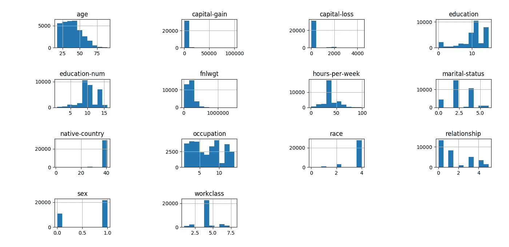
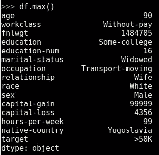

# 数据探索与洞察

> 原文：<https://towardsdatascience.com/data-exploration-vs-insights-cd2d3551fd77?source=collection_archive---------47----------------------->

(来源: [PxHere](https://pxhere.com/en/photo/1554545) )

## Pytolemaic 系列

## 为什么您应该停止数据探索，转而使用自动洞察生成。

## 动机

一个 ll 数据项目从数据开始，工作从*数据探索*开始。通过执行数据探索，探索者旨在熟悉和理解数据，发现有趣的事实和趋势，如数据中的损坏、相关性、类别不平衡。

然而，数据浏览器的最终目标不是有趣的事实或趋势，而是可操作的*见解。*这些数据洞察随时可用——可能用于清理数据、提高模型性能或支持业务 KPI。

这不是一个容易的过程。即使是很小的数据集(包含几千个样本和仅仅十几个特征的表)也很难理解，筛选见解就更难了。在这篇文章中，我将讨论为什么数据探索是发现有用数据洞察的错误方法，并建议用自动洞察生成方法来取代它。我将分享这种洞察力生成方法的一些结果以及我的结论。

## 数据探索，以及为什么你不应该这样做

人们通常通过查看一些样本来开始数据探索过程，这很好，但最多限于几百个样本。接下来，他/她会查看一些统计数据(例如最小值、最大值、频率、计数)并绘制一些直方图，以寻找有趣的见解。根据一个人的创造力和好奇心，为数据集中的每个要素生成一打统计数据和图表是相当容易的，这些数据可以累积到数百甚至数千个图表。

比如我们来看看 UCI 的*成人*数据集([链接](https://www.kaggle.com/johnolafenwa/us-census-data))。这是一个小数据集——大约 50K 个实例和 15 个特征——这个 Kaggler 已经为其训练了一个简单的逻辑回归模型，但在此之前绘制了 20 多个统计表和图表。

> 只见树木不见森林

成人数据集中所有特征的直方图(来源:*作者)*

我们贫乏的人类头脑无法处理太多的信息。太多的统计数据/图表会导致浏览时看不到它们。

> 在 Data Exploration 干草堆中寻找针

成人数据集中所有特征的最大值(来源:*作者)*

抛开创建统计表/图表所需的工作不谈，阅读和理解其中的内容需要付出大量的努力。例如，计算每个特征的最大值是微不足道的，但是要注意到一个特定的特征，(例如，*成人*数据集中的‘资本收益或‘每周小时数’)有一个可疑的最大值——这几乎是不可能的。

> 信息只有在你能付诸行动时才是有用的

数据探索旨在通过各种功能和技术获取数据信息。然而，我们需要所有这些信息吗？答案是不，我们没有。任何不会引发行动的信息都是无用的，我们不需要无用的信息，不管它多么有趣。

例如，让我们看看*成人*数据集中*职业*特征的直方图。我们可以看到每个职业有多少人。

*成人*数据集中特征占用的直方图(来源:*作者)*

如果那是你的数据集——你会在意数据集有 994 个渔民样本和 3650 个销售人员样本吗？可能分别是 1515 年和 2317 年，对吗？那么，如果一个箱子高度的 50%的差异没有影响，也不会引发第二个想法，为什么要首先查看直方图呢？

## 洞察力，以及如何获得洞察力

答案很简单——我们在搜索有趣的信息时进行数据探索，我们可以根据这些信息采取行动，换句话说，就是洞察力。看着上面的例子，我们可以发现一些有趣的事实:

*   “**职业为‘武装部’的只有 9 人**”。
*   **职业不明的有 1500 人**。
*   **“管理者比渔民多 4 倍”。**

然而，只有前两句话应被视为见解，因为它们会引发行动。

*   “**职业为‘武装部’的只有 9 人**”。→触发*“从数据集中删除这些样本”*动作或*“将‘职业’类与另一类合并”*。
*   **职业不明的有 1500 人**。→触发“*验证数据正确性*”动作，随后触发“*处理缺失值*”动作。

> 如果你先画一张图表，然后问自己能从中学到什么，那么你就做错了。相反，首先决定你想学什么，然后绘制图表。

绘制一个有趣的图表，然后试图发现洞察力是大多数人做的事情。很有挑战性，也很好玩，但不是很有效。更好的方法是根据问题的答案来定义“问题”( **Q** )或“假设”( **H** )以及相应的“动作”( **A** )。例如:

*   **H:** 超出 5-sigma 范围的异常值数量应≤1。
    **答:**降样。

在这种方法中，洞察力( **I** )很容易被发现，因为它们是触发行动的事实——对未实现的问题( **Q** )或假设( **H** )的回答。基于*成人*数据集的一些示例:

*   **H:** 超出 5-sigma 范围的异常值数量应≤1。
    **I** : 709 个异常值超出了特性“资本收益”的 5-sigma 范围。
    **I** : 244 个异常值在特征“资本损失”的 5-sigma 范围之外。
    **答:**滴样品。
*   **H:** 数字特征的最大值不是 10**k-1 的格式。
    **I** :存在‘资本收益’为 99999 的样本。
    **I** :存在“每周小时数”为 99 的样本。
    **答:**验证这些值的正确性。
*   **问:**唯正特征有没有负值？
    **I** : *无*(没有这样的值)。
    **A** :如果有，更换为 N/A

让我们看看如何将它写入代码:

3 种洞察的代码示例

> 洞察力不仅限于数据

在前面的示例中，我们重点关注了来自数据集的见解。然而，如果我们定义一些 ML 假设，我们可能会发现额外的见解。例如:

*   **H** :测试集和训练集具有相似的数据分布
*   **H** :数据集中没有重要性为 0 的特征
*   **H** :如果主要指标显示良好的结果，那么其他指标也有合理的值。

在大多数情况下，回答这些问题或检验假设是很容易的，不需要使用图形方式，甚至不需要人参与。因此，这一过程通常可以自动化，并且由于许多假设不依赖于数据集，因此不难扩展。人们甚至可以继承这个概念，为数据集定义一套单元测试。

## 自动洞察生成

我已经开始尝试实现这样的自动洞察生成器，作为 [Pytolemaic](https://github.com/Broundal/Pytolemaic) 包的一部分(在这里阅读更多)。我定义并实现了一组通用的假设，后来我在几个数据集上进行了尝试。在讨论我的结论之前，让我们看看那些试验的结果。

## 见解示例

*   [Titanic](https://www.kaggle.com/c/titanic) 数据集— 900 个样本 X 11 个特征

泰坦尼克号数据集的自动生成洞察

**洞察力告诉我们**:存在 5-sigma 异常值——需要检查。此外，一些功能(姓名/机票/客舱)使用不正确。

*   [加州房价](https://scikit-learn.org/stable/modules/generated/sklearn.datasets.fetch_california_housing.html)数据集— 20k 样本 X 8 特征

加州房价数据集的自动生成洞察

**洞察力告诉我们**:存在 5-sigma 异常值——需要检查。

*   [成人](https://archive.ics.uci.edu/ml/datasets/adult)数据集— 32K 样本 X 14 个特征

成人数据集的自动生成洞察

**洞察力告诉我们**:存在 5-sigma 异常值——需要检查。此外，每周*小时数(* 99.0)和*资本收益* (99999.0)也有可疑值。

*   [Sberbank 房产市场](https://www.kaggle.com/c/sberbank-russian-housing-market) — 3 万个样本 X 291 个特征(一场卡格尔竞赛)

Sberbank 房产市场数据集的自动生成洞察

**洞察告诉我们**:大约有 250 个洞察，其中大部分是 5-sigma 离群值——需要检查。另外，在*子区域*的小类应该合并到一个‘其他’类*。*

> 下面给出了使用 Pytolemaic 包生成 Titanic insights 的代码，如果您想亲自尝试的话。

## 我的结论

这些见解的实现非常有趣，并不像我预期的那么难。它向我展示了实现通用的自动生成的见解并获得对数据的有用见解是可能的。产生这种见解的要求是经验、创造力和编码技能——任何高级数据科学家都具备的技能组合。然而，在创建 insight 模块时，我不得不面对几个挑战，使得这个过程充满挑战。

*   **有用性** 由于定义问题/假设所涉及的过程，使见解变得有用并不是一个很大的挑战。因为行动是定义的一部分，所以获得的任何洞察都是可操作的，因此是有用的。然而，动作应该是 insight 模块输出的一部分，因为读者可能不知道要执行什么动作。
*   **简短、清晰、干净且易于理解** 通过查看这些自动生成的见解，很明显选择正确的格式至关重要。对于一些见解，我很难选择一个好的格式，这是显而易见的。难以阅读或难以理解的见解会被忽视和忽略，错过它们包含的信息。
    例如，在上述示例中，insight 分析是在分类特征已经通过序号编码的数据集上执行的，这使得“class '1.0 '只有 3 个表示”这样的句子非常模糊，因为人们很难弄清楚 class '1.0 '到底是什么？
*   **完整信息** 洞察应该包含数据科学家采取行动所需的所有相关信息。例如，离群值的“# *”洞察不提供遇到的最大值和最小值。因此，要由读者来查找(即编写一些代码)这些带有离群值洞察力的特性的数字——有很多这样的特性。然而，请注意，如果一个人想要保持简短清晰的洞察力，提供额外的信息并不像看起来那么简单。*
*   洞察力的质量和有用性很大程度上取决于投入到分析中的努力。例如， *'# of outliers'* 假设正态分布，这可能不是许多特征的情况(例如，“年龄”，“每周小时数”)。可以定义高级假设来揭示隐藏的见解，例如特征之间的高度相关性、数据中的异常、时间漂移等等。
*   **全面性** 由于数据集/模型中可能出现的问题数量接近于无穷大，因此要创建一套全面的见解几乎是不可能的。全面性只能通过从经验教训中不断改进来实现。
*   **太多的洞见** 克服了上面所有的挑战之后，还有一个主要的挑战——如何避免产生太多的洞见。当有太多的洞见时，用户将很难浏览所有的洞见。Sberbank 的例子展示了这样的行为。我相信我们需要实现一些算法来帮助我们筛选列表中更重要的见解。

## **总结一下**

由于人类能力有限，数据探索无法扩展。因此，我们需要使用不同的方法——自动洞察生成。在这种方法中，我们定义了一组问题-行动或假设-行动对。然后将问题/假设应用于数据集，提供可操作的答案。

通过几个例子，我们看到了这种方法的潜力和挑战。我相信，在不久的将来，世界将超越人工数据探索，代之以强大的算法，能够以可扩展的方式提供可操作的见解。