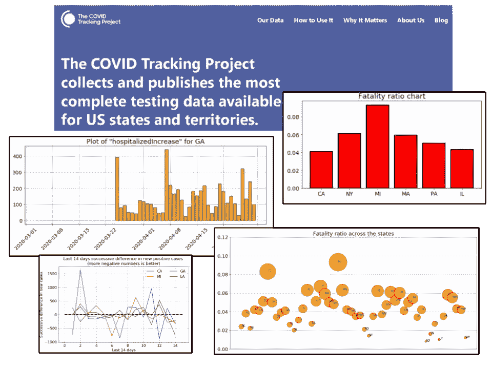

# COVID 跟踪项目的数据探索

> 原文：<https://towardsdatascience.com/data-exploration-with-the-covid-tracking-project-d89ac87342bc?source=collection_archive---------32----------------------->

## 如何使用新冠肺炎最全面的美国数据库之一轻松进行探索性数据分析(EDA)。

***编者按:*** [*走向数据科学*](http://towardsdatascience.com/) *是一份以数据科学和机器学习研究为主的中型刊物。我们不是健康专家或流行病学家，本文的观点不应被解释为专业建议。想了解更多关于疫情冠状病毒的信息，可以点击* [*这里*](https://www.who.int/emergencies/diseases/novel-coronavirus-2019/situation-reports) *。*

# 什么是 COVID-tracking-project？

根据他们的[网站](https://covidtracking.com/),**COVID 跟踪项目收集并发布了美国各州和地区**最完整的测试数据。

**图片来源**:截图来自 [Covid-tracking-project 网站](https://covidtracking.com/)

了解区域疫情的发展动态和精确位置需要完整的测试图——每个州/地区实际上有多少人接受了测试，测试是何时进行的，结果是什么。

 [## 新冠肺炎科学:为什么测试如此重要

### 艾德亚多·桑奇兹博士是美国心脏协会负责预防的首席医疗官，也是前州卫生局局长

www.heart.org](https://www.heart.org/en/news/2020/04/02/covid-19-science-why-testing-is-so-important) 

事实上，该项目已被全国各大媒体公司和机构引用和使用。

**图片来源**:截图来自 [Covid-tracking-project 网站](https://covidtracking.com/)

如何验证数据的质量和准确性？

该网站进一步补充道“…o *我们的数据团队使用网站抓取器和追踪器来提醒我们发生的变化，但对我们数据集的* ***实际更新是由细心的人*** *手动完成的，他们会仔细检查每一项变化，并广泛地注释不明确的变化区域。*

流行新闻媒体中的一些可视化内容(例如纽约时报、政治、华尔街日报等。)都是从这些数据中创建出来的。

**图片来源**:截图来自 [Covid-tracking-project 网站](https://covidtracking.com/)

在本文中，我们将了解简单的 Python 脚本如何帮助您阅读该数据集并创建有意义的可视化效果，从而追踪和了解新冠肺炎在美国的传播情况

> 了解区域疫情的发展动态和精确位置需要一个完整的测试图…

# 代码和演示

代码可以在这个 [**Jupyter 笔记本**](https://github.com/tirthajyoti/Covid-19-analysis/blob/master/Notebook/Covid-tracking-project.ipynb) 在我的 [**新冠肺炎分析 Github 回购**](https://github.com/tirthajyoti/Covid-19-analysis) 中找到。

## 提取数据并加载到数据帧中

第一部分是从网站上提取数据，并将其加载到熊猫数据框架中，以便于分析。

幸运的是，他们以 CSV 格式为此目的提供了一个简单的 API 端点。

这意味着，为了分析最新的数据，你只需要实时运行脚本，从网站上获取最新的数据。不依赖于旧的下载数据文件！

## 一些家务

我们可能希望将日期字段转换成特定的格式，删除不必要的列，并确保`state`字段有字符串值。

## 有什么样的数据？

这是数据集列的快照，

请注意，并非所有数据都以相同的数量/频率出现。记录阳性/阴性病例，定期维护测试结果，而住院数据(呼吸机、ICU 等。)都有些稀疏。

**我们预计在数据帧**中会有很多 NaN 或 voids，所以我们可以简单地用一个特殊的数字来替换它们，比如-1，以便稍后签入我们的验证代码。

## 给定变量/状态的条形图

条形图是最常见的这种类型的视觉分析。我们编写了一个自定义函数来绘制任何给定状态下数据集中的任何变量随时间的变化。

我们不会在这里乱码，但这里有例子。请注意，并非所有系列都具有相同数量的数据点，或者并非所有系列都从相同的时间点开始。但是代码只是简单地处理它，并为用户选择的特定状态绘制可用数据。

## 散点图检查相关性

相关性的一个基本检查是通过创建双变量散点图来完成的。因此，我们编写一个自定义函数来为任何一对变量创建散点图。

**总检测数和阳性病例数之间是否存在正相关关系？**

**死亡人数是否随住院率单调增加？**

## 跟踪测试的进度

正如我们在开始时提到的，COVID-tracking 项目主要用于测试相关数据。因此，毫不奇怪，我们想要创建一个可视化来跟踪测试工作中各种状态的进展。

我们甚至可以使用折线图在同一个图上比较多个状态。该函数还为我们计算平均测试/日指标，并将其放入图例中。

## 计算各种比率的函数

我们编写了一组函数来计算各种有用的比率，

*   *:死亡总人数与阳性总人数之比*
*   ****住院率*** :住院总人数与总阳性病例数之比*
*   ****阳性病例比率*** :总阳性病例数与总检测数的比率*

*一旦对这些函数进行了编码，就可以在标准的可视化脚本中使用它们来绘制条形图，比较各种状态的比率。这将回答一些问题，比如哪个州的死亡率最高？哪个州的住院率最低？*

> ***为什么这些比率对计算和跟踪很重要？***

*这是因为，稍后，公共卫生官员和社会科学家可以查看这些数字，并假设当地因素——医疗保健系统准备情况、测试/跟踪能力、政治权宜之计、人均 GDP 等。影响了每个州的死亡率和住院率。*

*这里有一些比较图表的例子。请注意，并非所有图表都有相同数量的条形，也并非所有状态都报告相同的指标。*

******

*就人口或新冠肺炎病例而言，纽约州或加利福尼亚州比密歇根州大得多并不重要。该比率清楚地表明，在新冠肺炎阳性病例中，心肌梗死的死亡率最高，而在所有检测中，纽约的阳性病例比例最高。*

*这些断言中的每一个，通过简单的条形图被可视化，都是一个可以跟随和分析的故事，以理解这种疾病的本质和动态。*

> *…公共卫生官员和社会科学家可以查看这些数字，并假设当地因素——医疗保健系统准备情况、检测/跟踪能力、政治权宜之计、人均 GDP 等。影响了每个州的死亡率和住院率。*

## *用于比较所有状态的气泡图*

*相同的比率可以绘制在气泡图中，以便一起比较所有的状态。*

****

## *哪些州有 14 天病例数下降？*

*我们需要编写几个自定义函数来从数据集中提取这些数据或趋势，并将其可视化。*

*基本上，我们可以看看最近 14 天新新冠肺炎病例的**连续差异。如果所有的数字都是负数，那么新的病例会单调下降。即使事实并非如此，那么**负数越多越好，因为这表明总体趋势在下降**。***

*代码在笔记本中，但当我们比较四种状态(CA、GA、LA 和 MI)时，结果显示在这里。事实上，没有一个州显示出一组完整的负数。*

**

# *摘要和其他文章*

*我们展示了如何从美国最受尊敬的新冠肺炎数据库中提取数据，并使用简单的 Python 代码创建有意义的可视化。*

*同样，代码可以在我的[新冠肺炎分析 Github repo](https://github.com/tirthajyoti/Covid-19-analysis) 中的这个 [Jupyter 笔记本](https://github.com/tirthajyoti/Covid-19-analysis/blob/master/Notebook/Covid-tracking-project.ipynb)中找到。这个回购里还有其他有用的笔记本，大家可以叉一下，探索一下。*

***这不是一个预测模型，将来也不会是**。这个脚本的目标是只做可视化分析。**如果没有扎实的流行病学知识或没有合作，就不应该仅仅从时间序列数据中建立任何预测模型。***

*自第二次世界大战以来最大的全球性危机和自 1918-1919 年西班牙流感以来最大的全球性疫情今天降临了。每个人都在关注死亡人数的每日增长和这种新型病毒的快速指数传播。*

*数据科学家，像其他各行各业的许多人一样，也可能感到焦虑。知道数据科学和统计建模的熟悉工具与分析关键测试和疾病相关数据非常相关，这可能有点令人放心。*

*我的几篇文章与新冠肺炎有关。*

* [## 分析纽约时报新冠肺炎数据集

### 创建一个简单的 Python 类来分析和可视化来自纽约时报的新冠肺炎数据集。

towardsdatascience.com](/analyze-ny-times-covid-19-dataset-86c802164210)  [## 新冠肺炎检验的假阳性/假阴性和贝叶斯规则

### 为什么假阳性和假阴性都不利于新冠肺炎测试。为什么贝叶斯规则对这些很重要…

towardsdatascience.com](/false-positives-negatives-and-bayes-rule-for-covid-19-testing-750eaba84acd)  [## “拉平曲线”和“解除锁定”的简单建模

### 一个基本流行病学模型的简单 Python 脚本，用于演示社交距离的影响。

towardsdatascience.com](/simple-modeling-of-flattening-the-curve-and-lifting-lockdown-1a774a248e68) 

注意安全，各位！

***作者注*** : *我是一名半导体技术专家，对将数据科学和机器学习应用于与我领域相关的各种问题感兴趣。我没有医学、分子生物学、流行病学或任何与新冠肺炎相关的专业知识。* ***请不要给我发那种查询的邮件*** *。*

答同样，你可以查看作者的 [**GitHub**](https://github.com/tirthajyoti?tab=repositories) **知识库**获取机器学习和数据科学方面的代码、思想和资源。如果你像我一样，对人工智能/机器学习/数据科学充满热情，请随时[在 LinkedIn](https://www.linkedin.com/in/tirthajyoti-sarkar-2127aa7/) 上添加我，或者[在 Twitter](https://twitter.com/tirthajyotiS) 上关注我。

 [## Tirthajyoti Sarkar - Sr .首席工程师-半导体、人工智能、机器学习- ON…

### 通过写作使数据科学/ML 概念易于理解:https://medium.com/@tirthajyoti 开源和有趣…

www.linkedin.com](https://www.linkedin.com/in/tirthajyoti-sarkar-2127aa7/)*