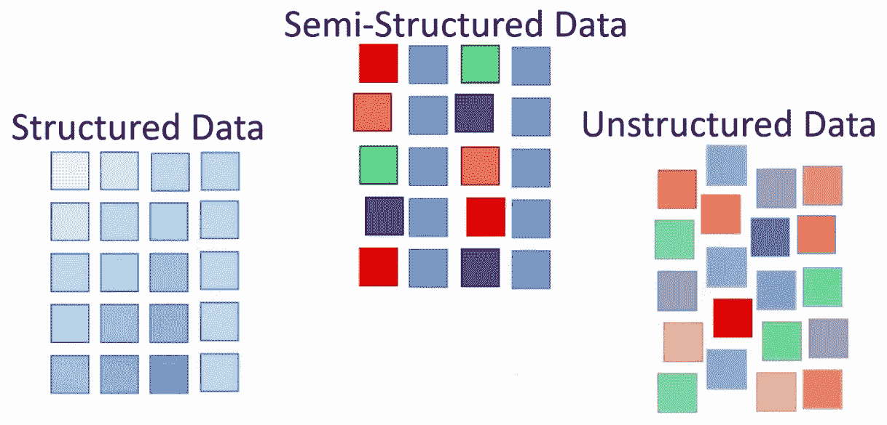
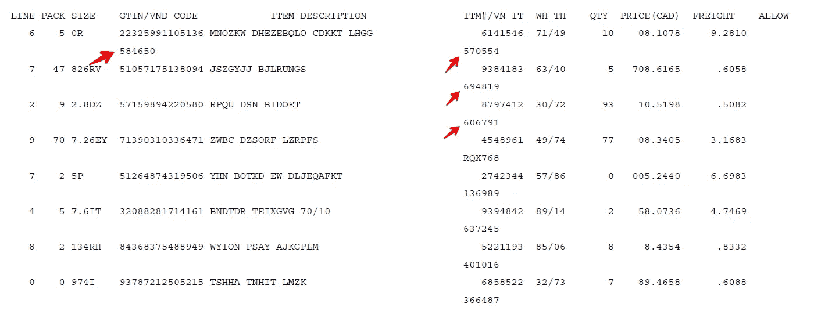

# 从具有半结构化布局的 PDF 表格中提取数据

> 原文：<https://towardsdatascience.com/data-extraction-from-a-pdf-table-with-semi-structured-layout-ef694f3f8ff1?source=collection_archive---------3----------------------->

## [实践教程](https://towardsdatascience.com/tagged/hands-on-tutorials)

## 了解如何使用 pdfminer、numpy 和 pandas 处理特定于上下文的数据结构

图片来自 https://wiki.atlan.com/unstructured-data/

# 什么是半结构化数据？

在当今的工作环境中，PDF 文档被广泛用于内部以及与贸易伙伴交换商业信息。很自然，你已经看到了相当多的 pdf 格式的发票、采购订单、发货单、价目表等。尽管 PDF 文档作为纸质文档的数字替代物，但对其存储的数据的自动化操作提出了挑战。它就像写在纸上的数据一样容易获取，因为有些 pdf 是为了向我们人类传递信息而设计的，而不是计算机。此类 pdf 可能包含没有预定义数据模型或没有以预定义方式组织的[非结构化信息](https://en.wikipedia.org/wiki/Unstructured_data)。它们通常以文本为主，可能包含数字、日期和数字的组合。

使用大多数可用的工具，您通常必须处理整个 PDF 文档，无法将数据提取限制在最有价值的数据所在的特定部分。然而，一些 PDF 表格提取工具就是这样做的。遗憾的是，即使你足够幸运，在你的 PDF 中有一个表格结构，也不意味着你能够无缝地从中提取数据。

例如，让我们看看下面的基于文本的 PDF，其中有一些虚假的内容。它有非常明显和明显的(虽然没有边界)行和列:

作者图片

只要稍加观察，您就可能会忽略一个重要的模式:一些行和列相交处的文本被堆叠和移动，因此很难将其识别为同一数据行的附加特征。

尽管如此，任何不适合列或行的数据都被广泛认为是非结构化的，我们可以将这种特殊的现实世界现象称为半结构化数据。

对于任何现成的提取算法来说，从给定的表中解析数据并不容易。虽然这些工具可能有相当有效的结果，但在这种特殊情况下，我们需要额外的开发工作来满足您的要求。继续学习本教程，您将会找到解决这一挑战的有效方法。

# 本教程的范围

在本教程中，您将学习如何:

*   使用现成的解决方案从 PDF 中提取表格
*   使用真实的文档布局从 PDF 获取原始文本
*   使用 numpy 和 pandas 执行文本操作

更一般地说，您将了解如何在一系列数据提取任务中处理特定于上下文的数据结构。

# 用于表格提取的现成解决方案

为了证实上述陈述的真实性，我们将尝试使用现成的 Python 模块解析半结构化数据，专门用于从 pdf 中提取表格。最受欢迎的开箱即用算法有 [camelot-py](https://camelot-py.readthedocs.io/en/master/) 和 [tabula-py](https://tabula-py.readthedocs.io/en/latest/tabula.html) 。他们都证明了自己在许多复杂的环境中是有效的。让我们看看他们如何应对我们的挑战:

看来我们最初的选择变成了悲惨的失败！虽然 [tabula-py](https://tabula-py.readthedocs.io/en/latest/tabula.html) 在检测我们的表格的网格布局方面似乎稍好一些，但它仍然提供了许多额外的工作来分割第二列中的文本，并不是说它已经完全开始了原始表格的最后一行。

关于 [camelot-py](https://camelot-py.readthedocs.io/en/master/) 的输出，很明显，所有关于在列中插入文本的相关信息都已经完全消失了。

从现在开始，我们将继续构建我们的自定义解析算法。

# 使用真实的布局处理 PDF 中的原始文本

首先，我们需要一个自定义算法的基础。这应该是一个字符串输入，完全代表原始文档的布局。同样，您有相当多的选项(想想 python 模块)可供选择。在我们的教程中，我们将决定使用 [pdfminer](https://pdfminersix.readthedocs.io/en/latest/) 和[pdf text](https://github.com/jalan/pdftotext)进行实验。以下是他们的工作成果:

看起来两个模块都产生了相当令人满意的结果，除了 [pdftotext](https://github.com/jalan/pdftotext) 去掉了第 5 和第 6 列之间的一些空白。

但最重要的是，在这两种情况下，我们都能够保留垂直对齐的文本块之间的可见间隔(你好，monospace 字体！)

# 用 numpy 和 pandas 操作文本数据

另一个好消息是，这些空格在某种程度上使您将垂直对齐的文本视为一个完整的元素，即我们的表格布局中的一列！这是一个作用中的邻近定律。如果你之前没有听说过视觉设计的格式塔理论，请参考[链接](https://www.creativebloq.com/graphic-design/gestalt-theory-10134960)。你尤其应该明白的是，邻近定律与任何物理定律都相去甚远。它只是在你的脑海中，所以每次你都必须明确地告诉计算机元素的排列应该有多接近才能有接近度。在我们的例子中，有一条宽度至少为一个空格的垂直直线就足够了，可以均匀地将列彼此分开。我们所需要的就是显示我们的自定义算法，那些空白行分隔符在哪里。

## 将字符串输入转换成字符矩阵

为了达到这个目的，我们将把来自 [pdfminer](https://pdfminersix.readthedocs.io/en/latest/) 的字符串输出转换成一个 char 矩阵，即每个字符串元素在各自的单元格中包含空格的结构。利用下面代码块中的一些辅助函数，我们依次执行转换并搜索上述除法器:

## 将原始文本拆分成列

看起来我们已经准备好将输入行分割成新定义的列:

## 处理行中的堆叠数据

太神奇了！我们的下一步将是把那些堆叠在“悬挂”(偶数)行中的文本块向右移动，并向上移动到(⤴)与它们真正属于的相应奇数行相同的水平上。此外，我们将把第一行作为表格的标题分开，单独处理它:

## 将列与原始标题匹配

您是否注意到我们的表格是如何自然而一致地为额外的列(如 3–3 和 5–5)设置了双重标题？

为了进一步将所有列引用到表的原始标题，我们将执行下面的重命名技巧:我们将根据它们的父元素(最左边的元素)为所有重复条目分配新的唯一字幕(后缀)。比如一个序列[0，1，2，3，3，4 …]会变成[0，1，2，3，3_1，4 …]。

我们将对表的原始标题执行的有点类似的转换(与上一步中的数据分离)。假设您已经注意到了一个特殊的模式:所有带有堆叠文本的列的标题中都有“/”，这表示我们从数据拆分中获得的列的名称。为了将列与其标题相匹配，我们需要某种查找表，以便标题引用并执行最后的处理:

当您确切知道表格的位置时，应该将上述方法视为从基于文本的 pdf 中提取数据的专用解决方案。尽管您可以尝试采用另一种解决方案来大规模解析 pdf 中的半结构化数据。

参见 [GitHub](https://github.com/woldemarg/unstructured_data_post) 上的完整代码。