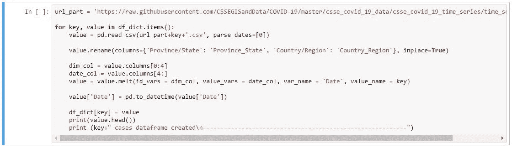
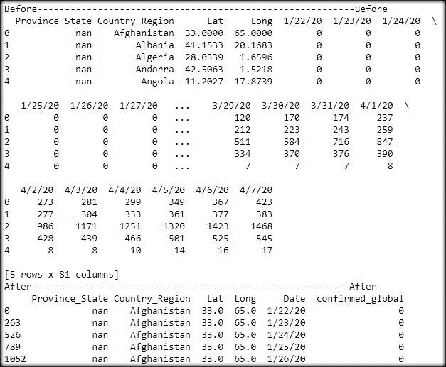
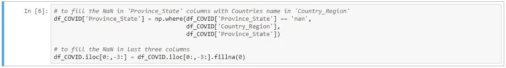
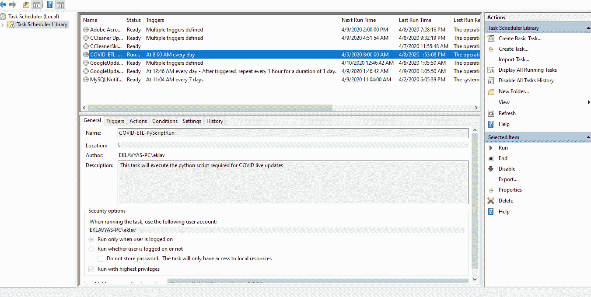
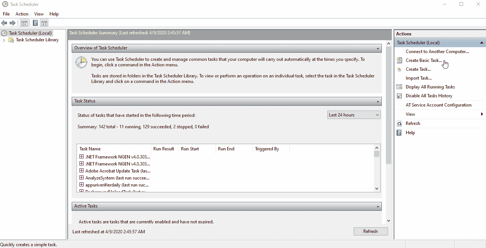

# 从 GitHub 提取数据，并自动运行或调度 Python 脚本

> 原文：<https://towardsdatascience.com/data-extraction-from-github-and-auto-run-or-schedule-python-script-9d1910239085?source=collection_archive---------23----------------------->

## 博客的第一部分—
[用于实时 Tableau 公共可视化的自动化 ETL](/automated-etl-for-live-tableau-public-visualizations-54f2b8652224)


[https://public.tableau.com/profile/eklavya.saxena#!/viz home/CoronavirusCOVID-19 cases world wide/新冠肺炎 _Country](https://public.tableau.com/profile/eklavya.saxena#!/vizhome/CoronavirusCOVID-19CasesWorldwide/COVID-19_Country)

T 他的博客是[LIVE Tableau 公共可视化自动化 ETL](/automated-etl-for-live-tableau-public-visualizations-54f2b8652224)的一部分，分为两个部分，即:

1.  从原始数据中提取数据。GitHub 用户内容的 csv 文件
2.  使用 Windows 上的任务调度程序自动化 Python 脚本

# 1.从原始数据中提取数据。GitHub 用户内容的 csv 文件

数据来源于 https://github.com/CSSEGISandData/COVID-19 JHU CSSE GitHub 库:


```
import numpy as np
import pandas as pd
```

导入了相关的库。


```
df_names = ['confirmed_global', 'deaths_global', 'recovered_global'] 
df_list = [pd.DataFrame() for df in df_names]
df_dict = dict(zip(df_names, df_list))
```

因为我们需要提取 3。csv 文件，我创建了一个包含数据帧名称的列表' *df_names'* 。注意，声明的名称是根据下面解释的`url_part`选择的。

然后，声明一个列表' *df_list* '来保存创建的 3 个空数据帧。注意，`for df in df_names`只需确认创建的空数据帧的数量=列表' *df_names '中的元素数量。*

然后，使用关键字:值对创建字典' *df_dict* '，作为' *df_names: df_list* '。也就是说，每个名称都链接到具有各自位置的空数据帧。



```
url_part = '[https://raw.githubusercontent.com/CSSEGISandData/COVID-19/master/csse_covid_19_data/csse_covid_19_time_series/time_series_covid19_'](https://raw.githubusercontent.com/CSSEGISandData/COVID-19/master/csse_covid_19_data/csse_covid_19_time_series/time_series_covid19_')
```

根据需要创建 URL 部件。*以上申报的名称将成为申报的`url_part`的后缀。

```
for key, value in df_dict.items():
    value = pd.read_csv(url_part+key+'.csv', parse_dates=[0])

    value.rename(columns={'Province/State': 'Province_State', 'Country/Region': 'Country_Region'}, inplace=True)

    dim_col = value.columns[0:4]
    date_col = value.columns[4:]

    value = value.melt(id_vars = dim_col, value_vars = date_col, var_name = 'Date', value_name = key)

    value['Date'] = pd.to_datetime(value['Date'])

    df_dict[key] = value
```

为了加载数据，我在上面声明的字典' *df_dict* '中的条目中用' *for 循环'*。使用 pandas `read_csv`函数一个接一个地输入空的数据帧，该函数从使用`url_part` +键(它们是各自声明的名称)+'生成的 URL 中读取数据。csv。然后，重命名列名，使其对 Python 友好。

> 现在有趣的部分来了——pandas`[**melt**](https://pandas.pydata.org/docs/reference/api/pandas.melt.html)`函数，它发挥了魔力，使我能够为我的 Tableau 仪表板转换数据。基本上，`melt`函数**将数据帧**从宽格式转换为长格式。请参考下面的调试打印输出:



因此，`melt`函数将 77 个日期列从宽格式转换为长格式，这些列的标题被输入到使用`value_vars = date_col, var_name = 'Date'`参数创建的新列' *Date* ，数字数据被输入到使用`melt`函数的`value_name = key`参数创建的新列' *confirmed_global* 。

然后，将“ *Date* ”列数据类型更改为 datetime，并为之前声明的字典的键分配相应的加载和转换数据帧。


```
join_on_col = ['Province_State','Country_Region','Lat','Long','Date']df_COVID = df_dict['confirmed_global'].merge(df_dict['deaths_global'], on=join_on_col, how='outer').merge(df_dict['recovered_global'], on=join_on_col, how='outer')df_COVID.rename(columns = {'confirmed_global':'Confirmed', 'deaths_global':'Deaths', 'recovered_global':'Recovered'}, inplace = True)
```

现在，pandas `[merge](https://pandas.pydata.org/pandas-docs/stable/reference/api/pandas.DataFrame.merge.html)`函数被用来合并 3 个不同的文件，它们共同具有'*省 _ 州*'、*国家 _ 地区*'、*纬度*'、*经度*'、*日期*。然后，合并的数据帧' *df_COVID* '的列名被重命名。



```
# to fill the NaN in 'Province_State' columns with Countries name in 'Country_Region'
df_COVID['Province_State'] = np.where(df_COVID['Province_State'] == 'nan', df_COVID['Country_Region'], df_COVID['Province_State'])# to fill the NaN in last three columns
df_COVID.iloc[0:,-3:] = df_COVID.iloc[0:,-3:].fillna(0)
```

这最后一行代码有助于根据需要从数据帧*‘df _ COVID’*中删除 *NaN* 。稍后，可以使用 pandas 的`to_csv` 功能将该数据帧提取为. csv 文件。

但是我计划将它导出到**Google Sheets**——查看博客的第二部分—[LIVE Tableau 公共可视化的自动化 ETL](/automated-etl-for-live-tableau-public-visualizations-54f2b8652224)

# 2.使用 Windows 上的任务调度程序自动化 Python 脚本

现在我已经创建了一个. py python 脚本文件来 ETL(提取、转换和加载)数据，我意识到用于获取数据的 GitHub 存储库每天都在更新。

> 在寻找每天运行 python 脚本的需求时，我看到了一个博客——[用任务调度器](/automate-your-python-scripts-with-task-scheduler-661d0a40b279)自动化你的 Python 脚本，作者是 Vincent Tatan。不过，如果你是 Linux 用户，请参考 Ratik Sharma 写的[在 macOS 上用 Crontab 调度作业](https://medium.com/better-programming/https-medium-com-ratik96-scheduling-jobs-with-crontab-on-macos-add5a8b26c30)。

这一部分是从以前的博客中简单整理出来的:

1.  创建 Windows 可执行文件。运行 Python 的 bat 文件
2.  在 Windows 任务计划程序中配置任务



跑步。任务计划程序中创建的任务的 bat 文件

## 2.1 创建 Windows 可执行文件。运行 Python 的 bat 文件

> 一个 **BAT 文件**是一个 DOS **批处理文件**用来执行 Windows 命令提示符(cmd.exe)下的命令。它包含一系列通常可能在 DOS 命令提示符下输入的行命令。 **BAT 文件**最常用于在 Windows 中启动程序和运行维护实用程序。资料来源:https://fileinfo.com/extension/bat

创建新的。bat 文件(例如:etl-covid-data.bat)并对其进行编辑，以如下格式编写您的命令:

`***<python.exe location> <python script location>***`

```
C:\Users\eklav\AppData\Local\Programs\Python\Python37\python.exe "C:\Users\eklav\Documents\My Tableau Repository\Datasources\COVID-DataSource\COVID-19\COVID-DataExtraction.py"
```

请确保您的`Python37\Lib\site-packages`已经安装了所有相关的库或模块。否则，在 cmd.exe 上执行`pip install <module>`来下载所需的依赖项。

**调试**:保存并运行此。双击 bat 文件。您可以在声明的命令前键入`**cmd /k**`。bat 档。这将在执行后保持 Windows 命令提示符(cmd.exe)窗口打开。蝙蝠文件

## 2.2 在 Windows 任务计划程序中配置任务

1.  从'*开始*菜单中搜索并打开' ***任务调度器***
2.  单击“*任务调度器*”
    右侧“操作”选项卡下的“ ***创建基本任务…*** ”，声明“名称:”(例如:COVID-ETL-PyScriptRun)和“描述:’(例如:此任务将执行 COVID 实时更新所需的 python 脚本)
3.  ***任务触发*** :
    选择'*您希望任务何时开始？*'(例如:*每日*)
4.  为之前的选择声明频率参数
5.  ***动作*** :
    选择'*你希望任务执行什么动作？*'(例如:*启动程序*)
6.  通过浏览到声明“*程序/脚本:*”。先前创建的 bat 文件位置。此外，您可以将“ *Start in(可选):*”声明到应用程序文件夹的位置，以访问相关的依赖项
7.  ***完成*** :
    显示上述所有申报的'*汇总*。当我点击完成时，你可以勾选复选框*打开该任务的属性对话框，以发现对你的预定任务的有趣和有用的改变。当我的代码中断时，一个有帮助的编辑是——在任务属性的' *General* '选项卡上，我选中了'*Run with high privileges**

下面是。上述 7 个步骤的 gif 动画:



上述 7 个步骤的 GIF 动画

# 参考

*   [关于。BAT 文件扩展名](https://fileinfo.com/extension/bat)
*   Vincent Tatan @ Medium 写的博客
*   [Python 数据帧构造器文档](https://pandas.pydata.org/pandas-docs/stable/reference/frame.html)

感谢您的阅读！我希望这篇博客揭示了如何在 windows 上自动化 python 脚本的有趣方面。如果你觉得这有帮助或者没有帮助，请在评论中告诉我。如果这篇文章是有帮助的，分享它。

[](https://github.com/eklavyasaxena/COVID-19) [## eklavyasaxena/新冠肺炎

### 来自 JHU CSSE GitHub Repo 的 ETL 创建 Tableau 可视化。ETL: Extract 中执行的步骤。GitHub 中的 csv 文件…

github.com](https://github.com/eklavyasaxena/COVID-19) [](https://www.linkedin.com/in/eklavyasaxena/) [## Eklavya Saxena -印度|职业简介| LinkedIn

### 精通数据的分析师和有抱负的数据科学家，拥有 2 年以上的销售或客户行业经验…

www.linkedin.com](https://www.linkedin.com/in/eklavyasaxena/)