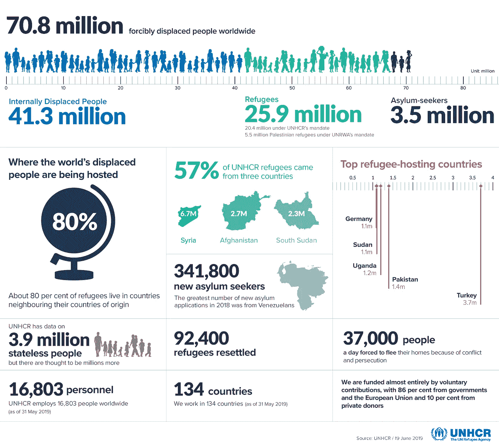

# 有益的数据有益于灵魂

> 原文：<https://towardsdatascience.com/data-for-good-is-good-for-the-soul-e2e3360bf45c?source=collection_archive---------79----------------------->

## 数据科学家如何回馈

迈克尔·阿莱奥在 [Unsplash](https://unsplash.com?utm_source=medium&utm_medium=referral) 上的照片

## 想象一下所有的数据…

> *在约翰·列侬的歌曲《想象》中，他唱到了一个没有饥饿、没有痛苦、没有贪婪的世界，在那里他想象着所有的人过着和平的生活，一个共享整个世界的人类兄弟。*
> 
> *想象一下这个世界上所有等待分析、可视化的数据，想象一下将要做出的预测和将要开发的算法。想象一下，通过数据驱动的决策，可以讲述哪些有见地的故事来提高对社会问题以及对人类影响的认识。*

数据正以前所未有的速度被创建和增长。根据 IDC 白皮书[预测，整个数字世界有望在 2025 年达到 175 兆字节。](https://www.seagate.com/files/www-content/our-story/trends/files/idc-seagate-dataage-whitepaper.pdf)

IDC:世界的数字化——从边缘到核心

> *绝大多数慈善组织、非营利组织和基金会只能* **想象** *拥有数据和分析来影响决策和推动他们的事业。*

## 慈善事业竞争极其激烈，捐赠者要求透明度

> *捐助者、赞助商和公民越来越要求公开他们的时间和资金贡献的影响。*

人们期望慈善组织展示出切实的社会影响和可衡量的成果。慈善监督机构继续深入调查，并根据透明度和影响力对慈善机构进行评级。

> *通过降低项目、筹资和管理费用的百分比来证明财务效率已经不够了。社会影响报告使慈善机构能够传达他们对社会事业或他们所支持的人的影响。如果做得好，社会影响报告可以增进志愿者、支持者、受益者和捐助者的信任。*

## ***引人注目的故事需要用数据、分析和可视化来讲述***

慈善机构面临的挑战并不仅仅是获取经过筛选的、易于获取的数据。由于他们面临着维持低运营成本的巨大压力，他们没有能力雇佣数据管理和数据科学领域的熟练员工。数据在电子表格中捕获和/或分散在各种系统中。将数据拼接在一起，使其有意义，并获得有意义的见解是耗时的，并需要正确的技能。

有许多非营利和慈善组织，如联合国难民署、T2 世界粮食计划署，已经利用数据可视化的力量讲述故事，在几秒钟内吸引观众的注意力。

[联合国难民署——数字一览](https://www.unhcr.org/figures-at-a-glance.html)

## **“数据换好”机芯**

虽然每个人都为数据的创造做出了贡献，但并不是每个人都从中受益。企业部门继续受益于以创新方式利用其数据来增加利润。

我们都需要关注三重底线——为**人、地球**和**利润**做正确的事情。

当使命驱动的组织拥有合适的人才、工具和知识时，他们可以产生切实的人类影响。

[Gartner](https://www.gartner.com/smarterwithgartner/use-data-for-social-good/) 将数据定义为“人们和组织超越组织界限，利用数据改善社会的运动”

数据科学在行动中的力量继续得到证明。

[危机短信热线](https://www.crisistextline.ca/)由[儿童求助电话](https://kidshelpphone.ca/)提供给处于危机中的年轻人免费短信服务。数据是他们的生命线，多年来，危机文本热线已经收集了世界上最大的健康数据集之一。这些数据用于推动他们的服务产品和整体危机空间的改进。

危机文本行

利用他们丰富的数据集，他们开发了一种算法，根据短信的初始内容评估短信者的自杀风险。高风险短信发送者被标记为“橙色代码”,并被移到队列的顶部，以减少他们的等待时间。*更短的等待时间可以拯救更多的生命*。

个人可以通过以下几种方式自愿贡献自己的时间、技能和才能，对数据产生影响。无论是在数据管理、分析、数据可视化、高级分析、机器学习还是人工智能领域，都有大量参与的机会。

通过以下组织之一做出贡献:

[**DataKind**](https://www.datakind.org/) 由 Jake Porway 于 2011 年创立，被认为是 Data for Good 机芯的开创者。他们与社会变革组织合作，在数据科学方面进行协作，以最大限度地发挥社会影响。DataKind 通过 DataCorps、DataDives 和社区活动与全球志愿者合作。

Chloe Tseng 于 2017 年创建了一个在线数据可视化社区。Viz 与世界各地的使命驱动型组织合作，利用数据可视化的力量来影响社会变革。世界各地的志愿者使用他们选择的工具，如 [Tableau](https://www.tableau.com/) 、 [Power BI](https://powerbi.microsoft.com/en-us/) 、 [Qlik](https://www.qlik.com/us/) 和 [D3](https://d3js.org/) 来强调有助于推动组织发展的趋势和机遇。

[**Kaggle**](https://www.kaggle.com/) 是全球最大的数据科学社区，拥有强大的工具和资源。Kaggle 为在线学习和数据科学竞赛提供公共数据集。2017 年，Kaggle 推出了“数据科学为善”，并为社会事业举办在线竞赛。

数据和分析供应商通过捐赠免费软件和他们自己的专业知识来促进社会事业，从而为良好的计划提供数据支持。一些提供志愿者和非营利组织之间的在线匹配服务。

Tableau 服务团 隶属于 Tableau 基金会，Tableau 的全球慈善组织。这是一个由 Tableau 专家组成的志愿者网络，他们有兴趣帮助非营利组织完成少于 10 小时的项目。非营利组织可以在 Tableau 服务团注册，并有机会根据项目的性质和所需的技能选择志愿者。

[**Alteryx for Good Co-lab**](https://www.afgcolab.com/how)是一个由 Alteryx 客户、员工和合作伙伴组成的网络，他们通过合作来改变数据。专门从事 Alteryx 的志愿者可以在网上注册，并与非营利组织或教育工作者配对。在整个分析生命周期中，志愿者帮助为报告准备数据，提供关于工具的见解，培训员工或完成项目。

剪贴画库

**志愿服务的惊人好处**

除了支持社会事业或社区的明显好处之外，志愿服务还提供许多其他好处。优秀志愿者的数据能够提高他们的技能，学习新的工具，并与志同道合的专业人士建立联系。一些人选择利用他们的志愿工作来提升他们的职业形象和寻找新的工作机会。

分析与某项事业或慈善机构相关的数据的过程为志愿者提供了一个全新的视角，非常令人大开眼界。使用数据可以深入主题，这是讲述有意义的故事或提出可行建议所必需的。

根据 BMC 健康研究的一份[报告，志愿活动改善了**心理**和**身体健康**，增加了**自尊**和**快乐**，提高了**生活满意度。**](https://www.ncbi.nlm.nih.gov/pmc/articles/PMC5504679/)

如果你是数据爱好者、数据科学家或对任何数据都有热情，那么世界就在你的脚下。支持你的事业，贡献你的才能，加入运动。

你可能会说我是一个梦想家，但我不是唯一的一个。我希望有一天你会加入我们，世界将会像一个人一样生活——约翰·列侬