# 数据框 EDA 软件包比较:Pandas Profiling、Sweetviz 和 PandasGUI

> 原文：<https://towardsdatascience.com/data-frame-eda-packages-comparison-pandas-profiling-sweetviz-and-pandasgui-bbab4841943b?source=collection_archive---------5----------------------->

## 哪些熊猫数据框 EDA 包适合你？

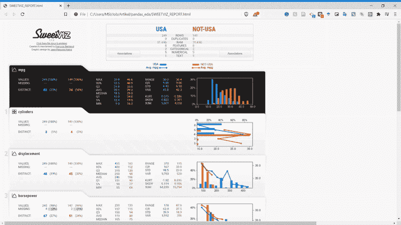

作者创建的 GIF

作为一名数据科学家，我们的工作总是涉及探索数据，或者通常称为探索性数据分析(EDA)。探索数据的目的是为了更好地了解我们的数据，掌握我们在处理什么。

以前，使用 pandas 数据框探索数据是一件很麻烦的事情，因为我们需要从头开始编写每一个分析。这不仅要花很多时间，还需要我们集中注意力。

以下面的 mpg 数据集为例。

```
import pandas as pd
import seaborn as sns
mpg = sns.load_dataset('mpg')
mpg.head()
```

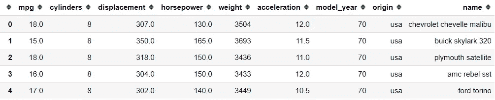

作者创建的图像

虽然数据看起来很简单，但是探索这个数据集仍然需要很多时间。

幸运的是，在当今时代，许多伟大的人已经开发了很棒的软件包来简化 EDA 过程。这些包的例子有[熊猫简介](https://github.com/pandas-profiling/pandas-profiling)、 [Sweetviz](https://github.com/fbdesignpro/sweetviz) 和 [PandasGUI](https://github.com/adamerose/pandasgui) 。

了解了许多 EDA 软件包，我很想知道它们之间是如何比较的，以及哪些软件包更适合每种情况。

让我们看看每个包是如何工作的，它们的主要特点是什么。

# 熊猫简介

我以前写了一篇关于熊猫概况的完整文章，但是为了比较起见，让我们从头到尾回顾一下。

[](/fantastic-pandas-data-frame-report-with-pandas-profiling-a05cde64a0e2) [## 带有熊猫档案的神奇熊猫数据框报告

### 将您的基本报告提升到下一个级别

towardsdatascience.com](/fantastic-pandas-data-frame-report-with-pandas-profiling-a05cde64a0e2) 

对我来说，熊猫简介是三个软件包中最简单的一个。它提供了一个很好的数据集快速报告。让我们试着看看大熊猫侧写在野外是如何工作的。首先，我们需要安装软件包。

```
#Installing via pip
pip install -U pandas-profiling[notebook]#Enable the widget extension in Jupyter
jupyter nbextension enable --py widgetsnbextension#or if you prefer via Conda
conda env create -n pandas-profiling
conda activate pandas-profiling
conda install -c conda-forge pandas-profiling#if you prefer installing directly from the source
pip install [https://github.com/pandas-profiling/pandas-profiling/archive/master.zip](https://github.com/pandas-profiling/pandas-profiling/archive/master.zip)#in any case, if the code raise an error, it probably need permission from user. To do that, add --user in the end of the line.
```

在安装了必要的包之后，我们可以使用 Pandas Profiling 来生成我们的报告。

```
from pandas_profiling import ProfileReportprofile = ProfileReport(mpg, title='MPG Pandas Profiling Report', explorative = True)profile
```

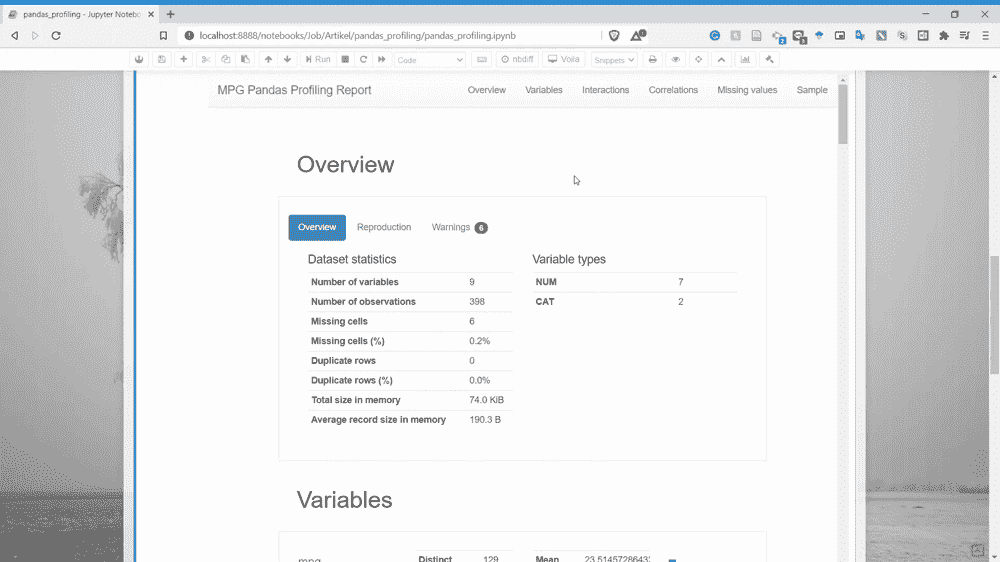

熊猫简介报告(GIF 由作者创建)

正如我们在上面看到的，使用 Pandas Profiling 产生了一个快速的报告，有很好的可视化效果，便于我们理解。报告结果直接显示在我们的笔记本中，而不是在单独的文件中打开。让我们来剖析一下大熊猫特征分析给了我们什么。

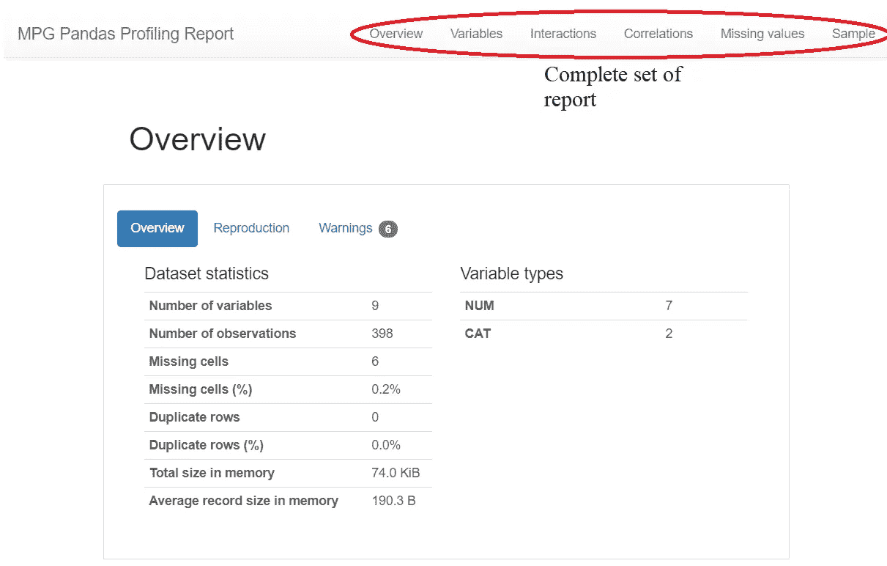

作者创建的图像

Pandas Profiling 给出了六个部分— **概述、变量、交互、相关性、缺失值、**和**样本。**

Pandas Profiling 的完整部分是变量部分，因为它们为每个变量生成了详细的报告。

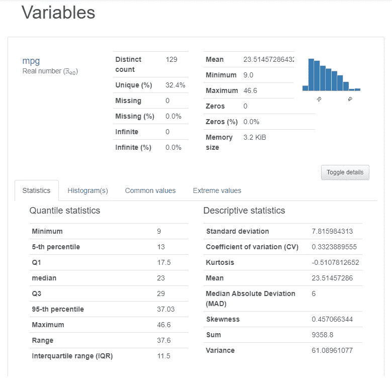

作者创造的形象

从上图可以看出，仅仅是那一个变量就有这么多的信息。你可以得到描述性信息和分位数信息。

让我们看看我们能从熊猫档案中得到的其他信息。首先是**交互。**

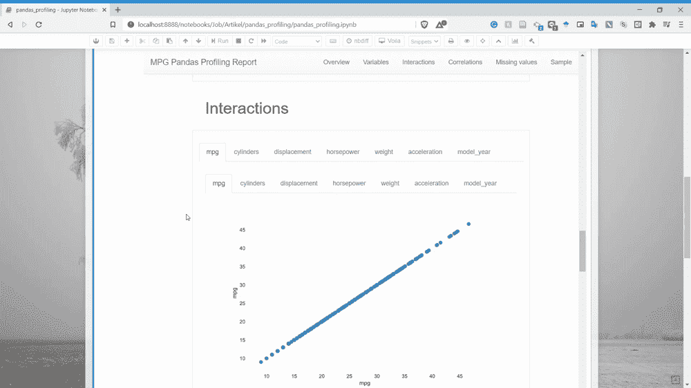

作者创建的 GIF

交互作用是我们可以得到两个数值变量之间散点图的部分。

接下来是**关联**。在这个部分，我们可以得到两个变量之间的关系信息。目前，我们只能得到四个相关分析。

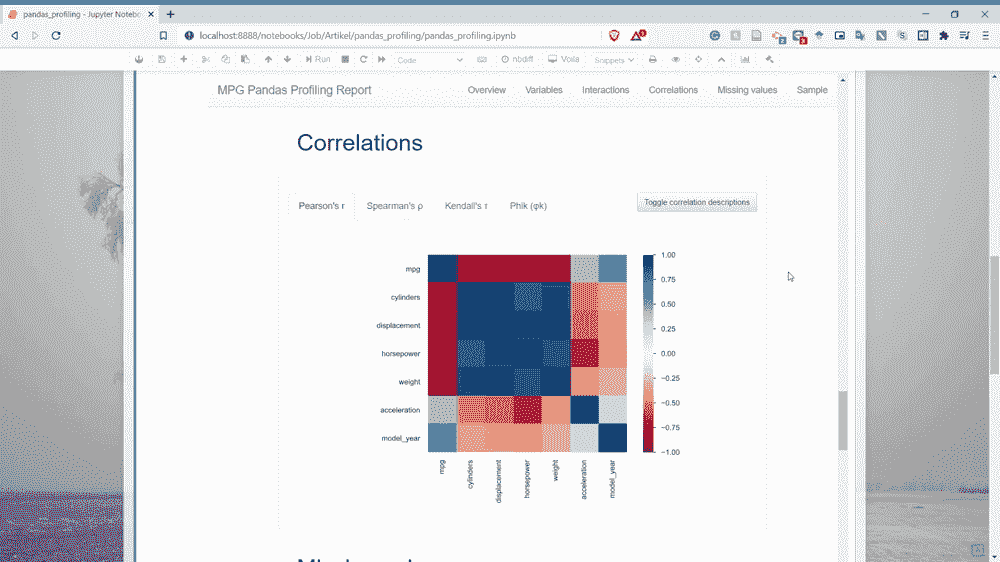

作者创建的 GIF

下一部分是**缺失值**。你应该已经猜到我们能从这里得到什么信息了。是的，它是每个变量的缺失值计数信息。

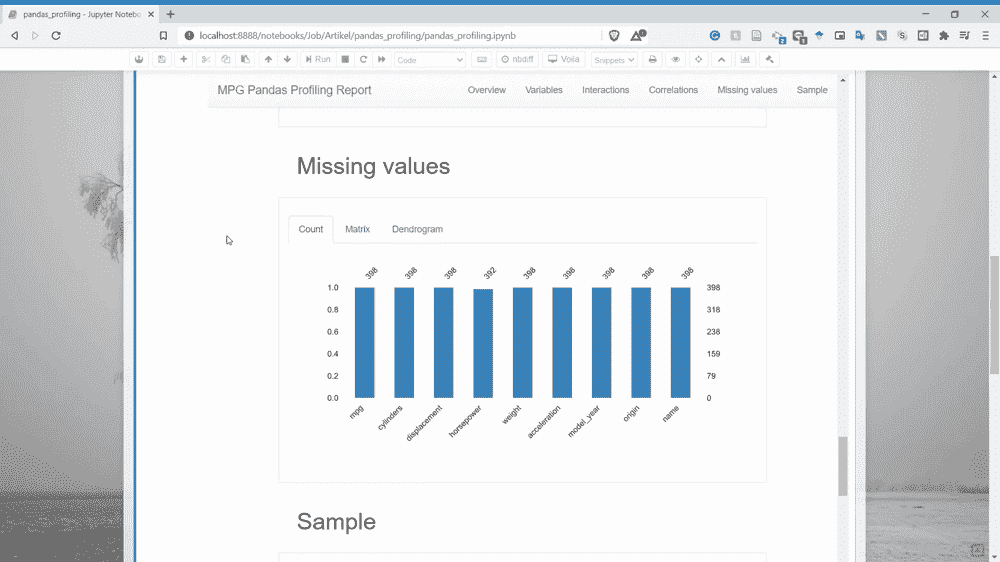

作者创建的 GIF

最后是**样品**部分。这只显示了我们数据集中的样本行。

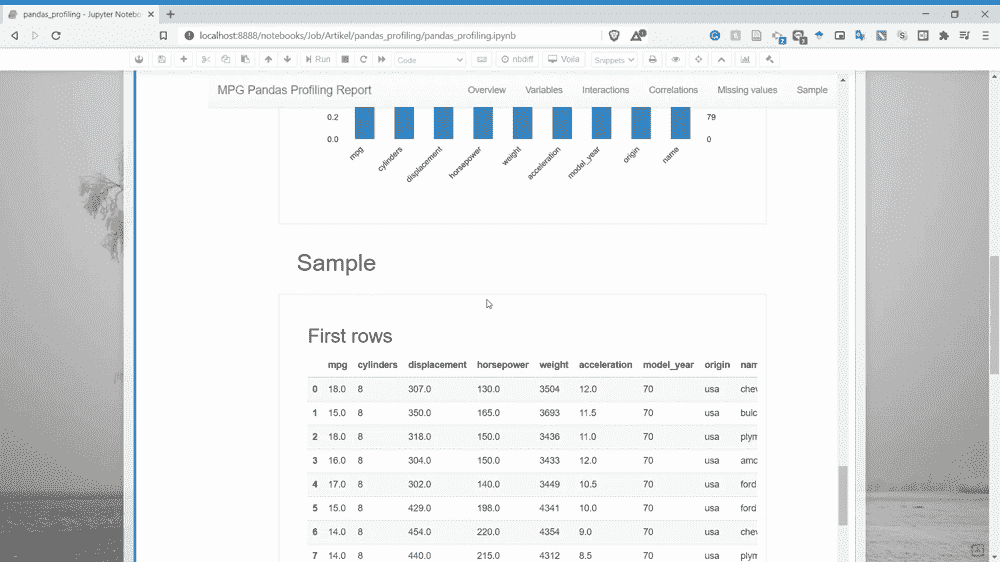

作者创建的 GIF

这是我们从熊猫报告中能得到的粗略信息。它很简单，但为我们提供了快速重要的信息。

现在，我喜欢熊猫简介的一点是:

*   生成快速报告
*   每个变量的详细信息

虽然有些部分，**我感觉不太倾向**。有:

*   相当高的内存使用率
*   变量之间没有太多详细信息，只有相关性和散点图。
*   样本部分是不必要的。

对我来说，熊猫概况对于快速获得我们需要的详细信息非常有用。对于想要掌握我们在处理什么样的数据的人来说已经足够了，但是我们还需要做更详细的信息。

# **Sweetviz**

[Sweetviz](https://github.com/fbdesignpro/sweetviz) 是另一个 Sweetviz 是另一个开源 Python 包，可以用一行代码生成漂亮的 EDA 报告。与 Pandas Profiling 不同的是，它的输出是一个完全独立的 HTML 应用程序。

让我们试着安装这个包并生成我们的报告。

```
#Installing the sweetviz package via pippip install sweetviz
```

安装完成后，我们可以使用 Sweetviz 生成报告。让我们使用下面的代码来尝试一下。

```
import sweetviz as sv#You could specify which variable in your dataset is the target for your model creation. We can specify it using the target_feat parameter.my_report = sv.analyze(mpg, target_feat ='mpg')
my_report.show_html()
```

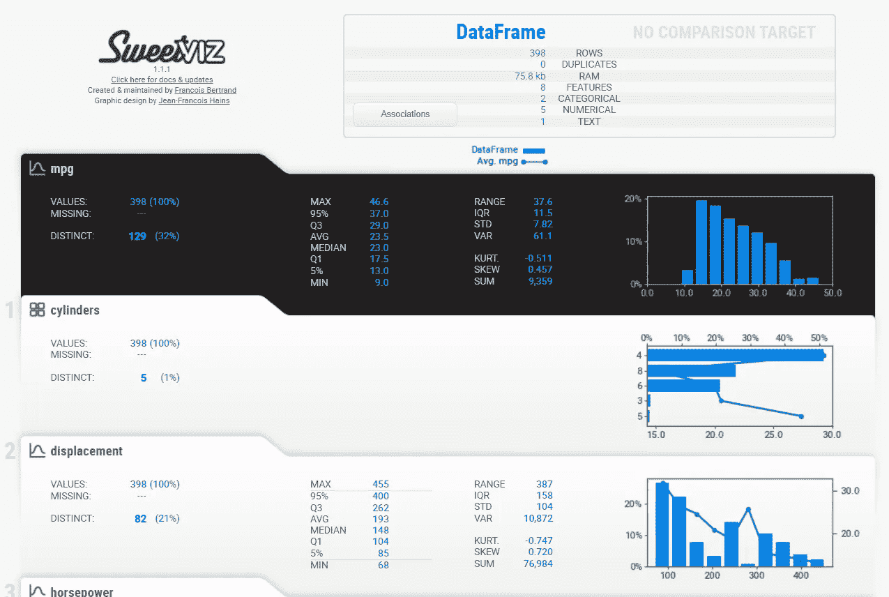

作者创建的图像

从上图中可以看出，Sweetviz 报告生成的内容与之前的 Pandas Profiling 相似，但使用了不同的用户界面。让我们看看下面 GIF 中的整体 Sweetviz 报告。

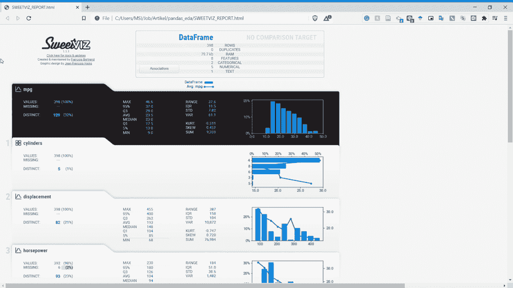

作者创建的 GIF

我们知道，当你点击上面 GIF 中的变量时，每个变量都有完整的信息。不过，这些信息也可以通过熊猫档案获得。

如果您还记得以前，我们在代码中设置了目标特性(“mpg”)。这是使用 Sweetviz 的优势之一。我们可以获得关于目标特征的更详细的信息。例如，让我们关注位移变量，并查看右侧的详细报告。

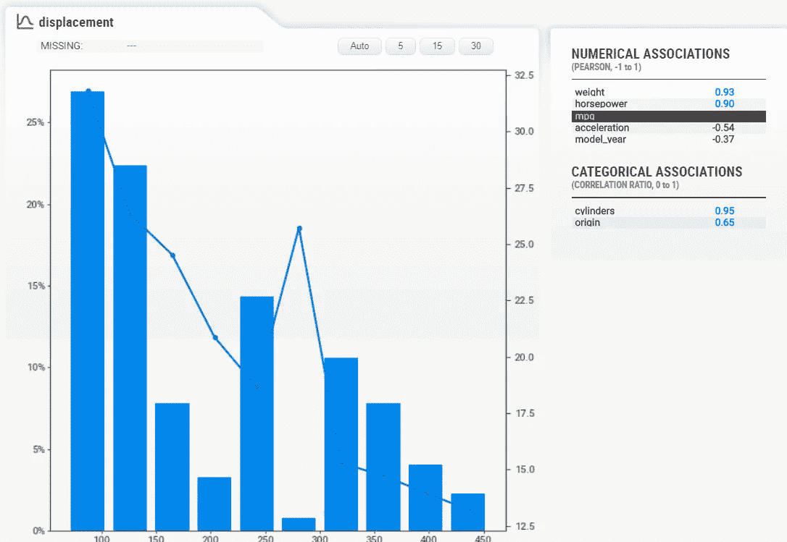

作者创建的图像

我们可以从上面的图像中看到目标特征(“mpg”)和位移变量之间的关系。条形图显示位移分布，而折线图是位移变量后目标特征的平均值。如果我们想知道这两个变量之间的关系，这是一个很好的报告。

在报告的最右侧，我们得到了所有现有变量的数值关联和分类关联的相关信息。有关向我们展示的关联分析信息的更多说明，请参考 [Sweetviz 主页](https://github.com/fbdesignpro/sweetviz)。

现在，Sweetviz 的优势不在于针对单个数据集的 EDA 报告，而在于数据集比较。Sweetviz 的主页解释说，Sweetviz 系统是围绕**快速可视化目标值和比较数据集而构建的。**

有两种方法可以比较数据集；要么我们分割它，比如**训练**和**测试**数据集，要么我们**用一些过滤器子集化群体**。要试用，让我们试试子集化数据。

我想知道当我的数据集是美国汽车的数据与非美国汽车的数据相比有多大的不同。我们可以用下面一行生成报告。

```
#Subsetting are happen by using the compare_intra. We input the condition in the parameter and the name as well.my_report = sv.compare_intra(mpg, mpg["origin"] == "usa", ["USA", "NOT-USA"], target_feat ='mpg')my_report.show_html()
```

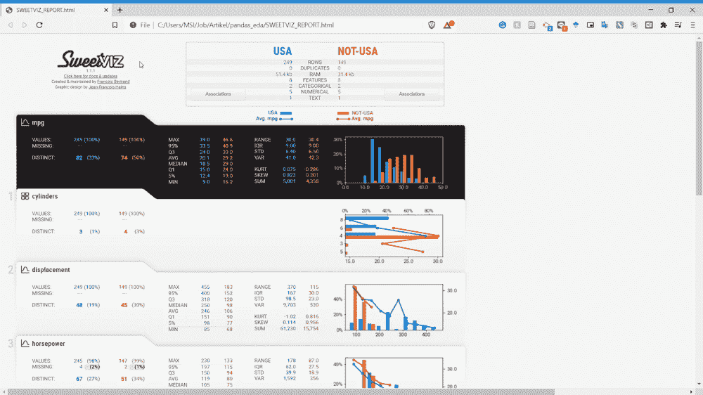

作者创建的 GIF

从上面的 GIF 可以看出，我们现在比较美国子集数据和非美国子集数据。对我来说，这种报告比较是如此强大，因为我们可以获得人口之间的信息，而不用编码这么多。

让我们更仔细地检查变量。

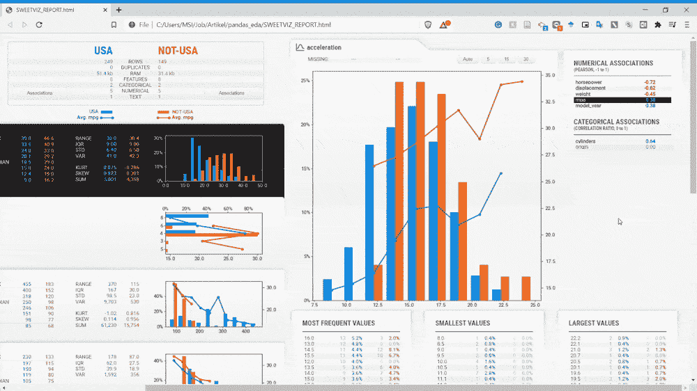

作者创建的 GIF

从上面的 GIF 中，我们可以了解到，变量被用两种不同颜色(蓝色和橙色)表示的两个子集总体划分。让我们再来看看位移变量。

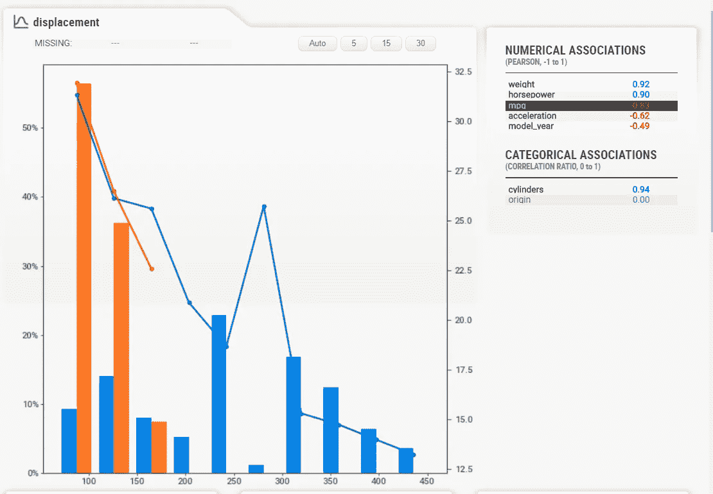

作者创建的图像

我们可以看到，非美国(橙色)排水量远小于美国排水量。这是我们可以通过比较两个数据集立即得到的信息。

协会怎么样？我们可以通过使用数据集名称上的关联按钮来仔细查看关联。

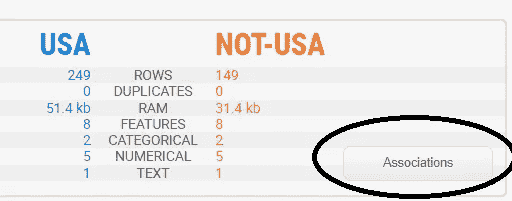

作者创建的图像

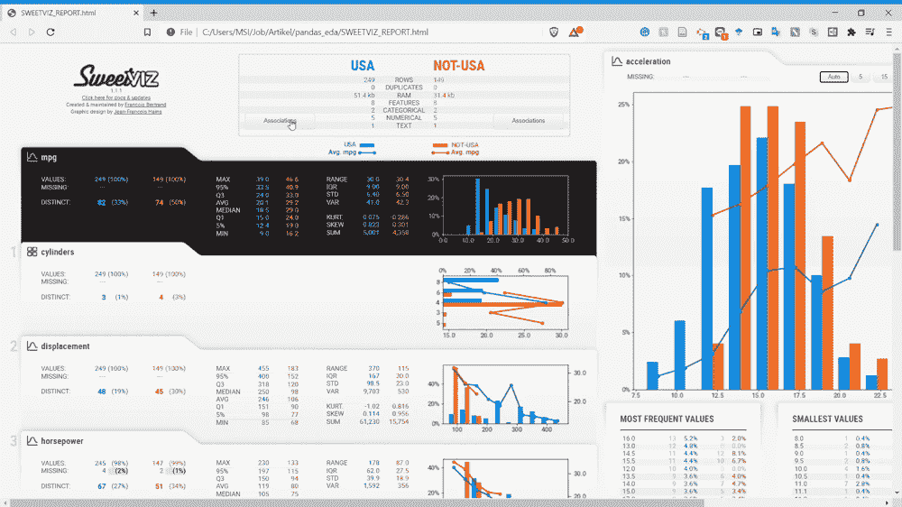

作者创建的 GIF

从上面的 GIF 中，我们可以很容易地得到两个变量之间的关系信息。请参考主页以获得对关联分析的完整理解。

所以，我喜欢 Sweetviz 的是:

*   视觉效果不错
*   易于理解的统计信息
*   分析与目标值相关的数据集的能力
*   两个数据集之间的比较能力

对我来说，就数据集和变量比较而言，Sweetviz 是一个比分析熊猫更高级的包。有几件事**我对**没什么感觉，那就是:

*   变量之间没有可视化，如散点图
*   该报表将在另一个选项卡中打开

虽然我感觉这些东西一点都不差，但是实力，我猜，盖过了弱点。

在我看来，Sweetviz 非常适合用于旨在创建预测模型的比较分析或数据集，因为 Sweetviz 的优势就在这些问题上。

# **PandasGUI**

[PandasGUI](https://github.com/adamerose/pandasgui) 不同于我上面解释的前几个包。 **PandasGUI 没有生成报告，而是生成了一个 GUI(图形用户界面)数据框**，我们可以用它来更详细地分析我们的 Pandas 数据框。

让我们试试这个包裹。首先，我们需要安装 PandasGUI 包。

```
#Installing via pippip install pandasgui#or if you prefer directly from the sourcepip install git+https://github.com/adamerose/pandasgui.git
```

安装完成后，让我们看看 PandasGUI 能做什么。要生成数据框 GUI，我们需要运行以下代码。

```
from pandasgui import show#Deploy the GUI of the mpg dataset
gui = show(mpg)
```

就像那样，GUI 应该单独显示出来。

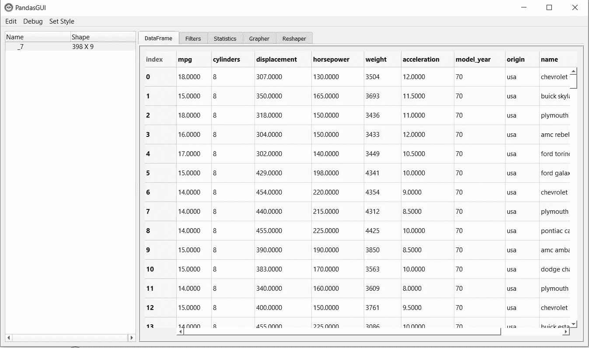

作者创建的图像

在这个 GUI 中，您可以做一些事情。主要是**过滤**，**统计** **信息**，**创建变量之间的图**，以及**重塑你的数据**。

作为提醒，您实际上可以根据需要拖动标签。看看下面的 GIF 就知道了。

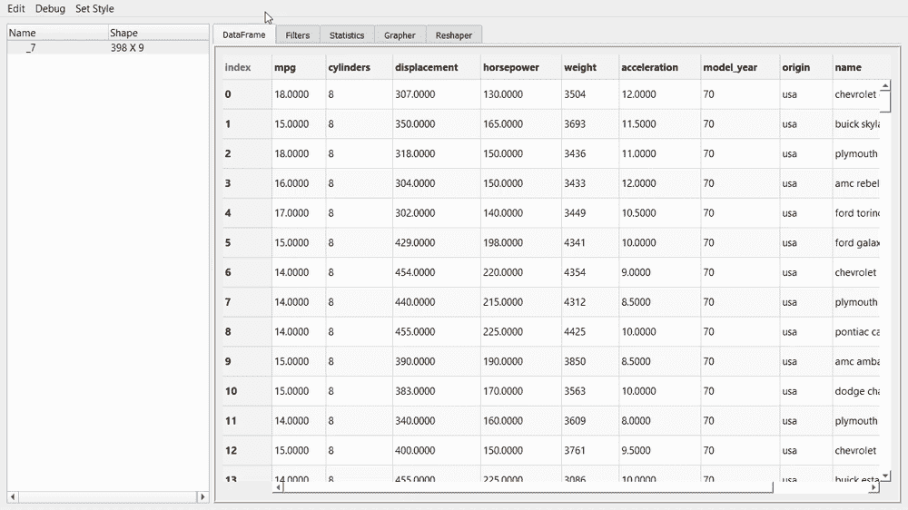

作者创建的 GIF

现在，让我们仔细看看每个特性，从**过滤数据**开始。

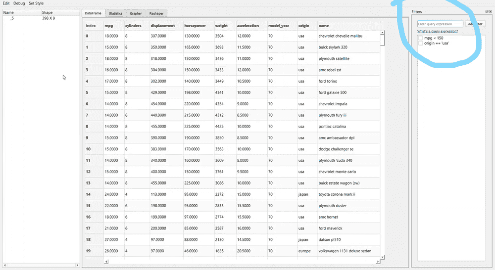

作者创建的 GIF

使用 PandasGUI 过滤数据需要我们查询条件，就像我们在 Pandas 数据框中写入它一样。看一下上面的例子；我编写“72 年模型”查询。结果是带有勾选框的查询。在这种情况下，如果我们不想再用预期的条件过滤数据，我们需要取消选中该框。

如果您在编写查询时出错了，该怎么办？这很容易；您需要双击您的查询并重写它。就这么简单。

现在，让我们来看看**统计选项卡**。

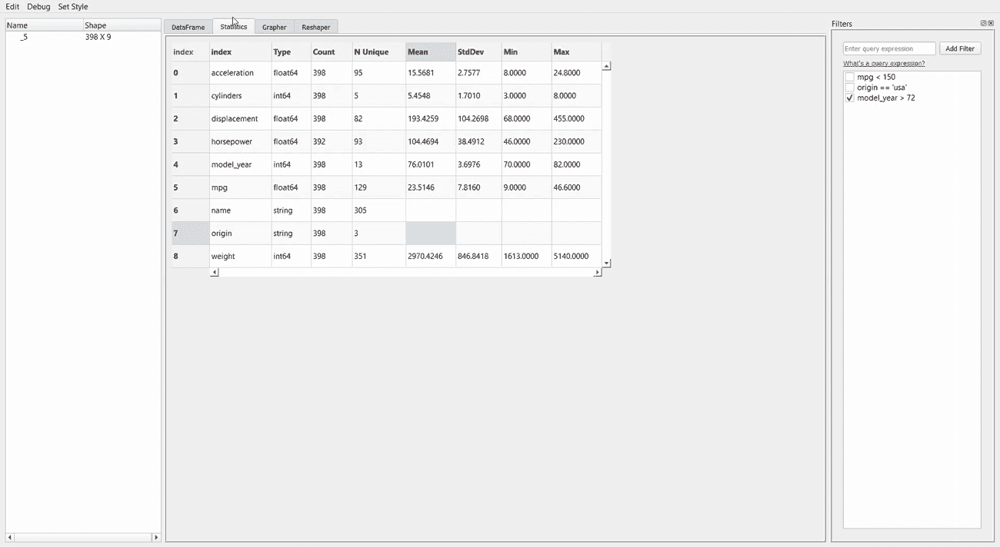

作者创建的 GIF

如果我们将从这个 GUI 获得的统计信息与前一个包进行比较，我们在这里获得的信息要比其他两个包少得多。尽管如此，这个选项卡向我们显示了数据集的基本信息。

提醒一下，我们之前所做的任何筛选都会在您在另一个选项卡中进行的下一个活动中出现，所以不要勾选任何您认为不必要的筛选。

从统计开始，我们现在进入**图表生成器标签**或者绘图 GUI。对我来说，PandasGUI 的优势就在这个标签上。让我告诉你这是为什么。

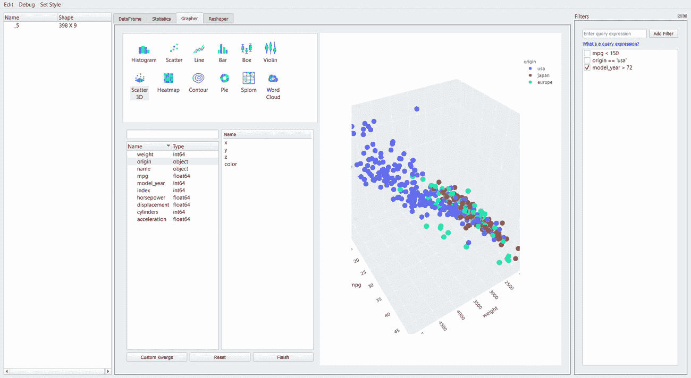

作者创建的 GIF

从上面的 GIF 中我们可以看到，创建 plot 只是拖拽我们想要的一切。由于绘图资源依赖于 [plotly](https://plotly.com/) 包，我们可以通过将光标悬停在图形上来浏览图形。

最后，可用的标签是整形标签。在这个选项卡中，**我们可以通过创建一个新的数据透视表来重塑或者融化数据集**。

pivot 和 melt 函数会产生一个新的表格，如下图所示。

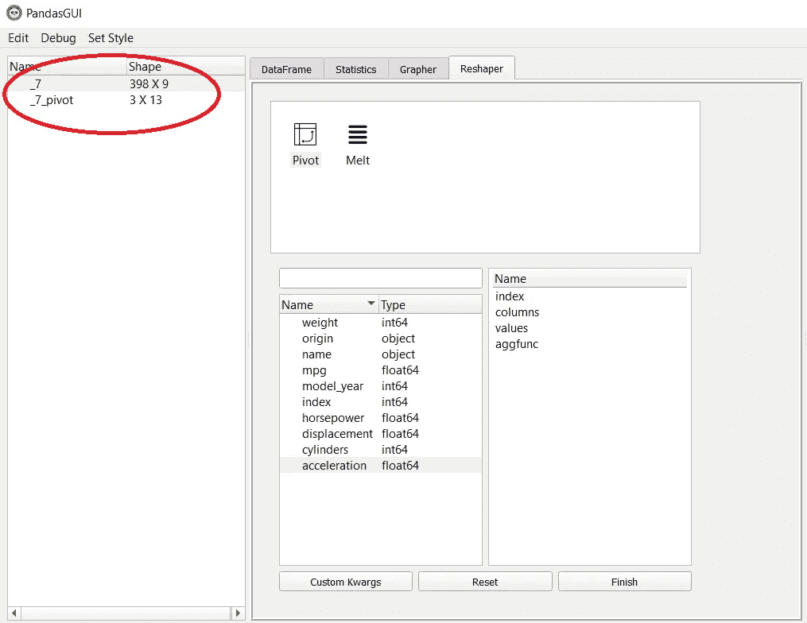

作者创建的图像

作为附加信息，您可以将过滤或整形后的数据导入到新的 CSV 中。您需要从编辑下拉列表中单击导入选择。

如果要将新的 CSV 文件导出到 PandasGUI，也可以单击下图所示的导出选项。

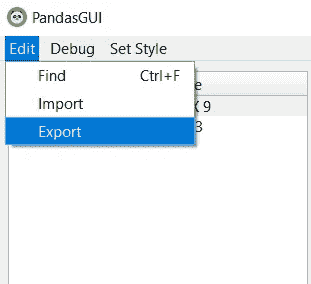

作者创建的图像

现在，我喜欢 PandasGUI 的什么地方:

*   拖放的能力
*   轻松过滤查询选择
*   快速剧情创作

虽然，我现在有一些**低谷**，那就是:

*   我们能得到的统计信息很少
*   没有生成自动报告。

在我看来，PandasGUI 是一个很棒的包，尤其是对于喜欢用自己的方式分析数据的人来说。毕竟，这个软件包适合进行深入分析。

我认为 PandasGUI 的目的更多的是我们自己的探索，而不是自动生成报告。然而，它仍然可以与前两个包相媲美，因为这些包在 EDA 过程中对我们有所帮助。

# **结论**

Pandas Profiling、Sweetviz 和 PandasGUI 是为简化 EDA 处理而开发的令人惊叹的软件包。在不同的工作流程中，每个包都有自己的优势和适用性。如果我需要总结我的比较，那就是:

*   **Pandas Profiling** 适合对单个变量进行快速分析生成，
*   **Sweetviz** 适用于数据集和目标特征之间的分析，
*   **PandasGUI** 适用于具有手动拖放功能的深入分析。

那是我对这三个 EDA 包的比较；我不会推荐什么适合你的工作，因为只有你自己知道。

如果你想了解更多关于我对其他 EDA 包的评论，你可以看看下面的文章。

[](/quick-recommendation-based-data-exploration-with-lux-f4d0ccb68133) [## 使用 Lux 进行基于快速推荐的数据探索

### 通过基于一行建议的数据探索，轻松探索您的数据

towardsdatascience.com](/quick-recommendation-based-data-exploration-with-lux-f4d0ccb68133) 

访问我的[**LinkedIn**](https://www.linkedin.com/in/cornellius-yudha-wijaya/)**或 [**Twitter**](https://twitter.com/CornelliusYW)**

# **如果您喜欢我的内容，并希望获得更多关于数据或数据科学家日常生活的深入知识，请考虑在此订阅我的[简讯。](https://cornellius.substack.com/welcome)**

> **如果您没有订阅为中等会员，请考虑通过[我的介绍](https://cornelliusyudhawijaya.medium.com/membership)订阅。**