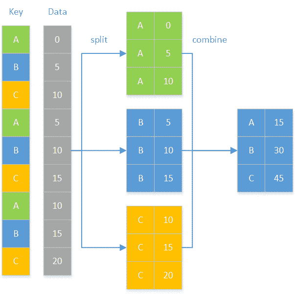
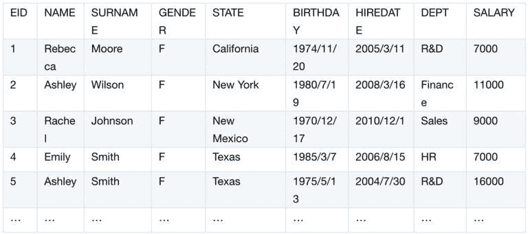
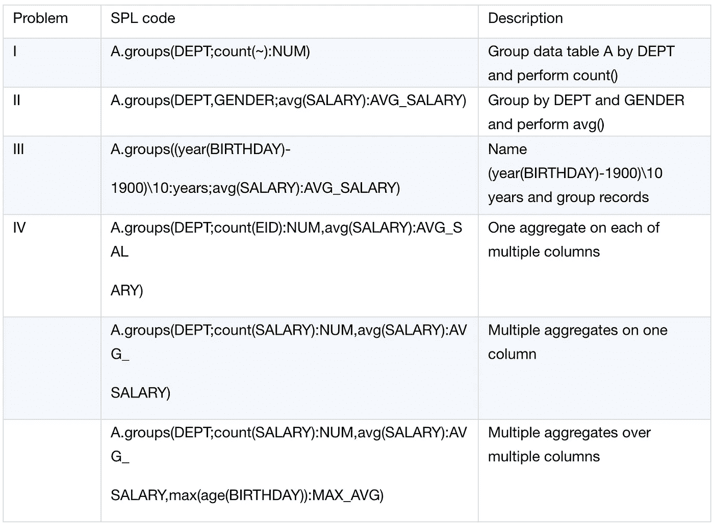
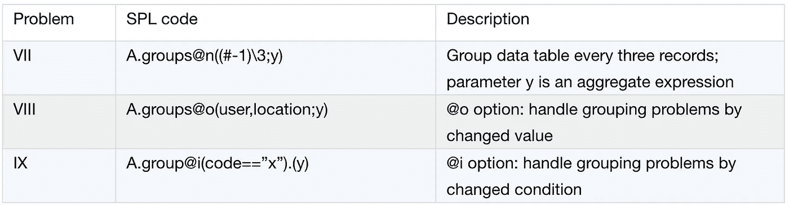
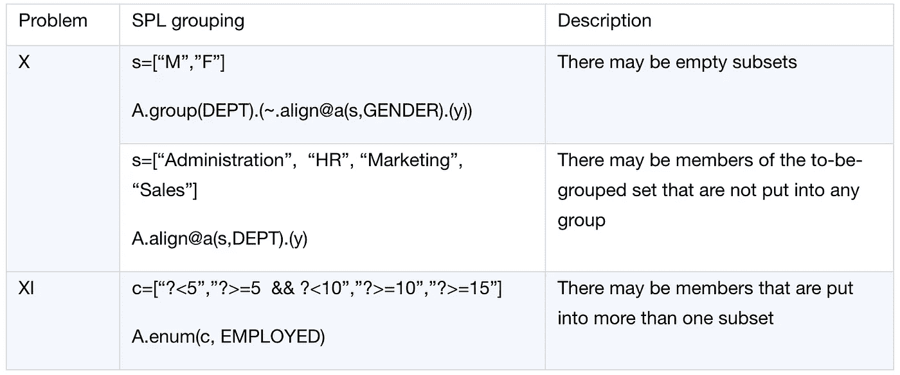

# Python 中的数据分组

> 原文：<https://towardsdatascience.com/data-grouping-in-python-d64f1203f8d3?source=collection_archive---------0----------------------->

## 检查“困难”的任务，并尝试给出替代的解决方案

按列对记录进行分组是数据分析的常见需求。这样的场景包括统计公司各个部门的员工，分别计算各个部门男女员工的平均工资，计算不同年龄段员工的平均工资。熊猫有分组功能，可以方便地处理大部分分组任务。但是该职能部门发现有些任务很难管理。在这里，让我们检查这些“困难”的任务，并尝试给出替代的解决方案。

分组是熊猫最重要的功能之一。它用于根据拆分-应用-组合策略对记录进行分组和汇总。下图显示了工作流程:



作者图片

# I .按单个字段分组和聚合

您按特定字段对记录进行分组，然后对每个组执行聚合。

这是上述策略最简单的用法。例如，根据员工信息计算每个部门的员工数:

问题分析:以 department 为关键字，按其对记录进行分组，统计每组中的记录。

以下是部分员工信息:



Python 脚本:

```
import pandas as  pd#Import data
employee =  pd.read_csv("Employees.csv")#Grouping and perform count over each group
dept_emp_num =  employee.groupby('DEPT')['DEPT'].count()print(dept_emp_num)
```

解释:groupby('DEPT ')按部门对记录进行分组，count()计算每组中的雇员数。

# II 按多个字段分组和聚合

您按多个字段对记录进行分组，然后对每个组执行聚合。

我们以类似的方式处理它。根据前一个实例中相同的员工信息计算每个部门中男性和女性员工的平均工资。

问题分析:分组键有两个，部门和性别。我们将组合键作为一个整体来进行分组和聚合。

Python 脚本:

```
import pandas as pdemployee = pd.read_csv("Employees.csv")#Group by two keys and then summarize each group
dept_gender_salary =  employee.groupby(['DEPT','GENDER'],as_index=False).SALARY.mean()print(dept_gender_salary)
```

解释:表达式 groupby(['DEPT '，' GENDER'])将两个分组字段作为列表形式的参数。表达式 as_index 使用 True 或 False 指定是否将分组字段用作索引(这里 False 表示不将它们用作索引)。mean()函数计算平均工资。

# III 按计算列分组和聚合

分组键不是显式数据，需要根据已有数据进行计算。这样的键称为计算列。例如，要计算不同年份员工的平均工资:

问题分析:员工信息中没有年份一栏。我们需要根据员工的生日来计算，按计算列对记录进行分组，并计算平均工资。

Python 脚本:

```
import pandas as pdimport numpy as npemployee = pd.read_csv("Employees.csv")#Convert the BIRTHDAY column into date format
employee['BIRTHDAY']=pd.to_datetime(employee['BIRTHDAY'])#Calculate an array of calculated column values, group records by them, and calculate the average salary
years_salary =  employee.groupby(np.floor((employee['BIRTHDAY'].dt.year-1900)/10)).SALARY.mean()print(years_salary)
```

说明:由于原始数据中不存在年值，Python 使用 NP . floor((employee[' BIRTHDAY ']. dt . year-1900)/10)来计算年列，按新列对记录进行分组，并计算平均工资。

# 四多重集合

您可以对多列中的每一列执行一种类型的聚合操作，或者对一列或多列执行几种类型的聚合操作。

1.多列中的每一列都有一个聚合

对多列中的每一列执行一种类型的聚合。计算每个部门的雇员数和平均工资，例如:

问题分析:count 聚合在 EID 列上，average 聚合在 salary 列上。每个列都有自己的一个聚合。

Python 脚本:

```
import pandas as pdemployee = pd.read_csv("Employees.csv")#Group records by DEPT, perform count on EID and average on SALARY
dept_agg =  employee.groupby('DEPT',as_index=False).agg({'EID':'count','SALARY':'mean'})#Rename the columns
print(dept_agg.rename(columns={'EID':'NUM','SALARY':'AVG_SALARY'}))
```

解释:Pandas agg()函数可以用来处理这类计算任务。相关的列和涉及的聚合操作以字典的形式传递给函数，其中列是键，聚合是值，以完成聚合。

2.一根色谱柱上的多种聚合

您在单个列上执行多种类型的聚合。对于之前的任务，我们也可以把工资加起来，然后算出平均值。这样，我们在 salary 列上执行两个聚合，count 和 average。

Python 脚本:

```
import pandas as  pdemployee =  pd.read_csv("Employees.csv")#Perform count and then average on SALARY column
dept_agg = employee.groupby('DEPT').SALARY.agg(['count','mean']).reset_index()#Rename columns
print(dept_agg.rename(columns={'count':'NUM','mean':'AVG_SALARY'}))
```

说明:我们可以把聚合操作组合成一个列表，并把它作为参数传递给 agg()函数。

3.多个色谱柱上的多个聚合

您汇总了多个列，在此期间，单个列上有多个聚合。聚合操作可以由用户定义。

以获取每个部门的员工人数、平均工资和最大年龄为例:

问题分析:统计员工人数，计算平均工资，都是对工资列(一列多个合计)的操作。查找最大年龄需要对生日列进行自定义操作。

Python 脚本:

```
import pandas as pdimport datetime#The user-defined function for getting the largest age
def max_age(s):
    #Year
    today = datetime. datetime.today().year
    #Get ages
    age = today-s.dt.year return age.max()employee = pd.read_csv("Employees.csv")employee['BIRTHDAY']=pd.to_datetime(employee\['BIRTHDAY'\])#Group records by DEPT, perform count and average on SALARY, and use the user-defined max_age function to get the largest age
dept_agg = employee.groupby('DEPT').agg({'SALARY':['count','mean'],'BIRTHDAY':max_age})#Rename columns
dept_agg.columns = ['NUM','AVG_SALARY','MAX_AGE']print(dept_agg.reset_index()) 
```

说明:要汇总的列和聚合操作以字典的形式通过参数传递给函数。对于需要多个聚合操作的列，我们需要将这些操作组合成一个列表，用作字典值。

# 复制分组和汇总结果

您可以将每个聚合结果扩展到相应组的长度。这相当于将聚合结果复制到其组中的所有行。向员工信息中添加包含每个部门平均工资的新列，例如:

问题分析:按部门对记录进行分组，计算每个部门的平均工资，在保持原有顺序的情况下，将每个平均值填充到相应的组中。

Python 脚本:

```
import pandas as pdemployee = pd.read_csv("Employees.csv")#Group records by DEPT and calculate average on SLARYemployee['AVG_SALARY'] = employee.groupby('DEPT').SALARY.transform('mean')print(employee)
```

说明:按部门对记录进行分组，并计算每组的平均工资。transform()函数计算每个组的聚合，返回结果并按照原始索引的顺序将其填充到所有行中。这确保了记录保持原始顺序。

# VI 处理分组子集

您可以在每个组中执行一个或多个非聚合操作。例如，为了对每个组进行排序，我们关心的是记录的顺序，而不是集合。要按聘用日期以升序对每个部门的记录进行排序，例如:

问题分析:按部门对记录进行分组，并在每个组中循环，按雇用日期对记录进行排序。

Python 脚本:

```
import pandas as pdemployee = pd.read_csv("Employees.csv")#Modify hire date format
employee['HIREDATE']=pd.to_datetime(employee['HIREDATE'])#Group records by DEPT, sort each group by HIREDATE, and reset the index
employee_new = employee.groupby('DEPT',as_index=False).apply(lambda x:x.sort_values('HIREDATE')).reset_index(drop=True)print(employee_new)
```

说明:要对每个组中的记录进行排序，我们可以使用 apply()函数和 lambda 的组合。lambda 表达式通过组进行循环，使用 sort_values()函数对每个组中的记录进行排序，并返回排序结果。

还有更复杂的计算目标。例如，要找出每个部门中年龄最大的员工和年龄最小的员工之间的工资差异:

问题分析:将记录按部门分组，定位最年长的员工记录和最年轻的员工记录，计算他们的工资差异。

Python 脚本:

```
import pandas as pd#salary_diff(g)function calculates the salary difference over each group
def salary_diff(g):

    #The index of the eldest employee record
    max_age = g['BIRTHDAY'].idxmin() #The index of the youngest employee record
    min_age = g['BIRTHDAY'].idxmax() #Calculate the salary difference
    diff = g.loc[max_age]['SALARY']-g.loc[min_age]['SALARY'] return diffemployee = pd.read_csv("Employees.csv")employee['BIRTHDAY']=pd.to_datetime(employee['BIRTHDAY'])#Group by DEPT and use a user-defined function to get the salary difference
salary_diff = employee.groupby('DEPT').apply(salary_diff)print(salary_diff) 
```

解释:该脚本使用 apply()和一个用户定义的函数来获取目标。apply()将分组结果作为参数传递给用户定义的函数。自定义函数 salary_diff()中的参数 g 本质上是熊猫 data frame 格式的一个数据帧，这里是分组结果。该脚本通过参数获取最老员工记录的索引和最年轻员工记录的索引，然后计算 salary 字段的差异。

**概要:**

掌握 Pandas groupby 方法对处理数据分析任务特别有帮助。

让我们进一步看看 Pandas groupby 的使用，尽管现实世界中的问题来自堆栈溢出。

# VII 基于职位的分组

您按位置对记录进行分组，也就是说，使用位置作为键，而不是按某个字段。这种情况包括将每三行放入同一组，并将奇数位置的行放入一组，偶数位置的行放入另一组。下面是一个例子:

来源:https://stack overflow . com/questions/59110612/pandas-group by-mode-every-n-rows

以下是部分源数据:

```
time     a      b
0       0.5    -2.0
1       0.5    -2.0
2       0.1    -1.0
3       0.1    -1.0
4       0.1    -1.0
5       0.5    -1.0
6       0.5    -1.0
7       0.5    -3.0
8       0.5    -1.0
```

我们希望每隔三行对数据进行分组和组合，并保持每组中每列的模式。预期结果如下:

```
time     a      b
2       0.5    -2.0
5       0.1    -1.0
8       0.5    -1.0
```

问题分析:这个分组任务与列值无关，但涉及位置。我们通过位置执行整数乘法来获得一个计算列，并将其用作分组条件。

Python 脚本:

```
import pandas as pdimport numpy as npdata = pd.read_csv("group3.txt",sep='\\t')#Group records by the calculated column, calculate modes through the cooperation of agg function and lambda, and get the last mode of each column to be used as the final value in each groupres = data.groupby(np.arange(len(data))//3).agg(lambda x: x.mode().iloc[-1])print(res)
```

说明:表达式 NP . arange(len(data))//3 生成一个计算列，其值为[0 0 1 1 1 2 2]。该脚本使用它作为每三行对数据进行分组的键。表达式 agg(lambda x: x.mode())从每个组中的每一列获取模式。在第一组中，时间列中的模式是[0，1，2]，a 和 b 列中的模式分别是[0.5]和[-2.0]。然后，该脚本使用 iloc[-1]来获取它们的最后模式，以用作最终的列值。

# VIII 按变化值分组

您可以根据特定字段中的值是否更改来对有序数据进行分组。也就是说，每次出现新值时，都会创建一个新组。这里有一个例子:

来源:https://stack overflow . com/questions/41620920/group by-conditional-sum-of-adjacent-rows-pandas

以下是部分原始数据:

```
duration  location  user
0 10       house    A
1 5        house    A
2 5        gym      A
3 4        gym      B
4 10       shop     B
5 4        gym      B
6 6        gym      B 
```

数据按用户分组后，对位置值连续相同的持续时间值求和，并在位置值改变时对持续时间执行下一次求和。以下是预期结果:

```
duration  location  user
15        house     A
5         gym       A
4         gym       B
10        shop      B
10        gym       B
```

问题分析:订单是为位置列导入的。具有连续相同位置值的记录被放入同一个组，一旦值改变，一个记录被放入另一个组。当用户为 B 时，第 4 行(其索引为 3)中的位置值为[健身房、商店、健身房、健身房]。这里我们不应该把三个健身房放在一个组里，而应该把第一个健身房放在一个单独的组里，因为第一个健身房之后的位置值是商店，这是一个不同的值。商店应该另设一个小组。然后，其他两个健身房应该在同一组，因为他们一直是相同的。所以用户 B 的分组结果应该是[[健身房]，[商店]，[健身房，健身房]]。这就是为什么我们不能用 df.groupby(['user '，' location']).duration.sum()来得到结果。相反，我们需要一个计算列作为分组条件。

他们的 Python 脚本:

```
import pandas as pd#Generate data for computation
df = pd.DataFrame({'user' : ['A', 'A', 'A', 'B', 'B', 'B','B'], 'location' : ['house','house','gym','gym','shop','gym','gym'], 'duration':[10,5,5,4,10,4,6]})#Create a calculated column
derive = (df.location != df.location.shift()).cumsum()#Group records by user, location and the calculated column, and then sum duration values
res = df.groupby(['user', 'location', derive], as_index=False, sort=False)['duration'].sum()print(res)
```

解释:计算列 derive 通过在每次位置值发生变化之前累计位置值来获取其值。累积值为[1 1 2 2 3 4 4]。然后按用户、位置和计算出的数组对原始数据进行分组，并对持续时间进行求和。

# IX 按条件分组

当对有序数据进行分组时，只要某个字段的值满足指定的条件，就会创建一个新组。下面是一个例子:

来源:https://stack overflow . com/questions/62461647/choose-random-rows-in-pandas-data fram

以下是部分原始数据:

```
ID            code
333_c_132     x
333_c_132     n06
333_c_132     n36
333_c_132     n60
333_c_132     n72
333_c_132     n84
333_c_132     n96
333_c_132     n108
333_c_132     n120
999_c_133     x
999_c_133     n06
999_c_133     n12
999_c_133     n24
998_c_134     x
998_c_134     n06
998_c_134     n12
998_c_134     n18
998_c_134     n36
997_c_135     x
997_c_135     n06
997_c_135     n12
997_c_135     n24
997_c_135     n36
996_c_136     x
996_c_136     n06
996_c_136     n12
996_c_136     n18
996_c_136     n24
996_c_136     n36
995_c_137     x 
```

我们希望在代码列中的每两个 x 值之间得到一个随机行。

预期结果如下:

```
333_c_132     n06
999_c_133     n12
998_c_134     n18
997_c_135     n36
996_c_136     n18
```

问题分析:从两个 x 值中随机获取一行，我们可以根据代码值是否为 x 对行进行分组(即每当代码值变为 x 时创建一个新组)，从当前组中随机获取一行。所以我们仍然需要一个计算列作为分组键。

Python 脚本:

```
import pandas as pddf = pd.read_csv("data.txt")#Generate a calculated column
derive = df.code.eq('x').cumsum()#Group records by the calculated column and get a random record from each groupthrough the cooperation of apply function and lambda
res=df[df.code.ne('x')].groupby(derive).apply(lambda  x : x.sample(1))#Reset the index
res=res.reset_index(level=0, drop=True)print(res)
```

解释:code.eq(x)当 code 为 x 时返回 True，当 code 不是 x 时返回 False，cumsum()累加真值和假值的个数，生成计算列[1 1 1 1 1 1 1 1 1 2 2…]。然后，该脚本查找 code 为 x 的记录，根据这些 x 值对记录进行分组，并从每个组中获得一个随机记录。

**概要:**

在上述所有例子中，原始数据集根据指定的条件被分成若干子集，并具有以下两个特征:

1)没有子集是空的；

2)原始数据集中的每个成员属于且只属于一个子集。

我们称这种类型的分组为全分。也有偏科的。

以下是一些例子。

# x 对齐分组

路线编组有一个基础集。它将待分组集合的成员的属性(字段或表达式)与基本集合的成员进行比较，并将与基本集合的成员匹配的成员放入同一子集中。子集的数量与基本集中的成员数量相同。路线分组有三个特征:

1)可能存在空的子集(例如，基本集合的一个或多个成员不存在于要分组的集合中)；

2)可能存在未被放入任何组的待分组集合的成员(例如，它们并不重要到包括在基本集合中)；

3)待分组集合中的每个成员最多属于一个子集。

1.空子集

一家公司想知道每个部门员工的准确人数。如果一个部门没有男性员工或女性员工，它会将他们的人数记录为 0。

问题分析:如果我们直接按部门和性别分组数据，也就是 groupby(['DEPT '，' GENDER'])，那么一个部门中没有女性员工或者男性员工的员工都会被放到一个组中，缺失性别的信息就会缺失。很容易想到一个替代方案。该解决方案按部门对记录进行分组，生成一个[男性，女性]基集以左连接每个组，按性别对每个连接结果进行分组，然后计算男性和女性员工的数量。这将确保每个小组都包括女性雇员和男性雇员。

Python 脚本:

```
import pandas as pd#Alignment grouping function
def align_group(g,l,by):

    #Generate the base dataframe set and use merge function to perform the alignment grouping
    d = pd.DataFrame(l,columns=[by]) m = pd.merge(d,g,on=by,how='left')return m.groupby(by,sort=False)employee = pd.read_csv("Employees.csv")#Define a sequence
l = ['M','F']#Group records by DEPT, perform alignment grouping on each group, and perform count on EID in each subgroupres = employee.groupby('DEPT').apply(lambda x:align_group(x,l,'GENDER').apply(lambda s:s.EID.count()))print(res)
```

解释:

用户自定义函数 align _ groupuses 使用 merge()函数生成基集，并对基集和要分组的集执行左连接，然后按合并列对每个连接结果集进行分组。记录按部门分组后，apply()函数和 lambda 表达式的配合通过自定义函数对每组进行对齐分组，然后对 EID 列进行计数。(注意:您不应该对性别执行计数，因为在合并操作期间，所有性别成员都会保留。当有一个空的子集时，对性别计数的结果将是 1，而其余的列在左连接时将被记录为 null。这将导致 EID 计数的结果为零)。

2.未放入任何组的待分组集合的成员

任务是按指定的部门['管理'，'人力资源'，'营销'，'销售']对记录进行分组，计算它们的员工数，并按指定的部门顺序返回结果。

问题分析:我们可以使用 left join 过滤掉未包含在指定部门集合中的记录。

Python 脚本:

```
import pandas as pd#Alignment grouping function
def align_group(g,l,by): d =   pd.DataFrame(l,columns=[by]) m =   pd.merge(d,g,on=by,how='left') return   m.groupby(by,sort=False)employee = pd.read_csv("Employees.csv")#The specified subset of departments
sub_dept = ['Administration', 'HR', 'Marketing', 'Sales']#Use the alignment function to group records and perform count on EID
res =  align_group(employee,sub_dept,'DEPT').apply(lambda x:x.EID.count())print(res)
```

说明:Pandas 并不直接支持对齐分组功能，所以实现起来比较迂回。此外，使用合并函数会导致性能下降。

# XI 计数分组

枚举分组指定一组条件，通过将待分组集合的每个成员作为参数传递给它们来计算条件，并将使条件为真的记录放入同一子集中。结果集中的子集和指定的条件有一对一的关系。枚举分组的一个特点是，要分组的集合中的成员可以放入多个子集中。

这里有一个例子

任务是根据雇佣期限对员工进行分组，雇佣期限为[雇佣期限<5 years, 5 years<= employment duration<10 years, employment duration> =10 年，雇佣期限> =15 年]，并统计每组中的女性和男性员工(列出每个枚举条件的所有符合条件的员工记录，即使他们也满足其他条件)。

问题分析:列举条件任职年限> =10 年和任职年限> =15 年有重叠期间。在公司工作了至少 15 年的员工也符合另一个条件。计算列不支持将一条记录放入多个组中。我们需要遍历所有条件，为每个条件搜索符合条件的记录，然后执行计数。

```
import pandas as pdimport datetime#The function for converting strings into expressions
def eval_g(dd:dict,ss:str): return   eval(ss,dd) emp_file = 'E:\\txt\\employee.txt'emp_info = pd.read_csv(emp_file,sep='\\t')employed_list = ['Within five years','Five to ten   years','More than ten years','Over fifteen years']#Grouping conditions
employed_str_list = ["(s<5)","(s>=5) & (s<10)","(s>=10)","(s>=15)"]today = datetime.datetime.today().yeararr = pd.to_datetime(emp_info['HIREDATE'])#Calculate employment durations
employed = today-arr.dt.yearemp_info['EMPLOYED']=employeddd = {'s':emp_info['EMPLOYED']}group_cond = []#Loop through grouping conditionsfor n in range(len(employed_str_list)): #Group records by conditions
    emp_g = emp_info.groupby(eval_g(dd,employed_str_list[n])) #Grouping indexes
    emp_g_index = [index for index in emp_g.size().index] #If there are not eligible records Then the number of female or male employees are 0 if True not in emp_g_index: female_emp=0 male_emp=0

    #If there are records meeting the current condition Then create a group for them And count the female and male employees else: group =   emp_g.get_group(True) sum_emp = len(group) female_emp = len(group[group['GENDER']=='F']) male_emp = sum_emp-female_emp group_cond.append([employed_list[n],male_emp,female_emp])#Summarize the count results for all conditionsgroup_df = pd.DataFrame(group_cond,columns=['EMPLOYED','MALE','FEMALE'])print(group_df)
```

说明:已雇佣是根据雇佣日期列新计算的雇佣期限列。用户定义的函数 eval_g()将枚举条件转换为表达式。列举条件<5, for instance, is equivalent to the eval_g(dd,ss) expression emp_info[‘EMPLOYED’]<5\. The new calculated column value will then be used to group the records. The script loops through the conditions to divide records into two groups according to the calculated column. get_group(True) gets eligible groups. Finally the script uses concat() function to concatenate all eligible groups.

**汇总**

Python 可以优雅地处理大多数分组任务。在处理基于顺序的分组任务时，它需要生成一个满足分组条件的计算列，例如按更改的值/条件分组。有点复杂。当面对排列分组和枚举分组任务时，它变得很尴尬，因为它需要采取非常迂回的方式，例如使用合并操作和多重分组。那很费时间和精力。熊猫在处理分组任务方面仍有弱点

esProc SPL 巧妙地处理分组任务。esProc 是专门的数据计算引擎。它所基于的语言 SPL 提供了丰富的分组函数，以更加一致的代码风格方便地处理分组计算。

两个 esProc 分组函数 group()和 group()用于实现按组聚合和子集处理。他们能够以简洁的方式处理上述六个简单的分组问题:



Python 在处理它们时也很方便，但通过涉及许多其他函数，包括 agg、transform、apply、lambda 表达式和用户定义的函数，它具有不同的编码风格。SPL 以组的形式采取一致的编码风格(x；y)和组(x)。(y)。

Python 脚本在处理以下三个涉及计算列的问题时有点复杂。基于有序集的 SPL 通过提供处理基于有序的分组任务的选项，能够保持优雅的编码风格



根据是需要分组后聚合还是希望进一步处理每个子集中的数据，可以选择使用组或组函数来处理分组和聚合任务。

Python 在通过使用合并函数和多重分组操作来管理最后两个类型组任务(对齐分组和枚举分组)时确实有些笨拙。SPL 有专门的对齐分组函数 align()和枚举分组函数 enum()，以保持其优雅的编码风格。



Python 的致命弱点是对大数据分组的处理(数据放不进内存)。该语言需要外部存储读/写和哈希分组。对于一个非专业程序员来说，用 Python 来完成几乎是不可能的。阅读[Python 如何处理大文件](https://medium.com/analytics-vidhya/how-python-handles-big-files-fc60ff90b819)了解更多信息。

那篇文章指出了 Python 在计算大数据(包括大数据分组)方面的问题，并介绍了 esProc SPL 的游标机制。该机制提供了 group 函数和 groupx()函数，以优雅的方式处理大数据计算。