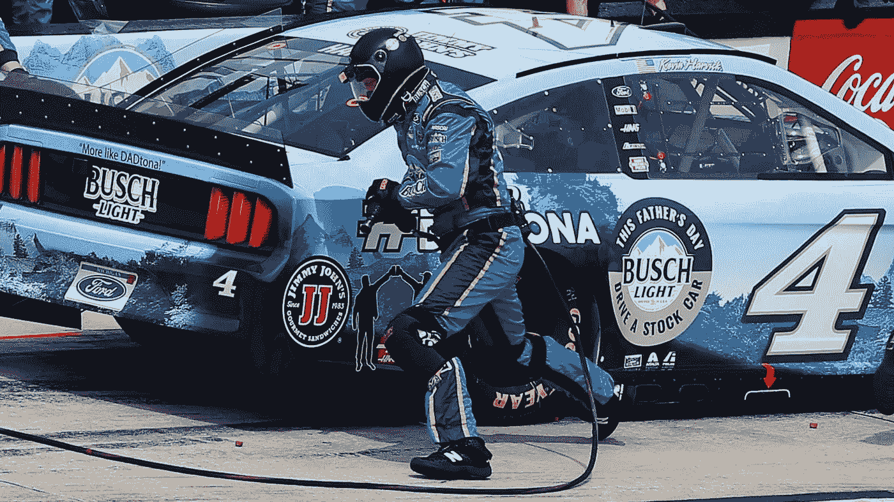
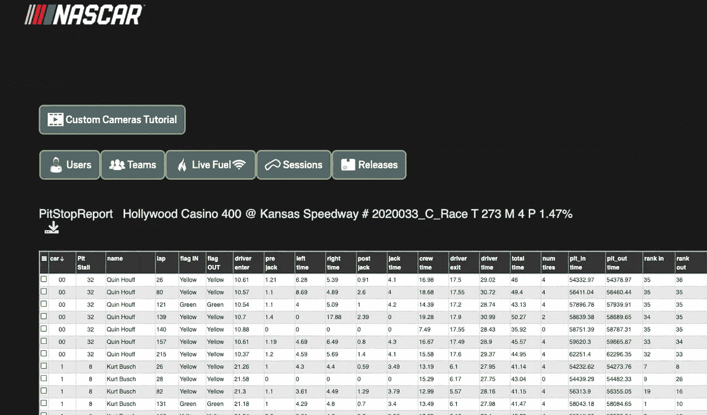
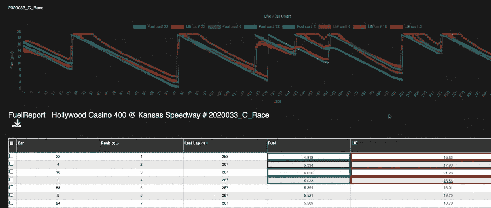

# 数据是纳斯卡和 F1 的驱动力。NoSQL 在杆子上

> 原文：<https://towardsdatascience.com/data-is-the-driver-of-nascar-and-f1-and-nosql-is-on-pole-e5898f212d38?source=collection_archive---------24----------------------->

## 速度和动力推动着 NoSQL 技术在赛车运动中的应用

2020 年，乔治·拉塞尔在 63 号车里进站。图片 via [*威廉姆斯车队*](https://www.williamsf1.com) *下牌照给丹尼尔福尔克斯莱昂*。

谈到赛车和速度，f1 和纳斯卡车队的目标是相同的。获胜。他们的目标是拥有最快的赛车，招募最熟练的车手，并在赛前和赛中做出最佳的战略和竞争决策。进入海量数据呈指数级增长的时代:从汽车内的大量传感器、司机制服、赛道旁扫描仪、视频馈送、天气预报；你说吧。数据库技术及其管理现在不仅是影响赛道决策的因素，也是确保登上领奖台的关键。

Formula 1 和 NASCAR 从数据分析和处理中获得了明显的好处，但它们的实现和方法彼此非常不同。在一级方程式赛车中，车队的遥测数据是专有的，受到高度保护。另一方面，NASCAR 将所有车辆和车队的遥测数据实时提供给车迷、车队和原始设备制造商(原始设备制造商，即 NASCAR 的福特、雪佛兰和丰田)。但是 f1 和纳斯卡都有一个共同的关键因素:对 NoSQL 技术的快速采用。

奥古斯托·卡多佐(Augusto Cardoso)是 SportMedia Technologies (SMT)的首席工程师，该公司是纳斯卡的合作伙伴，负责汇总、处理和向各种观众传输所有比赛数据。卡多佐指出，在多种运动中，它们的采用速度正在加快。“大约 3 年前，我们在赛车运动团队中首次采用了 MongoDB。它取代了 SQL 数据库。我们正在扩大 MongoDB 在曲棍球和棒球等其他运动中的使用。每项运动都有自己的要求，MongoDB 提供了很大的灵活性。”

2020 年，凯文·哈维克驾驶 04 号赛车进站。图片由丹尼尔·福尔克斯·莱昂授权。

英国一级方程式赛车队的首席工程师菲利普·托马森(Phillip Thomason)指出了使用 NoSQL 技术的两大优势:打破以前孤立的存储库之间的墙壁，以及允许多个团队之间的协作。NoSQL 有助于解决筒仓挖好后通常会出现的特殊问题。Thomason 描述了他们开始使用 NoSQL 技术之前的情况，“这些查询是缓慢的、手动的，并且通常实际上是不可能的。NoSQL 允许用户访问所有数据的潜力，并改善了部门间的沟通。”

在这种数据丰富的环境中，通过“合适的工作工具”理念来接纳各种各样的数据，NoSQL 技术公司可以提供这些团队所需的能力和速度。

## 这并不容易，因为 f1 车队每场比赛至少会产生 3TB 的数据，仅纳斯卡在一个周末就产生了超过 1 亿个数据点。

数据通过赛道从赛车传输到基站，工具需要快速处理数据，以便团队分析和视频动画配对播放。

“在纳斯卡的情况下，数据需要为多个观众实时准备好，”卡多佐说。“在赛车运动中，我们有一些独特的应用，我们有一辆生产卡车，每周前往每个场地。我们为赛道用户提供服务，包括车队、汽车制造商(OEM)和电视广播公司。挑战在于，我们需要在卡车和云中复制数据。客户直接从我们的卡车或云端使用数据。如果出现网络问题，电视广播不能停止。我们的本地基础架构可以独立运行，但大多数性能分析和数据科学用户都连接到云。”高辛烷值的数据性能是业务的重要组成部分，但它不能以可用性为代价。Cardoso 补充道，“自从我们迁移到 MongoDB，有了‘在卡车中’和云的存在，我们还没有一个数据库相关的问题。”

在 F1 中，车队都在积极地试图获得彼此之间的竞争优势，他们对各种技术的使用和组合也不例外。

“F1 车队不得不“内部”开发所需的大部分软件，因为市场上根本没有这些软件，”汤姆森解释道。“由于我们是一个相对较小的团队，技术选择通常由团队中的现有技能决定。通常没有足够的时间(或资源)来招聘额外的技能。我们依靠非常有能力的团队成员，他们都在‘全栈’工作，他们的日常职责包括研究新技术。”在 Williams 内部，将结构化和非结构化数据整合在一起的过程是一个关键的竞争领域，也是一个不能公开披露太多信息的领域。

> *“NoSQL 已经允许用户访问所有数据的潜力，它还改善了部门间的沟通。”*
> 
> 威廉姆斯车队的菲利普·托马森

随着数据库技术在潜力和机会方面的进步，方法也在进步。赛车运动也不例外，推动 DevOps 流程引领着持续集成—持续开发(CI-CD)的发展。关于 DevOps 流程，Thomason 补充说，对于 F1 中的威廉姆斯车队来说，“我们总是面临着时间和资源的挑战，以及提高所有业务领域效率的动力。像 Docker 这样的工具允许我们将传统的软件开发团队转移到 DevOps 领域，并帮助更好地定义 IT 和软件部门之间的界限。我们一直有一个非常快速的软件更新机制(基于不同种族发布)，但 DevOps 无疑给了我们更多的灵活性。”

遥测数据不是比赛中可以收集的唯一数据类型；其他来源也会对团队及其奖金产生巨大影响。一个这样的例子是在进站。自从 f1 禁止中途加油以来，他们的进站一直保持在三秒以内，威廉姆斯在 2016 年实现了最快的进站。NASCAR 也在努力缩短进站时间，车队可以在比赛中跟踪和监控所有赛车的进站时间。这导致团队只根据 SMT 汇总的数据向他们的团队发放特别奖金。

由 SMT 开发的 NASCAR 团队分析应用程序中的 PitStop 报告示例。图片经由 [*SMT*](https://www.smt.com) *授权给丹尼尔·福尔克斯·莱昂*。

NASCAR 和 SMT 完全通过 MongoDB 和微服务处理他们的数据。Cardoso 甚至表示，自从他们实施以来，没有一次生产失败。“微服务要快得多。我已经有了一个包含脚本和所有设置的漏斗…所以就 CI-CD 而言，继续推出这些东西对我来说要容易得多…我只需添加和编辑即可”。

关于数据的采用，Thomason 补充说:“F1 一直是数据驱动的，随着管理机构限制我们可以做的测试(有限轮胎、计算流体力学、风洞和赛道测试)，这导致了围绕技术的效率驱动，以从我们允许的运行中提取最大的利益。因此，遥测数据的扩展是由寻求竞争优势的团队推动的。”

尽管这两项运动高度重视数据，并且都从数据分析中获得了明显的回报，但它们的方法非常不同。对于 F1，汤姆森将其描述为一种非常有价值和令人垂涎的资源:“鉴于 F1 的历史，任何公开发布的数据都会被车队用来分析竞争对手的表现，并且需要大量的资源投资才能保持竞争力。”

另一方面，纳斯卡则截然不同。“这是纳斯卡做的一件事，”卡多佐补充道，“每个人都可以看到每个人的数据。所以这是一件非常重要的事情。这都是纳斯卡的政策！为此，我推荐他们，因为这样更容易理解。”这导致了一种非常不同的数据处理方式，以及围绕这种方式建立竞争力的方式。卡多佐是一个团队的成员，该团队开发了一个由 NASCAR、车队及其原始设备制造商直接使用的应用程序，该程序可以帮助实时计算每辆车的燃油效率和估计值。应用程序瞬时运行，当显示结果的速度时，卡多佐补充道:“我不知道你是否能理解这有多快。这个集合有 28 个阶段，我在 3T T1 工作室完成了整个过程。

不仅后面的车队可以实时看到领先的汽车是否有足够的燃料完成比赛，而且粉丝和竞争对手也可以随着比赛的发展制定策略。

*SMT 为 NASCAR 开发的数据应用中的燃料指标示例。图片经由* [*SMT*](https://www.smt.com) *授权给丹尼尔·福尔克斯·莱昂*。

Formula 1 和 NASCAR 可能会以不同的方式处理遥测数据，但它们都希望尽可能快地传输数据。数据传输率是 F1 和 NASCAR 的普遍瓶颈，因为网络错误或基站在降雨期间淹没赛道会导致连接问题。即便如此，他们已经达到了令人印象深刻的延迟速度。在 NASCAR 中，SMT 能够以比一般广播延迟更快的速度处理从赛道到现场卡车、云以及用户的数据。

卡多佐说:“让你了解一下，当你在赛道上时，我们发送数据的延迟大约是 5 到 6 毫秒。真的很快。数据到达云时的延迟接近 100 毫秒。这个巨大的差距，基本上是从卡车到数据中心，最快也就是 60 毫秒的延迟。”正如 Thomason 指出的那样，Williams 也在推动更快的数据速度，“推动处理尽可能接近比赛，以减少数据处理/流丰富套件中的延迟。这里节省的十分之一秒对比赛性能有真正的好处。”

速度、动力和多功能性是赛车运动的每一个要素的要求，从空气动力学到轮胎质量和遥测数据流。数据库技术和架构模型也不例外，NoSQL 现在是另一个帮助获得下一秒的可靠元素。