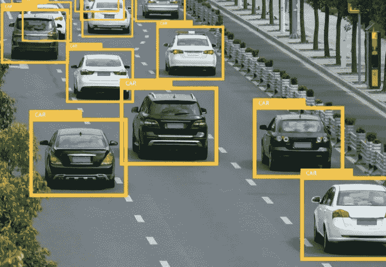
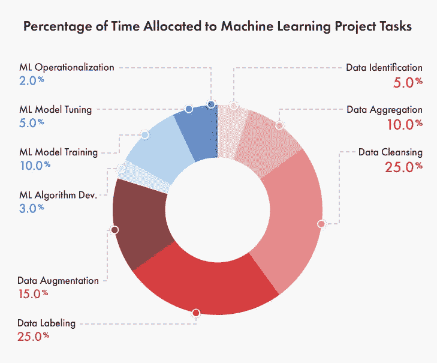

# 数据标签是中国在联网汽车大战中的秘密武器

> 原文：<https://towardsdatascience.com/data-labeling-is-chinas-secret-weapon-in-the-connected-car-battle-e8e395965380?source=collection_archive---------30----------------------->

## 这是一场真正的军备竞赛。

***“你现在看到的一切——所有这些人工智能的壮举，比如自动驾驶汽车、解读医学图像、击败围棋世界冠军等等——这些都是非常狭隘的智能，它们实际上是为特定目的而训练的。在这些情况下，我们可以收集大量数据。”***

这是根据脸书人工智能研究的负责人 Yann LeCun 的说法。

这些话强调了一个事实，即在最近闪亮的人工智能产品繁荣的背后，隐藏着一个更加平庸的人类现实。

世界科技巨头经常依赖大群人来标记将用于训练其机器学习算法的数据。

“标记数据”只是指获取一组未标记的数据(例如，电话记录或街道图像)，并在单个元素(如单词或汽车)上添加信息性的描述性标签。

例如，为了帮助训练自然语言处理系统，数据标注者可能会添加标签来显示某个单词在不同上下文中的含义。

虽然这种估计总是通用和简化的，但数据科学类型已经有益地将机器学习项目中的时间分配细分如下:

如果机器学习算法被输入大量精确标记的训练数据，它可以在“现实世界”中用于包括无人驾驶汽车中的计算机视觉在内的任务。

数据标记需要很多时间，这是一项重要的任务，尤其是当数据将用于训练自动驾驶汽车时。可接受的误差幅度非常小，我相信我们都同意这一点。

尽管有所进步，人工智能仍然像它的名字所暗示的那样非常人工。

机器学习算法的学习方式与人类不同。一些科学家正试图教人工智能像孩子一样学习( [**这篇科学杂志文章**](https://www.sciencemag.org/news/2018/05/how-researchers-are-teaching-ai-learn-child) 是一个很好的入门)，但这些努力仍处于婴儿阶段。

我们偶尔会收到这一事实的严峻提醒，比如对街道标志的细微修改，这完全扰乱了计算机视觉系统，如下所示:

当我们看着这个被破坏的停车标志时，我们看到的是很清楚的，但神经网络分类器在几乎 100%的测试中认为这是一个“限速 100”的标志。

因此，就目前情况而言，机器学习需要良好的数据，而获得这些数据的最可靠方式是付钱给那些整天坐着给图像做注释的人。

你有越多的人，你就能标记越多的数据。

这是一场军备竞赛，但不是我们所知道的那种。

在中国，人们谈论钱坫后厂经济模式——字面意思是“前店后厂”。通常，这是用来帮助分工，资本和供应链内的资源。

中国过去曾让人民币贬值(特别是在 20 世纪 80 年代和 90 年代)，以使其出口商品对外国更便宜，并刺激对生产大众消费品的工厂的投资。这也使得中国公司的进口更加昂贵，刺激他们在当地购买设备。

基本上，在这种情况下，中国是后面的工厂，西方是商店前面。

现在，中国的野心自这一时期以来(也因为这一时期)一直在增长，到了中国公司希望“跃上”价值链并拥有客户关系和产品创造的地步。

为什么要提这个？嗯，钱坫猴场模式仍然占主导地位。现代中国的区别是，机器人在前面，人在后面。

人们正在投入艰苦的劳动，以便中国汽车、数字助理和店内机器人能够蓬勃发展。在理想的情况下，中国会向世界其他地区出口更好的产品。

这有点让人想起 18 世纪的“土耳其机器人”(mechanical Turk)，那个让赌客惊叹不已的下棋机器人原来是一个由下面一个隐藏隔间中的一个小人控制的木偶。

信不信由你，我提到这个例子是有原因的。亚马逊做出了一个颇能说明问题的决定，将其众包工作平台命名为“ [**”亚马逊机械土耳其人**](https://www.mturk.com/) ”，这是对昔日迷人的投机者的滑稽引用。

在 17 世纪，“计算机”是能够进行算术计算的人。在 20 世纪中期，计算机仍然是公司内部处理数字运算的人(主要是女性)。只是到了后来，计算机才变得程序化和数字化，我们今天还在训练它们。

我们每天都是这个动态的一部分。我们使用这些验证码形式来“证明”我们是人类，这些数据被用来让机器变得更智能。

尽管我们偶尔会瞥见幕后的场景，但人们可能会对今天人工智能训练的手工程度感到惊讶。

去年，苹果、谷歌、亚马逊和脸书在被发现出口用户数据并与第三方分享后都不得不道歉。

这些科技巨头向数据注释公司提供信息，如用户与数字助理的对话，以提高其人工智能系统的准确性。

在文章发表的时候，还没有人找到一种精确的、成本有效的方法来取代人类贴标机的角色。

**就这样，回到了中国。**

中国的农村地区，比如贵州，现在是庞大的数据标注工厂的所在地。

对于当地人来说，是一个很有诱惑力的职业；每月 3000 元(425 美元)的平均工资是该地区平均工资的三倍。贵州去年的经济产出增长了 10.2%，成为全国增长最快的省份。

当然，科技公司之间的这场“军备竞赛”不仅仅是让更多的人来完成标签制作过程。

然而，这是一个好的开始。

正如贵州一家数据标签公司的老板在接受《纽约时报》采访时说的那样，

“我们是数字世界的建筑工人。我们的工作是一砖一瓦地砌。但是我们在人工智能中扮演着重要的角色，没有我们，他们无法建造摩天大楼。”

像淘宝的视觉搜索( [**在最近的时事通讯中讨论过**](https://mailchi.mp/f34033d5e2fc/hi-tech-no-24-taobao-luxury-retail-visual-search?e=[UNIQID]) )这样的知名产品是根据阿里巴巴在这些农村地区的仓库中标记的数据进行训练的。

就其本身而言，腾讯正在研究这个巨大的掩体，以存储、处理和分析来自其一直受欢迎的微信应用程序的用户数据:

当然，中国经常比其他国家拥有更多的劳动力。

它还在一些关键技术领域落后于美国，并陷入了与特朗普政府的持续斗争。

出于多种原因，美国将这种体力劳动外包出去。首先，建立这些设施，培训员工，然后付给他们讨厌的最低工资，成本很高。把工作送到更便宜的地方要容易得多，尤其是如果成品(大量有标签的数据)看起来都一样的话。

中国或许能够将其昔日的弱点转化为优势。像贵州这样的农村地区仍然欠发达；数据标签公司带来了急需的工作和相对健康的薪水。与北京等大城市相比，这些工资就相形见绌了，这也为科技公司提供了进一步的好处。

中国完全跳过了几代人的技术发展，让它在下一个重大事件上领先一步。非接触式信用卡从未真正在那里起飞，它们已经转向智能手机支付。在西方，从非接触式卡转向智能手机支付的动机远没有那么有吸引力。

这同样适用于自动驾驶汽车；在未能严重削弱全球有人驾驶汽车市场后，中国公司已将重点转向制造无人驾驶机器。

如果中国科学家在这个过程中学会开发更复杂的微处理器，中国发展的这一最新阶段只会真正对美国科技巨头构成威胁。

正如《经济学家》 [**本周**](https://www.economist.com/technology-quarterly/2020/01/02/china-is-slowly-moving-up-the-microprocessing-value-chain) 报道的那样，中国仍在一个至关重要的行业追赶，到 2022 年，这个行业的价值将达到 5750 亿美元。

虽然数据标记看起来是一项只有一个有用目的的令人沮丧、单调的任务，但它在这个宏观层次上也发挥着作用。

通过自始至终拥有机器学习供应链的所有权，中国人工智能科学家仍然接近这些复杂、有时不透明的系统的内部运作。

中国劳动力的庞大数量将在开发知识产权这一珍贵商品方面发挥至关重要的作用。