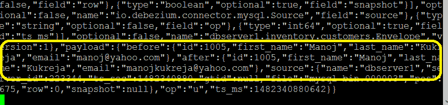
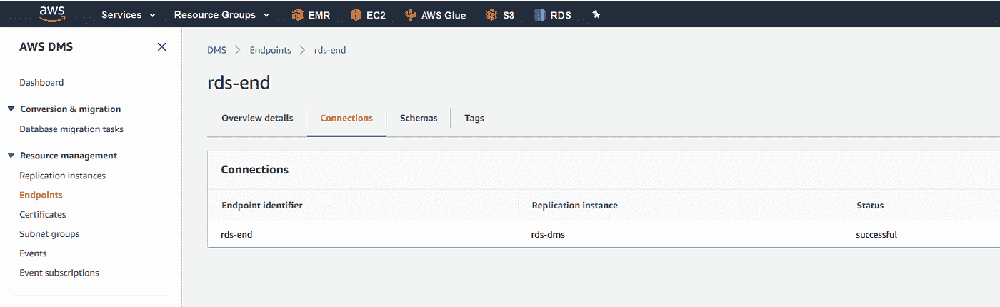
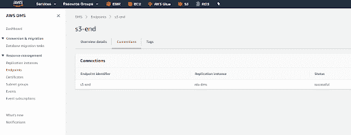
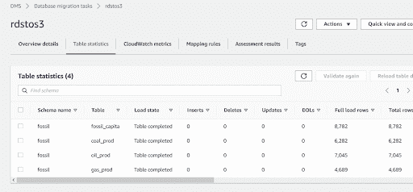
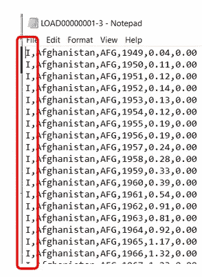
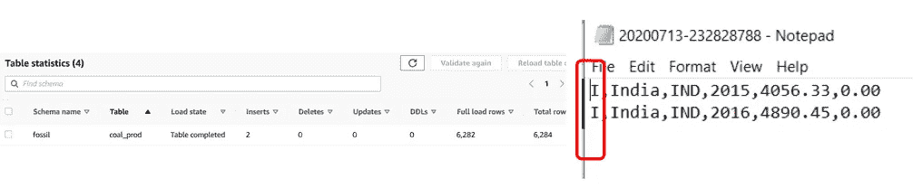
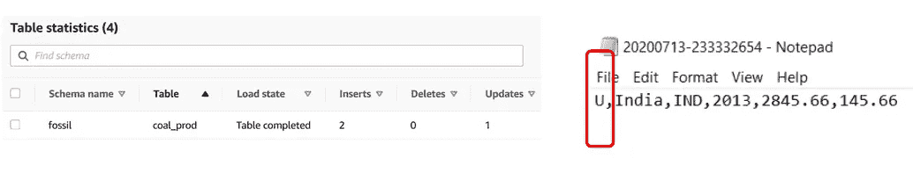
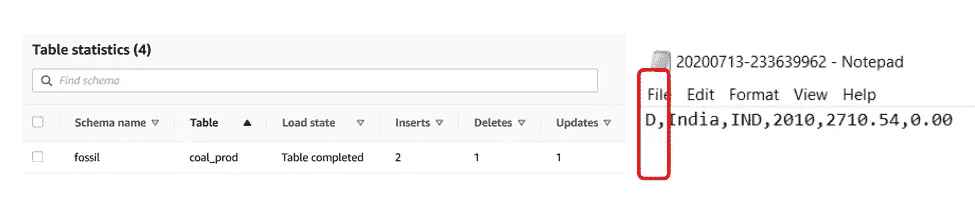

# 使用亚马逊数据库迁移服务的数据湖变化数据捕获(CDC)——第 1 部分——捕获

> 原文：<https://towardsdatascience.com/data-lake-change-data-capture-cdc-using-amazon-database-migration-service-part-1-capture-b43c3422aad4?source=collection_archive---------18----------------------->

## 使用 Amazon Database Migration Service(DMS ),轻松捕获随时间推移从数据库到数据湖的数据更改


图片由来自 [Pixabay](https://pixabay.com/?utm_source=link-attribution&utm_medium=referral&utm_campaign=image&utm_content=2654130) 的 [Gino Crescoli](https://pixabay.com/users/absolutvision-6158753/?utm_source=link-attribution&utm_medium=referral&utm_campaign=image&utm_content=2654130) 拍摄

在我过去 10 年在大数据和分析领域的经历中，我逐渐意识到捕获和处理变化数据集一直是一个具有挑战性的领域。这些年来，我看到了疾控中心是如何发展的。让我带你走过这段旅程:

2011–2013 年—对许多人来说，Hadoop 是主要的数据分析平台。通常，Sqoop 用于将数据从给定的数据库传输到 HDFS。这对于满表负载非常有效。Sqoop incremental 可以捕获*插入*以及*。*

**但是 CDC 不仅仅是关于插页。我的*更新*和*删除*在哪里？**

2016 年—我们创建了一个策略，使用数据库表上的触发器捕获更新和删除，并将更改写入影子表。一旦捕获到发生更改的数据，我们将使用 Sqoop 将数据传输到 HDFS。这种方法需要修改数据库，所以我们的很多客户都反对。

2015–2016 年——名为 **Debezium** 的新开源项目的使用越来越多。此后的几年里，我们非常有效地使用了这个 CDC 工具。最初，Debezium 只支持有限数量的数据库，但这足以覆盖我们的大部分用例。

Debezium 能够查询数据库二进制日志并提取更改。它以 JSON 文档的形式将每个变化发布给 Kafka。



按作者分类的图像—在图像之前和之后记录

2016 年—现在—对于 AWS 云部署，我们通常使用亚马逊数据库迁移服务(DMS)。DMS 可以从内部服务器或 RDS 读取变更数据集，并将其发布到许多目的地，包括 S3、红移、Kafka 和 Elasticsearch 等。

让我向您展示如何创建一个示例 CDC 管道。我们将首先在 AWS 上创建一个 RDS 数据库，创建一个示例数据库，最后设置 Amazon DMS 来执行到 S3 的变更数据捕获。

让我们从下载一个样本数据文件开始

```
$ git clone https://github.com/mkukreja1/blogs.git
```

创建 RDS 安全组并打开入口

```
$ aws ec2 delete-security-group --group-name "RDS Security Group"$ RDS_GROUP=` aws ec2 create-security-group --description sg-rds --group-name "RDS Security Group" | grep GroupId | sed 's/"GroupId"://' |  sed 's/"//g' |  sed 's/,//g'`;echo $RDS_GROUP$ aws ec2 authorize-security-group-ingress --group-id $RDS_GROUP  --protocol tcp --port 3306 --cidr **0.0.0.0/0***# For security reasons you may want the replace* ***0.0.0.0/0*** *with your web facing IP. This will limit traffic originating from your IP address only.* 
```

我们将创建一个 MySQL 数据库。该数据库将用作 CDC 的来源。首先创建一个 RDS 参数组。

```
$ aws rds delete-db-parameter-group --db-parameter-group-name rds-mysql$ PG_ARN=`aws rds create-db-parameter-group --db-parameter-group-name rds-mysql --db-parameter-group-family MySQL5.7 --description "RDS Group" | grep DBParameterGroupArn | sed -e 's/"//g' -e 's/,//g'  -e 's/DBParameterGroupArn//g' -e 's/: //g' `;echo $PG_ARN$ aws rds modify-db-parameter-group --db-parameter-group-name rds-mysql --parameters "ParameterName=binlog_format, ParameterValue=ROW,ApplyMethod=immediate" "ParameterName=binlog_checksum,ParameterValue=None,ApplyMethod=immediate"
```

创建 RDS 实例

```
$ aws rds delete-db-instance --db-instance-identifier fossil --skip-final-snapshot$ aws rds create-db-instance --db-instance-identifier fossil --db-instance-class db.t2.micro --engine mysql --region us-east-1 --output text --master-username admin --master-user-password admin123 --allocated-storage 20 --vpc-security-group-ids $RDS_GROUP --db-parameter-group-name rds-mysql --option-group-name default:mysql-5-7 --engine-version 5.7.30**-- Wait for 5-10 minutes after this step**
```

安装一个 MySQL 客户端并测试与 MySQL 的连接。将数据文件导入新创建的数据库。

```
$ sudo yum -y install mysql$ RDS_ENDPOINT=`aws rds describe-db-instances --db-instance-identifier fossil | grep "Address" | sed 's/.*://'   | sed 's/"//g'    | sed 's/,//g'`;echo $RDS_ENDPOINT$ mysql -uadmin -padmin123 -h $RDS_ENDPOINT -e "DROP DATABASE IF EXISTS fossil;CREATE DATABASE fossil;grant REPLICATION CLIENT on *.* to admin;grant REPLICATION SLAVE on *.* to admin;"$ mysql -uadmin -padmin123 -h $RDS_ENDPOINT fossil < blogs/dms/energy.sql$ mysql -uadmin -padmin123 -h $RDS_ENDPOINT -e "use fossil;select count(*) from coal_prod"
```

配置 DMS。首先创建 DMS 复制实例。

```
$ SG_RDS=`aws ec2 describe-security-groups --group-names "RDS Security Group" | grep GroupId | sed -e 's/"//g' -e 's/,//g'  -e 's/GroupId//g' -e 's/: //g' `;echo $SG_RDS$ aws dms create-replication-instance --replication-instance-identifier rds-s3-dms --replication-instance-class dms.t2.micro --no-publicly-accessible --vpc-security-group-ids $SG_RDS$ REP_ARN=`aws dms describe-replication-instances | grep ReplicationInstanceArn | sed -e 's/"//g' -e 's/,//g'  -e 's/ReplicationInstanceArn//g' -e 's/: //g' `;echo $REP_ARN**# wait 5 minutes for the above to finish**
```

创建 DMS 源端点。在这种情况下，上面创建的 RDS 实例将充当源。

```
$ DMS_END_SOURCE=`aws dms create-endpoint --endpoint-identifier rds-end --endpoint-type source --server-name $RDS_ENDPOINT --engine-name mysql --username admin --password admin123 --port 3306 --database-name fossil | grep EndpointArn | sed -e 's/"//g' -e 's/,//g'  -e 's/EndpointArn//g' -e 's/: //g' `;echo $DMS_END_SOURCE
```

测试 DMS 源端点连接。只有在成功的情况下才能继续。

```
$ aws dms test-connection --replication-instance-arn $REP_ARN --endpoint-arn $DMS_END_SOURCE
```



按作者分类的图像— DMS 源端点

创建有权访问 S3 的 DMS 角色。我们将使用该角色来定义 DMS 目的地端点。

```
$ aws iam detach-role-policy --role-name dms-role --policy-arn arn:aws:iam::aws:policy/AmazonS3FullAccess$ aws iam delete-role --role-name dms-role$ DMS_ROLE=`aws iam create-role --role-name dms-role --assume-role-policy-document file://blogs/dms/policy.json | grep Arn | sed -e 's/"//g' -e 's/,//g'  -e 's/Arn//g' -e 's/ //g' -e 's/://' `;echo $DMS_ROLE$ aws iam attach-role-policy --role-name dms-role --policy-arn arn:aws:iam::aws:policy/AmazonS3FullAccess**# you ay want to tighten up the above policy to limit access to specific buckets only**$ aws iam create-role --role-name dms-vpc-role --assume-role-policy-document file://blogs/dms/policy.json$ aws iam attach-role-policy --role-name dms-vpc-role --policy-arn arn:aws:iam::aws:policy/service-role/AmazonDMSVPCManagementRole
```

创建 DMS 目标端点

```
$ S3_JSON="{\"ServiceAccessRoleArn\": \"$DMS_ROLE\",\"BucketFolder\": \"raw/dms\",\"BucketName\": \"aws-analytics-course\",\"DataFormat\": \"csv\", \"IncludeOpForFullLoad\": true }";echo $S3_JSON >s3.json;cat s3.json$ DMS_END_DEST=`aws dms create-endpoint --endpoint-identifier s3-end --engine-name s3 --endpoint-type target --s3-settings file://s3.json | grep EndpointArn | sed -e 's/"//g' -e 's/,//g'  -e 's/EndpointArn//g' -e 's/: //g' `;echo $DMS_END_DEST$ aws dms test-connection --replication-instance-arn $REP_ARN --endpoint-arn $DMS_END_DEST
```



按作者分类的图像— DMS 目标端点

创建并运行 DMS 任务。在第一次运行时，该任务将从源端点的所有表中获取全部数据，并将数据复制到目的端点。之后，复制实例跟踪源端点上的更改，并迅速将它们传递到目标。在这个过程中，复制实例维护每个表的日志。

```
$ aws dms create-replication-task     --replication-task-identifier rdstos3     --source-endpoint-arn $DMS_END_SOURCE     --target-endpoint-arn $DMS_END_DEST     --replication-instance-arn $REP_ARN     **--migration-type full-load-and-cdc **    --table-mappings file://blogs/dms/table-mappings.json$ TASK_ARN=` aws dms describe-replication-tasks | grep ReplicationTaskArn | sed -e 's/"//g' -e 's/,//g'  -e 's/ReplicationTaskArn//g' -e 's/ //g' -e 's/://' `;echo $TASK_ARN$ aws dms start-replication-task --replication-task-arn $TASK_ARN  --start-replication-task-type reload-target
```



按作者分类的图像—复制任务的状态

一旦 DMS 作业运行，我们就可以检查 S3 上满负载的数据

```
$ aws s3 ls aws-analytics-course/raw/dms/$ aws s3 ls aws-analytics-course/raw/dms/
                           PRE fossil/$ aws s3 ls aws-analytics-course/raw/dms/fossil/
                           PRE coal_prod/
                           PRE fossil_capita/
                           PRE gas_prod/
                           PRE oil_prod/$ aws s3 ls aws-analytics-course/raw/dms/fossil/coal_prod/
2020-07-13 18:08:09     326026 LOAD00000001.csv
```

请注意，每条记录都标记了 DML 操作，在本例中，所有行都标记了 Insert (I ),因为这是第一次将数据从源装载到目标。



作者图片

让我们对源数据库执行更多的 DML 操作——插入、更新和删除。从几个插页开始。

```
$ mysql -uadmin -padmin123 -h $RDS_ENDPOINT fossil -e "INSERT INTO fossil.coal_prod VALUES('India', 'IND', 2015, 4056.33, 0.00);INSERT INTO fossil.coal_prod VALUES('India', 'IND', 2016, 4890.45, 0.00)"
```



作者图片

注意，S3 的文件将新插入的行标记为“I”。现在让我们发送一个更新。

```
$ mysql -uadmin -padmin123 -h $RDS_ENDPOINT fossil -e "UPDATE fossil.coal_prod SET Production=2845.66, consumption=145.66 WHERE Entity='India' AND Year=2013"
```



作者图片

注意，S3 的文件将新插入的行标记为“U”。最后发个删除。

```
$ mysql -uadmin -padmin123 -h $RDS_ENDPOINT fossil -e "DELETE FROM fossil.coal_prod WHERE Entity='India' AND Year=2010"
```



作者图片

请注意，S3 的文件将新插入的行标记为“D”。

> 有什么大惊小怪的？毕竟它只是插入、更新和删除。

既然我们已经有了连续复制，源端和目标端将保持同步。在本文的第 2 部分，我将向您展示如何使用 Apache 胡迪将 CDC 接收到数据湖中。

如果您将本文用于测试/教育，不要忘记在完成后清理您的 AWS 资源。如果在生产中使用，DMS 资源将永久部署。

```
$ aws dms stop-replication-task --replication-task-arn $TASK_ARN$ aws dms delete-replication-task --replication-task-arn $TASK_ARN$ aws dms delete-endpoint --endpoint-arn $DMS_END_SOURCE$ aws dms delete-endpoint --endpoint-arn $DMS_END_DEST$ aws dms delete-replication-instance --replication-instance-arn $REP_ARN$ aws rds delete-db-instance --db-instance-identifier fossil --skip-final-snapshot
```

本文中使用的所有代码都可以在下面的链接中找到:

[](https://github.com/mkukreja1/blogs/tree/master/dms) [## mkukreja 1/博客

### 此时您不能执行该操作。您已使用另一个标签页或窗口登录。您已在另一个选项卡中注销，或者…

github.com](https://github.com/mkukreja1/blogs/tree/master/dms) 

我希望这篇文章是有帮助的。 **CDC 使用亚马逊数据库迁移服务**是由 [Datafence 云学院](http://www.datafence.com)提供的 AWS 大数据分析课程的一部分。课程是周末自己在网上教的。