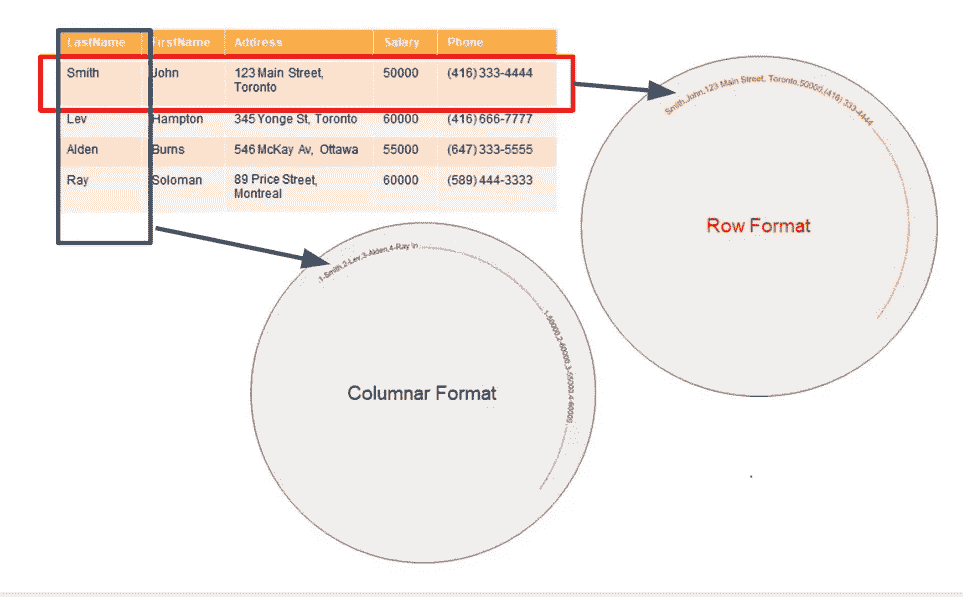
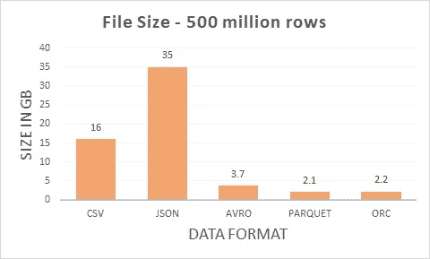
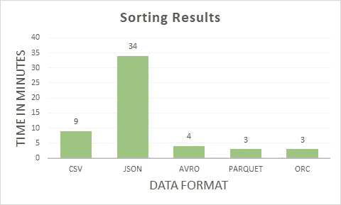
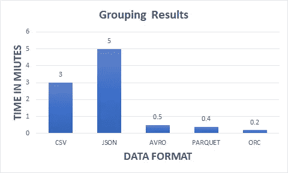

# 数据湖—比较已知大数据格式的性能

> 原文：<https://towardsdatascience.com/data-lake-comparing-performance-of-known-big-data-formats-eace705b6fd8?source=collection_archive---------14----------------------->

## 众所周知的大数据格式(CSV、JSON、AVRO、PARQUET 和 ORC)的性能比较


米卡·鲍梅斯特在 [Unsplash](https://unsplash.com/s/photos/data?utm_source=unsplash&utm_medium=referral&utm_content=creditCopyText) 上的照片

在过去的几年里，我一直在大数据项目中使用各种数据格式。在这段时间里，我强烈倾向于一种形式，而不是另一种——我的失败给了我一些教训。在我的讲座中，我一直强调为正确的目的使用正确的**数据格式**的重要性——这让世界变得不同。

一直以来，我都在想，我是否向我的客户和学生传授了正确的知识。我可以用数据来支持我的主张吗？因此，我决定做这个性能比较。

在我开始比较之前，让我简要地向您描述一下所考虑的各种数据格式。

## 行格式

CSV、JSON 和 Avro(二进制)

## 分栏格式

拼花地板和 ORC(都是二元的)

我相信你一定想知道*行*和*列*格式之间的区别。**数据在磁盘上的存储方式至关重要。**行格式存储为**行 1 >行 2 >行 3** 列格式存储到磁盘为**列 1 >列 2 >列 3**

一切都好，但这有什么关系…数据就是数据。不完全是。如果我让你平均一下**工资**栏呢。对于数据的行格式，需要从磁盘中读取每一行，提取薪金列，然后进行平均。这消耗了大量的 IO，因为需要读取大量的磁盘扇区。

对于列格式，从磁盘中一次性读取连续的薪金列块，然后进行平均。更少的 IO 意味着更高的性能。像平均、求和等数学运算。包括很大一部分数据分析处理——自然，柱状格式在 OLAP 更受欢迎



作者图片

如果行格式那么糟糕，为什么还在使用？如果您正在执行 OLTP，行格式显然是最佳选择。在 web/mobile 应用程序中，您不太关心一系列行的数学处理，但是您确实希望快速访问单个行。**这就是自动选择行格式的地方。由于这个原因，所有已知的关系数据库都以这种方式存储数据。**

## 性能比较—平台

**存储层:** Hadoop 3 .2.1— Hadoop 文件系统(HDFS)

**计算层:**Spark 3-4 个工作线程-32 个内核 58GB

**数据样本量:**HDFS 存储 5 亿行

**样本数据:**

```
+-----+---------+----------+
|stock|    price|  timetamp|
+-----+---------+----------+
| AMZN| 121.1792|1600952178|
| SBUX|132.03702|1600952178|
|  MCD| 407.2828|1600952178|
|  MCD| 43.12032|1600952178|
| MSFT|115.79154|1600952178|
+-----+---------+----------+
```

**加工操作**

1.  按照这个顺序[股票，价格，时间]对 5 亿行进行排序，并将结果保存到 HDFS
2.  按股票分组数据，找到最高价，并将结果保存到 HDFS

## 性能比较结果

以下是不同格式的文件大小的结果。请注意 5 亿行文件大小的巨大差异。JSON 的占地面积最大，而 Parquet 的占地面积最小。



作者图片

JSON 占用的内存最大，因为它存储了每行的模式属性。因此，我很少将 JSON 或 CSV 格式存储在数据湖的管理和转换区域中。JSON 和 CSV 格式仍然是最广泛使用的数据交换方法。我特别注意在从源代码中获取之后将它们转换成二进制格式。我的数据湖通常看起来像:

**原始区域:JSON 或 CSV**

**策划和改造区:Avro、ORC 或拼花地板(或其组合)**

以下是不同格式的排序操作的结果。不出所料，JSON 表现最慢，Parquet、ORC 最快。我必须承认，看到 AVRO 表现得相当好，我有点惊讶。



作者图片

以下是分组操作的结果，并找出不同格式的最大值。注意，这个操作本质上是纯数学的。它非常类似于数据分析用例。我很高兴地证实，所有二进制格式(AVRO，拼花，ORC)表现相当不错。

Parquet 和 ORC 的性能几乎相同，但 ORC 的文件占用空间略小。看到近年来 ORC 的采用率大幅下降并不奇怪。我几乎不再遇到任何使用 ORC 格式的项目。



作者图片

> 总之，我现在可以有把握地推断，Parquet 和 ORC 格式确实非常适合数据分析操作。从这篇文章中得到的另一个非常重要的启示是— **立即停止在您的管理和转换区域中使用 CSV、JSON。**这似乎是显而易见的，但你会惊讶地发现，我遇到过多少次不遵循这一规则的部署。

这种比较的所有代码都可以在下面的链接中找到:

[](https://github.com/mkukreja1/blogs/tree/master/data-formats) [## mkukreja 1/博客

### 此时您不能执行该操作。您已使用另一个标签页或窗口登录。您已在另一个选项卡中注销，或者…

github.com](https://github.com/mkukreja1/blogs/tree/master/data-formats) 

我希望这篇文章是有帮助的。由 [Datafence Cloud Academy](http://www.datafence.com) 提供的**大数据格式**主题将作为大数据 Hadoop、Spark & Kafka 课程的一部分进行详细介绍。课程是周末自己在网上教的。