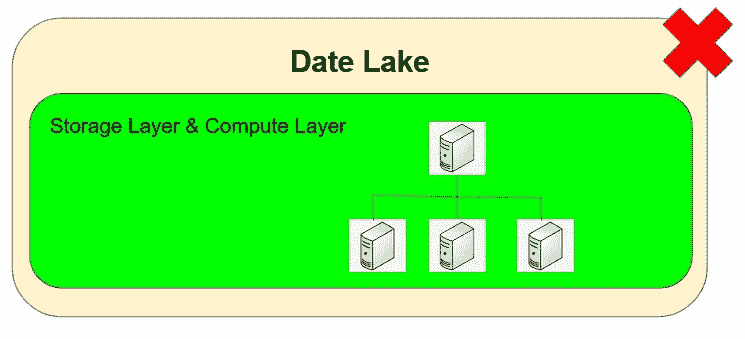
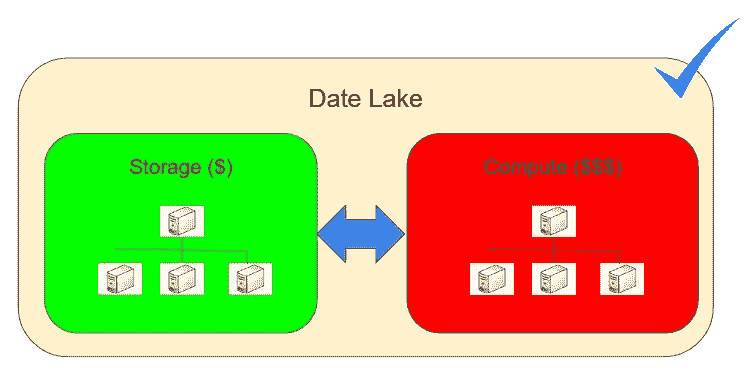
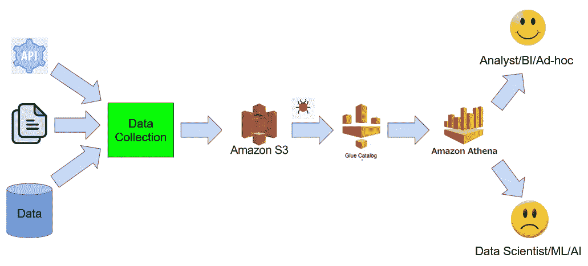
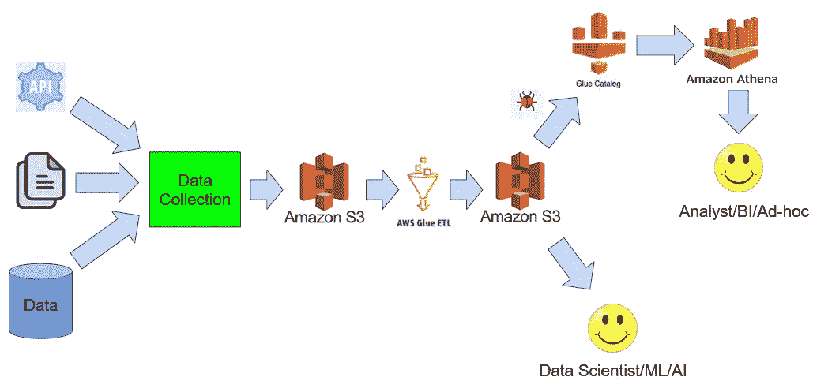
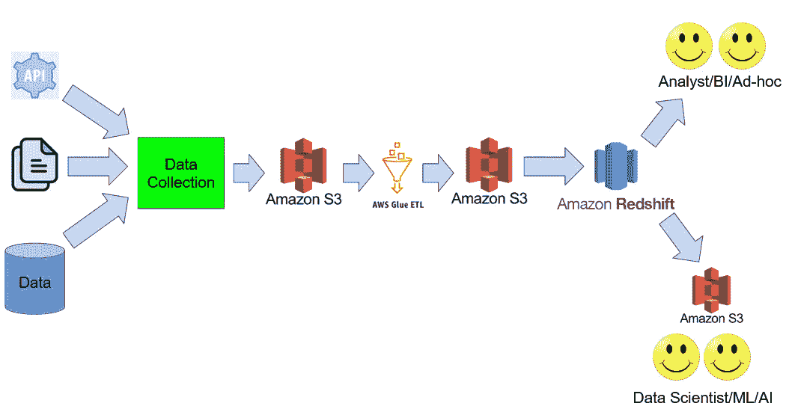

# AWS 上的数据湖设计模式——简单、恰到好处和复杂

> 原文：<https://towardsdatascience.com/data-lake-design-patterns-on-aws-simple-just-right-the-sophisticated-2d0bc8892899?source=collection_archive---------22----------------------->

## 为您的企业选择正确的 AWS 数据湖设计指南

图片来自[皮克斯拜](https://pixabay.com/?utm_source=link-attribution&utm_medium=referral&utm_campaign=image&utm_content=1907993)

互联网上对数据湖有不同的定义。一些站点将它定义为存储结构化和非结构化数据的集中存储库，其他站点则讨论以原始格式存储数据，以便以后可以使用 schema on read 对其进行处理。一切都好…但我想补充一些关于存储和计算层的非常重要的内容。

过去几年，我参与了几个数据湖项目，其中存储层与计算层非常**紧密耦合**。尽管这种设计非常适合使用本地物理/虚拟机的基础架构。但是，对于云基础架构来说，这可能不是最好的主意，因为资源需要全天候可用。

作者图片

## *存储*便宜，但*计算*昂贵——分离存储和计算

作为替代方案，我支持将存储和计算分离的想法。这样，唯一不昂贵的存储层需要 24x7 全天候运行，而昂贵的计算层只能在需要时按需创建。

作者图片

我在以前的一篇文章中演示了如何做到这一点(链接如下)。

[Data ops——使用 AWS Lambda 和 Amazon EMR 的全自动低成本数据管道](/dataops-fully-automated-low-cost-data-pipelines-using-aws-lambda-and-amazon-emr-c4d94fdbea97)

因为我们支持存储和计算分离的想法，所以让我们讨论 AWS 上的一些数据湖设计模式。我尝试根据 3 个关键因素对每个模式进行分类:

1.  费用
2.  操作简单
3.  用户基础

# 简单的

数据收集过程不断地将各种来源的数据转储到亚马逊 S3。使用 Glue crawler 可以推断出数据的模式和格式，表元数据存储在 AWS Glue Catalog 中。对于数据分析，用户可以使用 Amazon Athena 通过标准 SQL 查询数据。

低成本、操作简单(无服务器架构)。使用标准 SQL 进行查询让分析师、商业智能开发人员和特别报告用户非常高兴。对于数据科学家、机器学习/人工智能工程师来说，情况并非如此。他们通常希望从文件中获取数据，最好是大文件和二进制格式，如 Parquet、ORC 和 Avro。

# 正好

数据收集过程不断地将各种来源的数据转储到亚马逊 S3。粘合 ETL 作业管理/转换数据，并将数据写入大型 Parquet/ORC/Avro。使用 Glue crawler 推断出管理/转换数据的模式和格式，并将表元数据存储在 AWS Glue Catalog 中。对于数据分析，用户可以选择使用 Amazon Athena 使用标准 SQL 查询数据，或者从 S3 获取文件。

作者图片

价格经济、操作简单(无服务器架构)。分析师、商业智能开发人员可以选择使用 Amazon Athena。数据科学家、机器学习/人工智能工程师可以以最适合他们需求的合适格式获取大文件。每个人都很开心……算是吧。

这种模式的缺点是，它将复杂的转换和连接数据操作推给 Amazon Athena 处理，或者假设这些操作将由数据科学家和机器学习/AI 工程师以编程方式处理。在某些情况下，这两个选项都不理想，因为它们会降低性能，并且会导致数据不标准和不可重用。

# 老练的人

数据收集过程不断地将各种来源的数据转储到亚马逊 S3。粘合 ETL 作业管理/转换数据，并将数据写入大型 Parquet/ORC/Avro。这些数据被复制到 Amazon Redshift 表中，该表使用键分布将数据存储在跨越多个节点的表中。用户不仅可以利用 Amazon Redshift 进行即席报告，还可以进行复杂的转换和连接数据集。此外，经过转换和连接的数据版本可以转储到大型文件中，供数据科学家和机器学习/人工智能工程师使用。每个人都非常高兴。

作者图片

价格较高，操作相对简单(无服务器架构)。使用分布式和并行处理执行所有计算，因此性能相当好。每个人都能以他们需要的形式得到他们需要的东西。较高的价格可能是合理的，因为它通过以标准化和可重用的方式执行复杂的转换来简化它们。

我希望以上信息能帮助您为自己的企业选择正确的数据湖设计。如果你需要进一步的帮助，我随时乐意与你聊天。

我希望这篇文章是有帮助的。 **AWS 数据湖**是由 [Datafence 云学院](http://www.datafence.com)提供的 AWS 大数据分析课程的一部分。课程是周末自己在网上教的。