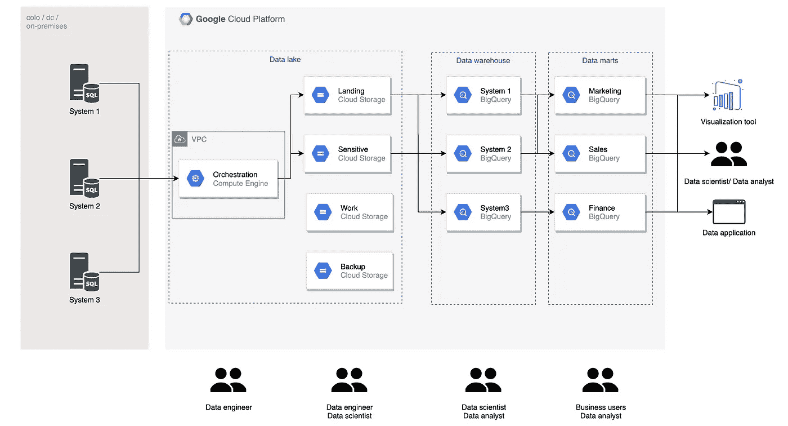
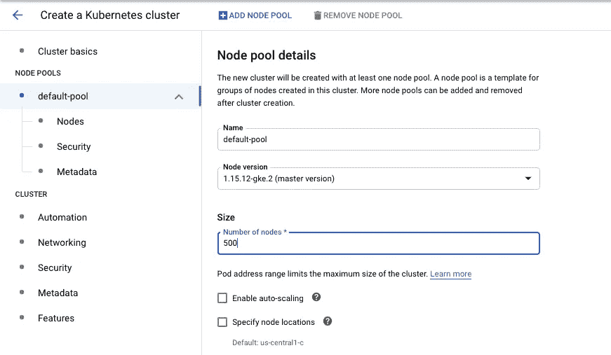
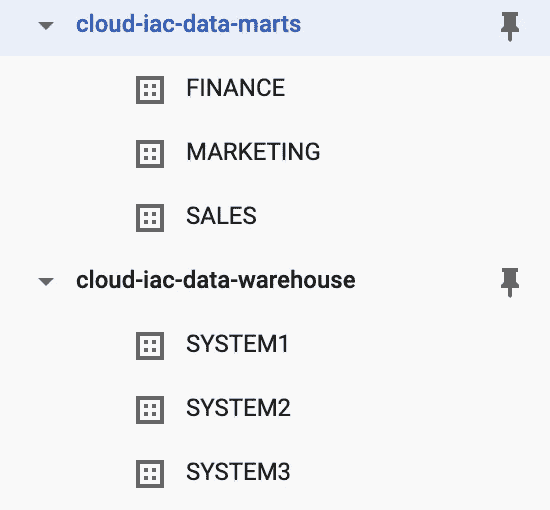

# 使用 Terraform 的 GCP 数据湖

> 原文：<https://towardsdatascience.com/data-lake-on-gcp-using-terraform-469062a205ad?source=collection_archive---------11----------------------->

## 使用 Terraform 为谷歌云平台上的数据湖建立基础设施代码。



我们将在这个项目中建设的总结(作者图片)

过去，处理物理基础架构是一项巨大的负担，不仅需要专家团队来管理，而且非常耗时。然而，在现代云计算时代，只需点击一个按钮，你就可以立即部署数百台计算机来解决你的问题。实际上，我们试图解决的大多数日常问题并不需要那么多的计算能力。



# 什么是基础设施即代码(IaC)

> 基础设施即代码(IaC)是通过机器可读的定义文件，而不是物理硬件配置或交互式配置工具来管理和配置计算机数据中心的过程。
> 
> [维基百科](https://en.wikipedia.org/wiki/Infrastructure_as_code)

因此，您可以编写代码来完成所有这些工作，而不是将物理服务器放在机架上，设置所有电缆，配置网络，安装所有必需的操作系统。要使用 IaC，您通常会使用源代码控制库，编写代码来配置您的基础设施，在本地运行代码，或者设置一个自动化来在每次提交时执行您的代码。

# 为什么是 IaC？

你可能会问，既然可以通过所有云提供商的界面来管理基础设施，为什么还要设置和学习新的东西呢？对我们的基础设施进行版本控制有很多好处。

## 再现性

IaC 使您能够轻松地创建不同的环境，尤其是当您的项目很复杂，并且有许多活动部分时。例如，在设置了包含多个项目、VPC、存储、计算实例和 IAM 的开发环境后，对试运行和生产环境做同样的事情会适得其反。

使用 IaC，您可以通过对您的代码库做一些小的修改来复制您的环境。您甚至可以定制您的环境来满足您的需求。例如，您可以为生产和开发设置不同的机器类型，或者为开发设置更宽松的 IAM。

想象一下，如果一个实习生[搞乱了](https://www.quora.com/What-is-the-most-catastrophic-mistake-made-by-an-intern-at-a-company)你的生产环境，你可以拆除一切，轻松构建你的环境(假设你的底层数据毫发无损)

## 安全性

在大型项目中，您可以拥有具有复杂权限和策略的环境。您不仅要担心设计和设置这些环境，而且实施策略和权限也很有挑战性。

有了 IaC，您环境中的每一个更改都被版本化，因此您知道谁做了什么更改(假设您将管理权限限制为仅您的 IaC 服务)。您还可以定期扫描您的环境，查看配置和实际环境之间的差异。如果大多数 IaC 服务检测到任何变更，它们将能够将您的环境恢复到配置。

## 合作

当您的基础设施由代码管理时，您可以在团队之间共享它们，或者在以后的项目中使用它们。您还可以根据配置自动生成基础设施文档。

# 在 GCP 上使用 Terraform 开始使用 IaC

很好，那么让我们开始使用 Terraform 在 Google 云平台上建立数据湖的基础设施。您可以在任何其他云提供商上使用任何其他 IaC 工具，我选择这种组合，因为它对我来说很熟悉。

> Terraform 是由 HashiCorp 创建的开源基础设施代码软件工具。它使用户能够使用一种称为 HashiCorp 配置语言的声明式配置语言，或可选的 JSON，来定义和配置数据中心基础架构。Terraform 通过“提供者”管理外部资源。[维基百科](https://en.wikipedia.org/wiki/Terraform_(software))


我们将在这个项目中建设的总结(作者图片)

在这个项目中，我们将使用 terraform 代码为 GCP 的一个数据湖提供资源和权限。上图是数据湖的简化版本，我们将编写代码在 GCP 上提供和设置一切。

让我简要介绍一下 GCP 上一个典型数据湖的架构(为了简单起见，我只考虑批处理管道)。您通常会有生成数据的系统，在本地运行，或者您需要连接的其他云提供商/项目。出于安全目的，您可以通过 VPN 或互连连接到这些系统。然后，您将需要一个编排/暂存服务器来提取数据并将它们加载到您的存储桶中。

然后，数据将被分类并加载到不同的桶中。原始数据通常会被接收到着陆桶中。包含敏感客户信息的数据将被单独处理(屏蔽、去识别、单独的许可政策)并加载到敏感存储桶中。工作桶用于数据工程师和数据科学家的在制品数据，备份桶用于清洗数据的备份。

然后，数据将被加载到数据仓库，在那里，数据将根据接收系统进行分离(不同的公司可能会有不同的做法)。这里的数据根据需要进行清理、规格化/反规格化，并建模以备后用。来自数据仓库的数据将被进一步建模、聚合并加载到数据集市。数据集市通常按业务功能组织，如市场营销、销售和财务。

您可以看到，我们有几个层，不同的团队访问这些层。上面的架构是基于我们的工作和具体的业务问题。欢迎任何建设性的反馈:)

# 开始之前

您需要为此项目做以下工作:

*   **下载并设置 Terraform CLI:** 使用本入门指南在您的本地机器上安装 Terraform CLI。
*   **创建一个谷歌云账户**:如果你还没有，注册一个谷歌云账户。注册时你将获得 300 美元的信用，足够让你不用花一美元就能完成本教程。
*   **获取您的账单 ID:** 遵循此处的指南在 GCP 上找到您的账单 ID。你以后会需要它的。
*   **安装 gcloud CLI** :使用[这个链接](https://cloud.google.com/sdk/docs/quickstarts)帮助你在本地安装 gcloud CLI。

你可以在这里查看该项目的完整代码。

[](https://github.com/tuanchris/data-lake-iac) [## 图安克里斯/数据湖-iac

### 使用 Terraform 为谷歌云平台上的数据湖建立基础设施代码。你需要做…

github.com](https://github.com/tuanchris/data-lake-iac) 

# 在 GCP 上使用 Terraform 开始使用 IaC

## 向 GCP 认证

首先，我们需要向 GCP 认证。将以下注释粘贴到终端，并按照说明进行操作。

```
gcloud auth application-default login
```

## Setup main.tf

用以下内容创建一个`main.tf`文件:

```
provider "google" {}
```

这将为我们的 terraform 项目设置提供者。

```
terraform init
```

## 创建项目

现在我们可以开始建立我们的基础设施。我们将首先为数据湖和数据仓库创建两个项目。你可以把你所有的设置放在一个巨大的`main.tf`文件中，但是我建议根据服务分开。让我们创建一个新的`project.tf`文件，我们将在其中定义我们的项目。

第一行将定义我们想要创建的资源:`google_project`。下一位`data-lake`是被其他服务引用的资源的名称。将`project_id`替换为全球唯一的 ID(包括您的姓名或项目)，将`billing_account`替换为您自己的 ID。

```
terraform apply
```

您将看到如下输出:

```
# google_project.data-lake will be created
  + resource "google_project" "data-lake" {
      + auto_create_network = true
      + billing_account     = ""
      + folder_id           = (known after apply)
      + id                  = (known after apply)
      + name                = "Data Lake"
      + number              = (known after apply)
      + org_id              = (known after apply)
      + project_id          = "cloud-iac-data-lake"
      + skip_delete         = true
    }# google_project.data-warehouse will be created
  + resource "google_project" "data-warehouse" {
      + auto_create_network = true
      + billing_account     = ""
      + folder_id           = (known after apply)
      + id                  = (known after apply)
      + name                = "Data Warehouse"
      + number              = (known after apply)
      + org_id              = (known after apply)
      + project_id          = "cloud-iac-data-warehouse"
      + skip_delete         = true
    }# google_project.data-marts will be created
  + resource "google_project" "data-marts" {
      + auto_create_network = true
      + billing_account     = ""
      + folder_id           = (known after apply)
      + id                  = (known after apply)
      + name                = "Data Marts"
      + number              = (known after apply)
      + org_id              = (known after apply)
      + project_id          = "cloud-iac-data-marts"
      + skip_delete         = true
    }
```

这是详细说明 terraform 将创建什么的提示。研究这些以确保结果与您想要做的相匹配，并在终端中键入`yes`。

您已经成功地创建了三个项目:数据湖、数据仓库和数据集市！转到 GCP 控制台验证您的结果。请注意，每个计费帐户最多只能有三个项目，这可能会阻止您继续操作。

## 定义变量

在继续之前，我们先来谈谈变量。你可以看到，在我们上面的`project.tf`中的 terraform 代码中，我们使用特定的名称作为项目 ID。这并不总是最好的方式。想象一下，如果我们想在其他地方使用代码，我们必须手动更改所有的名称。

相反，我们可以定义一个将在整个项目中使用的`variables.tf`文件。我们可以把常用的变量存储在那里。我们可以使用不同类型的变量，但为了简单起见，我将使用局部变量。你可以在这里阅读更多关于地形变量[的内容。](https://www.terraform.io/docs/configuration/variables.html)

```
locals {
  region = "asia-southeast1"
  unique_id = "cloud-iac"
  billing_id = ""
}
```

## 创建 GCS 资源

以类似的方式创建三个项目，我们可以创建我们需要的 4 个 GCS 存储桶:`landing`、`sensitive`、`work`和`backup`存储桶。创建一个`gcs.tf`文件并粘贴到以下内容中:

运行`terraform apply`并输入`yes`，您将在我们的数据湖项目中创建了四个存储桶。在上面的代码中，您可以看到我们使用变量来引用项目和存储桶的区域。如果我们需要再次创建数据湖(可能是为不同的客户，或者不同的公司)，我们只需要改变`variables.tf`中的值。相当强大的东西！

## 为 GCS 存储桶配置 ACL 权限

现在我们需要为不同的团队提供不同的权限。例如，DE 应该可以访问所有桶，而 DS 不能访问`sensitive`桶，只能在`landing`和`backup`上读取，但可以在`work`上写入。我们可以用下面的代码很容易地设置它:

我们将创建 Google groups 来管理不同团队中的人员，使权限控制变得更容易(而不是在这里有十个不同的电子邮件来获得权限，我们只需要每个团队一个电子邮件)。

请记住，如果电子邮件不存在，terraform 命令将失败。

## 数据仓库

接下来，我们将为我们的数据仓库创建数据集。回到图中，我们有三个系统，因此将创建三个相应的数据集。与 GCS 不同，我们可以在`google_bigquery_dataset`定义中定义 Bigquery ACL。

我们将为数据仓库数据集配置相同的 ACL。DE 将是这些数据集的`owner`(在生产环境中，建议设置一个服务帐户作为所有者)，DS 将是`writer`，DA 将是`reader`。

## 数据集市

对于我们的数据集市，我们将拥有与数据仓库相似的配置，但是具有不同的访问权限。



## 计算引擎

对于编排部分，我们将构建一个 VPC 网络、一个编排实例和一个静态外部 IP 地址。如果你通读下面的代码，这里没有什么复杂的事情。你可以在这里阅读关于如何创建实例[的 Terraform 文档。](https://www.terraform.io/docs/providers/google/r/compute_instance.html)

## IAM 权限

最后但同样重要的是，我们需要为我们的项目设置 IAM 权限。对于这一部分，我将只提供一个示例，但是我们可以将每个组映射到任何角色，如下所示。

# 结论

在这个迷你项目中，我们已经创建了在 Google Cloud 上运行数据湖所需的大部分基础设施。您可能需要更深入地为您的特定需求定制代码。

## 打扫

不要忘记清理未使用的资源，以避免任何意外收费。使用 terraform，您可以运行一个命令来拆除一切。

```
terraform destroy
```

希望你学到了一些东西:)