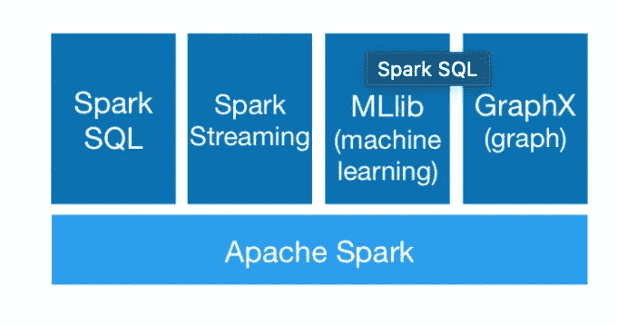
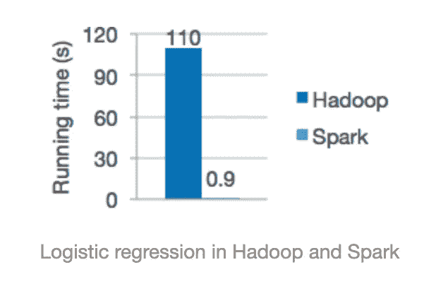
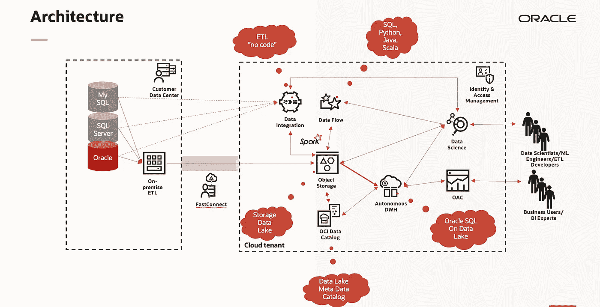
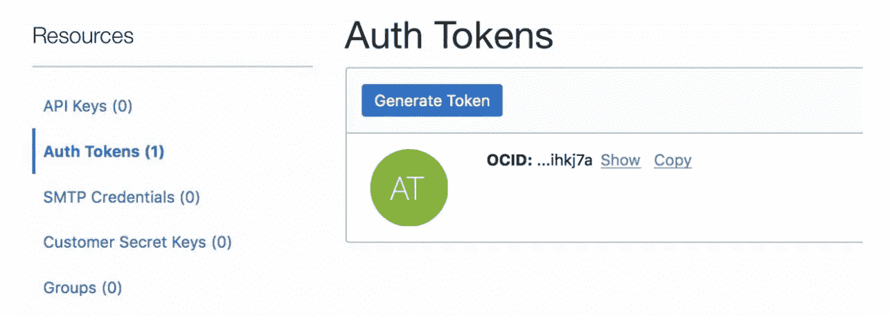
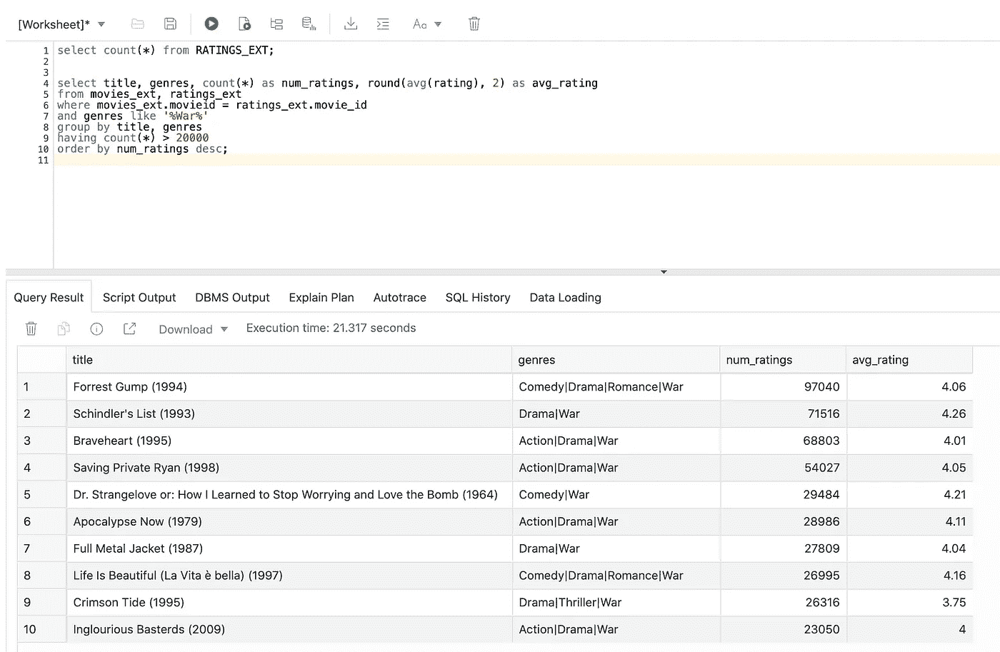

# 数据湖、Oracle ADWH 和对象存储

> 原文：<https://towardsdatascience.com/data-lakes-oracle-adwh-and-object-storage-b5ec0477e79?source=collection_archive---------53----------------------->

# 引言。

现在是 2020 年，再也没有时间使用大型昂贵的集群了。

如今，构建在云环境中的**现代数据湖**，应该尽可能多地使用**云原生的、无服务器的服务**，以获得公共云范例提供的全部**敏捷性、弹性和效率**。

在本笔记中，我想简要介绍如何使用 **Oracle 云基础设施(OCI)** 构建这样一个数据湖，以及如何使用 **Oracle 自治数据仓库(ADWH)** 为存储在数据湖中的数据提供 **SQL 访问**。

我将简要描述存储数据的最佳选择，以及提取、转换和加载数据的可用服务。然后，我将介绍启用 SQL 访问所需的步骤。

我还将提供并描述一些实用程序，它们有助于简化任务。

# 文件作为对象。

在数据湖环境中，您应该能够高效地为您的数据科学家、BI 专家和业务用户想要探索和利用的所有数据集提供弹性存储。您不应该忘记“**读取模式**”的要求:当您存储数据时，您不希望被迫指定一个模式。

**对象存储**是存储所有数据集的最佳位置。您可以将它们组织在不同的**存储桶**中，例如创建一个“原始数据区”和一个“分析就绪”区，前者存储源系统提供的数据集，后者存储所有经过验证、过滤和聚合的数据集，以备分析和数据科学家的笔记本使用。

对象存储可以根据您的需要扩展，无需任何规划，并且足够便宜(大约 25.5 美元/TB/月)来存储数 Pb 的数据。此外，您可以使用许多 OCI 功能，例如，管理文件的生命周期(您可以定义规则来归档超过一定时间的文件)，甚至添加元数据，以便更容易地找到您工作所需的数据。

# 快速浏览加工过程。

在我看来，数据湖中的处理必须使用**无服务器云服务**来完成，首选引擎应该基于 **Apache Spark** 。

Apache Spark 是**并行**、**分布式、大规模处理**的绝佳环境。这是一个完善且持久的开源项目，由[许多公司](https://spark.apache.org/committers.html)支持。您可以在几种语言(Scala、Python、Java、SQL)之间进行选择，并且您可以找到支持数据帧、流和分布式机器学习(MLlib)的库。



图 1:阿帕奇火花模块(来源:[https://spark.apache.org)](https://spark.apache.org).)。

而且， **Spark 比 Hadoop 和 MapReduce 快得多**。



图 2: Spark 表演(来源: [https://spark.apache.org)。](https://spark.apache.org).)

**在 OCI** 我们有两项服务提供基于 Spark 无服务器引擎的完整集成处理环境: [OCI 数据集成](https://www.oracle.com/integration/oracle-cloud-infrastructure-data-integration/)和 [OCI 数据流](https://www.oracle.com/big-data/data-flow/)。

有了这些服务，您可以开发快速且可伸缩的 ETL。而且，由于无服务器的特性，您只能在启动作业时指定使用的资源(CPU)。此外，您只需为执行时间付费。

第一种允许使用“无代码”方法开发数据流，使用图形用户界面。使用第二种语言，您可以基于 Apache Spark 库，以自己喜欢的语言编写代码，并拥有充分的能力和灵活性。这两者结合起来提供了你所需要的一切。

这幅图展示了一个集成了所有这些服务的架构:



图 3:数据湖架构(*图片作者*)。

Oracle Data Flow 和 OCI 数据集成等无服务器服务与对象存储相结合，可以为您提供处理和准备数据集所需的全部计算能力和存储能力。即使它们比您在大数据之旅开始时计划的要大。

# 好吧，Spark 很酷，但是我们想用 SQL。

但是，当数据准备就绪并且结构良好时，您的 BI 专家、业务用户和数据科学家可能希望**能够使用众所周知的 SQL 语言**查询这些数据。例如，使用 Oracle 分析云(OAC)构建丰富而强大的数据可视化。

Oracle Autonomous Data Warehouse(ADWH)与对象存储完美集成，为您提供了两种选择:在 ADWH 存储中加载数据，或者使用"**外部表**"并使用 ADWH SQL 查询引擎查询数据，而数据集则保留在对象存储中的存储桶中。

如果您将数据集放在对象存储上，您可以将对象存储的易用性和高效性与 ADWH 提供的 Oracle SQL 引擎的功能、健壮性和安全性结合起来。或许以后，您可以决定在 ADWH 存储中只加载那些您需要更好性能的数据。

说到这里，我想在本文的剩余部分为您提供一些建议，使访问存储在对象存储器上的文件变得容易。我还会提供一些我为自己的工作和客户开发的实用程序的链接。

# 首先是安全。

要从 ADWH 访问对象存储，您需要一组凭证:一个**身份验证令牌**。这个令牌必须存储在 DB 中，以使 SQL 代码能够访问对象存储桶。

首先，要创建令牌，请转到 OCI UI 控制台，在您的配置文件中创建(右上方的图标和用户设置)和 AuthToken:



图 4:安全访问对象存储的授权令牌(作者的*图片)。*

然后，从 UI 复制身份验证令牌。请记住在创建后立即这样做，否则，您将无法重新阅读它。

第二，将云凭证存储在 DB 中，在 SQLDeveloper 中执行这段代码；该步骤只需执行一次:

```
BEGIN DBMS_CLOUD.CREATE_CREDENTIAL( 
credential_name => 'ADWH2', 
username => 'oracleidentitycloudservice/myname', 
password => '<AUTH Token>' ); 
END;
```

注意:如果您的用户是联邦用户，那么这个名称就是完全限定的名称。它有一个前缀，如:

oracleidentitycloudservice/

# 创建外部表的 DDL。

下一步是创建“外部表”。它是存储在 DB 数据字典中的一个“定义”，允许 SQL 访问存储在对象存储桶中的文件。

在下文中，我将假设数据文件是一个 CSV 文件，并且它在第一行中包含一个带有字段名称的标题。

在我的测试中，我使用了来自 [MovieLens 数据集](https://grouplens.org/datasets/movielens/25m/)的文件。因此，其中一个文件(movies.csv)包含这种类型的记录:

```
movieId,title,genres 1,Toy Story (1995),Adventure|Animation|Children|Comedy|Fantasy 2,Jumanji (1995),Adventure|Children|Fantasy 3,Grumpier Old Men (1995),Comedy|Romance 4,Waiting to Exhale (1995),Comedy|Drama|Romance 5,Father of the Bride Part II (1995),Comedy 6,Heat (1995),Action|Crime|Thriller 7,Sabrina (1995),Comedy|Romance
```

使用提供的 Python 实用程序(参见上一节中的链接)，我已经能够生成下面的 SQL DDL 指令(再次在 SQLDeveloper 中执行):

```
BEGIN DBMS_CLOUD.CREATE_EXTERNAL_TABLE( 
table_name =>'MOVIES', 
credential_name =>'ADWH2', 
file_uri_list =>'https://objectstorage.eu-frankfurt-1.oraclecloud.com/n/emeaseitalyp/b/datalake_in/o/movies.csv', 
format => json_object('type' value 'csv', 'skipheaders' value '1'), column_list => 'MOVIEID NUMBER, TITLE VARCHAR2(4000), GENRES VARCHAR2(4000)' 
); 
END; 
/
```

一些解释:

*   **credential_name** 是身份验证令牌的名称(ADWH2，见上文):
*   **column_list** 包含一组所有列的名称/类型。数据类型是 Oracle 类型
*   **格式**这里指定第一行包含列名(表头)
*   **文件 uri 列表**包含访问对象存储器中文件的 URL。

这是 URL 的格式:

> https:///n/<namespace>/b/<bucket name="">/o/
> 
> # 查询数据。
> 
> 创建外部表后，我可以使用 SQL 语言的全部功能来提取我需要的所有信息。
> 
> 例如，再次从 MovieLens 数据集，假设我想知道什么是最高评级的**战争片**。
> 
> 使用 SqlDeveloper，大约 20 秒钟，我就能得到结果:
> 
> 
> 
> 图 SQL 查询的结果(作者的*图片)。*
> 
> # 链接到 Python 实用程序代码。
> 
> 编写 DDL 代码来创建外部表有点无聊，而且容易出错。
> 
> 为了帮助完成这项任务，我准备了一个 **Python 实用程序**，它可以读取 CSV 文件(只有前 N 行)，理解数据类型，并在标准输出中打印 DDL，准备好进行复制和执行。
> 
> 你可以在我的 GitHub 仓库中找到这个工具的最新版本:[https://github.com/luigisaetta/adw_external_tables](https://github.com/luigisaetta/adw_external_tables)。
> 
> 希望您会发现它很有用，**祝数据科学**愉快。
> 
> *原载于 2020 年 10 月 27 日*[*https://luigisaetta . it*](https://luigisaetta.it/index.php/others/50-oracle-autonomous-dwh-and-object-storage-2)*。*</bucket></namespace>