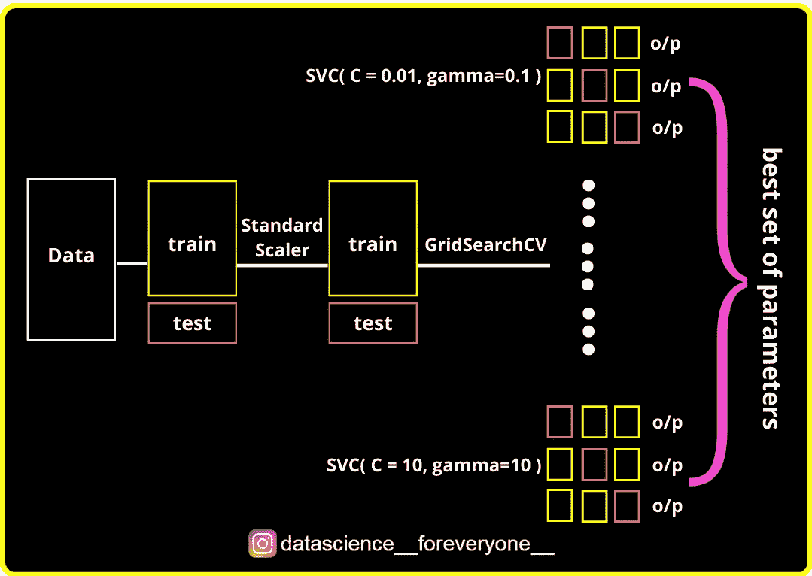
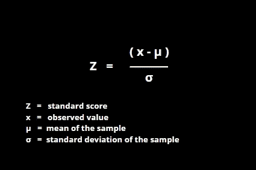
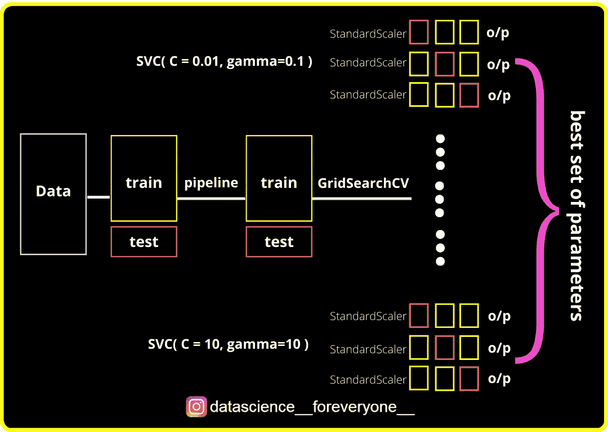

# 超参数调整的数据泄漏

> 原文：<https://towardsdatascience.com/data-leakage-with-hyper-parameter-tuning-c57ba2006046?source=collection_archive---------34----------------------->

## 超参数调优有时会打乱您的模型，并导致对看不见的数据产生不可预测的结果。

作者图片

# 介绍

D **数据泄漏**是指模型在其训练阶段不知何故知道了测试数据中的模式。换句话说，你用来训练最大似然算法的数据恰好包含了你试图预测的信息。

数据泄漏阻碍了模型的推广。数据科学家很难识别数据泄露。数据泄露的一些原因是

*   分割前使用中心值处理异常值和缺失值
*   在划分为培训和测试之前，对数据进行缩放
*   使用训练和测试数据训练您的模型。

**超参数调整**是寻找提供最佳性能的 ML 算法的最佳超参数集的过程。

关于超参数和调优技术的更多信息，请参考我以前的文章。

 [## 4 种超参数调整技术

### 每个数据科学家都应该知道的流行超参数调整技术

medium.com](https://medium.com/swlh/4-hyper-parameter-tuning-techniques-924cb188d199) 

大多数超参数调整技术使用交叉验证来选择最佳超参数集。交叉验证将数据分成训练测试集，在训练集上用不同的超参数集建立不同的模型，并在测试集上验证性能。最终，它会选择最佳的参数组合来获得最高的性能。

但是，当我们使用网格搜索、随机搜索等交叉验证的调整技术执行缩放、输入等预处理步骤时，会导致数据泄漏。

让我们用代码更详细地理解这一点。

在上面的代码中，我首先对训练数据执行缩放(StandardScaler **)** ，然后使用支持向量分类器作为*估计器和 cv =* 3 *即* 3 重交叉验证来训练我的 GridSearchCV。使用三重交叉验证，训练数据将分成 3 组，在每组中，它进一步分成 2 组作为训练集，1 组作为测试集。对于具有唯一参数集的每个模型，将在训练集上进行训练，并在测试集上进行评估，稍后将评估分数并丢弃模型。这一过程对所有 3 组继续进行。

作者图片

这里的模型在训练时受到了测试集中的数据的影响(数据泄漏),数据是用 StandardScaler 操作泄漏的。标准标度/ z 分数通过平均值和标准差计算得出。

作者图片

在网格搜索之前，对列车数据进行了缩放(**平均值和标准缩放器的标准差根据列车数据**进行计算，然后通过交叉验证将列车数据分成列车&测试组。用于训练/拟合算法的训练组已经有了关于测试组的信息(即训练数据的平均值和标准差，它是训练&测试组的组合)。这就是超参数调优发生数据泄漏的原因。

# 解决办法

这种情况下数据泄露的解决方案是**管道。**

一个**管道**被用来帮助自动化机器学习工作流，如缩放、降维、模型拟合和验证等。它基本上在机器学习过程中采取多个步骤，并将其组合成单个对象，这使得开发和使用以及保存和以后重用都变得更容易。

我们先来了解一下 pipeline 是如何用代码解决数据泄露的。

在上面的代码中，我将 StandardScaler 和 SVC 与 pipeline 一起使用，然后将 pipeline 对象传递给 cv = 3 的网格搜索。

作者图片

在这种情况下，数据首先被分成 3 组(cv=3)，即 2 个训练组和 1 个测试组。在每个组上，将执行缩放。所以，这里没有数据泄露。

这样，我们可以成功地避免数据泄漏。

# 结论

使用交叉验证技术进行超参数调整时，应注意数据泄漏。在这种情况下，使用管道将有助于避免数据泄漏。

# 感谢您的阅读！

非常感谢您的任何反馈和意见！

你可能喜欢我的其他文章，

 [## 超参数调整的数据泄漏

### 超参数调优有时会打乱您的模型，并导致对看不见的数据产生不可预测的结果。

towardsdatascience.com](/data-leakage-with-hyper-parameter-tuning-c57ba2006046)  [## Python 中的“是”和“==”

### 加快字符串比较的速度

medium.com](https://medium.com/swlh/is-and-in-python-f084f36cbc0e)  [## 4 种超参数调整技术

### 每个数据科学家都应该知道的流行超参数调整技术

medium.com](https://medium.com/swlh/4-hyper-parameter-tuning-techniques-924cb188d199)