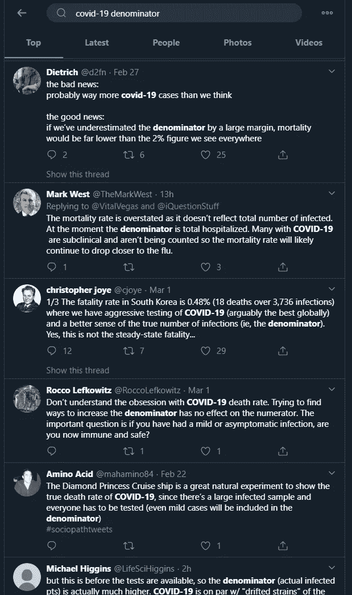

# 通过新冠肺炎进行数据扫盲

> 原文：<https://towardsdatascience.com/data-literacy-via-covid-19-38965538f390?source=collection_archive---------34----------------------->

## 有些人在没有意识到的情况下快速学习数据科学

照片:兰迪·欧

这些天，当[尽我所能不碰我的脸](https://apic.org/wp-content/uploads/2019/12/Dont-touch-your-face_FINAL.pdf)的时候，我在看着这个世界上的人上基础数据分析的速成班。由于教授数据素养是我工作的一大部分，我更加关注人们在日常生活中学习数据。是的，我应对充满越来越多不确定性和风险的时事的方法是说“看！这是学习的时刻！”

我希望我知道这是谁造成的，但我记得在这些情况下听到了一些被证明是真实的事情:*普通人并不愚蠢，他们只是非常没有动力去学习那些似乎与他们无关的事情。但是在危机时刻，比如癌症诊断[或者即将来临的疫情]，人们可以很快成为专家。*

我记得当我有一个个人医疗问题，需要一个低风险的常规手术。确诊后不到 24 小时，我就一头扎进了描述预后、治疗方法及其风险评估等的医学论文中。有了正确的动机，在堆积如山的信息中跋涉是很容易的。

现在，新冠肺炎为世界许多地方提供了学习流行病学和病毒学的巨大动力。虽然他们可能没有意识到这一点，但这些人正在学习许多优秀科学的基础知识:理解数据是如何收集的，并接受我们寻求的知识只能通过近似和代理来获得。

我发现非常有趣的是，很多很可能没有接受过数据处理培训的人是如何学习这些东西的。这给了我很大的希望，努力提高人们的数据素养是对时间的有效利用，因为很容易证明，在适当的条件下，许多人可以“获得它”。

# 这一切都要感谢伟大的科学传播者

现在互联网上有很多恐慌和错误的信息。所以我今天指出的很多东西实际上是医学领域各种专家的工作，他们尽最大努力用好的信息抵消坏的信息。

我愚蠢地没有跟踪所有的推文和人，所以我借用了一个消息灵通的朋友的声誉良好的科学人士的名单来关注这个问题:[@ Helen branswell](https://twitter.com/HelenBranswell)[@ Angie _ Rasmussen](https://twitter.com/angie_rasmussen)[@ aetoiology](https://twitter.com/aetiology)[@ marynmck](https://twitter.com/marynmck)[@ cmy eaton](https://twitter.com/cmyeaton)[@ mlipsitch](https://twitter.com/mlipsitch)[@ statnews](https://twitter.com/statnews)。

所说的朋友可能想在我的简讯中保持匿名，但他们知道他们是谁！

# 给我们分母！

一个例子是计算经常被引用的“死亡率”，粗略估计约为 1-3%，这使得这种疾病类似于 1918 年的西班牙流感。这个数字本质上取决于分母，每个人都承认，由于症状可能非常轻微，新冠肺炎感染的总人数被低估了。

也就是说，从我对这个话题的理解来看，网上人们随便称之为死亡率的说法更接近于[病死率](https://en.wikipedia.org/wiki/Case_fatality_rate)，即死亡人数/确诊人数。死亡率(典型的“每 1000 人中有 1 人死于 X 原因”)是一个太滞后的统计数据。我们要到几个月后才能知道新冠肺炎是否在全因死亡率方面有所进展。

*有趣的一面注意到* [*一些参考文献*](https://www.npr.org/templates/story/story.php?storyId=5222069) *表明，1918 年的大战促使审查人员早在 1916 年就压制了流感杀死士兵的新闻，而西班牙只是碰巧没有参战，因此没有像其他国家一样压制人们如何死于流感的新闻。流感病毒株的真正起源显然仍在争论中。*

正如你所看到的，很多人突然对分母感兴趣，因为现在这个暗示你未来死亡率的可怕数字是高估还是低估非常重要。

许多数据科学工作都是关于使用分母，并在得出结论之前理解比率的分母意味着什么。人们正直接看到这一过程有多混乱，因为他们想知道“真实数字”，但由于测量/定义问题，他们完全无法获得它，这让他们感到沮丧。在他们看来，真实的死亡率存在于柏拉图的空间中，但由于测量的原因，它是不可接近的。

# 查看发行版

我们很多人都知道，平均值隐藏了很多东西。这一点即使对外行人来说也是显而易见的，尤其是当人们很容易假设人口中的某些部分会对自变量做出不同的反应时。我们在关于弱势人群和不同病死率的讨论中看到了这一点，特别是在老年人和已有健康问题的人群中。

你也可以看到人们开始把他们对统计数据中定义的理解用于解释官方公布的统计数据。

就像上面那条关于 20 岁以下的病例低并不意味着该年龄组的实际感染率低，而是可能存在与被测试者的阈值之间的相互作用。然后你可以得出一个初步的结论，相对于老年人，年轻人受疾病的影响较小。

# 坚持教授数据素养！

数据科学是沟通，我知道随着组织内人员的流动，不断教授各种形式的数据知识有时是一种负担。人们很容易感觉到，似乎有永无止境的人在不顾一切地进行劣质数据分析，以符合选定的议程。但是振作起来，大多数人可以很快学会这些东西。

*本文原载兰迪的* [*计数玩意儿通迅*](https://counting.substack.com) *。每周在你的收件箱里免费收到这样的帖子。*