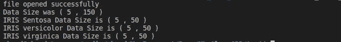
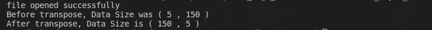
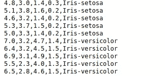
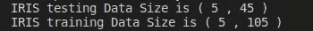

# 使用 C++进行机器学习数据操作

> 原文：<https://towardsdatascience.com/data-manipulation-using-c-389d6c4493b1?source=collection_archive---------40----------------------->

## 关于如何使用 C++实现机器学习基础的工作代码教程

克里斯·利维拉尼在 Unsplash 上的照片

**数据操作**是改变数据使其更容易阅读或更容易处理的过程。在开始模型构建之前，数据操作通常用于机器学习，作为数据预处理的一部分，也在模型构建期间将数据转换成更适合处理的形式。

在下面的文章中，我们将简要介绍 C++中各种数据操作 API 的实现。

*   按类拆分数据。
*   二维向量转置。
*   二维向量随机化。
*   数据分为训练数据和测试数据。

这篇文章是解决机器学习算法在 C++中实现的系列文章的一部分，在整个系列中，我们将使用 C++特性实现基本的机器学习算法。

*   [什么时候应该学习使用 C++的机器学习？](https://medium.com/ml2b/when-should-you-learn-machine-learning-using-c-6edd719f95ff?source=friends_link&sk=8b66a55c047b99bbd1c720e59fe6a770)
*   [c++中的数据预处理和可视化。](/data-preprocessing-and-visualization-in-c-6d97ed236f3b?source=friends_link&sk=d13cdabff65a5ce56b717835108615ab)
*   [使用 C++进行机器学习数据操作。](/data-manipulation-using-c-389d6c4493b1?source=friends_link&sk=b16fffc79fcdfbd63f60d919eb86d835)
*   [使用 C++](/naive-bayes-implementation-from-scratch-using-c-51c958094041) 从零开始的朴素贝叶斯。
*   [线性回归在 C++中的实现](https://medium.com/swlh/linear-regression-implementation-in-c-acdfb621e56)。
*   每个 C++开发人员必读的 8 本书。
*   [每个机器学习开发者必读的 9 本书。](https://medium.com/ml2b/the-9-books-each-machine-learning-developer-must-read-e6ef8c0fb384)

这里我们将使用可用的虹膜数据集。

# 按类别划分数据:

正如我们在上一篇文章中讨论的，我们将使用 Iris 数据集作为我们的数据的例子。我们从读取文件中的虹膜数据开始。

从 iris.data 文件加载数据集

如果您不熟悉这行代码，请阅读本文。

 [## C++中的数据预处理和可视化

### 关于如何使用 C++实现机器学习的基本功能的工作代码示例

towardsdatascience.com](/data-preprocessing-and-visualization-in-c-6d97ed236f3b) 

我们现在需要实现一个函数，我们可以给它一个向量和一个标签，它会过滤出值，并返回一个包含这个标签的元素的向量。

这个函数的实现并不复杂:

*   首先，我们需要遍历二维向量中的每个元素，并将每个标签与需要的标签进行比较。
*   其次，我们将这些向量推入新的输出向量并返回。

按类拆分数据集

前面代码的注释:

*   我们使用了一个 lambda 表达式来完成函数中的所有重要工作，你会注意到，比较和存储是在 lambda 表达式中进行的。
*   当试图存储数据时，我们使用一个向量，并将该向量推回到输出向量中。这改变了数据形状，因为当我从文件中加载数据集时，我使用的格式是将每个特征加载到一个单独的矢量中，然后通过将这些矢量放入一个二维矢量中来创建数据集矢量。

输入向量中的数据格式

转置功能之前的数据格式

*   扩展之前的注释，这需要我们在收集数据后转置向量。

现在，我们可以使用这个 API 来检查数据大小:

按类拆分数据的函数的用法

先前数据拆分代码的输出

# 二维向量转置:

在上一节中，我们使用了一个二维向量转置，但是这个函数不是一个标准函数。如前所述，在我们的实现过程中，数据格式需要多次更改，因此我为此创建了一个单独的函数。

转置功能实现

如你所见，向量转置是一个简单的操作。您只需从索引为[i][j]的向量中读取数据，并将其存储在索引为[j][i]的向量中。

检查移调前后的数据大小

移调示例的输出

虽然这个操作很简单，但它将大大简化我们的实现，原因是，有时我们需要将数据作为一个整体来处理，而在某些情况下，我们需要将数据作为整个特性的值的样本来处理。

# 数据随机化:

在分割任何数据之前，通常最好先随机化数据。我们不希望所有的训练数据都来自同一类型。

例如，如果您研究 Iris 数据集，您会发现来自相同类型的数据被分组在一起，这可能会导致您在 Iris-Sentosa 数据上训练您的模型，然后在 Versicolor 数据上测试它。

Iris 数据集包含分组在一起的相同类型的数据

为了解决这个问题，我们需要在拆分之前添加一个随机化步骤。

使用 random_shuffle 的向量随机化

请注意，根据 random_shuffle [文档](http://www.cplusplus.com/reference/algorithm/random_shuffle/)，这个函数是一个模板，这就是为什么我在使用它之前转置了二维向量，以每次处理一个样本，这将确保样本数据不会混合在一起。

随机化代码的输出

# 训练数据和测试数据分割:

机器学习中最重要的步骤之一就是数据拆分。

 [## 关于机器学习中训练、验证和测试集

### 这旨在为任何需要了解各种数据集分割之间的差异的人提供一个简短的入门指南，同时…

towardsdatascience.com](/train-validation-and-test-sets-72cb40cba9e7) 

这是一个如何在 C++中实现数据拆分的例子。

训练和测试数据拆分的实现

测试和训练数据拆分的调用

拆分后的数据大小

如果你对这些函数的数据输出感兴趣，可以查看这个[链接](https://gist.github.com/ahmhashesh/ddde5f4fd07913e30dd09a85c0384d9b)

把所有这些代码一起修改，我们会发现，矢量转置是这些功能中的重要一步。所以我们必须注意这一步的优化。

毕竟，数据操作就是如何在 C++中处理向量，并把你需要做的事情分成小步骤。

想回忆一下吗？

这篇文章是解决机器学习算法在 C++中的实现的系列文章的一部分，在整个系列中，我们将使用可用的 Iris 数据集[这里](https://archive.ics.uci.edu/ml/datasets/iris)。

*   [什么时候应该学习使用 C++的机器学习？](https://medium.com/ml2b/when-should-you-learn-machine-learning-using-c-6edd719f95ff?source=friends_link&sk=8b66a55c047b99bbd1c720e59fe6a770)
*   每个 C++开发人员必读的 8 本书。
*   [c++中的数据预处理和可视化。](/data-preprocessing-and-visualization-in-c-6d97ed236f3b?source=friends_link&sk=d13cdabff65a5ce56b717835108615ab)
*   [使用 C++进行机器学习数据操作。](/data-manipulation-using-c-389d6c4493b1?source=friends_link&sk=b16fffc79fcdfbd63f60d919eb86d835)
*   [使用 C++](/naive-bayes-implementation-from-scratch-using-c-51c958094041) 从零开始的朴素贝叶斯。
*   [线性回归在 C++中的实现](https://medium.com/ml2b/linear-regression-implementation-in-c-acdfb621e56)。

希望这篇文章对您有用，请关注本系列新文章发布时的通知。

您可能也会觉得这些文章很有趣:

 [## 所以你以为你掌握了 C 编程！！！

### C 语言中改变你想法的 5 个技巧…

medium.com](https://medium.com/ml2b/so-you-think-you-have-mastered-c-programming-caecc56a587f)  [## 压缩变换简介

### 长时记忆模型和近期工作综述

medium.com](https://medium.com/ml2b/introduction-to-compressive-transform-53acb767361e)