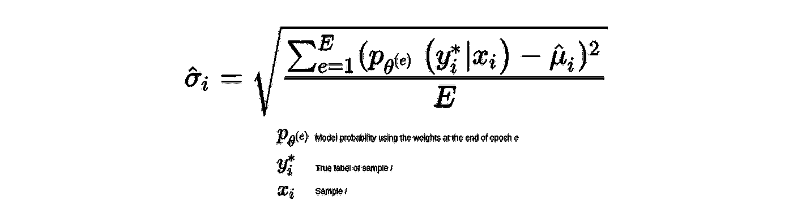
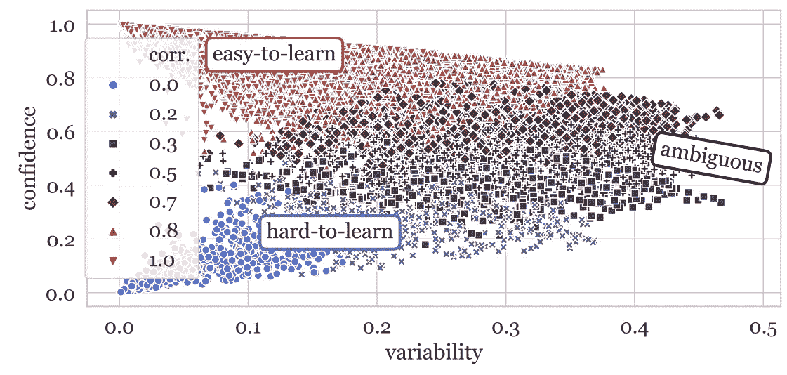
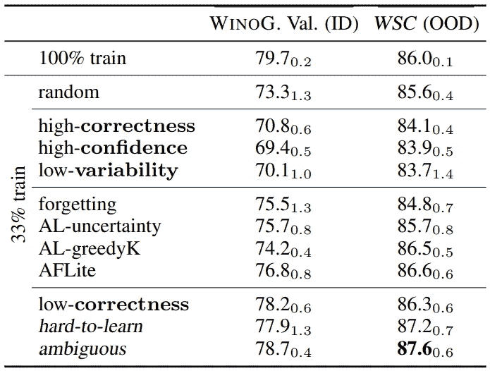
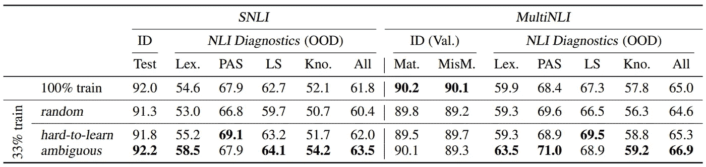
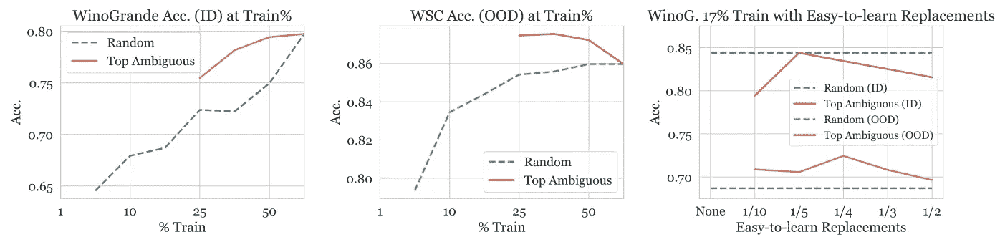
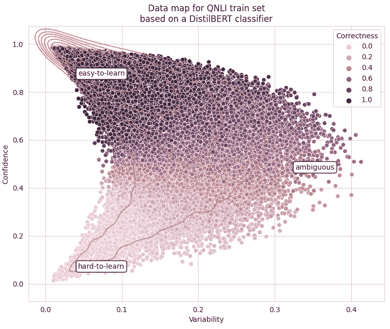

# 数据地图:数据集也可以被提炼

> 原文：<https://towardsdatascience.com/data-maps-datasets-can-be-distilled-too-1991c3c260d6?source=collection_archive---------31----------------------->

## *TL；DR:这篇帖子是关于论文* [*数据集制图:用训练动力学*](https://arxiv.org/abs/2009.10795) *绘制和诊断数据集，以及在 TensorFlow 2 中的实现。*

*链接:
论文:* [*数据集制图:用训练动态对数据集进行制图和诊断*](https://arxiv.org/pdf/2009.10795.pdf) *笔记本:*[https://github.com/eliorc/Medium/blob/master/datamaps.ipynb](https://github.com/eliorc/Medium/blob/master/datamaps.ipynb)

一周前，我在工作场所的一个空闲频道上看到了一篇有趣的论文。不要误会我的意思，我略读了很多论文，但有些确实引起了我的注意，让我继续尝试。
我在这里写的论文是[数据集制图:用训练动力学绘制和诊断数据集](https://arxiv.org/abs/2009.10795)。我发现这篇论文的有趣之处在于，它挑战了训练数据时“越多越好”的常见方法，并将重点从数据的*数量*转移到数据的*质量*。在这篇文章中，我将回顾这篇文章，并以一个 TensorFlow 实现结束。

## 行动纲要

本文创新性地提出了为训练数据集中的每个样本计算*训练动态*(称为置信度、可变性和正确性)的方法。使用这些，我们可以诊断我们的数据集，目的是将数据集提取到一个更小的子集，具有很少或没有**内分布*** 性能损失和更好的**外分布*** 性能，这意味着更好的泛化能力。
该方法不知道数据的类型，但是特定于通过基于随机梯度的方法(基本上任何分类神经网络)优化的分类器。

这篇文章继续探索作为不确定性度量的训练动态，并使用训练动态来检测错误标记的样本。这两个板块我在这篇文章里就不说了。

***内分布—** 训练/测试数据取自同一分布
* **外分布** —训练和测试来自不同的分布

# 使用训练动态创建数据地图

本文给出了三个度量标准，即置信度、可变性和正确性，它们都是为训练集中的每个样本计算的。这些指标是在以下列方式训练模型时收集的。
在每个时期之后，在没有梯度更新的情况下，对训练集进行全面检查，并且保存每个样本的真实标签的概率。
然后，一旦训练结束，对于每个样本，我们将有一个大小为 E(时代数)的向量。

**置信度**被定义为跨时期的平均真实标签概率:


**可变性**被定义为跨时期的真实标签概率的标准偏差:



**正确性**是最直观的指标，定义为样本在不同时期被正确标记的次数。这个度量可以被认为是样本在不同时期的准确性。

一旦我们为每个样本收集了这些指标，我们就可以绘制一个“数据图”。
绘制数据图，作者将样本分为三组，**易学的**样本是变异性低、置信度高的样本。**难学习的**样本是可变性低、置信度低的样本，最后，**不明确的**是可变性高的样本。



SNLI 训练集的数据图，基于 RoBERTA-large 分类器。摘自原论文

## 使用提取数据集的实验

一旦数据图准备好了，作者就以下面的方式设置实验。选择模型并为其定型集创建数据映射。然后创建 7 个不同的数据集:

1.  **100%训练**:所有数据集
2.  **随机** : 33%随机选择的样本
3.  **高信心**:高信心样本的 33%
4.  **低可变性** : 33%的低可变性样品
5.  **高正确率**:高正确率样本的 33%
6.  **低正确性**:低正确性样本的 33%
7.  **不明确** : 33%的高可变性样品

一旦不同的分割准备就绪，它们就在不同的训练集上训练相同的模型，同时在相同的集上进行评估。以下是 RoBERTA-large 在 WinoGrande 数据集(训练和验证)上作为分布内(ID)数据集和 WSC 数据集作为分布外(OOD)数据集的结果。它们还与其他相关作品进行了比较:



论文中的结果

性能提升不是很大，但考虑到这表明你可以使用 33%的数据实现相同的 ID 性能，甚至更好的 OOD 性能——这在处理非常大的数据集时可能非常显著(有人说 GPT-3？)并提供了一种将数据集缩小的方法。此外，这些实验揭示了歧义样本的属性，其本身导致更好的泛化和相同的 ID 性能，而训练成本为 33%。

以下是更多的结果:



论文中的结果

## 不同样品组的作用

作者继续进行另一组实验，测试多少模糊才算足够。由于在上一节中我们看到，在保持 ID 性能的同时，模糊样本是对 OOD 性能贡献最大的样本，因此自然的问题是，对于来自训练集的模糊样本的分数，我们可以达到多低。

作者尝试了从 50%到 1%的不同歧义百分比，并观察了在 ID 和 OOD 集上的性能。他们得出的模棱两可的样本太少，而且模型不收敛。
为了应对这种情况，他们尝试用易于学习的样本交换一些不明确的样本，并观察到这些交换(用大多数不明确的样本和一些易于学习的样本构建训练集)产生了收敛性和性能。他们接着得出结论，尽管模糊样本的作用对于泛化很重要，但包含一些易于学习的样本对于收敛也很重要。
结果:



论文中的图 3:左边和中间是 ID 和 OOD 性能，与随机相比，模糊样本的百分比不断增加。右边是 17%的歧义样本，以及不同比例的简单易学的替换样本。所有结果是 3 个随机种子的平均值。

## 我的看法

从我的角度来看，我首先要说的是，发现一个我以前从未接触过的新的信息来源——训练动力学——非常有趣。实际上，模糊样本的概念和创建具有更好概括能力的模型基本上是实用 ML 的全部内容，所以尽管不像一篇关于新奇的异国建筑的文章那样“性感”,我认为这项工作和基于它的工作非常重要。数据集越来越大的趋势只会继续，因为我们总是在收集数据。随着时间的推移，构建高质量数据集的能力将变得更加重要。最后，拥有另一个工具来构建更好地概括的模型是非常相关和重要的，并且使它更有趣的是，这个工具是关于数据的，而不仅仅是模型。

# 在 TensorFlow 2 中创建数据地图

由于我发现这篇文章很有趣，我不得不亲自尝试一下。正如我的一些读者可能已经知道的那样，无论我为 TensorFlow 构建什么样的模块，并且我认为它在不同的数据科学应用程序中都是有用的，我都保存在我的经过测试和记录的 PyPI 包中— [](https://github.com/eliorc/tavolo)`[tavolo](https://github.com/eliorc/tavolo)`。

为了试验数据映射，在`tavolo`中，我创建了一个回调函数来计算创建数据映射所需的所有指标。你可以在我的 [Github](https://github.com/eliorc/Medium/blob/master/datamaps.ipynb) 里看到完整的笔记本，用法相当简单。

在我的实验中，我采用了一个 [DistillBERT 模型](https://huggingface.co/transformers/model_doc/distilbert.html)，并将其应用于 [QNLI 数据集](https://www.tensorflow.org/datasets/catalog/glue#glueqnli)。
回调和训练力度计算的用法相当简单:

```
import tensorflow as tf
import tavolo as tvl # Load data
train_data = ... # Instance of tf.data.Dataset
train_data_unshuffled = ... # Another instance of the train_data
                            # without shufflingmodel = ... # Instance of tf.keras.Model# Creating the callback
datamap = tvl.learning.DataMapCallback(train_data_unshuffled)# Training
model.compile(...)
model.fit(train_data, callbacks=[datamap], ...)# Access training dynamics
confidence = datamap.confidence  # This is a numpy array
variability = datamap.variability  # This is a numpy array
correctness = datamap.correctness  # This is a numpy array# Plot datamap
...
```

使用 DistillBERT 模型在 QNLI 数据集上运行这段代码，得到了下面的数据图(取自[笔记本](https://github.com/eliorc/Medium/blob/master/datamaps.ipynb)



就是这样:)我希望你喜欢阅读，并学到了一些新的✌️