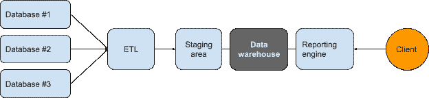
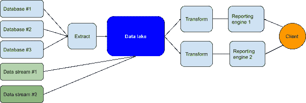
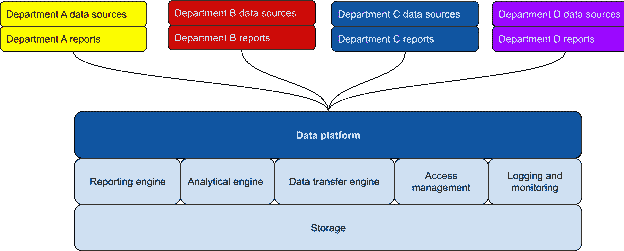
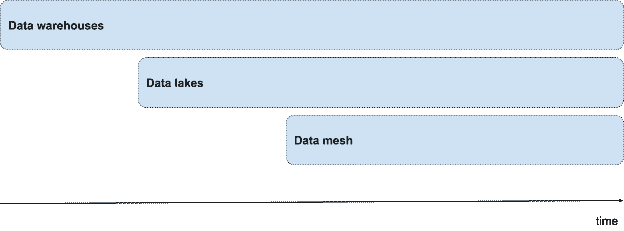

# 数据网格(不是服务网格)

> 原文：<https://towardsdatascience.com/data-mesh-not-a-service-mesh-1a4a315193b3?source=collection_archive---------36----------------------->

## 当今业务的发展速度要求数据架构不断发展——从仓库到数据湖再到数据网格。

数据科学

Olena Domanska 的宝贵意见。

# 长话短说

如何正确管理业务数据？这是保险、银行、制药、工业、建筑等所有行业都必须回答的问题。

组织中[数据管理](https://www.avenga.com/our-expertise/data-services/)的有效性对组织绩效和更好的战术和战略规划有着直接的影响。

本文描述了业务组织中数据的基本方法的演变以及最新的趋势—数据网格。

# 数据仓库时代

数据仓库已经有 40 多年的历史了。从今天的角度来看，这个想法很明显。关系数据库针对读取和修改小块数据的数十亿个短事务进行了很好的优化，但不适合长时间运行的分析查询。

需要一个不同的存储和数据引擎，于是数据仓库系统诞生了。

传统上，数据仓库针对事实进行了优化，为预期要执行的一组查询提供了维度。一个典型的经典例子是给定时间段内每个分支机构的月度销售报告。

数据仓库最常见的数据摄取场景是提取-转换-加载(ETL): **E** 从源数据库提取数据， **T** 转换数据(清理、初始过滤和聚合)，然后 **L** 将数据加载到仓库存储中。很经典，不是吗？

提取-转换-加载(ETL)方案

作者对威尼斯湾的想象

# 数据湖的故事

数据仓库是为特定的目的而创建的，它们很好地服务了这个目的。当业务需求发生重大变化时，问题就出现了，即使在早期阶段，转换也开始带来伤害而不是帮助，因为它们是针对不同的、现在已经过时的业务场景进行优化的。

如果领域是众所周知的，并且分析需求是众所周知的和稳定的，那么这是一个有效的方法。但是商业的速度、更多的非关系数据来源以及动态变化的分析需求都被现代机器学习技术加速了。

此外，数据仓库开始成为一个问题，因为它们的模式很强，一旦装满了万亿字节的数据，就很难改变。

另一个问题是，不同的业务用户组，根据他们特定的报告和分析需求，使用不同的供应商和分析系统创建了他们自己的带有 ETL 机制的仓库。原始数据和转换后的数据都存储在不同的系统中，因此在不同的部门级别上产生了数据孤岛。

IT 部门对此感到很不舒服。需要将组织的所有数据放在一个中心位置，由一个中心团队管理，并采用未经修改的原始格式，以便以后进行任何转换，这导致了数据湖的流行。

数据湖方案

# 好人

您可以 **E** xtract， **L** oad，然后 **T** 转换(ELT)数据，以实现您当前和未来的分析目标。数据湖在一个集中的位置提供来自所有业务领域和组织所有部分的数据。分析师可以用以前似乎不可能或太难的方式加入数据并从中提取信息。数据是原始格式，因此在此过程中不会丢失任何东西，也不会破坏任何信息。

消费者可以决定他们现在和将来如何从湖中存储的数据中受益。IT 部门可以添加新的数据源并填补数据湖。

不同的视图和访问机制由中央团队管理，因此，尽管数据位于一个位置，也能防止未经授权的访问。

此外，数据流技术支持实时报告和持续接收数据湖。数据湖的适当设计使基于云的工具能够从数据中推断出模式，并在其上运行复杂的查询，我们可以将这些工具视为半自动数据仓库，但是是现代的、灵活的版本。

# 坏事

好了，我们把所有的数据都放在了一个地方，但是这些数据意味着什么呢？将数据存储在一个位置并不会使它更容易理解。例如，数据呈指数级增长。在没有正确理解数据的哪些部分重要，哪些部分不重要的情况下，我们如何处理这种数据洪流？

一切都是“以防万一”存储的——但“万一”是什么呢？

原始格式也没有帮助，因为如果数据消费者想要做任何事情，向更文明的格式的转换必须由数据消费者自己来执行。

它不再是一个干净、结构化和定义良好的数据仓库。数据工程师通常与业务团队隔离，与业务领域和数据知识隔离。此外，所有部门都依赖于一个数据工程师团队。

# 数据网格——微服务革命的教训

对新方法的需求导致了数据网格模式。

事务性系统发展成了微服务，但在数据领域，集中化占据了主导地位。打破企业应用程序的铁板一块已经成为一个新的口号，但是数据呢？数据湖可以被看作是一个数据块。打破它怎么办？如何将领域驱动架构原则也应用于数据呢？

数据流和数据集归用户所有；它是原始数据，而不是来自源数据库的运营数据。它可以被转换以创建业务领域的联合聚合视图。附属于商业专家的独立团队现在可以更深入地理解数据的含义，以便创造更好的见解和预测。

这是否意味着逆转潮流，把老问题带回来？不——如果处理得当的话。

# 数据作为一种产品

数据作为一种产品，意味着一个产品团队，一个产品路线图，适当的管理和开发管道。从用户的角度来看，这意味着更好的数据可发现性、自助服务(即文档、示例、模式)和自治。

必须创建一个数据平台，作为一组模式、约定、工具和基础设施(即存储、事件、监控)，以使数据用户能够专注于他们的目标，并帮助避免过去不可维护的数据孤岛。数据体验对于数据科学家和业务用户来说起着至关重要的作用。

从 IT 角度来看，团队不需要决定存储机制。分布式数据所有权模型并不意味着在物理上分离数据。

这是数据民主化的真正开始，而不会失去 It 治理。

数据平台结构

# 已知挑战

在这种方法中，数据是分离的，而不是集中的。创建数据孤岛并(再次)失去组合来自不同领域的数据的能力有多容易？解决方案是数据平台组件和通信机制的适当标准化。

技术挑战也在这里。在微服务领域，Kubernetes 占据了主导地位，并成为事实上的标准，但在数据领域，它更加分散，不够成熟。在数据网格中出现类似的情况需要几年时间，就像我们现在在企业应用程序世界中一样。

# 最后的话

数据仓库、数据湖和数据网格

数据网格、数据湖和数据仓库将继续共存。

例如，最新的云数据服务系列支持使用现有的数据湖，并在其上构建现代化的半自动数据仓库，从数据中推断模式，并支持复杂的查询功能。

如果您当前的数据湖或数据仓库解决方案正在实现您的目标，那么很难证明投资迁移到数据网格体系结构来满足您的数据需求是合理的。一些首席信息官或首席债务官甚至声称他们已经拥有数据网格架构多年，但没有使用新的名称。

我也听到了支持 IT 部门严格控制数据的声音；他们不愿意在这种范式下建立这样一个平台。

这一次，传统的“如果有效，就不要修复它”的态度是目前最好的策略。

然而，没有什么能阻止 Avenga 公司密切关注这一趋势和支持工具，并在新的领域尝试这种方法，以了解其全部价值。