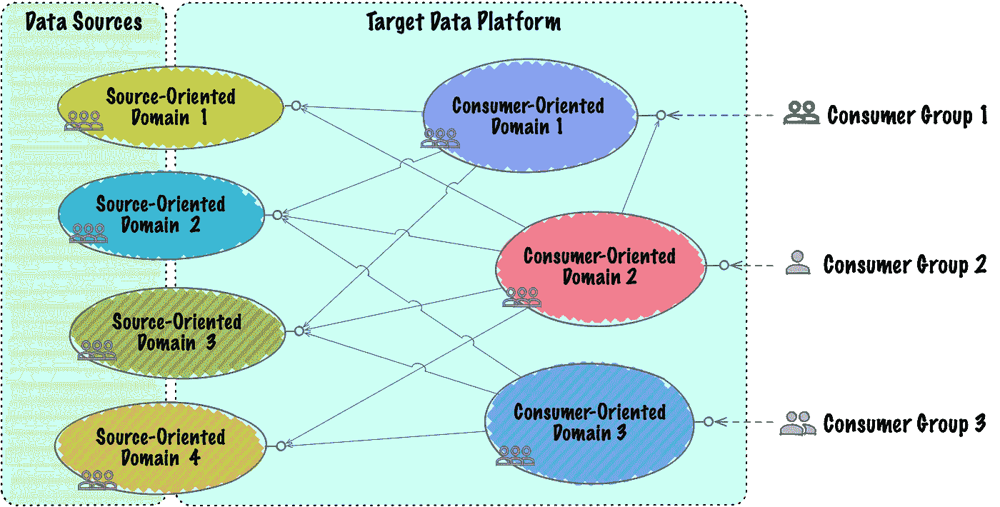
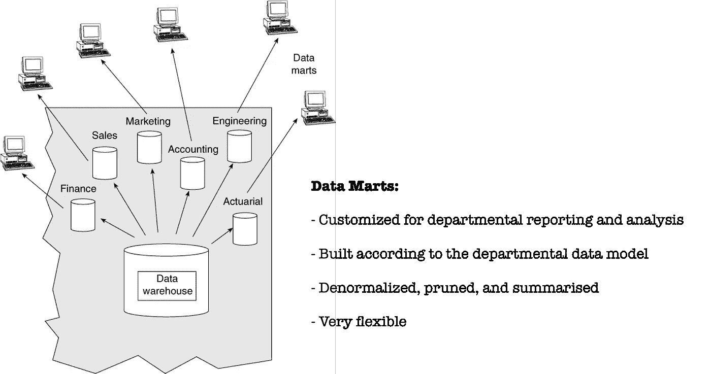
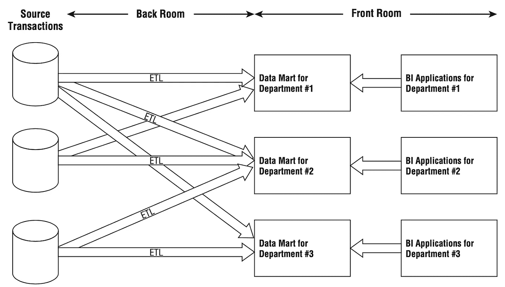

# 数据网格痛点

> 原文：<https://towardsdatascience.com/data-mesh-pain-points-b4bebca37357?source=collection_archive---------17----------------------->

## [意见](https://towardsdatascience.com/tagged/opinion)

## 为什么在实施数据网格之前要三思

# 介绍

最近，在数据平台架构领域，引入了一个名为**数据网格**的新概念/范式。它假装推动一种新的架构方法来构建分析解决方案，这种方法通常被视为尖端、新奇的方法，并且已经开始被一些组织采用。

尽管事实上，Zhamak Dehghani 带来了许多伟大的思想，背后有着体面的推理(原文是[这里是](https://martinfowler.com/articles/data-monolith-to-mesh.html))，但我看到了严重的担忧，阻止我推荐它应用于大多数数据分析平台。

# 数据网格概念摘录

数据网格架构非常广泛，涵盖了数据分析平台的不同方面，但我想集中讨论两个方面，在我看来，这两个方面非常重要，值得深入研究:

*   **面向领域的数据分解** —将单一数据平台分散到一组面向领域的数据集中。域需要以一种易于使用的方式托管和服务它们的域数据集。
*   **面向领域的数据所有权** —每个领域都应该有自己的跨职能数据团队，包括数据产品负责人和数据工程师。

除此之外，域数据还被拆分为:

*   **面向源的域** **数据**代表业务的事实和现实
*   **面向消费者和共享的领域数据**以满足一组密切相关的用例。这些数据集经历了更多的变化，它们将源域事件转换为符合特定访问模型的聚合视图。

下图概括展示了 data domains 的分布以及可能的数据提取依赖关系:

数据域以及可能的相互依赖关系(图片由作者提供)

# 面向消费者领域的数据集似曾相识

当我看上面的图表时，它的右边部分(一组面向消费者的领域数据集)看起来非常类似于 1998 年发布的著名的 Inmon 的 CIF 架构中的数据集市组件:

图片来自 Claudia Imhoff 的《企业信息工厂》一书；瑞安·索萨；W. H. Inmon，威利出版，2001 年

面向领域的数据集被称为为部门需求创建的数据集或**数据集市**。

在 Daniel Linstedt 定义的 Data Vault 架构中也可以找到非常相似的方法，唯一的区别是数据集市被称为“**信息集市**”，但服务于相同的目的。

Ralph Kimball 还提到了“独立的数据集市架构”(作为其总线架构的替代方案之一),同样的部分与消费相关:

独立数据集市“架构”的简化说明(《数据仓库工具包》，第三版，作者拉尔夫·金博尔和玛吉·罗斯)

因此，**我不同意**Zhamak 关于尚未利用领域驱动设计范例的数据平台的说法:

> 尽管我们在实现操作能力时采用了面向领域的分解和所有权，但奇怪的是，当涉及到数据时，我们忽略了业务领域的概念

如您所见，20 多年前，这个概念开始以稍微不同的形式引入数据分析架构，随之而来的是赞美、批评、赞美，甚至是圣战(Inmon vs Kimball)

# 域数据集隔离有什么问题

让我们首先认同这样一种说法，即用于分析的最佳数据模型是建立在星型模式之上的(**多维数据模型**)。它是最高效和最灵活的。它的规模很大，大多数现代 MPP 发动机都为此进行了优化。它被用在所有大型架构(Inmon 的、Linstedt 的和 Kimbal 的)的数据消费层。

所以我们有事实/事件和维度之间的模型分离。描述组织中不同业务流程的事实可以很好地相互隔离，并且可以分布在不同的域中。但是维度呢？通常，我们有一堆不同领域共享的维度，比如产品、客户、组织结构、员工、银行账户、商店等。使用数据网格方法和隔离的面向消费者的数据集，我们有两个选项，都有各自的问题:

1.  为每个维度**创建** **一个单独的域**。这将带来许多不必要的复杂性，因为要从其他域访问这些数据，并增加要维护的域的数量
2.  **在每个域**中复制所需的尺寸**。这将导致与维度处理和质量保证相关的逻辑重复。**

Zhamak 在她的文章中部分提到了这些问题，并通过以下方法给出了解决方案:“全球治理以实现多语言领域数据集之间的互操作性”。

坦率地说，我认为全球治理可以帮助防止混乱，并跟踪不同领域中同一实体的所有版本，告知它们之间的差异或相似性，但事实上，它不会防止数据集的重复问题以及与其支持相关的工作。

# 集成和整合优势

因此，数据仓库的“*单片*性质及其负面解释可以转化为具有所有正面意义和优势的**集成**和**整合**。

在我看来，集成和整合是数据平台的**重要优势之一**，它实际上允许以各种方式进行数据分析:描述性的、诊断性的、预测性的和规范性的。如果每个数据源都包含自给自足的数据，那么将它加载到其他地方就没有意义了。不同数据集的实际集成、整合和关联为企业带来了最大的价值。

# 不可分离的数据仓库神话

有一种神话认为数据仓库项目是长期运行且永无止境的。它们不能以敏捷的方式执行，因为很难将它们分割成具有商业价值的增量部分。

但事实上，并不是这样。

如果我们遵循 Ralph Kimball 提出的总线架构，那么描述业务流程的总线矩阵中的每一行都可以在端到端的一次迭代中实现，并交付业务价值。因此，使用这种方法，交付给企业的价值可以按周来衡量，而不是按月或年来衡量。

# 领域跨职能团队挑战

在一家大型服务提供商公司建立分析解决方案方面，我有 15 年以上的经验，我有以下更好的观察结果:将在较窄知识领域具有较深专业知识的工程师结合起来，比在较宽主题上具有较浅专业知识的工程师更好。

因此，流、ETL 批处理、DW 设计、数据可视化知识领域之间的专业知识分离非常完美。

如果我们有 5-10 个不同的领域，在每个领域保持 4 个以上的工程师和数据所有者的跨职能团队看起来是不真实的，并且对于大多数项目来说是负担不起的。

# 利用 DW 传统

数据仓库或数据分析解决方案已经在市场上存在了 25 年以上，因此从不同的角度来看，特别是在方法论方面，它们已经非常成熟。正在发生积极变化的是用于数据传输的下划线存储和框架的技术:它们在性能和拥有成本方面变得更快、更可靠、更高效。

值得利用这一传统，并在适当调整后将其应用于现代现实，但没有必要发明另一种自行车。

# 结论

我的意图不是贬低数据网格体系结构，而是强调现有数据仓库方法的不同方面，这些方面通常不为人所知，没有得到充分的研究和重视。

我希望这将导致一些富有成效的合作讨论:)