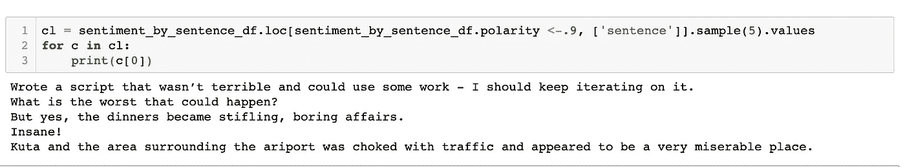

# 数据挖掘日记:TextBlob 和 NLKT 来分析你的个人日记

> 原文：<https://towardsdatascience.com/data-mine-a-diary-textblob-and-nlkt-to-analyze-your-personal-journal-a7c73f412acc?source=collection_archive---------54----------------------->

# 介绍

2003 年，我开始写日记:把我的想法、计划、恐惧和反省写在一个简单的文本文件里。从此，我将**631597 字**写进了 **787 总日志**，跨越 **17 年**。日志是更好地了解一个人的想法的无价工具:分析决策模式，识别趋势，并在这个混乱的世界中找到目标。

这些年来，我对我的日记进行了多次特别的深入研究。例如，当从受伤中恢复时，我用我的日记来识别导致恶化的触发因素，并随着时间的推移绘制这些触发因素，以更好地了解我的行为如何影响我的恢复过程。如果有一种方法可以通过编程来进行这种类型的分析，会怎么样呢？幸运的是，有——它被称为自然语言处理——并且有大量的库允许我们解析和分析大量的文本。

我们将使用 [TextBlob](https://textblob.readthedocs.io/en/dev/) ，一个基于 [NLKT](http://www.nltk.org/) 和[模式](https://github.com/clips/pattern)构建的流行 python NLP 库，来计算以下内容:

*   描述性统计:每年字数，每年条目，总字数。
*   使用词云和 N-gram 分析的最常用词(词的组合)
*   词性标注(名词、动词、形容词)。
*   情感极性分析——随着时间的推移，语气(积极/消极)发生了怎样的变化？

阅读下面的每一个过程的细节或简单地进入我的 [Jupyter 笔记本](https://github.com/datachico/data_mine_journal/blob/Updated_file/NLP_on_a_diary.ipynb)。

# 数据清理和处理

《华尔街日报》位于谷歌文档中；每一年都由一个单独的 Docs 文件表示。文档文件被导出为。然后导入到我们的笔记本中。我们将遍历每个文件中的段落，解析出日期(使用各种可能的格式)并将其与后续日志条目一起存储在 pandas 数据帧中。日记账的格式如下:

> 2020 年 6 月 11 日
> 
> 今天写了一篇中帖。我希望它能得到一些掌声。
> 
> 6/15/2020
> 
> 我的帖子收到了一些掌声:我太激动了！！！
> 
> 现在是时候开始下一个数据项目了…

这个过程的一个挑战性方面是处理不一致的日期格式:代码需要考虑日期的每一种可能的格式，以便正确地解析日期和随后的日志条目。这个问题通过使用正则表达式模式匹配的大量试验和错误得到了解决。

产生的数据帧显示了正确解析的日志条目和相应的日期。

我们现在已经将数据合理地组织成一个数据框架。每一行都是包含多个段落的单个条目。让我们通过为以下任务创建函数来进一步清理数据:

*   **基本清理。**去除空段落，统计单词/段落，标记句子，转换成小写，去除缩写，标准化日期格式。
*   **词汇化。**为了简化分析，我们将每个单词转换为其引理，本质上是其基本形式(got，going = go，claps = clap)。在上下文中，词汇化不同于词干化；通常需要词类(动词、名词、形容词)来完成这个过程。为了做到这一点，我们需要首先将每个句子标记为单独的单词，将单词传递给 TextBlobs POS tagging 函数，然后通过 lemmatizer 函数运行它。我发现这篇[博客文章](https://www.machinelearningplus.com/nlp/lemmatization-examples-python/#textbloblemmatizer)对学习更多关于词汇化的知识很有帮助。

成功了！我太兴奋了。

作为一个有趣的附带项目，我决定快速编写一些代码来自动输出 1 年前、5 年前和 15 年前的日志条目。这个想法是基于佩恩·吉列特每天写日记和自我反省的方法。令人难以置信的是，这些年来，事情发生了怎样的变化(并保持不变)。

我在 60 个单词之后就停止了输出——之后就变得太私人了！很高兴看到我在 15 年前可怕的 127 考试中获得了 a。

# 高级结果

我把**631597 字**写进了 **787 总日志**，跨越 **17 年**。我平均每年写 **44 条**和**350000 字**每条 **803 字**。下面的代码块显示了我是如何计算这些汇总统计数据的，此外还生成了一个显示日志条目的频率和长度的图表。

大约在 2005/2006 年，期刊产量急剧上升，这一年对我来说恰好是转变的一年——完成大学学业，找到工作，搬到旧金山。显然，在这段时间里，我的日记中有更多的事情需要分析、计划、思考和组织。

字数的其他峰值出现在 2013 年(旅行一年，过渡到一份新工作)和 2016 年(搬到西班牙)。2020 年，采用了一种新的每日日志格式(每天早上写 5 分钟——受佩恩方法的启发),这反映在条目和总字数的大幅增加上。

接下来让我们看看季节性——旅行条目的频率是否会按月下降？也许写日记在一月份更常见——因为人们越来越关注反思和决心。

按月记录日志的频率相对稳定，在夏季(7 月/8 月)出现小高峰。可能在这段时间有更多的假期和旅行，因此有更多新的经历可以写。

# 独特的单词用法

让我们深入研究一下内容，首先看看一段时间以来独特的单词用法。

随着时间的推移，我们可以看到独特词汇的使用有所增加——这可能表明词汇量的增加以及可以写的经历种类的增加。

右图显示了总字数中的%独特字数，计算方法是将独特字数相加，然后除以总字数。这基本上是一个单词重复的统计——它通常保持不变，在 2003/2004 年和 2009/2010 年有显著的峰值。需要进一步的分析来挖掘这些峰值。

# 最流行的词

让我们来看看在我的日记中找到的热门词汇。第一步是对最常见的单词有一个大致的了解。为了简化我们的可视化，我们将使用词汇化的版本(‘got’，‘go’，‘going’都应该被认为是动词‘go’)。除了对热门词汇的标准统计，我们还将利用一个名为 [WordCloud](https://github.com/amueller/word_cloud) 的简洁函数来可视化热门词汇。

第一步是过滤掉停用词——对我们的分析没有价值的词，如“The”、“a”、“an”、“in”。接下来，我们遍历词汇化的单词，并创建一个频率分布，输入到 WordCloud 库中。

行动的词汇(去，得到，工作)，欲望(想要，需要，感觉)，以及我们每天都在思考的精髓名词(时间，日子，乐趣)。

让我们更深入地研究热门词汇，并根据词类(动词、名词、形容词、副词)对它们进行分类。

名词“单词云”给了我一个有趣的视角来看待我生活中什么是重要的:人、时间和乐趣！

内省动词:思考，想要，感觉，知道，需要，知道。

大多是正面的形容词和副词:很好，很棒，很棒，超级，很好。我觉得这反映了我普遍积极向上的天性！

# N-Gram 提取

n 元语法被定义为来自给定文本或语音样本的 n 个项目的连续序列例如，在我的日记中常见的两个单词是“我曾经是”，“在这个世界中”，“将要成为”，“那个我”。让我们对该杂志做一些基本的 n 元语法分析，看看是否有任何有趣的模式出现。

我们将遍历每个标记化的句子，并将其传递给 NLKT 的 n-gram 函数，附加到一个 n-gram 列表，该列表将被转换为 DataFrame，以便于数据处理。

一些初步想法:

*   **3 克。像“我需要”和“我想”这样的短语揭示了反复出现的想法、欲望和计划。深入挖掘这些二元模型会很有趣——它们后面的常用词是什么？**
*   **4-克。**还有很多道路需要调查。例如，我提到“很多乐趣”超过 100 次——什么是很多乐趣？与这个 4-gram 相关联的常见名词有哪些？
*   **5-克。**有趣的是,“但同时”被写了 40 多次——它的出现表明了对比——也许在同一个句子中有积极和消极的想法？这是一个很好的例子，说明分析一篇文章是多么的混乱:通常，一个单独的句子或短语不容易被归类为 100%肯定或否定。

# 情感分析

情感分析是一种量化文本情感状态的自然语言处理技术。它利用机器学习原理，一种常见的方法是将文本分类为正面或负面。Textblob 提供了情绪的“极性得分”，其浮动范围为[-1.0，1.0] —负值表示负面情绪，正值表示正面情绪。

Textblob 的情感得分的默认方法使用一个[情感极性词典](https://github.com/sloria/TextBlob/blob/eb08c120d364e908646731d60b4e4c6c1712ff63/textblob/_text.py)，(基于模式库)，它本质上是一个单词及其相应极性和主观性值的词典。Textblob 也有一个使用朴素贝叶斯分析器(一个在电影评论上训练的 NLKT 分类器)的选项。此外，它允许使用你自己的测试数据来训练一个定制的朴素贝叶斯分类器。我们将保存分类器方法供将来的项目使用——现在，让我们深入研究计算极性的默认方法。

让我们从计算每个日志条目和句子的极性开始。

让我们快速输出 5 个完美的 1.0 积极情绪极性的随机句子。

在我看来，它们都很明显是积极的。显然，“棒极了”是我最喜欢的词之一，也是正极性的高度预示。

一些被认定为高度否定的句子的随机例子:

这看起来不太准确:一些人明显是消极的，但其他人不一定传达消极的想法(例如，“疯狂！”可能指的是更积极或更令人震惊的事情。)

情感极性是如何在所有日志条目中分布的？

我们看到期刊条目的情绪极性得分呈正态分布，大多数略微偏正。情绪极性是如何随时间变化的？

平均情绪极性逐年稳步上升！这是一个很好的迹象，随着时间的推移，日志条目的积极性总体呈上升趋势。这能证明生活会随着年龄的增长而变得更好吗？

按年份划分的盒须图显示了每个条目的情绪极性按年份的可变性。我们可以看到，2003 年是一个高度动荡的年份；这是有意义的，因为这是一个过渡时期，也是写日记的开始。季节性呢？在寒冷的月份和温暖的月份，情绪极性会发生变化吗？

当按日历月查看情绪极性时，我们看到一些非常轻微的季节性:年初情绪稍微积极一些，年底情绪略有下降。这在逻辑上是有意义的:一月是一年的开始，是下定决心、新的开始和更高的动力去改变生活的时候！

# 常用词类的情感极性

某些单词是与更多的肯定句还是否定句联系在一起？也许像“工作”、“税收”和“车管所”这样的词通常更消极，而像“娱乐”、“野营”和“度假”这样的词更积极。我们能用这种技术发现我们的选择、行动和言语中未知的趋势吗？

为了进行这种计算，我们在句子级别计算情感极性，然后简单地用整个句子的极性分数标记该句子中的每个单词。这是一个粗略的近似值，可以大致了解单词如何影响句子的整体情绪。

让我们创建一个快捷的函数，轻松地按词类(名词、专有名词、动词、形容词)绘制不同的单词切分。

前三个最积极的名词是“人”、“生活”和“乐趣”——显而易见的非常积极的东西。

创造和体验动词，如“制造”、“感觉”和“思考”，是一些最积极的常见动词。

Textblob analyzer 为单词“awesome”赋予了额外的权重，这是我个人的最爱。另一方面，“bad”是迄今为止最常用的负面形容词。有道理。

# 结论

我希望这对于开始学习基本的 NLP 和基于文本的数据的数据处理技术是一个有用的练习。所有代码都可以在我的 [Github repo](https://github.com/datachico/data_mine_journal/blob/Updated_file/NLP_on_a_diary.ipynb) 上找到。以下是我在这个项目中发现的一些有用的链接:

*   [Python 中的情感分析:TextBlob vs Vader 情感 vs Flair](https://neptune.ai/blog/sentiment-analysis-python-textblob-vs-vader-vs-flair) —这是对 Python 中一些比较流行的 NLP 包的一个很好的总结。
*   [处理文本数据的终极指南](https://www.analyticsvidhya.com/blog/2018/02/the-different-methods-deal-text-data-predictive-python/)
*   [使用 NLTK 的初学者文本分析](https://www.datacamp.com/community/tutorials/text-analytics-beginners-nltk)
*   [教程:用 Python 进行文本分析来测试一个假设](https://www.dataquest.io/blog/tutorial-text-analysis-python-test-hypothesis/)