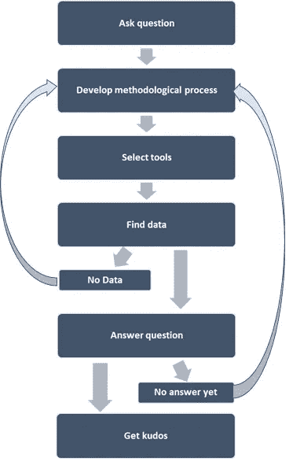
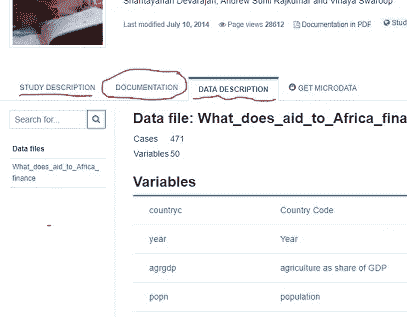
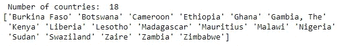
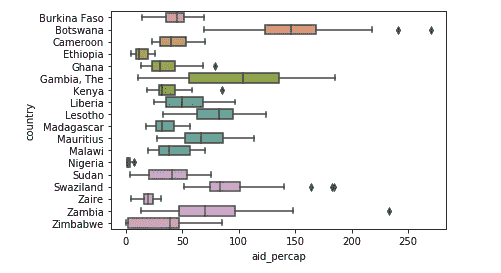
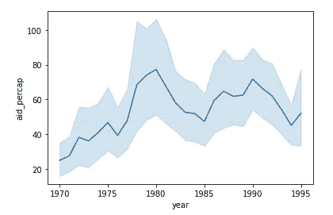
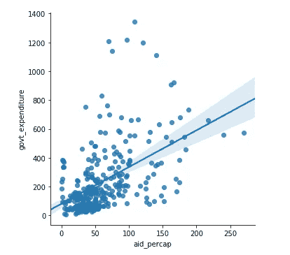
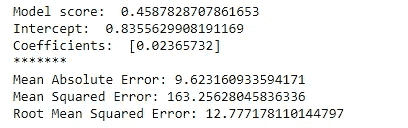

# 未知领域的数据挖掘

> 原文：<https://towardsdatascience.com/data-mining-in-an-unknown-domain-70502d12fc19?source=collection_archive---------33----------------------->

## 从提取仿真陈述到构建高级模型


照片由[弗兰基·查马基](https://unsplash.com/@franki?utm_source=medium&utm_medium=referral)在 [Unsplash](https://unsplash.com?utm_source=medium&utm_medium=referral) 上拍摄

> 你有没有遇到过这样的情况，不管出于什么原因，你不得不处理一个来自你知之甚少或一无所知的领域的数据集？我打赌是的。没有多少数据科学家对泰坦尼克号或 Iris flowers 有专业知识，但他们完全可以处理这些数据集。

数据科学家经常抱怨他们 80%的时间被浪费了？)在数据清理方面。虽然这是事实，但花在数据清理上的时间并没有完全浪费。恰恰相反。你花在数据上的时间越多，你对数据了解得越多，你的分析直觉就越好。

这篇文章的目的是——假设你有一个开放的心态，对数据集一无所知，头脑中没有任何问题，只是好奇——你如何发现数据集会泄露什么有趣的故事和信息？

正如我在上一篇文章中所写的，数据科学有两个可能的起点——从问题开始或者从数据开始。在那篇文章中，我谈到了从一个问题开始的项目的生命周期。在理想情况下，是的，数据科学家会首先提出一个问题，然后使用所有可用的工具和技术来尝试找到该问题的答案。然而，现实中并非总是如此。偶尔会碰到一些你一无所知的数据。你不问任何问题，你只想知道他们掌握了什么信息。



数据科学项目周期(@mab.datasc)

在接下来的部分中，我将带您完成这个过程。为此，我从世界银行微数据数据库下载了一个数据集来使用(稍后会有更多的介绍)。我将使用 python jupyter 笔记本环境，使用三个主要库:`pandas`、`seaborn`和`Scikit-Learn`。但是不管你用什么工具——R，excel，tableau，power BI，等等——重要的是你做了什么。

> 声明:为了公平起见，我选择了一个我以前不了解的领域，并选择了一个我在写这篇文章之前从未见过的数据集。以前我处理过其他类型的世界银行数据集，但是对非洲的援助从来都与我的工作或兴趣无关。

# **理解数据及其起源**

当你得到一个未知的数据集时，你要做的第一件事就是问一些基本的问题来了解数据的来源/血统:这个数据是关于什么的？它从哪里来的？谁生产的，出于什么目的？什么时候收集的，怎么收集的？可能有描述数据集、一些关键变量的定义等的相关文档。您可能会在哪里找到这些信息



元数据和数据文档

我在这里使用的数据集是 1990 年至 1996 年间从非洲依赖援助的国家收集的时间序列数据。根据文件，该数据集创建于 2010 年，目的是了解捐助方为一个目的提供的援助最终是否被用于另一个目的。

# **这些数据包含了什么？**

接下来:启动你最喜欢的数据辩论库，第一次让你的数据达到顶峰。我不知道其他人做了什么，但我导入数据后做的第一件事就是调用`head()`函数，看看它在原始状态下是什么样子。然后我会检查(不一定按这个顺序)有什么样的列，数据类型是什么，数据大小是多少，是否有缺失值。老实说，对我来说，这是处理数据最令人兴奋的部分，尤其是处理未知数据，就好像我发现了新的东西！

```
# import libraries
import pandas as pd
import matplotlib.pyplot as plt
import seaborn as sns# import data
df = pd.read_csv("../data.csv")# take a peak into the data
df.head()
```


# **清理您的数据**

数据清理确实会花费你大量的时间，尤其是当你对它几乎一无所知的时候。我也花了不少时间来清理我的数据集。为了不把这篇文章写得太长，如果你感兴趣的话，我已经把数据清理的整个过程记录在一个 jupter 笔记本和上传到 GitHub 的[中。](https://github.com/mabalam/Towards-Data-Science-EDA)

# **提问**

现在您的数据已经清理完毕，您可以将它带到您的环境中来做一些事情了。如果您了解探索性数据分析(EDA)，那么您已经知道可以对数据集做什么:

*   描述统计学
*   散点图
*   图表
*   分布图
*   还有更多…

您可能可以从数据集中提取数百条不同的信息。这绝对是一种解决方法。但我认为更有趣的方式是问一些你可能会感兴趣的问题。这样你的时间会得到更有效的利用。因为我的数据集是关于非洲艾滋病的，我感兴趣的第一个问题是:

**问:有多少国家和哪些国家接受了援助？**

```
# number of countries
print("Number of countries: ", df["country"].nunique())# name of the countries
print(df["country"].unique())
```



既然我们知道有多少和哪些国家接受了援助，接下来显而易见的国家是:

**问:这些年来哪些国家接受了相对较多的援助？**

```
# creating boxplots to see summary of aid by receiving countries
sns.boxplot(y="country", x="aid_percap", data=df)
```



这是一个面板数据集，意味着每个国家都有自己的所有变量的时间序列。所以下一个问题是:

**问:在研究期间，aid 的总体时间趋势是什么？**

```
# plotting time series
sns.lineplot(x="year", y="aid_percap", data=df)
```



我可以继续下去……对每个变量问类似的问题，但我会在这里停下来。我将继续讨论一些更有趣的问题，一些双变量分析:

**问:政府支出和援助之间有关联吗？**

```
# bivariate scatter plot with linear model
sns.lmplot(x="aid_percap", y="govt_expenditure", data=df, fit_reg=True)
```



这个数据集不是终点。我会用其他来源的数据或文献来补充这个数据集中的发现，以验证和支持我的问题的答案。

# 建立预测模型

到目前为止，我在上一节中所做的事情是让您的数据准备好进行分析，并提出一些琐碎的问题来提取一些有趣的事实。它并没有在这里结束，而是很可能是一些更有趣和有用的东西的开始。下面是一个使用数据集构建线性回归模型以根据农业支出预测人均 GDP 的示例[注意:该模型仅用于演示目的，我跳过了许多中间步骤]。

```
# import necessary libraries
import numpy
from sklearn.model_selection import train_test_split
from sklearn.linear_model import LinearRegression
from sklearn import metricsdata = df[[ "gdp_percap", "agri_expenditure"]]# remove NA values
data=data.dropna()# select x, y data for modeling
y = data.iloc[:, 1].values
X = data.iloc[:, :-1].values# Split X and y into X_
X_train, X_test, y_train, y_test = train_test_split(X, y, test_size=0.25, random_state=1)# instantiate model
model = LinearRegression()# fit model
model.fit(X_train, y_train)# Model evaluationprint("Model score: ", model.score(X_test, y_test))
print("Intercept: ", model.intercept_)
print("Coefficients: ", model.coef_)print("*******")print('Mean Absolute Error:', metrics.mean_absolute_error(y_test, y_pred))  
print('Mean Squared Error:', metrics.mean_squared_error(y_test, y_pred))  
print('Root Mean Squared Error:', np.sqrt(metrics.mean_squared_error(y_test, y_pred)))
```



# 传达调查结果

讲述和交流你从数据中学到的东西是最不受重视的，但却是做数据科学最重要的部分。作为一名数据科学家，你需要能够总结故事中最有趣的部分，并能够将其传达给可能使用它们的人。这种交流可以采取任何形式，从写博客、制作幻灯片、为公司高管写报告到在科学期刊上发表。

*注:jupyter 笔记本及更多代码、注释和相关数据在*[*GitHub repo*](https://github.com/mabalam/Towards-Data-Science-EDA)*中。*