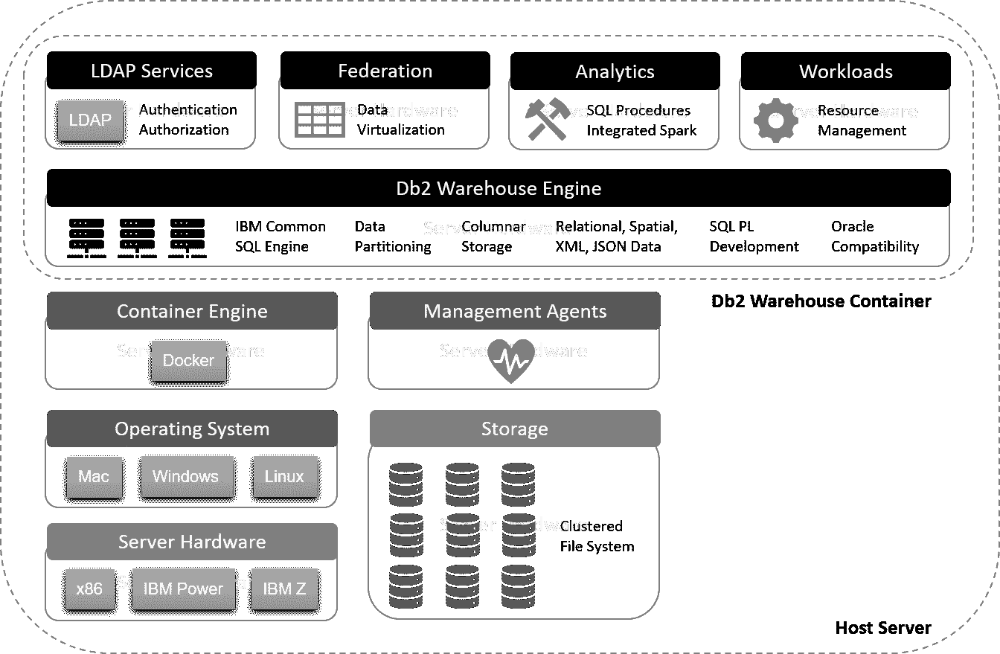
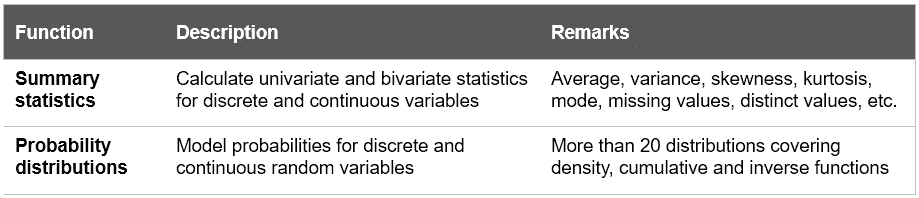
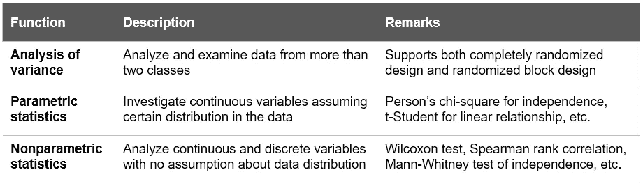
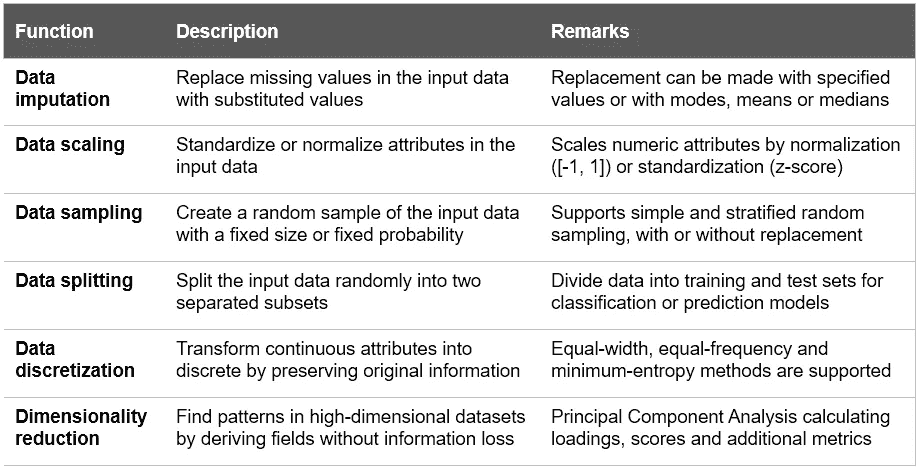
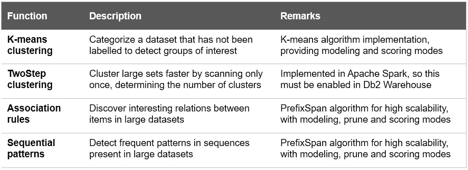
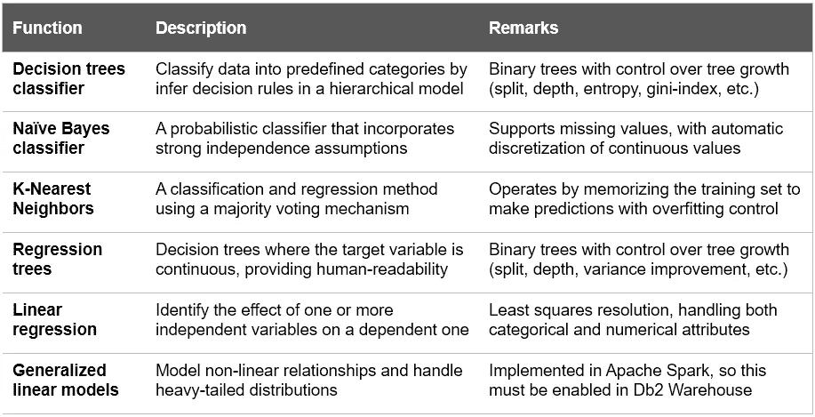
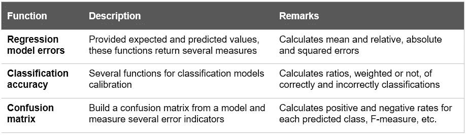
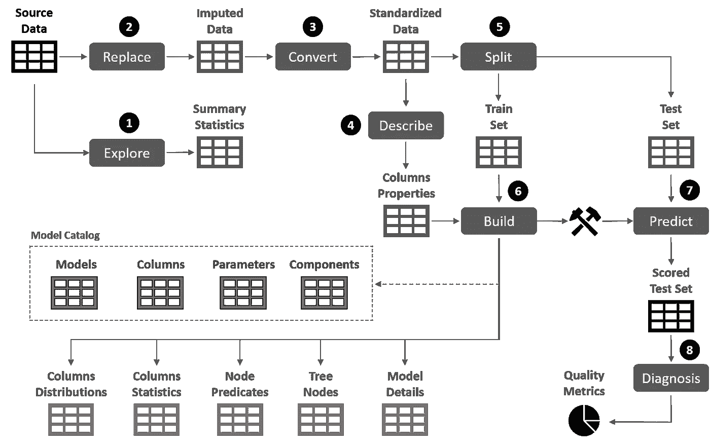
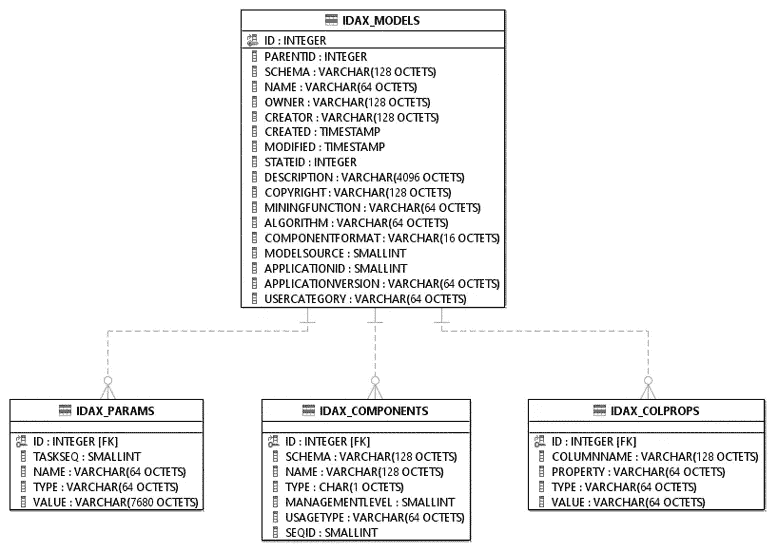
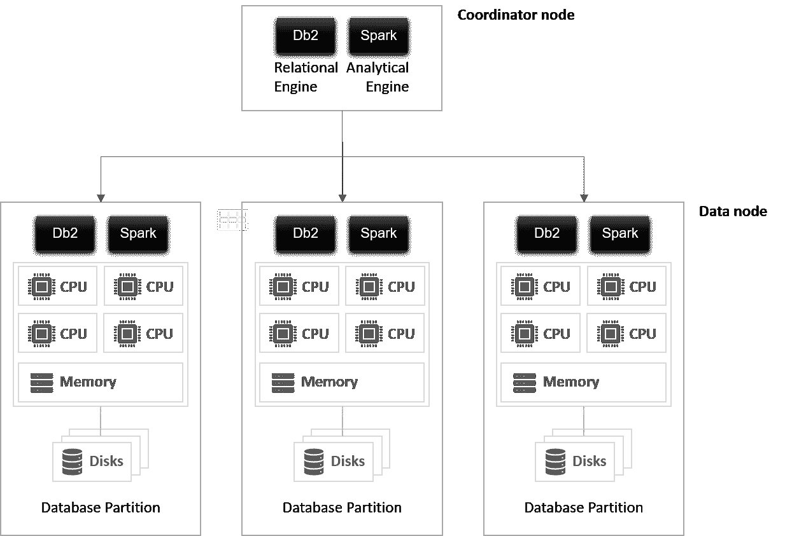

# Db2 仓库中的数据挖掘:基础知识

> 原文：<https://towardsdatascience.com/data-mining-in-db2-warehouse-the-basics-7b0b4fdcb736?source=collection_archive---------38----------------------->

## [Db2 仓库数据挖掘](https://medium.com/tag/db2-warehouse-data-mining)

## 从数据所在的 SQL 中运行数据库内分析功能

由[大卫·索拉](https://unsplash.com/@davidsola?utm_source=medium&utm_medium=referral)在 [Unsplash](https://unsplash.com?utm_source=medium&utm_medium=referral) 上拍摄

**数据库内数据挖掘**是一种分析和操作方法，它利用数据库平台的功能和资源来支持、嵌入和公开数据挖掘功能。与其他数据库中的计划一样，这个想法是将建模和推理工作尽可能地集中到核心业务数据所在的位置。除了这种协同定位在性能和可伸缩性方面提供的好处之外，使用 SQL 来训练、验证和评分数据挖掘模型使得这些工件与公司事务和分析过程的集成变得容易。您可以在我之前的[故事](/five-reasons-for-in-database-data-mining-84e9cf8e084a)中了解更多关于数据库内数据挖掘的特性和好处。

 [## 数据库内数据挖掘的五个理由

### 利用关系数据库引擎实现集成的模式发现和预测建模解决方案

towardsdatascience.com](/five-reasons-for-in-database-data-mining-84e9cf8e084a) 

本文的目标是将 IBM Db2 Warehouse 作为开发和部署数据挖掘工作负载的参考数据库平台。它涵盖了数据仓库引擎的主要特性，特别关注可用的分析例程，概述了模型管理框架和扩展点，以便在同一个通用平台中利用 Spark、Python 或 R。它应该作为围绕特定建模功能和场景的未来故事的起点。

# Db2 仓库概述

**Db2 Warehouse**【1】是 IBM 开发的一个分析数据仓库平台。Db2 Warehouse 构建于 IBM 的通用 SQL 引擎之上，可以作为托管服务或 Docker 映像在云(IBM Cloud 和 Amazon Web Services)上使用，以便进行定制部署和轻松扩展(图 1)。主要特性包括:

*   **分析优化**。Db2 Warehouse 采用了 IBM BLU 加速技术，包括列数据的内存处理、并行向量处理、高密度压缩和智能数据跳过。BLU 加速是自我优化的，消除了对索引、聚集或定期数据库调整的需要，使其成为在线分析处理(OLAP)应用的理想选择。
*   **可扩展性和性能**。遵循无共享架构，Db2 Warehouse 支持单个和多个数据库分区配置。向外扩展是通过向现有集群添加新的逻辑或物理分区来实现的。在多分区数据库中，一个表可以放在多个分区中，因此它的行沿着集群的成员分布。
*   **数据虚拟化**。Db2 仓库数据库可以充当一个或多个数据源的联邦数据库。这样，一条 SQL 语句就可以访问分布在不同的异构远程数据源中的数据，就好像这些数据存储在一个数据库中一样。此外，Db2 Warehouse 支持透明地指向驻留在数据库之外的文件的外部表。
*   **工作量管理**。在 Db2 Warehouse 中，可以根据用户和应用程序需求对工作负载进行分类。通过这种方式，可以将 CPU、内存访问优先级或最大执行时间等资源分配给每组工作负载。为了隔离数据库中运行的密集型分析应用程序，这一点尤其重要。
*   **多语种持久性**。Db2 Warehouse 不仅是 SQL 引擎，还支持关系结构、空间数据和半结构化文档，如 XML、JSON 和 BSON。
*   **数据挖掘特性**。预测建模算法以分析例程的形式在数据库中实现，可以使用 SQL 调用这些分析例程。无需将数据移出数据库就可以实现高性能的数据挖掘应用程序。

在数据库中开发和部署数据挖掘应用程序是 Db2 Warehouse 最重要的特性之一。

**图 1** —基于 Db2 仓库容器的架构

训练机器学习算法意味着大量的数据库交互，因为必须在每个训练时期重复获取数据。这个过程涉及多个 SQL 语句，如果在外部应用程序中进行训练，这又会产生许多发送和接收网络操作(以及相关的 CPU 成本)。但是，如果将训练实现为在数据库中执行的例程，则所有这些 SQL 语句(包括写入结果表的语句)都被封装到一个发送和接收操作中:网络流量被最小化，可以处理更多的数据，训练性能得到提高。这是数据库内数据挖掘方法的主要优点之一。

# 分析程序

Db2 Warehouse 提供了超过 125 个内置的分析例程[2]，涵盖了数据挖掘解决方案工作流的不同步骤:数据探索和理解、转换、建模、验证和评分。这些例程中的大多数都是存储过程和用户定义函数的形式。在第一种情况下，通过对存储过程的 CALL 语句进行调用，在第二种情况下，作为 SQL SELECT 的一部分。

这些例程是 SQL PL 模块 SYSIBMADM 形式的每个数据库目录的一部分。IDAX，它也包含支持数据类型和变量。它们可以分为六大类。

## 数据探索

数据探索的目标是通过分析不同的统计数据和识别分布来了解将要建模的数据，同时也是为了检测可能的质量问题，这些问题可以在建模任务之前通过数据转换功能来解决。

**表 1** —数据探索功能

## 统计测试

通过验证性数据分析，您可以测试假设并检查几组数据，验证独立性、相关性和显著性。

**表 2** —统计测试函数

## 数据转换

数据转换类别包含转换要分析的数据结构的例程，以便使它们更适合于进一步的分析处理。它们可以很容易地与探索和建模例程链接起来，以便符合也可以安排的训练管道。

**表 3** —数据转换功能

## 无监督学习

这些机器学习方法在没有预定义类别和最少用户监督的情况下检测数据集中的模式和共现关系。

**表 4** —无监督学习功能

## 监督学习

监督学习方法包括分类和回归函数，这取决于目标变量是分类变量还是数值变量。它们都实现了建模和评分模式。

**表 5** —监督学习功能

## 诊断功能

诊断功能提供了在验证阶段评估分类和回归模型的准确性和质量的方法。

**表 6** —诊断功能

图 2 显示了一个典型的分类模型管道，包括数据探索、数据准备、训练和验证步骤。清单 1 根据所使用的分析例程(存储过程)、其功能和所需的参数详细说明了管道的每一步。

**图 2** —建立分类模型的步骤和相关表格

管道的输入数据集包含属于三个不同品种的几种葡萄酒中存在的 13 种成分的化学分析结果。目的是根据这些成分鉴定正确的栽培品种。

**清单 1** —在 IBM Db2 仓库中使用分析存储过程的分类管道实现

其思想是，这个过程的调用可以被链接和打包在另一个例程或复合语句中，该例程或复合语句可以作为一个整体被调用，添加附加的逻辑、错误处理、审计或执行权限。此外，还可以利用集成的 Db2 调度器来定义和自动化执行类似这样的管道的任务。

# 模型管理

机器学习算法生成存储在数据库中的数据挖掘模型。为了管理它们，提供了一组管理例程，包括安全性和权限。模型目录位于 SYSTOOLS 模式中，由存储不同模型元数据的四个表组成(图 3):

*   **IDAX_MODELS** 。目录中的中央表，存储常规模型属性，包括模型名称、创建者、所有者、挖掘函数、算法或模型源(如果模型已导入)。
*   **IDAX_PARAMS** 。定义模型时指定的参数。这些包括源表、名称映射支持表、生成模型的例程以及为算法定义的任何超参数。
*   **IDAX。COLPROPS** 。用于创建模型的源表中的列属性。其中一些属性是自动派生的，比如 SQL 类型或基数。其他的被指定为模型定义的一部分，如列角色(输入、目标、权重等。).
*   **IDAX。组件**。根据模型挖掘功能的不同，会创建不同的结果表，其中包含模型的参数和细节。该表记录了模型中涉及的所有数据结构，包括源表、支持表和结果表。

**图 3** —模型目录库表格

除了需要特定权限之外，不应直接访问模型目录表。因此，元数据管理的几个例程以不同的类别提供:

*   **行政操作**。这些函数用于检查模型目录库的状态，包括初始化和重置。
*   **列表操作**。提供对目录表的只读访问的函数。
*   **模型操纵操作**。一组例程，用于更新、删除和获取存储在目录中的不同模型的摘要。包括在专有的中导出和导入模型的功能。mdl 格式，以及导出为 PMML 模型。
*   **安全操作**。在模型级别为不同的用户、组或角色授予、撤销或列出权限。

简而言之，Db2 Warehouse 为元数据管理提供了完整的 SQL API。与其他分析例程一样，您可以通过 SQL 脚本或支持存储过程调用的外部应用程序与这些函数进行交互。此外，这些功能中的大部分都可以在 Db2 Warehouse web 控制台界面中获得。

# 扩展分析能力

除了从 SQL 中运行数据库内数据挖掘功能之外，还有其他选项来扩展 Db2 Warehouse 数据库环境的分析能力。

## 用户定义的扩展

数据库功能可以通过不同类型的例程来扩展。在任何情况下，例程实现数据库内逻辑，这意味着应用程序在与数据库相同的进程中执行，具有最少的网络操作和降低的处理器成本。结果是数据密集型流程和 SQL 执行的性能得到了显著提高。如前所述，Db2 Warehouse 已经提供了一整套内置的分析过程。但是，可以通过编写用户定义的扩展来扩展分析能力。有几个选项可用:

*   **SQL PL 例程**。Db2 SQL 过程语言是 SQL 的扩展，它提供变量和条件处理程序声明、控制结构和错误管理的语句，以便在数据库中实现过程逻辑。这些语言元素可用于开发存储过程、标量函数和表函数，这些函数可打包成模块。就数据访问而言，SQL PL 中实现的例程在性能、安全性和可伸缩性方面提供了最佳选择。然而，对于复杂的应用程序逻辑，它们可能不是最佳选择。当在内置的分析程序之上实现例程时，应该考虑这些扩展，因此，为了提供定制的组件和解决方案，应该对它们进行组合和包装。
*   **对外套路**。流行的编程语言，如 C/C++，Java。NET、Python 或者 Lua，都可以用来实现 Db2 仓库中的复杂逻辑。如果目标是在数据库中实现新的建模算法，这可能是最好的选择。最后，对于存储过程，它们将作为 SQL SELECT 或 CALL 语句的一部分被透明地调用。为了部署这些功能，必须将源代码和附加文件上传到 Db2 实例。然后，在创建和编译库文件之后，通过指定其签名和类，在数据库目录中注册该例程。

除了其他数据库对象之外，用户定义的例程可以在 Db2 Warehouse 中被混淆，因此它们可以被部署到数据库中，而不会暴露应用程序逻辑。这对于想要保护其知识产权的解决方案提供商和开发者来说非常重要。

## 嵌入式 Apache Spark 引擎

Db2 Warehouse 包括一个与数据库引擎高度集成的 Apache Spark 集群。通过这种方式，可以部署、启动和监控直接从数据库读取数据的 Spark 应用程序，在集群中并行处理这些数据，然后将结果写回数据库。有四种可能的方法来管理集成 Spark 集群中的作业:

*   **SQL 存储过程**。有三个程序可用于启动、监控和取消火花应用。
*   **REST API** 。与存储过程功能类似，分析 API 可用于管理应用程序。
*   **命令行工具**。提供了一个基于 cURL 的脚本，它实现了 spark-submit 脚本的一个子集，外加一些特定的 Db2 仓库命令。
*   **阿帕奇 Livy 服务器**。Db2 Warehouse 提供了一个经过集成和配置的 Livy 服务器，它通过 REST 或编程(Java、Scala、Python) API 接受 Spark 作业。

因为 Spark 执行器与数据库节点位于同一位置，所以对数据的访问延迟被最小化(图 4)。数据通过进程间通信使用共享内存进行传输，因此在处理大型数据集时速度会显著提高。

**图 4**—Db2 仓库集群中的集成 Spark 引擎

## Python 包

Db2 Warehouse 为从 Python 应用程序访问数据库提供了几个组件和扩展:

*   **ibm_db** 。这个包提供了两个 API 来连接和管理数据库(支持 Db2 和 Informix 数据服务器)。ibm_db API 是由 ibm 定义的，它提供了一组丰富的方法来发布 SQL 查询、调用存储过程和管理数据库对象[3]。第二个是 ibm_db_dbi API，实现了 Python 数据库 API 规范 2.0 版。虽然它的功能不是很广泛，但是当应用程序需要符合规范时，它是必要的。当需要通过 Pandas 访问数据库时就是这种情况(清单 2)。

**清单 2** —将 Db2 仓库数据放入 Pandas 数据框架

*   **ibmdbPy** 。这个开源包提供了一个数据库内分析 Python 接口来访问 Db2 仓库中的数据和算法[4]。它实现了 Pandas 和 Scikit-learn 库的接口，分别用于数据操作和机器学习算法，将 Python 操作推到底层数据库中执行。通过提供等效的数据结构，如 IdaDataSeries、IdaDataFrames 或 IdaGeoDataFrames，ibmdbPy 可以通过提升 Python 的内存和 CPU 限制以及利用 Db2 Warehouse 的并行处理和列存储功能来非常有效地处理大量数据。例如，IDA 数据帧使用延迟加载来仅获取实际需要的数据部分:当函数请求数据时，它不在应用程序中运行，而是被转换为 SQL 查询，该查询在数据库中执行，结果被转换回 Python 对象。除了数据访问操作之外，ibmdbPy 还提供了特性选择、相关性分析、数据库内地理空间函数(利用 Db2 Spatial Extender)的方法，以及作为 SQL 例程提供的几种机器学习算法的包装器。
*   **朱庇特笔记本**。为了方便 Jupyter 笔记本中 Db2 对象的连接和操作，可以导入一个扩展(Db2 . ipynb)[5]。这个扩展启用了一个神奇的命令(%sql)，它允许将输入的文本解释为 sql 脚本，而不是 Python 代码。通过这种方式，不需要导入其他数据库访问库，将数据转移到 Pandas DataFrames 中非常简单(清单 3)。

清单 3—Jupyter 笔记本中 Db2 仓库数据的直接 SQL 操作

## r 包

与 Python 类似，Db2 Warehouse 中的 R 编程基于几个包:

*   **RODBC** 。通过 ODBC 接口提供对 Db2 仓库数据库的访问的标准包。
*   **ibmdbR** 。相当于 Python 中的对应物，它通过在 R [6]中实现 IDA 数据帧结构，允许直接在 Db2 仓库中进行数据库内分析。这个库中还提供了许多 SQL 分析例程。

# 结论

Db2 Warehouse 是一个高可伸缩的平台，其中数据和分析位于同一位置。通过利用关系数据库引擎和 SQL 语言，数据挖掘工作负载可以部署在数据已经驻留的地方，避免提取到专门的外部系统。

Db2 Warehouse 配备了 100 多个分析例程，涵盖了数据探索、转换和机器学习算法，还通过集成的 Spark 集群和专门的 Python 和 R 库提供了扩展功能。这是一个可以构建和部署高性能、以数据为中心的分析应用程序的环境。

# 一般参考

[1] IBM 公司， [Db2 Warehouse 文档](https://www.ibm.com/support/producthub/db2w/)，Db2 Warehouse 11.5 产品中心

[2] IBM 公司，[分析存储过程](https://www.ibm.com/support/knowledgecenter/SSCJDQ/com.ibm.swg.im.dashdb.analytics.doc/doc/r_analytic_stored_procedures.html)，Db2 仓库 11.5 知识中心

[3] GitHub，[IBM _ db 驱动程序的 API 描述](https://github.com/ibmdb/python-ibmdb/wiki/APIs)，IBM db—IBM 数据库服务器的开源驱动程序

[4] GitHub，[通过数据库内处理加速 Python 分析](https://github.com/ibmdbanalytics/ibmdbpy)，ibmdbanalytics

[5] GitHub， [Db2 Jupyter 笔记本扩展](https://github.com/DB2-Samples/db2jupyter#db2-jupyter-notebook-extensions)，DB2-Samples

[6] CRAN， [IBM 数据库内 R 分析](https://cran.r-project.org/web/packages/ibmdbR/index.html)，ibmdbR

# 软件访问

Db2 Warehouse 可以在 IBM Cloud 和 Amazon Web Services 中作为一个灵活的、完全托管的数据仓库即服务产品来访问。该服务有单节点和多节点两种形式。或者，它也可以作为 Docker 映像发布，用于可以从 IBM Cloud Container Registry 中提取的定制部署。

**Db2 Warehouse Developer Edition**是 Db2 Warehouse 的一个全功能版本，免费，面向开发和测试环境。此版本不适用于生产，并且不支持多节点部署。Docker 映像可以从 IBM 网站下载，并在几分钟内部署到笔记本电脑中。