# 数据建模:概述

> 原文：<https://towardsdatascience.com/data-modeling-an-overview-ed6165a27309?source=collection_archive---------13----------------------->

## 本文概述了软件应用程序中的数据建模。它描述了常用的术语，并使用一个零售销售案例研究来解释一步一步的过程。

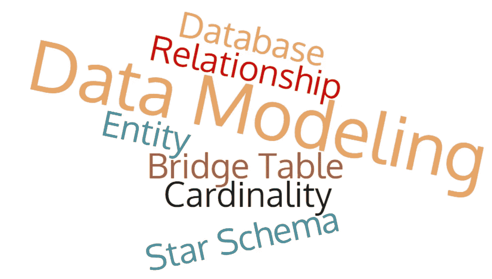

如果你观察世界上的任何软件应用程序，你会发现在最基本的层面上，它将处理数据的组织、操作和表示，以满足业务需求。

一个**数据模型**是表达和交流业务需求的概念表示。它直观地表示了数据的性质、管理数据的业务规则以及数据在数据库中的组织方式。

数据建模的过程可以比作建造房子的过程。假设某公司 ABC 需要建一个招待所(数据库)。它调用一个建筑架构师(数据建模师)并解释它的建筑需求(业务需求)。建筑设计师(数据建模师)开发计划(数据模型)并将其交给 ABC 公司。最后，ABC 公司召集土木工程师(数据库管理员和数据库开发人员)来建造客房(数据库)

# 数据建模中的关键术语:

***实体和属性:*** 实体是业务环境中的“事物”，我们希望存储关于它们的数据，如产品、客户、订单等。属性提供了一种组织和构造数据的方法。例如，我们需要存储我们销售的产品的某些信息，如售价或可用数量。这些数据是产品实体的属性。实体通常表示数据库的表格，而属性是这些表格的列。

***关系:*** 实体之间的关系描述一个实体如何链接到另一个实体。在数据模型中，实体可以是以下任何一种关系:一对一、多对一或多对多。这就是所谓的给定实体相对于另一个实体的基数。

***交集实体(参照表):*** 当实体间存在多对多关系时，可以用交集实体解析为多对一和一对多关系。一个简单的例子是:有两个实体，电视节目和人。每个电视节目可以由一个或多个人观看，而一个人可以观看一个或多个电视节目:

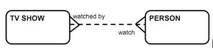

这可以通过引入新的相交实体“查看记录”来解决，如下所示:

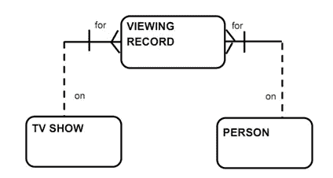

***ER 图:*** 表示实体及实体间关系的图称为 ER 图。ER 图可以采用概念数据模型、逻辑数据模型或物理数据模型的形式。

***概念数据模型:*** 概念数据模型包括所有主要实体和关系，不包含太多关于属性的详细信息，通常用于初始规划阶段。一个例子:

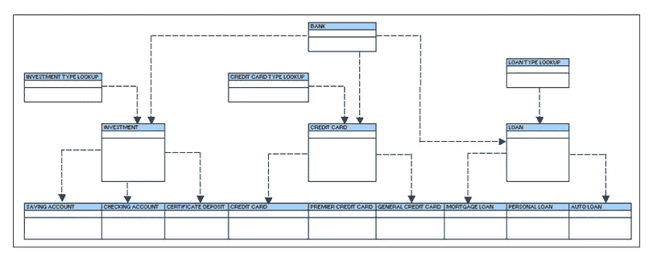

***逻辑数据模型:*** 它是概念数据模型的扩展。它包括代表业务信息和定义业务规则的所有实体、属性、键组和关系。一个例子:

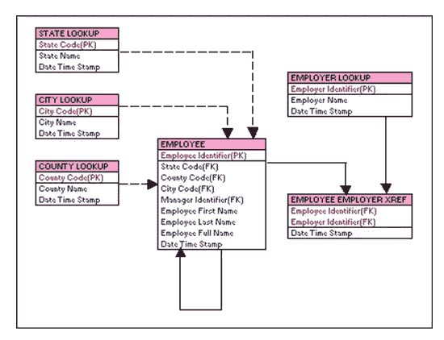

***物理数据模型:*** 它包括数据库物理实现所需的所有表、列、关系、数据库属性。数据库性能、索引策略、物理存储和反规范化是物理模型的重要参数。一个例子:

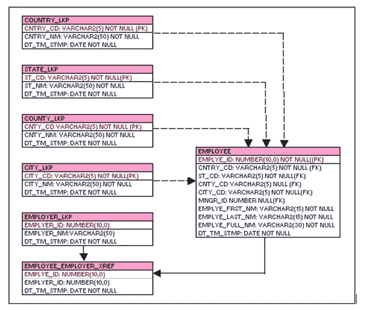

# 数据建模开发周期:

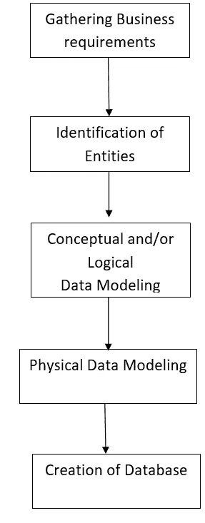

# 关系与维度建模:

根据业务需求，您的数据模型可以是关系型的，也可以是维度型的。关系模型是一种旨在消除数据冗余的设计技术。数据被分成许多离散的实体，每个实体都成为关系数据库中的一个表。这些表格通常被标准化为第三范式。在 OLTP 应用程序中，遵循这种方法。

在仓库需求的情况下，数据被反规范化以提高性能。在维度模型中，数据被分为维度和事实，其设计目标是用户可理解性、查询性能和对变化的弹性。

# 案例研究:

ABC 公司在八个州拥有 200 家杂货店。每个商店都有不同的部门，如日用品、化妆品、冷冻食品、乳制品等。每家商店的货架上大约有 20000 种产品。单个产品被称为库存单位(SKU)。约 6000 个 SKU 来自外部制造商，产品包装上印有条形码。这些条形码被称为通用产品代码(UPCs)。销售点(POS)系统在两个地方收集数据:测量顾客外卖的前门和供应商送货的后门。

在杂货店，管理关心的是订购、储存和销售产品的物流，同时最大化利润。一些促销方案，如临时降价、报纸广告、展示等，也在不断增加。

设计一个数据模型来分析这个连锁杂货店的运作。

**解决方案:**

**第一步:收集业务需求:**

管理层希望更好地了解 POS 系统捕获的客户购买情况。该模型应该允许分析什么产品在什么日子在什么促销条件下在什么商店销售。此外，这是一个仓储环境，因此需要一个维度模型。

**步骤 2:实体的识别:**

在维度模型的情况下，我们需要识别我们的事实和维度实体。在开发模型之前，需要明确所需数据的粒度。在这种特殊情况下，我们需要颗粒是 POS 交易上的单个行项目。根据要求，我们需要在特定的一天，在特定的促销方案下，查看特定商店中特定产品的数据。这给了我们所需尺寸的概念:

**日期维度**

**产品尺寸**

**店面尺寸**

**促销维度**

要计算的数量(如销售数量、利润等)将在**销售事实表中获取。**

**第三步:概念数据模型:**

将根据收集的关于实体的信息建立一个初步的数据模型。在我们的例子中，它将如下所示:

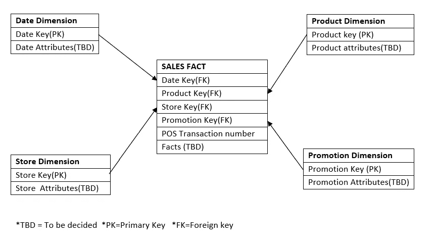

**步骤 4:属性的最终确定和逻辑数据模型的设计**

现在，需要最终确定已识别的事实表和维度表的属性。在我们的例子中，以下属性已经完成:

**日期维度:**

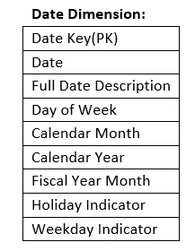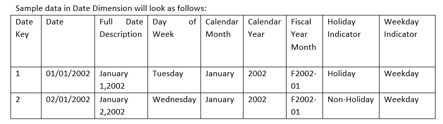

**产品:**

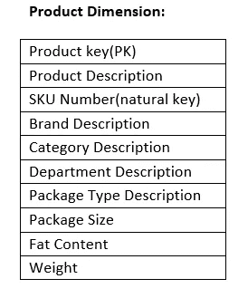

**店铺:**

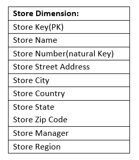

**晋级:**

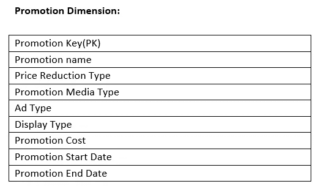

**销售事实:**

交易编号

销售数量:(例如蔬菜汤面罐头的数量)

销售金额:销售数量*单价

成本金额:供应商收取的产品成本金额

毛利金额:销售金额-成本金额

**逻辑数据模型**将看起来像:

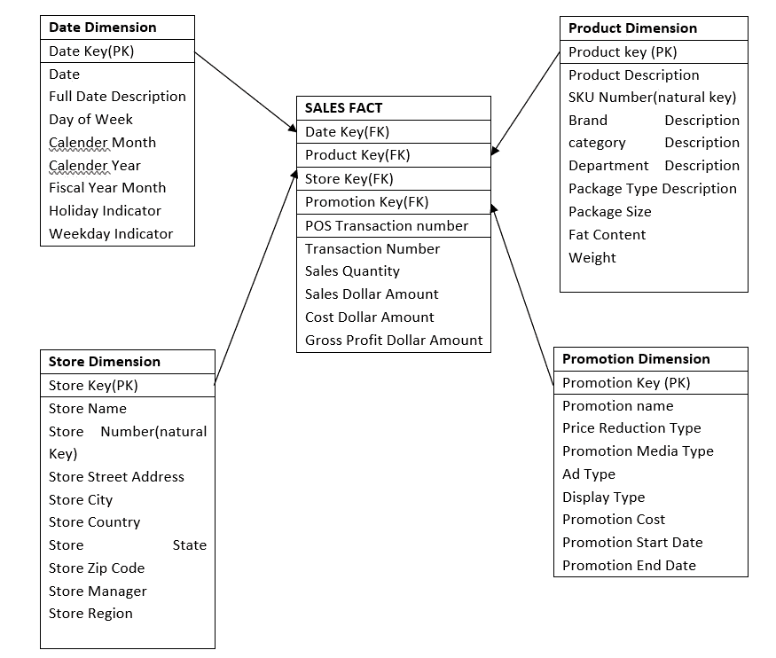

**步骤 5:在数据库中创建物理表:**

在数据建模工具的帮助下，或者通过编写定制脚本，现在可以在数据库中创建物理表。

数据建模是软件应用程序设计中最重要的任务之一。它为如何组织、存储、检索和呈现数据奠定了基础。