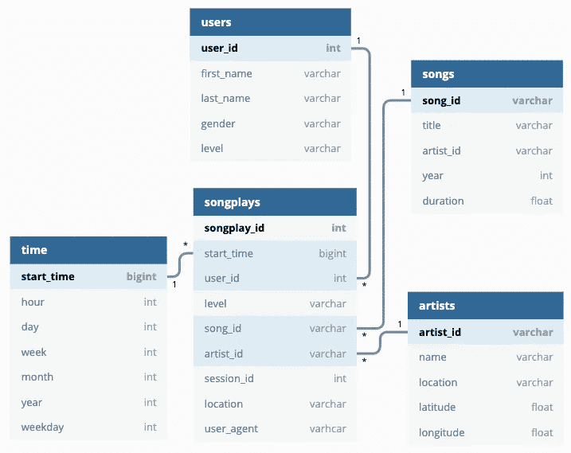

# 音乐流应用程序的数据建模

> 原文：<https://towardsdatascience.com/data-modeling-for-a-music-streaming-app-db46a4595e4e?source=collection_archive---------11----------------------->

## Udacity 数据工程师纳米学位

## 创建一个 Postgres 数据库，其中的表用于优化歌曲播放分析的查询


潘卡杰·帕特尔在 [Unsplash](https://unsplash.com?utm_source=medium&utm_medium=referral) 上的照片

# 介绍

我已经加入了 Udacity 数据工程师 Nanodegree。该计划由许多现实世界的项目组成。在这个项目中，我在一家名为“Sparkify”的虚构数据流公司担任数据工程师。这是一家初创公司，希望分析他们在新的音乐流媒体应用程序上收集的歌曲和用户活动数据。分析团队对了解用户在听什么歌特别感兴趣。目前，他们没有一种简单的方法来查询他们的数据，这些数据位于应用程序上用户活动的 JSON 日志目录中，以及应用程序中歌曲的 JSON 元数据目录中。

他们想要一个数据工程师来创建一个 Postgres 数据库，其表旨在优化歌曲播放分析的查询，并让我参与这个项目。我的角色是为这个分析创建一个数据库模式和 ETL 管道。我已经通过运行 Sparkify 的分析团队给我的查询测试了我的数据库和 ETL 管道，并将我的结果与他们的预期结果进行了比较。

# 项目描述

在这个项目中，我应用了我在 Postgres 数据建模方面学到的知识，并使用 Python 构建了一个 ETL 管道。我为特定分析焦点的星型模式定义了事实表和维度表，并使用 Python 和 SQL 编写了一个 ETL 管道，将数据从两个本地目录中的文件传输到 Postgres 的这些表中。

# 歌曲数据集

第一个数据集是来自[百万首歌曲数据集](https://labrosa.ee.columbia.edu/millionsong/)的真实数据子集。每个文件都是 JSON 格式的，包含关于一首歌和这首歌的艺术家的元数据。这些文件按每首歌曲曲目 ID 的前三个字母进行分区。例如，以下是该数据集中两个文件的文件路径。

```
song_data/A/B/C/TRABCEI128F424C983.json
song_data/A/A/B/TRAABJL12903CDCF1A.json
```

下面是一个歌曲文件 TRAABJL12903CDCF1A.json 的示例。

```
{"num_songs": 1, "artist_id": "ARJIE2Y1187B994AB7", "artist_latitude": null, "artist_longitude": null, "artist_location": "", "artist_name": "Line Renaud", "song_id": "SOUPIRU12A6D4FA1E1", "title": "Der Kleine Dompfaff", "duration": 152.92036, "year": 0}
```

# 日志数据集

第二个数据集由这个[事件模拟器](https://github.com/Interana/eventsim)基于上面数据集中的歌曲生成的 JSON 格式的日志文件组成。这些根据指定的配置模拟音乐流媒体应用程序的活动日志。

您将使用的数据集中的日志文件按年份和月份进行分区。例如，以下是该数据集中两个文件的文件路径。

```
log_data/2018/11/2018-11-12-events.json
log_data/2018/11/2018-11-13-events.json
```

下面是日志文件 2018–11–12-events . JSON 中数据的示例。


如果您想查看 log_data 文件中的 JSON 数据，您需要创建一个 pandas 数据帧来读取数据。记得先导入 JSON 和 pandas 库。

`df = pd.read_json(filepath, lines=True)`

例如，`df = pd.read_json('data/log_data/2018/11/2018-11-01-events.json', lines=True)`将读取数据文件 2018-11-01-events.json。

如果你需要复习 JSON 文件格式，[这里有一个有用的视频](https://www.youtube.com/watch?v=iiADhChRriM)。

# 歌曲分析的图式

使用歌曲和日志数据集，我创建了一个针对歌曲播放分析查询优化的星型模式。这包括以下表格。

## 事实表

**歌曲播放** —日志数据中与歌曲播放相关的记录，即带有页面`NextSong` 的记录*歌曲播放标识、开始时间、用户标识、级别、歌曲标识、艺术家标识、会话标识、位置、用户代理*

## 维度表

**用户** —应用中的用户
*用户标识、名字、姓氏、性别、级别*

**歌曲** —音乐数据库中的歌曲
*歌曲 id、标题、艺术家 id、年份、时长*

**艺术家** —音乐数据库中的艺术家
*艺术家 _id、姓名、地点、纬度、经度*

**时间**—**歌曲播放**中记录的时间戳分解成具体的单位
s*start _ time、hour、day、week、month、year、weekday*



火花数据库的 ER 图

在处理关系数据库系统时，像列中的`Primary key`和`NOT NULL`这样的条件很重要。同样，作为一名数据工程师，必须根据业务需求指定主键列，并且不能为空。例如，*用户标识*和*开始时间*应该被认为不为空。

# 项目模板

除了数据文件之外，项目工作环境还包括六个文件:

1.  `[test.ipynb](https://github.com/joshuayeung/Data-Modeling-for-a-Music-Streaming-App/blob/master/test.ipynb)`显示每个表格的前几行以检查数据库。
2.  `[create_tables.py](https://github.com/joshuayeung/Data-Modeling-for-a-Music-Streaming-App/blob/master/create_tables.py)`放下并创建表格。每次运行 ETL 脚本之前，我都会运行这个文件来重置我的表。
3.  `[etl.ipynb](https://github.com/joshuayeung/Data-Modeling-for-a-Music-Streaming-App/blob/master/etl.ipynb)`读取并处理来自`song_data`和`log_data`的单个文件，并将数据加载到表格中。这个笔记本包含了对每个表的 ETL 过程的详细解释。
4.  `[etl.py](https://github.com/joshuayeung/Data-Modeling-for-a-Music-Streaming-App/blob/master/etl.py)`从`song_data`和`log_data`读取并处理文件，加载到表格中。
5.  `[sql_queries.py](https://github.com/joshuayeung/Data-Modeling-for-a-Music-Streaming-App/blob/master/sql_queries.py)`包含所有的 SQL 查询，并被导入到上面的最后三个文件中。

# 创建表格

为了创建我需要的所有表，我完成了以下四个步骤:

1.  在`[sql_queries.py](https://github.com/joshuayeung/Data-Modeling-for-a-Music-Streaming-App/blob/master/sql_queries.py)`中编写`CREATE`语句，根据上面定义的模式创建每个表。
2.  在`[sql_queries.py](https://github.com/joshuayeung/Data-Modeling-for-a-Music-Streaming-App/blob/master/sql_queries.py)`中编写`DROP`语句来删除每个表(如果存在的话)。
3.  运行`[create_tables.py](https://github.com/joshuayeung/Data-Modeling-for-a-Music-Streaming-App/blob/master/create_tables.py)`创建数据库和表格。
4.  运行`[test.ipynb](https://github.com/joshuayeung/Data-Modeling-for-a-Music-Streaming-App/blob/master/test.ipynb)`确认用正确的列创建表格。运行本笔记本后，确保点击“重启内核”关闭与数据库的连接。

创建歌曲播放表的 CREATE 语句

在 create_tables.py 中，有一个函数`create_tables`来执行`create_table_queries`列表中列出的所有查询。

您可以看到这些表是用 test.ipynb 中定义的列创建的。


确认创建了具有正确列的表。

# 构建 ETL 管道

是时候为每个表开发 ETL 过程了。在 etl.py 中，有一个函数叫做`process_data`。您可以传递处理数据所需的文件路径和处理函数。它获取所有与扩展名匹配的文件。json)从目录。然后它使用传入的函数遍历文件和进程。

# 流程`song_data`

首先，让我们处理`song_data`并创建`songs`和`artists`维度表。我构建了`process_song_file`函数来执行以下任务:

*   首先，在`data/song_data`中获取所有 song JSON 文件的列表
*   阅读歌曲文件
*   提取歌曲表的数据并将数据插入歌曲表
*   提取艺术家表的数据并将数据插入艺术家表

## 提取歌曲表的数据

要提取歌曲表的数据，需要完成以下任务:

*   选择歌曲 ID、标题、艺术家 ID、年份和持续时间的列
*   使用`df.values`从数据框中选择数值
*   索引以选择数据帧中的第一条(唯一的)记录
*   将数组转换为列表，并将其设置为`song_data`

## 将记录插入歌曲表

在`sql_queries.py`中编写`song_table_insert`查询，并将这首歌曲的记录插入到`songs`表中。

sql _ queries.py 中的 song_table_insert 查询

将歌曲记录插入歌曲表的代码

## 提取艺术家表的数据并将记录插入艺术家表

艺术家表的数据提取类似于歌曲表的数据提取，但是这次我选择了艺术家 ID、姓名、位置、纬度和经度列。

# 流程`log_data`

其次，我对第二个数据集`log_data`执行了 ETL，创建了`time`和`users`维度表，以及`songplays`事实表。

## 提取时间表的数据并将记录插入时间表

我已经通过`NextSong`动作过滤了记录

`df = df[df['page']=='NextSong']`

并将`ts`时间戳列转换为日期时间。

`t = pd.to_datetime(df['ts'], unit='ms')`

> 注意:当前时间戳以毫秒为单位

我使用 pandas 的`dt`属性轻松访问类似日期时间的属性，例如来自`ts`列的小时、日、星期、月、年和工作日，并将`time_data`设置为按顺序包含这些值的列表。我还为这些列指定了标签，并设置为`column_labels`。我创建了一个数据帧，`time_df,`，包含这个文件的时间数据，方法是将`column_labels`和`time_data`组合成一个字典，并将其转换成一个数据帧。最后，我将日志文件中时间戳的记录插入到`time`表中。

## 提取用户表的数据并将记录插入用户表

用户表的数据提取很容易，只需选择用户 ID、名字、姓氏、性别和级别的列并设置为`user_df`，然后将该日志文件中的用户记录插入到`users`表中。

## 一些笔记

需要为每个表修改 INSERT 语句，以便在适当的时候处理现有记录。作为一名数据工程师，我需要仔细考虑当新数据被插入表中时，表将如何处理现有记录。

例如，对用户表使用`on conflict update`，因为级别可以从免费变为付费。

## 提取数据和歌曲播放表

这个有点复杂，因为`songs`表、`artists`表和原始日志文件中的信息都是`songplays`表所需要的。因为日志文件没有为歌曲或艺术家指定 ID，所以我需要通过查询`songs`和`artists`表来获得歌曲 ID 和艺术家 ID，以便根据歌曲标题、艺术家姓名和歌曲的持续时间找到匹配项。

使用歌曲标题、艺术家姓名和歌曲持续时间来查询歌曲 ID 和艺术家 ID 的 SELECT 语句。

由于这是一个更大的数据集的子集，解决方案数据集将只有一行，其值包含事实表中`songid`和`artistid`的 ID。这是`sql_queries.py`中的查询将返回的唯一两个非空值。对于这两个变量，其余的行将没有值。

# 结论

就是这样。我创建了一个 Postgres 数据库，其中的表是为优化歌曲播放分析的查询而设计的。分析团队现在可以轻松地查询他们的数据，并分析了解用户正在听什么歌曲。

更多细节可以访问我的 [GitHub 库](https://github.com/joshuayeung/Data-Modeling-for-a-Music-Streaming-App)。