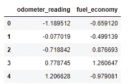

# 使用 Pandas 和 Scikit 实现数据标准化-学习

> 原文：<https://towardsdatascience.com/data-normalization-with-pandas-and-scikit-learn-7c1cc6ed6475?source=collection_archive---------2----------------------->

## 清洁数据集的完整指南—第 1 部分

杰里米·帕金斯在 [Unsplash](https://unsplash.com/?utm_source=medium&utm_medium=referral) 上的照片

一个**机器学习算法**的成功高度依赖于输入模型的数据质量。真实世界的数据通常是脏的，包含异常值、缺失值、错误的数据类型、不相关的要素或非标准化的数据。这些中的任何一个的存在都将阻止机器学习模型正确地学习。出于这个原因，将原始数据转换成有用的格式是机器学习过程中的一个重要阶段。在预处理数据时，您会多次遇到的一种技术是**归一化**。

**数据规范化**是机器学习中的常见做法，它包括将**数字列**转换为**通用比例。**在机器学习中，一些特征值会多次与其他特征值不同。具有较高值的特征将主导学习过程。然而，这并不意味着这些变量对预测模型的结果更重要。**数据标准化**将多尺度数据转换为相同尺度。归一化后，所有变量对模型有**相似的影响**，提高了学习算法的稳定性和性能。

统计学中有多种**归一化技术**。在本文中，我们将讨论最重要的几个问题:

1.  **最大绝对缩放比例**
2.  **最小-最大特征缩放**
3.  **z 值法**
4.  **稳健缩放**

此外，我们将用**熊猫**和 **Scikit-Learn** 解释如何实现它们。

那么，让我们开始吧💙

以下数据框包含用于预测二手车价格的**多元回归模型**的输入(独立变量):(1)里程表读数(km)和(2)燃油经济性(km/l)。在本文中，我们使用一个小数据集进行学习。然而，在现实世界中，所使用的数据集将会大得多。

你可以观察到，里程表读数从 120000 到 400000，而燃油经济性从 10 到 17。**多元线性回归**模型将比燃油经济性属性更重视里程表读数变量，因为它的值更高。然而，这并不意味着里程表读数属性作为一个预测因素更重要。为了解决这个问题，我们必须用**归一化**两个变量的值。❤️

# 最大绝对比例

**最大绝对缩放**通过将每个观察值除以其最大绝对值，在-1 和 1 之间重新缩放每个特征**。**

我们可以使用**在**熊猫**中应用**最大绝对缩放**。max()** 和**。abs()** 方法，如下所示。

或者，我们可以使用 **Scikit-learn** 库来计算**最大绝对缩放比例**。首先，我们用 maxabscaler 类创建一个 abs_scaler。然后，我们使用**拟合方法**学习缩放数据所需的参数(每个特征的**最大绝对值**)。最后，我们使用这些参数来转换数据。

正如你所观察到的，我们使用 **Pandas** 和 **Scikit-learn** 获得了相同的结果。下图显示了执行最大绝对缩放后的转换数据。

# 最小-最大要素缩放

**最小-最大方法**(通常称为**归一化**)通过减去特征的最小值然后除以范围，将特征重新缩放到 **[0，1]** 的**固定范围**。

我们可以使用**在**熊猫**中应用**最小-最大缩放**。min()** 和**。max()** 方法。

或者，我们可以使用 **Scikit-learn** 库中可用的 **MinMaxScaler** 类。首先，我们创建一个**缩放器对象**。然后，我们**拟合**缩放器参数，这意味着我们计算每个特征的最小和最大值。最后，我们使用这些参数对数据进行转换。

此外，我们可以获得由 **fit** 函数计算的最小值和最大值，以便用 **data_min_** 和 **data_max_** 属性对数据进行归一化。

下图显示了应用最小-最大要素缩放后的数据。正如您所观察到的，这种标准化技术将所有特征值重新调整到[0，1]的范围内。

正如你所观察到的，我们使用**熊猫**和 **Scikit-learn** 获得了相同的结果。但是，如果您想要执行许多数据转换步骤，建议使用**最小最大缩放器**作为**管道**构造器的输入，而不是使用**熊猫**执行规范化。

此外，切记**最大绝对缩放**和**最小-最大缩放**对**异常值**非常敏感，因为单个异常值会影响最小和最大值，并对结果产生重大影响。

# z 得分法

**z-score 方法**(通常称为**标准化**)将数据转换为一个**均值为 0** 、**标准差为 1** 的分布。通过减去相应特征的平均值**然后除以标准偏差**来计算每个标准化值。

与**最小-最大缩放**不同， **z 分数**不会将特征重新缩放至固定范围。如果输入呈正态分布，则 **z 值**通常在 **-3.00 到 3.00** (超过数据的 99%)之间。但是，标准化值也可以更高或更低，如下图所示。

重要的是要记住 **z 分数**不一定是正态分布的。它们只是缩放数据，并遵循与原始输入相同的分布。该变换后的分布具有平均值为 0 的**和标准差为 1** 的**，并且只有在输入要素遵循正态分布的情况下才会成为**标准正态分布**(见上图)。**

我们可以使用**来计算**熊猫**中的 **z 分数**。均值()**和 **std()** 方法。

或者，我们可以使用 **Scikit-learn** 库中可用的 **StandardScaler** 类来执行 z-score。首先，我们创建一个**标准缩放器**对象。然后，我们使用**计算转换的参数(在这种情况下，**表示**和**标准偏差**)。**方法契合()。接下来，我们称之为**。transform()** 方法将标准化应用于数据帧。**。transform()** 方法使用从**生成的参数。fit()** 方法来执行 z-score。

为了简化代码，我们使用了**。fit_transform()方法**将两种方法(fit 和 transform)结合在一起。

正如你所观察到的，这些结果与使用**熊猫**获得的结果不同。 **StandardScaler** 函数计算**总体标准差**，其中平方和除以 **N** (总体中值的数量)。

反之，**。std()方法**计算**样本标准差**，其中公式的分母是 **N-1** 而不是 **N** 。

为了使用 Pandas 获得相同的结果，我们将参数 **ddof** 设置为等于 0(默认值为 ddof=1)，它表示计算中使用的除数( **N-ddof** )。

我们可以获得由 **fit** 函数计算的参数，用于标准化具有 **mean_** 和 **scale_** 属性的数据。如你所见，当在**中设置参数 **ddof 等于 0** 时，我们在 **Scikit-learn** 和 **Pandas** 中获得相同的结果。std()** 方法。

下图显示了应用 z 得分方法后的数据，该方法是使用总体标准差(除以 N)计算的。

# 稳健的缩放

在**稳健缩放**中，我们通过减去**中值**然后除以**四分位间距**来缩放数据集的每个特征。**四分位数范围(IQR)** 定义为第三个**和第一个四分位数**之间的差值，代表数据的中间 50%。数学上，鲁棒定标器可以表示为:

其中 **Q1(x)** 是属性 x 的**第一个四分位数**， **Q2(x)** 是**中位数**， **Q3(x)** 是**第三个四分位数**。

这种方法在处理包含许多**异常值**的数据集时非常方便，因为它使用的统计数据对**异常值** ( **中值**和**四分位距**)非常稳健，而以前的定标器使用的统计数据受**异常值**的影响很大，如**最大值**、**最小值**、**平均值**和

**让我们看看**异常值**如何影响使用**最小-最大缩放**和**鲁棒缩放**缩放数据后的结果。**

**以下数据集包含 10 个数据点，其中一个是异常值**(变量 1 = 30)。****

********

******最小-最大缩放**将变量 1 移向 0，因为与变量 2 相比存在**异常值**，变量 2 的点在 0 到 1 的范围内均匀分布。****

****************

****缩放前，第一个数据点的值为(1，1)，变量 1 和变量 2 的值相等。转换后，变量 2 的值远大于变量 1 (0.034，0.142)。这是因为变量 1 有一个**异常值**。****

****相反，如果我们应用**鲁棒缩放**，两个变量在变换后具有相同的值(-1.00，-1.00)，因为两个特征具有相同的**中值**和**四分位间距**，是被移动的值**异常值**。****

****************

****现在，是时候对汽车数据集应用健壮的缩放了💜****

****正如我们之前所做的，我们可以使用 **Pandas** 来执行健壮的缩放。****

********

******中值**被定义为分布的中点，意味着分布值的 50%小于**中值**。在**熊猫**中，我们可以用**来计算。中位数()**或**。分位数(0.5)** 方法。**第一个四分位数**是数据集下半部分的中值(25%的值位于第一个四分位数以下)，可以用**计算。分位数(0.25)** 法。**第三个四分位数**代表数据集上半部分的中值(75%的值位于第三个四分位数之下)，可以用**计算。【分位数(0.75)】法。******

****作为对 **Pandas** 的替代，我们也可以使用 **Scikit-learn** 库来执行**健壮缩放**。****

********

****如上所示，我们获得了与之前相同的结果🙌****

****下图显示了使用鲁棒缩放转换数据后的结果。****

********

# ****摘要****

****数据规范化包括将**数字列**转换为**通用比例。在 Python 中，我们可以用非常简单的方式实现数据规范化。Pandas 库包含多种用于计算最常见的描述性统计函数的内置方法，这使得数据标准化技术非常容易实现。作为另一种选择，我们可以使用 Scikit-Learn 库将数据转换成通用的标度。在这个库中，已经实现了最常用的缩放方法。******

****除了数据标准化，我们还必须应用多种数据预处理技术来保证学习算法的性能。我们将在以后的文章中讨论其中的一些。🙌****

****感谢阅读:)****

****阿曼达💜****