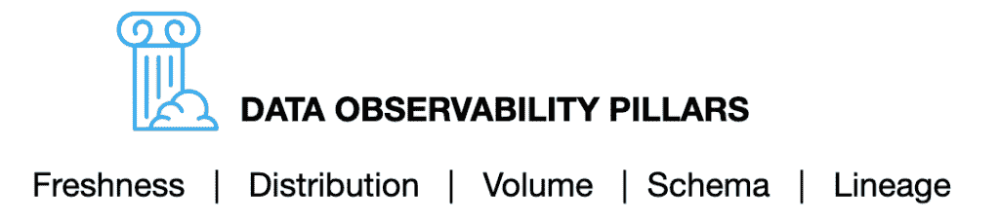
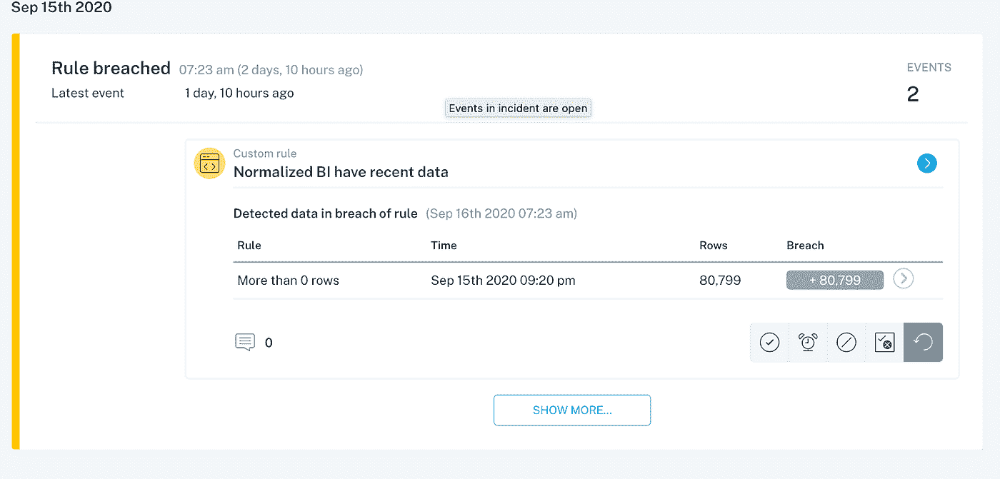
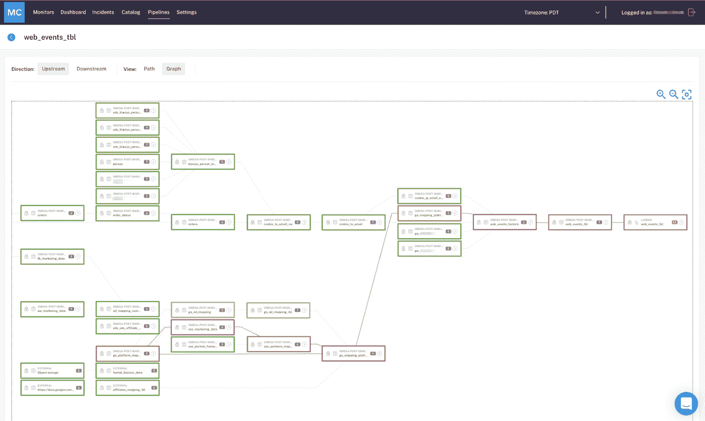

# 数据可观察性:如何防止数据管道损坏

> 原文：<https://towardsdatascience.com/data-observability-how-to-fix-your-broken-data-pipelines-3314c4fbd0d6?source=collection_archive---------31----------------------->

## 数据停机时间、可观察性和可靠见解之间的关系

图片由 [Unsplash](http://unsplash.com) 网站上的[朱莉娅·科佐斯基](https://unsplash.com/photos/X3-IypGOGSE)提供。

*虽然用于分析、聚合和建模数据的技术和方法在很大程度上跟上了现代数据组织的需求，但我们处理破损数据管道的能力却落后了。那么，我们如何在这个太常见的问题变得令人头疼之前识别、补救甚至预防它呢？* ***答案就在数据行业的下一个前沿:*** [***数据可观测性***](/data-observability-the-next-frontier-of-data-engineering-f780feb874b) ***。***

在你成长的过程中，你有没有读过一本 [*选择自己的冒险*](https://en.wikipedia.org/wiki/Choose_Your_Own_Adventure) 小说？你，主角，负责做出决定你史诗般旅程结果的选择，无论是杀死喷火龙还是踏上南极洲深处的旅程。如果您从事数据行业，这些“冒险”可能会有所不同:

## 数据分析师的追求

现在是凌晨 3 点。你已经花了 4 个小时对一个[数据消防演习](/the-rise-of-data-downtime-841650cedfd5)进行故障排除，你已经筋疲力尽了。您需要找出为什么您团队的 Tableau 仪表板没有从雪花中提取最新的数据，以便财务部门的 Jane 可以生成该报告…昨天。

## 数据工程逃脱

您正在迁移到一个新的数据仓库，并且没有办法知道重要数据存储在哪里。红移？天蓝色？Google Drive 里的电子表格？这就像一个电话游戏，试图弄清楚去哪里看，数据应该是什么样的，以及谁拥有它。

## 数据科学家的恶作剧

在你知道你公司的“好数据”在哪里之前，你需要入职 9 个月。你发现单个数据集有如此多的“FINAL _ FINAL _ v3 _ I _ PROMISE _ ITS _ FINAL”版本，以至于你再也不知道什么是 up，什么是 down，更不知道哪些数据表在生产中，哪些应该弃用。

听起来熟悉吗？

在深入探讨如何修复这个问题之前，我们先来说说数据管道破裂的常见原因: [**数据宕机**](/the-rise-of-data-downtime-841650cedfd5) 。

# 数据停机时间的增加

在互联网的早期，如果你的网站宕机，没什么大不了的——你可以在几个小时内让它恢复运行，对客户几乎没有影响(因为，坦率地说，没有那么多，我们对软件的期望也低得多)。

快进到 Instagram、T2、抖音和 T4 的时代——现在，如果你的应用崩溃，这意味着对你的业务的直接影响。为了满足我们对五个九的正常运行时间的需求，我们构建了[工具](https://newrelic.com/)、[框架](https://landing.google.com/sre/books/)，甚至是完全致力于解决这个问题的职业。

**2020 年，数据是新的软件。**

仅仅拥有一个伟大的产品已经不够了。每个认真保持竞争优势的公司都在利用数据做出更明智的决策，优化他们的解决方案，甚至改善用户体验。在许多方面，监控数据何时“中断”和管道何时被破坏的需求甚至比实现“五个九”更重要。正如一家拥有 5000 名员工的电子商务公司的一名数据主管最近告诉我的那样: ***“我公司的网站上有糟糕的数据比根本没有网站更糟糕。”***

为了向应用程序宕机的概念致敬，我们将这个问题称为[**数据宕机**](/the-rise-of-data-downtime-841650cedfd5) ，它指的是数据丢失、不准确或其他错误的时间段。数据停机会影响数据工程师、数据科学家和数据分析师，以及您公司中的其他人，导致时间浪费(数据团队工作时间的 30%[**之北)！)，**](https://www.montecarlodata.com/monte-carlo-raises-16m-to-build-the-worlds-first-data-reliability-platform/)**[沉没成本](https://www.montecarlodata.com/how-to-calculate-the-cost-of-data-downtime/)，士气低落，也许最糟糕的是，对自己的见解缺乏信任。**

数据停机往往被忽视，直到为时已晚，对您的数据管道造成严重破坏。图片由 [*蒂尔萨范迪克*](https://unsplash.com/photos/I8OhOu-wLO4) *上*[*Unsplash*](https://unsplash.com/)*。*

以下是一些常见的数据宕机来源，也许它们会引起共鸣:

*   **越来越多的数据正在从多个来源收集**。随着公司越来越依赖数据来推动决策制定，越来越多的数据被吸收，通常达到千兆字节或兆兆字节！通常，这些数据资产没有得到适当的监控和维护，从而导致日后出现问题。
*   **贵公司的快速发展**，包括合并、收购和重组。随着时间的推移，不再与业务相关的数据不会被正确归档或删除。数据分析师和数据科学家不知道什么数据是好的，什么数据可以像渡渡鸟一样。
*   **基础设施升级** [**迁移**](/migrating-to-snowflake-like-a-boss-6163293f0bcb) 。随着团队从本地迁移到云仓库，甚至在云仓库提供商之间迁移，复制数据表以避免在迁移过程中丢失任何数据是很常见的。当您忘记用新的、迁移的数据资产交叉引用旧的数据资产时，就会出现问题。

> 随着对数据收集、存储和应用程序的审查越来越严格，it 数据停机时间得到了应有的重视。

# 解决方案:数据可观察性

[**数据可观察性**](/what-is-data-observability-40b337971e3e) ，一个来自 DevOps 和软件工程中最佳实践的概念，指的是一个组织完全了解其系统中数据健康状况的能力。通过将软件应用程序可观察性和可靠性的相同原则应用于数据，可以识别、解决甚至预防这些问题，让数据团队对其数据充满信心，从而提供有价值的见解。

数据可观察性可分为五大支柱:

图片由巴尔·摩西提供。

*   我的表最后一次更新是什么时候？我的数据应该多久更新一次？
*   **分布**:我的数据在可接受的范围内吗？
*   **卷**:我的资料完整吗？2000 排突然变成 50 排了？
*   **模式**:谁有权访问我们的营销表并对其进行了更改？
*   **血统**:我的数据哪里破了？哪些表或报表受到了影响？

数据可观察性提供了对数据管道的端到端可见性，让您知道哪些数据在生产中，哪些数据资产可以废弃，从而识别和防止停机。

*一种数据可观察性方法，结合了自定义规则生成，以监控数据的特定维度何时被破坏。图片由巴尔·摩西提供。*

实现数据可观察性的强大而全面的方法包括:

*   **元数据聚合&编目**。如果你不知道你有什么数据，你当然不会知道它是否有用。数据目录通常被整合到最佳的数据可观察性平台中，为您的数据生态系统提供了一个集中的、透明的视角，在一个视图中展示丰富的谱系、模式、历史更改、新鲜度、数量、用户、查询等。
*   **自动监控&数据停机报警。**出色的数据可观察性方法将确保您是第一个知道并解决数据问题的人，让您能够在数据停机发生时立即解决其影响，而不是几个月后。最重要的是，这种解决方案需要最少的配置，而且几乎不需要设置阈值。
*   **沿袭** **追踪上下游的依存关系**。强大的端到端沿袭使数据团队能够跟踪从 A(接收)到 Z(分析)的数据流，并在流程中纳入转换、建模和其他步骤。
*   **既自定义&ML-生成规则。**我们建议选择一种两全其美的方法:使用机器学习来监控您的静态数据并确定应该设置什么规则，以及根据您的数据规格设置独特规则的能力。与编码到建模工作流或 SQL 包装器中的特殊查询不同，这种监控不会停留在“表 R 中的字段 T 的值今天低于 S”上
*   **数据分析师、数据工程师和数据科学家之间的协作。**数据团队应该能够轻松快速地协作解决问题，制定新规则，并更好地了解数据的健康状况。

*强大的端到端流程使数据团队能够跟踪其数据流，从接收、转换和测试，一直到生产、合并转换、建模和流程中的其他步骤。图片由巴尔·摩西提供。*

有了这些指导原则，数据团队可以更有效地管理数据，甚至从一开始就防止数据停机。

> 那么，您的数据冒险将带您走向何方？

*有兴趣了解有关贵组织数据可观测性的更多信息吗？把手伸向* [*巴尔摩西*](https://www.linkedin.com/in/barrmoses) *和剩下的* [*蒙特卡洛团队*](http://www.montecarlodata.com) *。*