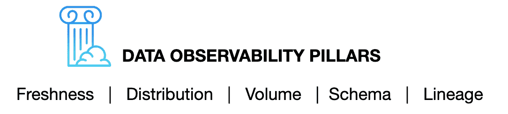
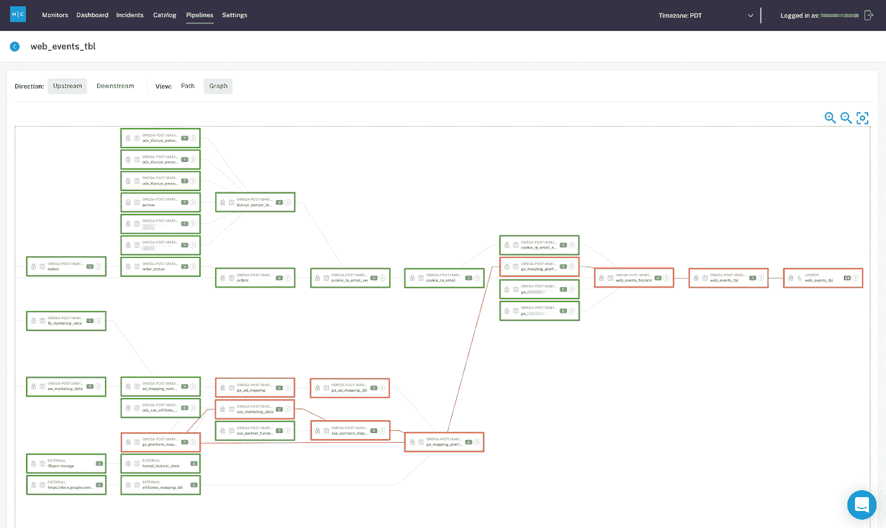
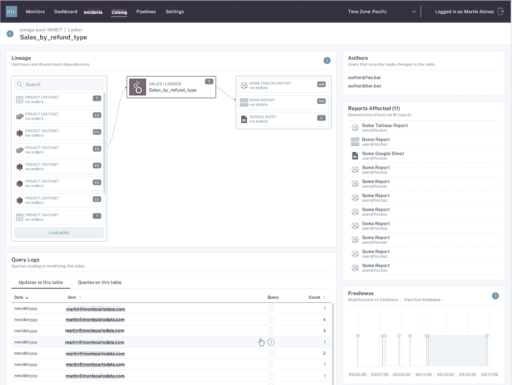

# 数据可观测性:数据工程的下一个前沿

> 原文：<https://towardsdatascience.com/data-observability-the-next-frontier-of-data-engineering-f780feb874b?source=collection_archive---------14----------------------->

## 介绍构建数据管道的更好方法

图片由 [Unsplash](http://www.unsplash.com) 上的 [Bekir Donmez](https://unsplash.com/photos/uKUjbD9tpOI) 提供。

*为了跟上数据创新的时钟速度，数据工程师不仅需要投资于最新的建模和分析工具，还需要投资于能够提高数据准确性和防止管道破裂的技术。解决办法？* [*数据可观测性*](https://www.montecarlodata.com/what-is-data-observability/) *，数据工程的下一个前沿和新兴支柱* [*数据可靠性范畴*](http://www.montecarlodata.com/introducing-the-pioneers-of-data-reliability) *。*

随着公司越来越受数据驱动，这些丰富见解背后的技术变得越来越微妙和复杂。虽然我们收集、存储、聚合和可视化这些数据的能力已经在很大程度上跟上了现代数据团队的需求(想想:[面向领域的数据网格](https://www.montecarlodata.com/what-is-a-data-mesh-and-how-not-to-mesh-it-up/)、[云仓库](https://www.montecarlodata.com/how-to-migrate-to-snowflake-like-a-boss/)、[数据可视化工具](https://coronavirus.jhu.edu/map.html)和[数据建模解决方案](https://en.wikipedia.org/wiki/Data_modeling))，但是[数据质量](https://www.montecarlodata.com/how-to-fix-your-data-quality-problem/)和完整性背后的机制已经落后了。

无论您的分析仪表板有多先进，或者您在云上的投资有多大，如果它吸收、转换和推送到下游的数据不可靠，那么您最好的计划都是徒劳的。换句话说，“垃圾入”就是“垃圾出”。

在我们讨论数据可靠性之前，让我们先讨论一下不可靠的“垃圾”数据是如何产生的。

# 好数据如何变坏

在过去 12 个月与数百个数据工程团队交谈后，我注意到好数据变坏有三个主要原因:1)单个数据生态系统中的数据源越来越多，2)数据管道越来越复杂，3)更大、更专业的数据团队。

## 越来越多的数据源

如今，公司使用数十到数百个内部和外部数据源来生成分析和 ML 模型。这些来源中的任何一个都可能在没有通知的情况下以意想不到的方式发生变化，从而危及公司用于决策的数据。

例如，工程团队可能会对公司的网站进行更改，从而修改对营销分析至关重要的数据集的输出。因此，关键营销指标可能是错误的，导致公司在广告活动、销售目标和其他重要的创收项目上做出糟糕的决策。

## 日益复杂的数据管道

数据管道越来越复杂，具有多个处理阶段和各种数据资产之间的重要依赖关系。由于缺乏对这些依赖关系的了解，对一个数据集的任何更改都可能会产生意想不到的后果，影响相关数据资产的正确性。

像改变一个系统中的单位这样简单的事情可能会严重影响另一个系统的正确性，就像火星气候轨道飞行器的情况一样。作为美国宇航局的一个太空探测器，火星气候轨道器由于数据输入错误而坠毁，该错误产生了非国际单位与国际单位的输出，使其过于接近火星。像航天器一样，分析管道在过程的任何阶段都极易受到最无害的变化的影响。

## 更大、更专业的数据团队

随着公司越来越依赖数据来推动智能决策，他们正在雇用越来越多的数据分析师、科学家和工程师来构建和维护数据管道、分析和 ML 模型，为他们的服务和产品以及业务运营提供支持。

沟通不畅或协调不充分是不可避免的，并且会导致这些复杂的系统随着变化而崩溃。例如，一个团队添加到数据表中的新字段可能会导致另一个团队的管道失败，从而导致数据丢失或部分丢失。在下游，这种不良数据可能导致数百万美元的收入损失、客户信任度下降，甚至是合规风险。

坏数据的好消息是什么？数据工程正在经历它自己的复兴，我们应该非常感谢我们在 [DevOps](https://en.wikipedia.org/wiki/DevOps) 的同行，感谢他们为我们指引下一个前沿领域的一些关键概念和原则。

# 下一个前沿:数据可观察性

界定“垃圾数据”影响的一个简单方法是从软件应用程序可靠性的角度来看。在过去十年左右的时间里，软件工程师利用 New Relic 和 DataDog 等目标解决方案来确保应用程序的高正常运行时间(换句话说，工作的、高性能的软件)，同时将停机时间(中断和落后的软件)降至最低。

在 data 中，我们把这种现象叫做[数据宕机](https://www.montecarlodata.com/the-rise-of-data-downtime/)。数据宕机指的是数据不完整、错误、丢失或不准确的时间段，随着数据系统变得越来越复杂，它只会成倍增加，从而支持无止境的源和消费者生态系统。

> 通过将软件应用程序可观察性和可靠性的[相同原则应用于数据](https://www.montecarlodata.com/what-is-data-observability/)，可以识别、解决甚至预防这些问题，让数据团队对其数据充满信心，从而提供有价值的见解。

图片由巴尔·摩西提供。

下面，我们将介绍数据可观测性的五大支柱。每个支柱都包含一系列问题，这些问题总体上提供了数据运行状况的整体视图。也许你会觉得它们很眼熟？

*   **新鲜度**:数据是最近的吗？最后一次生成是什么时候？包含/省略了哪些上游数据？
*   **分布**:数据是否在可接受的范围内？格式是否正确？完成了吗？
*   **卷**:数据都到了吗？
*   **模式**:什么是模式，它是如何改变的？谁做了这些改变，原因是什么？
*   **沿袭**:对于给定的数据资产，受其影响的上游来源和下游资产是什么？谁是生成这些数据的人，谁依赖这些数据来做决策？

一个强大而全面的数据可观察性方法需要通过一个集中的界面对这五大支柱进行一致而可靠的监控，该界面是关于数据健康状况的真实信息的集中来源。

*端到端数据可靠性平台允许团队探索和了解他们的数据谱系，自动映射上游和下游依赖关系，以及这些资产的健康状况。图片由巴尔·摩西提供。*

一个有效、主动的数据可观察性解决方案将快速、无缝地连接到您现有的堆栈，提供端到端的沿袭，允许您跟踪下游的依赖关系。此外，它将自动监控您的静态数据，而无需从您的数据存储中提取数据。这种方法可确保您满足最高级别的安全性和合规性要求，并扩展到要求最苛刻的数据量。

这种解决方案还需要最少的配置，并且实际上不需要设置阈值。它使用 ML 模型来自动学习您的环境和数据。它使用异常检测技术让你知道什么时候有东西坏了。此外，它不仅考虑了单个指标，还考虑了数据的整体视图以及任何特定问题的潜在影响，从而最大限度地减少了误报。

这种方法提供了丰富的上下文，能够快速进行分类和故障排除，并与受数据可靠性问题影响的利益相关方进行有效沟通。与特别查询或简单的 SQL 包装器不同，这种监控不会停留在“今天表 Y 中的字段 X 的值低于 Z”上

*数据目录将关于数据资产的所有元数据都放在单一窗口中，因此您可以在单一视图中看到沿袭、模式、历史更改、新鲜度、容量、用户、查询等。图片由巴尔·摩西提供。*

也许最重要的是，这种解决方案通过公开这五大支柱中有关数据资产的丰富信息，从一开始就防止了数据宕机事件的发生，以便能够负责任地、主动地进行更改和修改。

# 数据可观察性的下一步是什么？

就我个人而言，我对这个数据工程的新领域感到无比兴奋。随着数据领导者越来越多地投资于利用数据可观察性的数据可靠性解决方案，我预计该领域将继续与数据工程中的其他一些主要趋势相交，包括:[数据网格](https://www.montecarlodata.com/what-is-a-data-mesh-and-how-not-to-mesh-it-up/)、机器学习、[云数据架构](https://www.montecarlodata.com/how-to-migrate-to-snowflake-like-a-boss/)，以及[数据产品的平台化](https://www.montecarlodata.com/how-to-build-your-data-platform-like-a-product/)。

*有兴趣了解更多关于数据可观察性的信息吗？伸出手去* [*巴尔摩西*](https://www.linkedin.com/in/barrmoses/) *和剩下的* [*蒙特卡洛团队*](https://www.montecarlodata.com/) *。*

*有兴趣加入数据可靠性运动吗？把手伸向* [*蒙特卡洛团队*](https://www.montecarlodata.com/request-a-demo/) *！*

