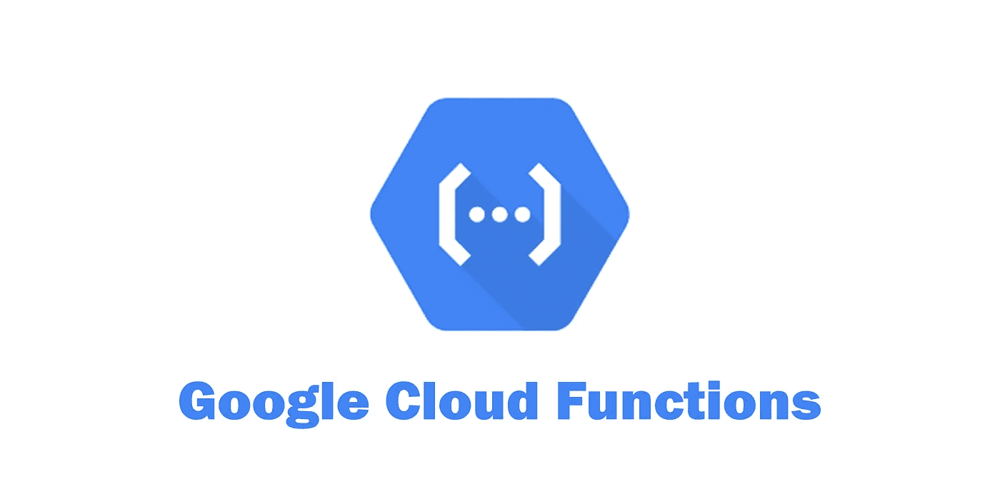
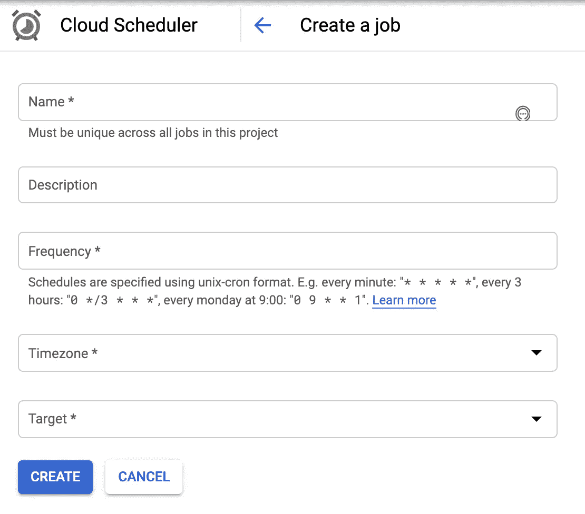
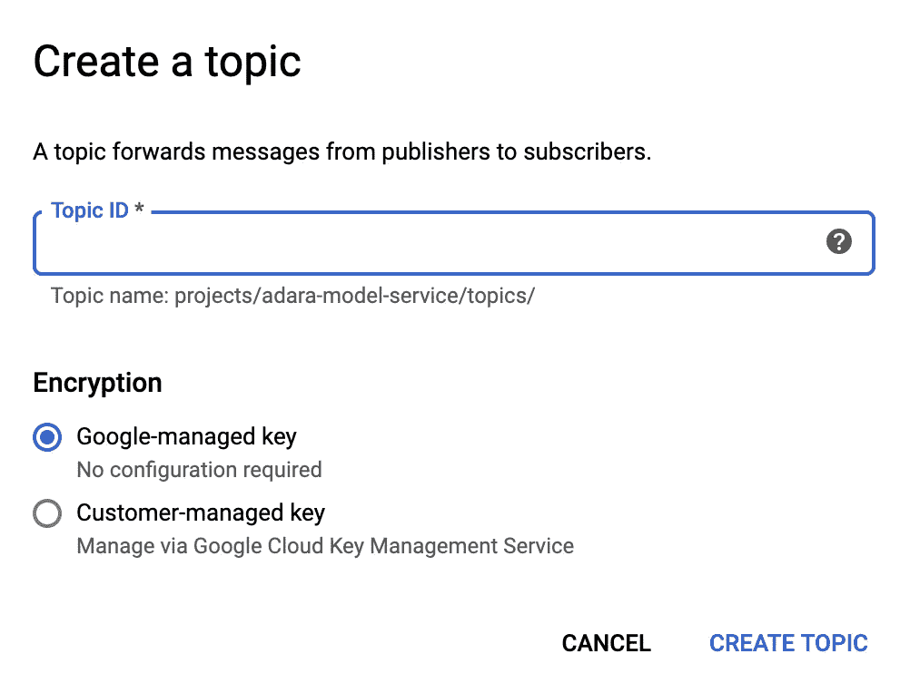
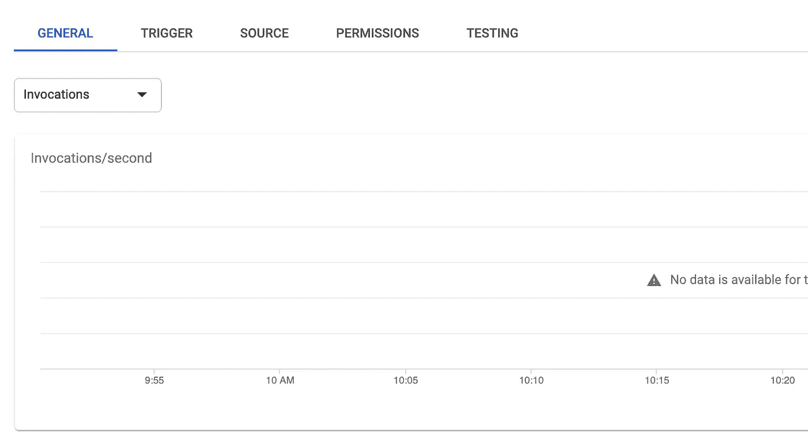

# GCP 的数据管道:云功能基础

> 原文：<https://towardsdatascience.com/data-pipeline-in-gcp-cloud-function-basics-524e870cfaa5?source=collection_archive---------40----------------------->



来源:谷歌云

大多数数据科学家更喜欢拥有他们模型的端到端数据管道，但是拥有管道需要大量的工程工作。

在本文中，我将讨论云功能，这是一个无服务器、简单且经济的选项。

# 第一步:日程安排

GCP 提供了一个简单的调度工具，叫做“云调度器”。从左上角的导航菜单中找到云调度程序。

给你的工作一个名字和描述。接下来，您需要提供计划的频率。如果您曾经使用过包括 Cron 作业在内的任何调度程序，您在这里都会很好。

选择时区和发布/订阅作为目标。



云调度程序用户界面

一旦你点击主题和有效载荷的发布/订阅选项。主题名称稍后将用作 Python 函数的名称，因此请记住使用 Python 中可接受的函数名称主题。现在给 payload 一些任意的字符串。

如果您喜欢使用命令行，可以运行以下命令:

```
gcloud alpha scheduler jobs create pubsub scheduler-name --schedule="0 8 * * *" --topic="my_pipeline_topic" --message-body=" "
```

现在，您应该能够在 Cloud Scheduler 中看到您的计划作业。

# 第二步:发布/订阅

我推荐你阅读谷歌关于 [Pub/Sub](https://cloud.google.com/pubsub) 的文档。但是简单一句话，Pub/Sub 允许你在不同的应用之间发送消息。您可以将发布/订阅用于批处理和流数据管道。

现在使用该主题创建一个发布/订阅主题

```
gcloud pubsub topics create my_pipeline_name
```

您可以选择使用 UI 创建发布/订阅主题:



从用户界面创建发布/订阅主题

# 第三步:云功能

你可以选择从用户界面创建你的云功能，但我不建议这样做。首先，如果你的代码中有一个 bug，你将会丢失你的工作。第二，您很容易忘记您的更改和版本。

作为第一步，让我们在本地创建我们的函数，并将它们手动部署到 GCP。

你需要什么？

你需要一个“main.py”函数。这是所有函数和类的包装器。在 main.py 中应该有一个函数使用我们的云函数名。

```
your imports here
def my_pipeline_name(event,contex):
    your_code_here
```

将其余的功能放在同一个文件夹中，这样更容易！

下面是根据[谷歌](https://cloud.google.com/functions/docs/writing/background)对事件和背景的定义:

```
event (dict):  The dictionary with data specific to this type of
         event. The `data` field contains the PubsubMessage message. 
context (google.cloud.functions.Context): The Cloud Functions event
         `timestamp` field contains the publish time.
```

所以别管他们了！

创建一个. gcloudignore 文件。这个文件类似于一个. gitignore，但是用于云部署。您可以包含不想部署的文件(比如您保存在文件夹中用于本地测试的密钥)

用所需的包创建一个 requirements.txt 文件。

在运行过程中，您可能需要保存一些文件，但是您的云函数的根是只读的！您需要使用`/temp/`目录来存放临时文件和可修改文件。

是时候部署了！

```
gcloud functions deploy my_pipeline_name  --runtime python37
--trigger-topic my_pipeline_topic --timeout 540
```

这里有一个很大的限制！根据[文档](https://cloud.google.com/functions/docs/concepts/exec#timeout)，云功能的最大超时为 9 分钟。

查看[兹登科的](https://medium.com/google-cloud/simple-serverless-data-pipeline-on-google-cloud-platform-ab8941ce0f8e)文章和 GitHub 了解更多详情。

# 步骤 4:在 UI 上测试

转到 GCP UI 上的云功能，然后单击功能名称，它会将您重定向到一个名为“功能详细信息”的新页面，其中有最新的部署版本



云功能详细信息

在 general 选项卡中，您可以找到调用、执行时间、内存使用和活动实例。所有这些都是计费的重要因素(我知道云功能很便宜，但跟踪成本是一种很好的做法)。可以参考你 Romin 的关于[云函数](https://rominirani.com/google-cloud-functions-tutorial-pricing-9cc6dc47f7c0)定价的文章。

你可以点击顶部中间的“编辑”,更改内存、功能或…

单击 Source，您将找到已部署的文件，您可以单击 edit 在线修改它们(不推荐)。

转到测试选项卡，点击`TEST THE FUNCTION`，代码将运行，如果有任何问题，将返回一个错误。但这是对云功能的测试，Pub/Sub 和 Scheduler 呢？

您可以从导航菜单进入“云调度程序”，您会在您的作业名称前找到一个`Run Now`按钮。你可以用它来测试和检查`Result`栏下的信息。

# 第五步:密钥

我不喜欢在代码中部署我的秘密密钥，这里我将回顾一下我处理秘密的两个最佳选择。

第一个是将环境变量添加到云函数中。您可以使用 UI 或命令行。这个选项不是我最喜欢的，因为首先秘密就在 UI 中，其次我必须再次为其他功能部署它。

第二个选择是使用 GCP 的秘密经理。我将从 Dustin 关于管理云函数秘密的帖子中借用一些材料。

现在可以用云壳了。图标在搜索栏的右上方。

启用“机密管理器 API”:

```
gcloud services enable secretmanager.googleapis.com 
```

创造一个秘密:

```
echo -n "your secret text here" | \
    gcloud beta secrets create my-secret \
      --data-file=- \
      --replication-policy automatic
```

如果你的秘密文件中有双引号，那就用单引号括起来。

编写一个函数来检索您的秘密:

```
import os
from google.cloud import secretmanager
import json
def get_secret*(*secret_name*)*:
    client = secretmanager.SecretManagerServiceClient*()* project_id = 'my_gcp_project'
    resource_name = f"projects/*{*project_id*}*/secrets/*{*secret_name*}*/versions/latest"
    response = client.access_secret_version*(*resource_name*)* secret_string = response.payload.data.decode*(*'UTF-8'*)* secret_string = json.loads*(*secret_string*)* return secret_string
```

您可以在剩下的代码中调用这个函数来检索您的密钥。确保将“google-cloud-secret-manager”添加到您的需求文件中。

你准备好了！去 UI 测试！

# 第六步:连接回购

即使您可以从本地部署，Google 也提供了一个[选项](https://cloud.google.com/functions/docs/deploying/repo)，用于从 GitHub 或 BitBucket 之类的源代码控件进行部署。让我们一步一步来。

[**镜幽库**](https://cloud.google.com/source-repositories/docs/mirroring-a-bitbucket-repository)

1.  在 Google Cloud 控制台中，打开云源代码库。
2.  [开放云源代码库](https://source.cloud.google.com/repos)
3.  点击**添加存储库**。
4.  将打开**添加存储库**页面。
5.  选择**连接外部库**并点击**继续**。
6.  将打开**连接外部存储库**页面。
7.  在**项目**下拉列表中，选择镜像存储库所属的 Google Cloud 项目。
8.  在 **Git 提供者**下拉列表中，选择 **Bitbucket** 。
9.  选中复选框以授权云源存储库存储您的凭据。
10.  点击**连接到铲斗**。
11.  使用您的机器用户凭据登录 Bitbucket。
12.  点击**授权 GoogleCloudPlatform** 。
13.  此选项授予 Google Cloud 对您的存储库的读取权限。
14.  授权完成后，您将返回到**连接外部存储库**页面。将打开存储库列表。
15.  从存储库列表中，选择要镜像的存储库。
16.  点击**连接选中的库**。

在左上方的“云资源存储库”下方，您可以找到您的存储库的名称以及活动分支。点击下拉菜单，更改查看其余分支。

**从云回购部署**

您可以使用以下命令从云源存储库部署到云功能:

```
gcloud functions deploy my_pipeline_name \
  --source [https://source.developers.google.com/projects/[gcp_project_name]/repos/[cloud_source_repository_root]/moveable-aliases/[branch]/paths/[folder](https://source.developers.google.com/projects/[gcp_project_name]/repos/[cloud_source_repository_root]/moveable-aliases/[branch]/paths/google_ads/[folder)_under_that_branch]/ \
  --runtime python37 \
  --trigger-topic my_pipeline_topic --timeout 540
```

现在检查你的功能，版本应该增加。前往`TESTING`选项卡，享受通过测试的乐趣吧！

现在您已经将您的存储库镜像到“云源存储库”了，如果您检查您的云函数的源代码，您会看到它现在指向您的 repo！

这一步似乎是多余的，因为您可以从本地部署，但是让我们进入下一步。

# 第七步:CI/CD

到目前为止，我们已经学习了如何从本地和从云 repo 进行部署，下面让我们学习如何设置 CI/CD！

您需要在您的目录中添加一个“cloudbuild.yaml ”,并放入以下内容:

```
steps:
- name: gcr.io/cloud-builders/gcloud
  args:
    - functions
    - deploy
    - my_pipeline_name
    - --source=https://source.developers.google.com/projects/[[gcp_project_name](https://source.developers.google.com/projects/[gcp_project_name]/repos/[cloud_source_repository_root]/moveable-aliases/[branch]/paths/google_ads/[folder)]/repos/[[cloud_source_repository_root]](https://source.developers.google.com/projects/[gcp_project_name]/repos/[cloud_source_repository_root]/moveable-aliases/[branch]/paths/google_ads/[folder)/moveable-aliases/[[branch]](https://source.developers.google.com/projects/[gcp_project_name]/repos/[cloud_source_repository_root]/moveable-aliases/[branch]/paths/google_ads/[folder)/paths/google_ads/[[folder](https://source.developers.google.com/projects/[gcp_project_name]/repos/[cloud_source_repository_root]/moveable-aliases/[branch]/paths/google_ads/[folder)_under_that_branch]/
    - --trigger-topic=my_pipeline_topic
    - --runtime=python37
    - --timeout=540
```

现在从 GCP 的导航菜单转到云构建，转到触发器，并点击“创建新的”。现在应该是直截了当了！给你的触发器一个名称和描述。我想在每次推送到分支时触发构建，所以将选择该选项。在 source 部分，我将找到步骤 6 中的镜像 repo，并输入分支的名称。

由于构建配置保存在 cloudbuild 中，我将选择第一个选项，并将路径复制并粘贴到 YAML 文件。

一切就绪，单击“创建”并享受您的 CI/CD 管道！