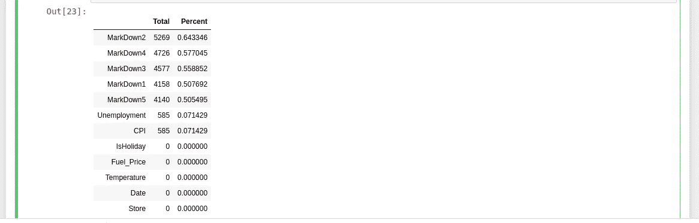
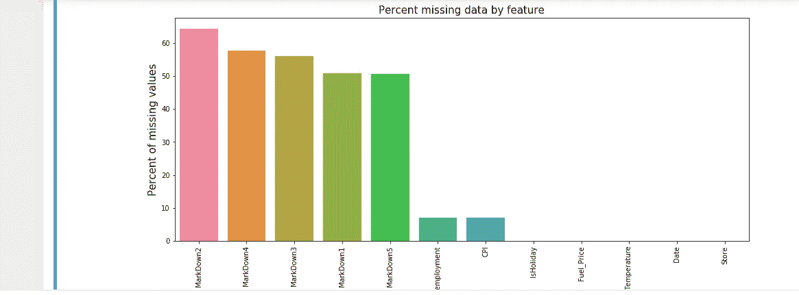

# 数据预处理:分步指南

> 原文：<https://towardsdatascience.com/data-pre-processing-a-step-by-step-guide-541b083912b5?source=collection_archive---------11----------------------->

我们知道，对数据进行充分的分析和特征工程会产生良好的可视化效果，但是人们在开始时经常会遇到问题。


来源:BY[route 79](https://www.flickr.com/photos/31956880@N00)根据 [CC BY-NC-SA 2.0](https://creativecommons.org/licenses/by-nc-sa/2.0/?ref=ccsearch&atype=rich) 获得许可

在这篇文章中，让我们来看看数据预处理的不同步骤。

# 1.用什么编码平台？

虽然 Jupyter Notebook 是一个很好的起点，但 Google Colab 始终是协作工作的最佳选择。在这篇文章中，我将使用 Google Colab 展示数据预处理步骤。

# **2。如何为进一步的分析准备原始数据？**

在针对任何问题优化数据时，遵循正确的步骤以达到正确的目的是很重要的。

```
## Import required libraries
import numpy as np
import pandas as pd## Upload dataset
from google.colab import files
uploaded = files.upload()
```

## 2.1 选择要上传的文件

```
## Read a .csv file to pandas dataframe
df = pd.read_csv(uploaded['data.csv'])## Read a .json file to pandas dataframe
df = pd.read_json(uploaded['data.json'])## Read an excel file to pandas dataframe
df = pd.read_excel(uploaded['data.xlsx'])
```

答。csv 文件可以基于`;`或任何其他分隔符(包括空格)进行分隔。

## 2.1.1 示例:以空格或制表符作为分隔符的 CSV 文件

```
*##* Read a .csv file to a dataframe with delimiter as space or tab:
df =  pd.read_csv('data.csv',  sep='\s+', engine='python')Output :
   Name  Age  City
0  Jack   34  Sydney
1  Jill   31  Melbourne
```

## 2.1.2 示例:具有多个分隔符的 CSV 文件

```
*##* Read a .csv file to a dataframe with multiple delimiters :
df =  pd.read_csv('data.csv',  sep='[:,|_]', engine='python')Input :
Name,Age|City
Jack,34_Sydney
Jill:31,Melbourne
Adam,16:New YorkOutput :
   Name  Age   City
0  Jack   34   Sydney
1  Jill   31   Melbourne
2  Adam   16   New York
```

# **3。描述数据有哪些不同的方式？**

## 3.1 数据的维度

```
df.shape 
# df is the dataframe object name whose dimension we want to obtain
```

## 3.2 从数据集中删除重复项

```
df.drop_duplicates(inplace=True)
```

`inplace=True`确保 dataframe 对象被修改，但不创建其副本。如果你需要返回数据帧的副本，使用`inplace=False`代替。

## 3.3 每个数字列的描述

```
df.describe()
```

`describe()`通过最小值和最大值以及平均值、中值、标准偏差&等几个值，帮助获得数据集的基本信息。

## 3.4 获取数据集的第一行或最后几行

```
df.head(5) # returns first '5' rows of the dataframe
df.tail(5) # returns last '5' rows of the dataframe
```

## 3.4 列名

如果数据集包含大量的要素(列)，它有助于获取整个要素列表。使用`df.columns`以描述性格式返回数据帧中所有列的名称。

```
df.columnsOutput:
Index(['MSSubClass', 'LotFrontage', 'LotArea', 'OverallQual', 'OverallCond', 'YearBuilt', 'YearRemodAdd', 'MasVnrArea', 'BsmtFinSF2', 'SalePrice'], dtype='object')
```

## 3.5 检查列的数据类型和每列中的条目数:

```
df.info()
```

## 3.6 删除数字列中的特殊字符

现在，在几个实例中，包含数字数据的列可以具有“对象”数据类型。由于缺少数据点，一些特殊字符如`**?**`或`space`可能出现在连续变量中。在这种情况下，我们将检查唯一条目，以删除它们并更改数据类型:

```
for col in ['names of each column containing object datatype with numeric data points']:
  uni_val_col = df[col].unique()
  print ('The unique values in ' , col , 'are ', uni_val_col)## Convert string datatype to float wherever required and change special characters to NaN
for col in ['names of each column containing object datatype with numeric data points']:
  df[col] = pd.to_numeric(df[col], errors='coerce')
```

这将某些列的特殊字符转换为`NaN`(非数字)值，并转换为`numeric`类型。

## 3.7 创建独立的连续和分类数据框架

```
## Create a dataframe with continuous columns 
df_cont = df.select_dtypes(include = ['int64','float64'])## Create a dataframe with categorical columns 
df_cat = df.select_dtypes(include =['object'])
```

## 3.8 从分类列中删除特殊字符

我们应该在分类列中检查类似的特殊字符(如 3.6 节所述)，并用适当的值替换它们。

```
df.replace(to_replace=["?", ";"], value=np.nan)
```

# **4。缺失值处理**

没有输入缺失值的最佳方法。它总是取决于问题的类型。在这里，我们只关注执行分析时要遵循的程序。

## 4.1 查找缺失值百分比

在这里，我们可以看到如何获得我们在 3.7 节中创建的连续数据帧中缺失值的百分比

```
# Percentage of missing values in each dataframe along with visualizationtotal = df_cont.isnull().sum().sort_values(ascending=False)
percent = df_cont.isnull().sum()/df_cont.isnull().count()).sort_values(ascending=False)
missing_data = pd.concat([total, percent], axis=1, keys=['Total', 'Percent'])
f, ax = plt.subplots(figsize=(15, 6))
plt.xticks(rotation='90')
sns.barplot(x=missing_data.index, y=missing_data['Percent'])
plt.xlabel('df_cont', fontsize=15)
plt.ylabel('Percent of missing values', fontsize=15)
plt.title('Percent missing data by feature', fontsize=15)
missing_data
```

输出:



我们可以将同样的方法应用于分类数据框架`**df_cat**`

## 4.2 缺失值的插补

## 数字数据框架

任何列的缺失值都可以通过均值、中值或众数进行估算。如果列中的数据点没有太大的偏差，对于连续数据点，中值比平均值更适合用于替换空值。

```
df_cont.'columnname'.fillna(features.Unemployment.median(), inplace=True)
```

与其他方法相比，我更喜欢用 KNN 插补来处理缺失值，因为它能提供更好的结果。

```
from sklearn.impute import KNNImputer
imputer = KNNImputer(n_neighbors=10) 
df_data = imputer.fit_transform(df_cont)## Creating a new dataframe of the imputed data
df_num = pd.DataFrame(df_data, columns = df_cont.columns )
```

## 4.2.2 分类数据框架

在分类数据点的情况下，我们可以用模式来代替它

```
## Replacing NaN with mode for a column
df_cat.replace({'NaN':'four'} , inplace =True)
```

# **5。数据分发**

## 5.1 数字数据帧的图形表示

```
## Plot distplot for continuous data columns 
for col in df_num.columns:
  plt.figure()
  sns.distplot(df_num[col])
```

## 5.2 分类数据框架的图示

```
## Plotting bar plots for categorical data columns
for col in df_cat.columns:
    plt.figure()
    sns.countplot(x=col, data=df_cat)
    plt.xticks(rotation=90)
```

# **6。异常值的处理**

## 6.1 异常值百分比和其他描述性统计措施

异常值是可能影响也可能不影响模型的任何特征的极值。要获得每个数值或分类属性中异常值的百分比，我们可以使用-

```
# Use the appropriate dataframe in place of "dataframe_name" in the code below, i.e. in this case **df_num** and **df_cat**df_outliers = pd.DataFrame(index=dataframe_name.columns, columns=['outliers', 'outliers%']) for col in dataframe_name.columns:if any(x in str(dataframe_name[col].dtype) for x in ['int', 'float']):df_outliers.loc[col, 'count'] = len(dataframe_name)
df_outliers.loc[col, 'q1'] = dataframe_name[col].quantile(0.25)
df_outliers.loc[col, 'q3'] = dataframe_name[col].quantile(0.75)
df_outliers.loc[col, 'iqr'] = df_outliers.loc[col, 'q3'] - df_outliers.loc[col, 'q1']
df_outliers.loc[col, 'lower'] = df_outliers.loc[col, 'q1'] - (3 * df_outliers.loc[col, 'iqr'])
df_outliers.loc[col, 'upper'] = df_outliers.loc[col, 'q3'] + (3 * df_outliers.loc[col, 'iqr'])
df_outliers.loc[col, 'min'] = df[col].min()
df_outliers.loc[col, 'max'] = df[col].max()
df_outliers.loc[col, 'outliers'] = ((dataframe_name[col] < df_outliers.loc[col, 'lower']) | (df[col] > df_outliers.loc[col,'upper'])).sum()
df_outliers.loc[col, 'outliers%'] = np.round(df_outliers.loc[col,
'outliers'] / len(dataframe_name) *100)df_outliers
```

我们也可以对每个特征使用箱线图来获得相同的图形表示。

## 6.2 异常值的处理

有不同的方法来处理异常值，z-score 是最简单的一种。

```
from scipy import statsz_scores = stats.zscore(dataframe_name)
abs_z_scores = np.abs(z_scores)
entries = (abs_z_scores < 3).all(axis=1)
dataframe_name = dataframe_name[entries]
```

这就完成了我们最初的数据预处理！我们现在可以从可视化和特征工程开始，使我们的数据集模型就绪。