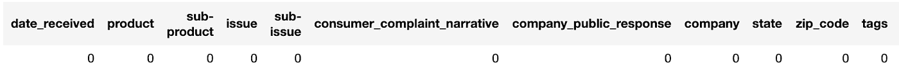
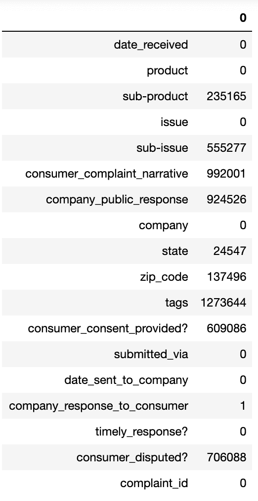
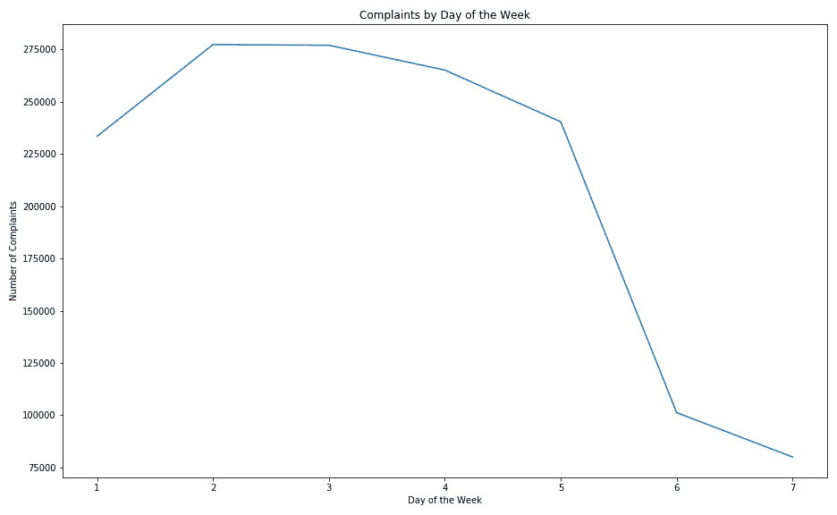
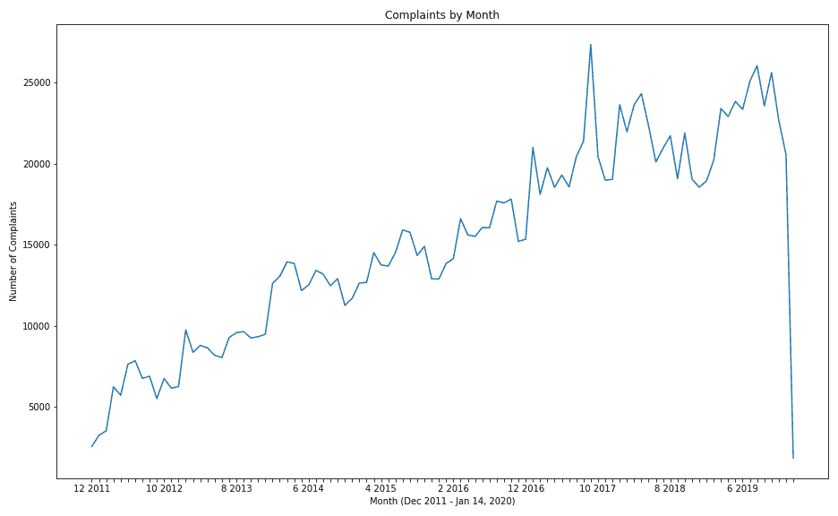
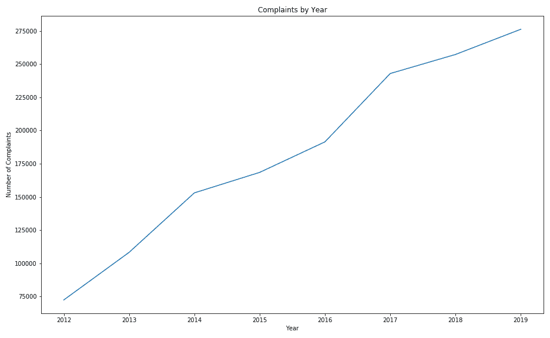
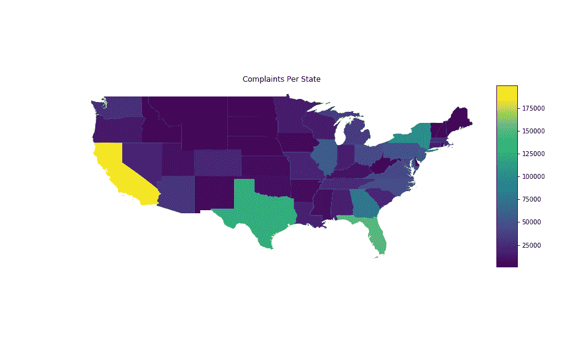
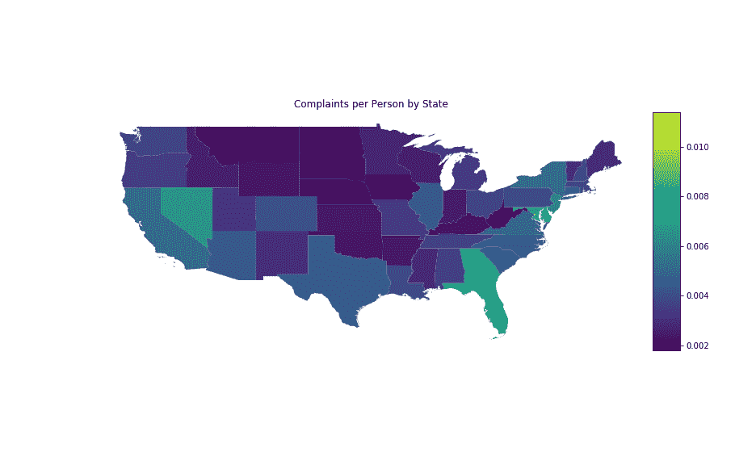
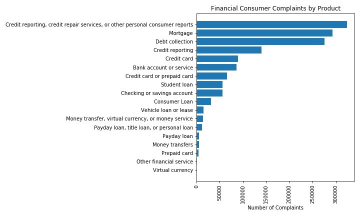

# 使用火花数据帧进行数据准备

> 原文：<https://towardsdatascience.com/data-prep-with-spark-dataframes-3629478a1041?source=collection_archive---------9----------------------->

## 使用 PySpark 继续调查金融服务消费者投诉数据库


当你向消费者金融保护局投诉时，你希望得到的平静——照片由 [Unsplash](https://unsplash.com?utm_source=medium&utm_medium=referral) 上的 [Stephen Walker](https://unsplash.com/@stphnwlkr?utm_source=medium&utm_medium=referral) 拍摄

正如我们在[上周的博客](/exploring-financial-consumer-complaints-with-spark-48a253f9c830?source=friends_link&sk=66da638afb846bf78032a63afd8acc0c)中看到的，三大信用报告机构是美国联邦金融服务消费者投诉数据库中被投诉最多的公司之一。想想你的信用评分被用来做的每一件事都很有趣:获得贷款、租公寓、购买手机套餐。算了吧。与其说有趣，不如说可怕。因此，今天我们将深入挖掘投诉数据库，回答我一直在思考的几个问题:

*   收到的投诉数量与星期几有什么关系？
*   这些年来投诉数量有什么变化？
*   投诉数量每月有何变化？
*   哪个州的居民抱怨最多？
*   不同州的人提交投诉的比率不同吗？
*   哪些产品被投诉最多？

一旦你有了 Spark 数据框架中的数据(如果没有，查看上周的[文章](/exploring-financial-consumer-complaints-with-spark-48a253f9c830?source=friends_link&sk=66da638afb846bf78032a63afd8acc0c))，你就准备好做一些探索和清理了。 [PySpark 数据框架](https://spark.apache.org/docs/2.3.0/api/python/pyspark.sql.html#pyspark.sql.DataFrame)、 [PySpark 列](https://spark.apache.org/docs/2.3.0/api/python/pyspark.sql.html#pyspark.sql.Column)和 [PySpark 函数](https://spark.apache.org/docs/2.3.0/api/sql/index.html)文档肯定会成为你的朋友，因为你在自己的环境中工作(分别是 Ross、Monica 和 Chandler……对不起 Joey，我仍然不确定你在数据科学世界中的位置)。对于我在[美国联邦金融服务消费者投诉数据库](https://www.consumerfinance.gov/data-research/consumer-complaints/)上的项目，我将计数、填充和删除 nan，将 date 列转换为 datetime 并提取日期特征，并对照可接受值列表检查值。

# 使用 Jupyter 笔记本时，更易于使用的输出格式

在开始之前，我建议您像这样设置 Spark 配置:

```
spark.conf.set('spark.sql.repl.eagerEval.enabled', True)
```

这个设置使得输出更像熊猫，而不像命令行 SQL。此后，您不再需要指定 show()来查看输出。或者，您也可以使用`.toPandas()`或`.toPandas().T`(用于移调)来查看熊猫风格的输出。请记住，仅在足够小以适合内存的数据帧上执行此操作。太大的`pandas`数据帧很容易使你的内核崩溃。

# 计算 nan 和 Nulls

请注意，在 PySpark 中，NaN 与 Null 不同。这两者也不同于空字符串""，因此您可能希望在任何数据集特定填充值之上检查其中的每一个。

像这样检查 nan:

```
from pyspark.sql.functions import isnan, when, count, coldf.select([count(when(isnan(c), c)).alias(c) for c in df.columns])
```



您可以在这里看到，这种格式肯定比标准输出更容易阅读，标准输出不适合长列标题，但它仍然需要向右滚动才能看到剩余的列。

这个数据集没有 NaNs，所以我转到 Null。

您可以使用以下代码计算空值:

```
from pyspark.sql.functions import when, count, coldf.select([count(when(col(c).isNull(), c)).alias(c) for c in 
           df.columns]).toPandas().T
```



# **检查重复**

为了检查重复项，我比较了 df.count()和 df.distinct()。计数()。在这种情况下，我没有。

# **处理空值**

接下来，我决定删除 company_response_to_consumer 中值为 null 的那一行。这里我们看到它和熊猫很像。

```
df_clean = df.dropna(subset='company_response_to_consumer')
```

对于 consumer _ contracted 列，我决定用 No 替换 null 值，同时为这一更改添加一个 flag 列:

```
# add flag column
df_clean = df_clean.withColumn('null_c_disputed', 
                            df_clean['consumer_disputed?'].isNull())# fill na in consumer_disputed? with 'No'
df_clean = df_clean.fillna('No', subset=’consumer_disputed?’)
```

同样，这与 pandas 非常相似，除了用于添加列的新语法“withColumn”)。在下一节中，您将看到添加新列的另一种方法。

# **将字符串转换为日期(时间)并生成日期相关特征**

```
from pyspark.sql.functions import (to_date, datediff, date_format, 
                                   month)# add datetime columns
df_clean = df_clean.select('*', to_date(df_clean['date_received'], 
                          'MM/dd/yyyy').alias('date_received_dt'))
df_clean = df_clean.select('*', 
                    to_date(df_clean['date_sent_to_company'], 
                    'MM/dd/yyyy').alias('date_sent_to_company_dt'))# drop string date columns
df_clean = df_clean.drop(‘date_received’) \ 
                   .drop(‘date_sent_to_company’)
```

现在，我准备添加我的新功能:

```
# add time difference between receipt and sent to company
df_clean = df_clean.withColumn('transit_time',
                       datediff(df_clean['date_sent_to_company_dt'],
                       df_clean['date_received_dt']))# add submitted day of week (1=Monday, 7=Sunday)
df_clean = df_clean.withColumn('dow_submitted', 
                              date_format('date_received_dt', 'u') \
                              .alias('dow_submitted'))# add submitted month, year
df_clean = df_clean.withColumn('y_submitted', 
                              date_format('date_received_dt', 'y') \ 
                              .alias('y_submitted')) \
                   .withColumn('m_submitted', 
                               month('date_received_dt') \ 
                               .alias('m_submitted'))
```

这让我能够研究我们数据集的时间方面



有趣的是，尽管有网上表格，但人们大多在投诉。我想知道这是如何按提交类型划分的。



这里似乎确实有周期性模式的可能性，但仅从这张图表上很难说。未来调查的另一个领域。



与可接受值列表相比，来自<75k 2012 to 275k in 2019.

# **的投诉明显呈上升趋势**

我使用州缩写列表清理了我的 state 列，用一个值“unknown”替换了所有非标准响应。

```
# add clean state column, drop original column, rename new column
df_clean = df_clean.withColumn(‘state_c’, when(col(‘state’)
                                         .isin(states), 
                                         col(‘state’)) \         
                                         .otherwise(‘unknown’)) \
                   .drop(‘state’) \
                   .withColumnRenamed(‘state_c’, ‘state’)
```

我最终得到了 26k 个“未知”状态的行——这是限制输入的主要原因，但至少现在已经包含了，而不是一大堆随机的错误输入的状态值。

有了这个，我按州分组，并把我现在的 50 行 2 列的数据框架转换成熊猫。然后，我将这个数据框架与我基于州的数据连接起来(谢谢 [SimpleMaps](https://simplemaps.com/data/us-zips) CC4.0)，并使用 geopandas(以及来自[census.gov](https://www.census.gov/geographies/mapping-files/time-series/geo/carto-boundary-file.html)的 shapefiles)绘制图表。

```
state_counts = df_clean.groupby(“state”).count().toPandas()
```

在 GeoPandas 中，我发现阿拉斯加最西部的岛屿与我的可视化效果不太好，于是选择今天只绘制美国的连续部分——改天再详细介绍如何分离和操作形状优美的多多边形。



这仍然不是一个非常有吸引力的投影选择(强迫一个地球仪在一个平面屏幕上)，但我们正在了解大多数投诉来自哪里的要点——人口最多的州。我想公平竞争，并考虑人口数量:



choropleth 会自动缩放颜色，因此我们必须有一个投诉提交量不成比例的小州。稍加挖掘就会发现，DC 的华盛顿州以每 100 名居民 1.1 起的投诉率领先。

# 按投诉计数的产品

最后，我执行了另一个`groupby().count()`来查看哪些产品是最值得关注的。



我们发现信用报告在前四个最有问题的产品中出现了两次。这与我们在我之前的博客中发现的相吻合，三大信用报告机构 Equifax、Experian 和 Transunion 是投诉最多的三家金融公司。

一如既往，你可以在 [GitHub repo](https://github.com/allisonhonold/spark-data-prep-blog) 上查看详情。编码快乐！