# 数据准备——alter yx，Knime 还是 Python？

> 原文：<https://towardsdatascience.com/data-preparation-alteryx-knime-or-python-d3824493e311?source=collection_archive---------15----------------------->

## 你选择的工具是什么？

米卡·鲍梅斯特在 [Unsplash](https://unsplash.com?utm_source=medium&utm_medium=referral) 上的照片

我们都听说过，在建立机器学习模型时，数据清理是 70%的任务。收集正确的数据、清理数据和合并数据集是数据建模工作的一半以上。数据准备不仅在数据建模中很重要，对于所有类型的分析工作和您构建的任何仪表板(如使用 Power BI 或 Tableau)也同样重要。

“数据准备”有许多方法，包括专门用于数据建模的商业软件。让我们看看本文中的 3 种方法——Alteryx、Python 和 Knime——并对它们进行比较。

正如我之前关于 Alteryx 的[文章](https://medium.com/towards-artificial-intelligence/ds-101-alteryx-for-citizen-data-scientists-bc03134d84e2)一样，我将使用 *SEMMA* 方法。在这篇文章中，我将只谈论样本，探索和修改阶段。

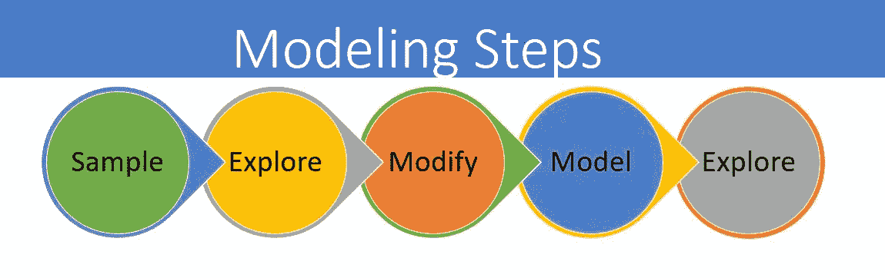

作者图片

我发现 SEMMA 方法非常有用，因为它为数据准备和建模提供了一种直观的方法。但是，您可以使用任何适合您的需求和偏好的数据准备方法。

***采样*** :流程从[数据采样](https://en.wikipedia.org/wiki/Sampling_(statistics))开始，即选择合适的数据集进行建模。数据集应该足够大，以包含足够的信息来有效地建模，但也应该足够小，以有效地使用。

***探索*** :在这个阶段，我们通过探索变量之间预期的和未预期的关系来理解数据，并借助[数据可视化](https://www.alteryx.com/solutions/analytics-need/bi-visualization)来发现任何异常。

***修改*** :修改阶段包含选择、创建和转换变量的方法，为数据建模做准备。

这些方法和逻辑可以复制到任何数据集。在下面的例子中，我已经使用[波士顿房产](https://data.boston.gov/)数据集进行了演示。关键在于探索阶段，在此阶段，您估算缺失值并执行异常值分析。

你可以在这里找到所有申请的副本！

# **巨蟒:**

**样品:**

在 Python 中进行数据加载和准备时，我使用了以下逻辑。

读入数据(使用 read_csv)->将数据添加到 pandas dataframe (pd.read_csv)->选择相关属性 ptype-->识别缺少值的列(使用 count()函数)->删除所有与分析无关的列，如名称等。(使用 dropna())

示例的 Python 代码

**探索:**

在上一个阶段，我们确定了 6 列缺失值，在这个阶段，我们将估算这些缺失值。一些估算策略包括:

均值:对于区间变量，一种策略是用均值或中值进行估算。在这种情况下，我们将使用 mean()函数估算 land_sf。

模式:对于分类变量，我们将使用模式来估算。

计算:对于一些变量，你可能需要做一些计算。例如，在我们的例子中，R _ BTH _ 样式 2、R _ BTH _ 样式 3、R _ 基奇 _ 样式 2 和 R _ 基奇 _ 样式 3 不能直接估算。如果房子的浴室少于两个，R _ BTH _ 样式 2 将具有空值。在这种情况下，我们将使用“NA”替换它

探索阶段:用平均值估算 LAND_SF，用模式估算 STRUCTURE_CLASS

探索阶段:用 YR _ BUILT 估算 YR_REMOD

估算浴室和厨房风格

**修改:**

现在，在这个阶段，我们有相对干净的数据。下一步是添加分析所需的任何额外变量(如年龄、YR_SINCE_REMOD)，确保预测变量呈正态分布(对数变换 AV_TOTAL ),并且必须使用一个热编码对所有分类变量进行编码

修改阶段的 Python 代码

# KNIME:

Konstanz Information Miner 是一个免费的开源数据分析、报告和整合平台。KNIME 通过其模块化的数据流水线概念，集成了用于机器学习和数据挖掘的各种组件。

这是快速准备数据的最佳工具之一，不需要任何编程背景。您可以快速合并不同的数据集，过滤行/列，连接列等。

链接到 Knime 例子[这里](https://github.com/evjanaki/DataPreperation)！

**样品**:

在“示例”中，我们将使用行过滤器选择相关的 PTYE，使用列过滤器过滤掉列，然后使用统计数据块和行过滤器的组合来查找缺失值。我们将多次使用该列来检查缺失值。

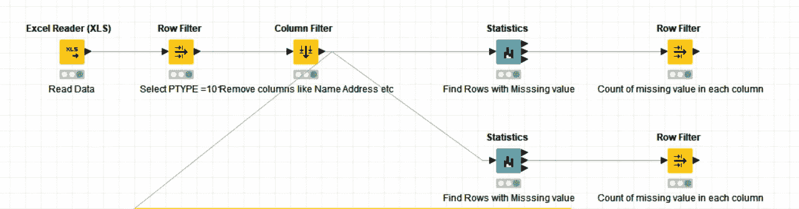

样品台

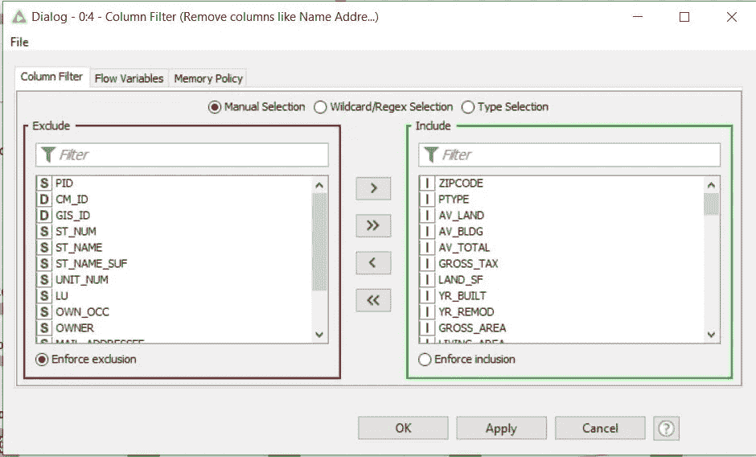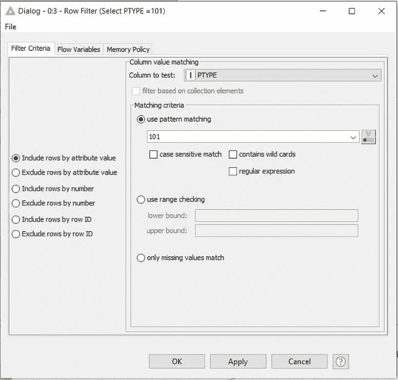

列过滤器和行过滤器

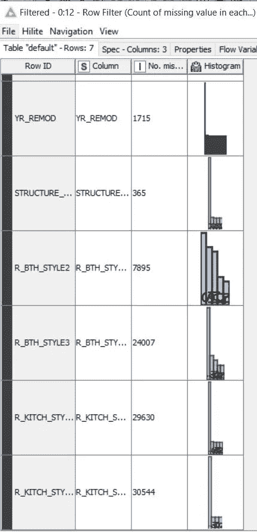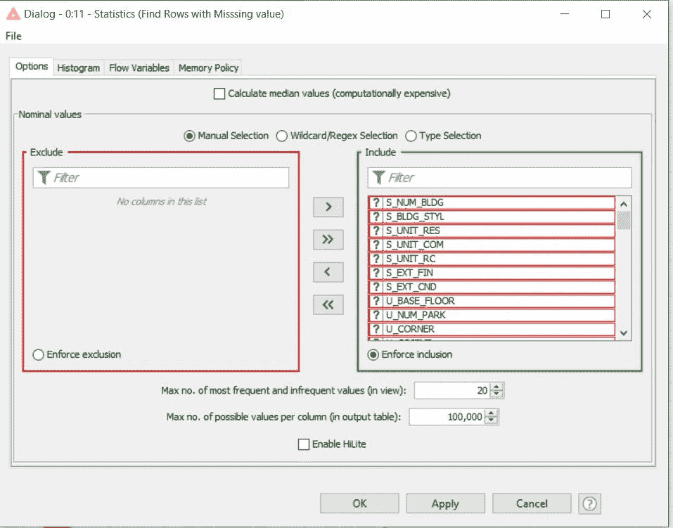

缺少值和统计块的列

**探索:**

这里的步骤与 Python 中的相同。在这一阶段，我们将估算所有缺失的变量。我们将使用:数学公式、缺失值(估算模式和中值)和规则引擎块。这些模块如下所示。如您所见，您可以从块中的各种可用选项中进行选择，或者键入一个数学公式，类似于我们使用 excel 的方式

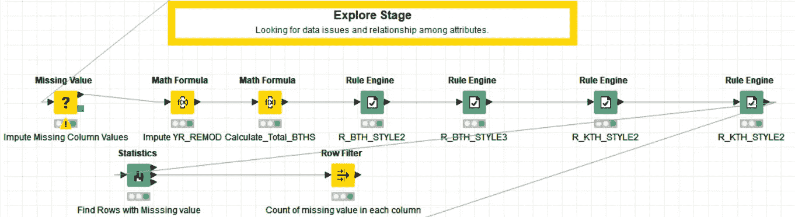

探索区块

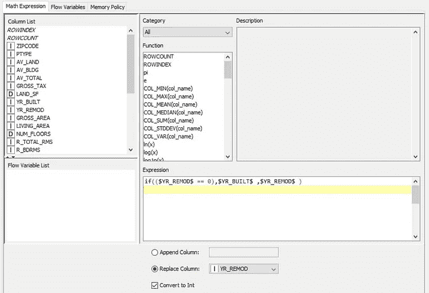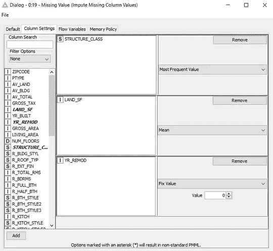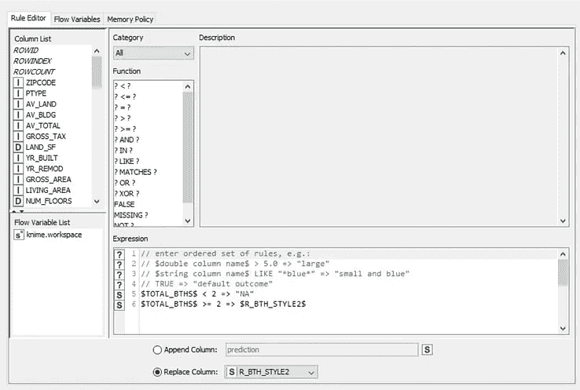

I:数学块 ii)缺少值 iii)规则编辑器

**修改:**

这是数据准备的最后阶段。在这一阶段，我们将使用数学公式计算一些新变量，如年龄和 YR_SINCE_REMOD，并对预测变量进行对数变换，最后对数据进行分区(如下所示)。

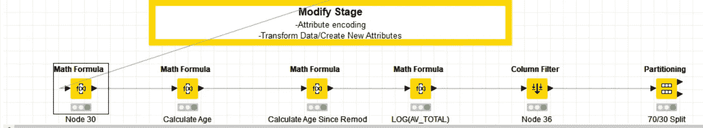

修改阶段

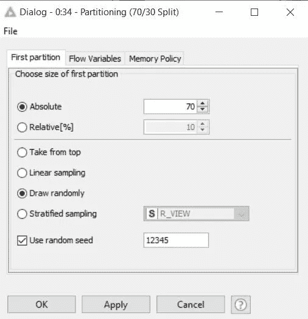

隔墙砌块

# **Alteryx:**

Alteryx 是一款出色的数据准备工具。它不是一个开源工具，但是 Alteryx 提供了一个试用许可。你可以看看我之前在 Alteryx 上发表的[文章](https://medium.com/towards-artificial-intelligence/ds-101-alteryx-for-citizen-data-scientists-bc03134d84e2)中关于 Alteryx 建模的介绍。

**样本:**

在' *Sample* '阶段，我们将数据加载到 Alteryx 中，按 *property type = 101* (单户住宅)进行过滤，并删除分析不需要的列(如姓名、地址和与单户住宅无关的行)。

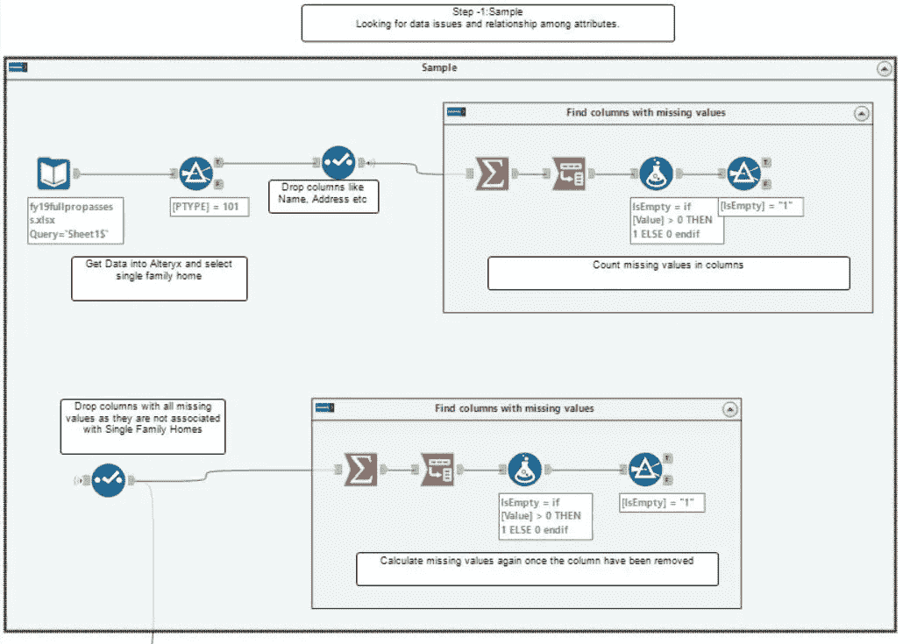

样品台

Alteryx 允许你创建“容器”,在这里你可以将一个函数的所有模块组合在一起，如上图所示。我创建了一个名为“查找缺少值的列”的容器来完成这个任务。我已经多次重复使用这个容器来检查是否所有缺失的值都被输入了

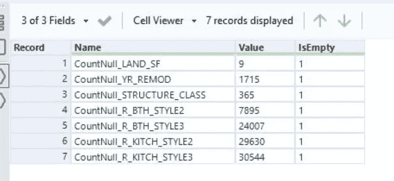

缺少值的列(容器的输出)

**探索**:

这一阶段包括通过探索变量之间预期和未预期的关系来理解数据，并在[数据可视化](https://www.alteryx.com/solutions/analytics-need/bi-visualization)的帮助下发现任何异常。

在此阶段，我们将估算所有缺失的数据，为建模做准备。在最后一步中，我们确定了 7 个缺少值的列。在这一步，我们将估算这些列。

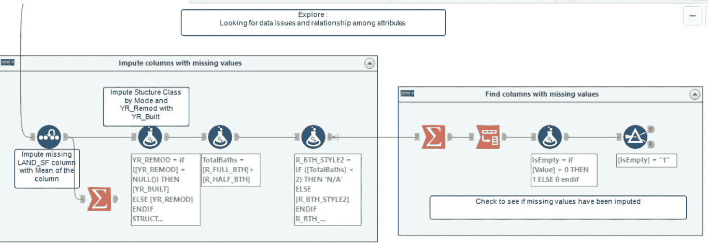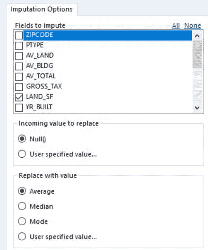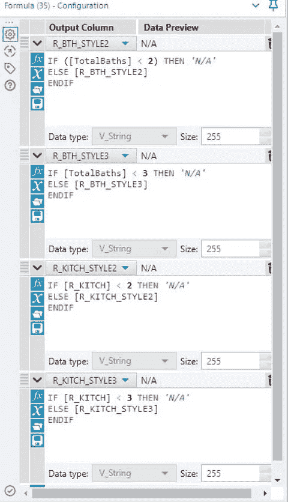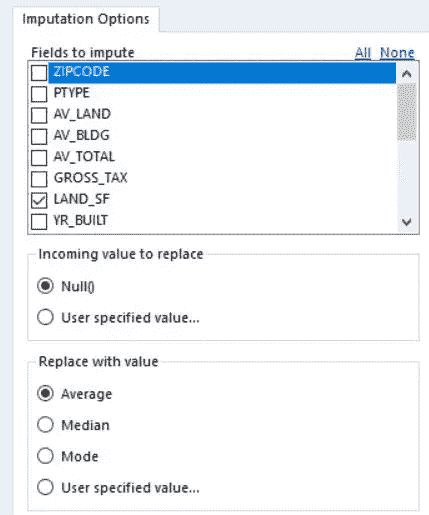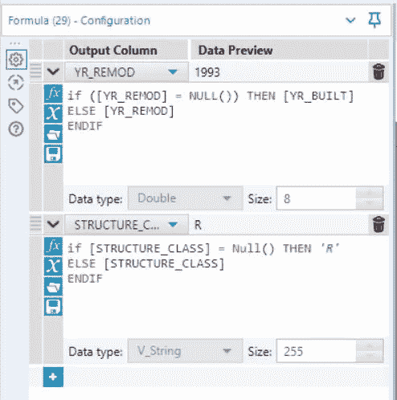

1)用平均值估算 LAND_SF。2)YR _ REMOD = YR _ build，STRUCTURE_CLASS 用 Mode 估算。3)估算浴室风格和厨房风格

## 修改:

在这一步中，我们将使用公式块转换变量/创建新属性。我们将计算年龄、YR_SINCE_REMOD 并对预测变量进行对数变换，如下所示。

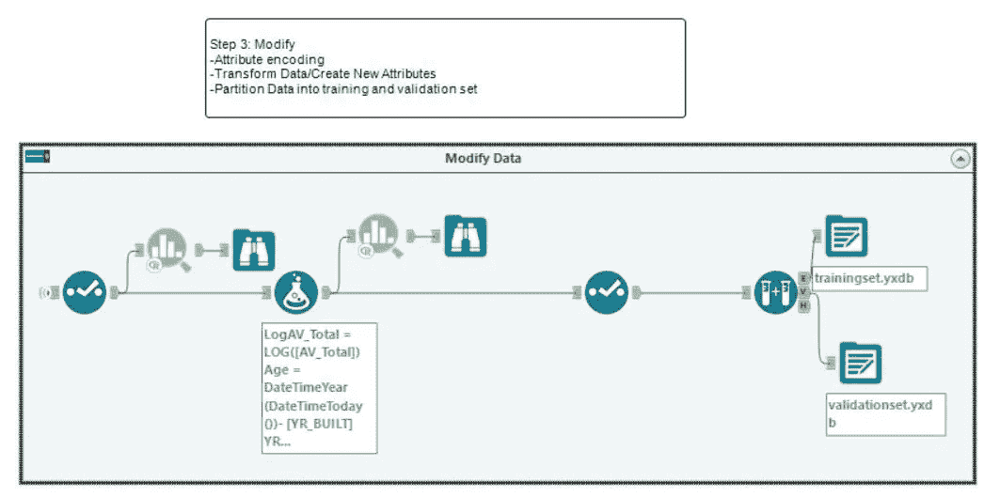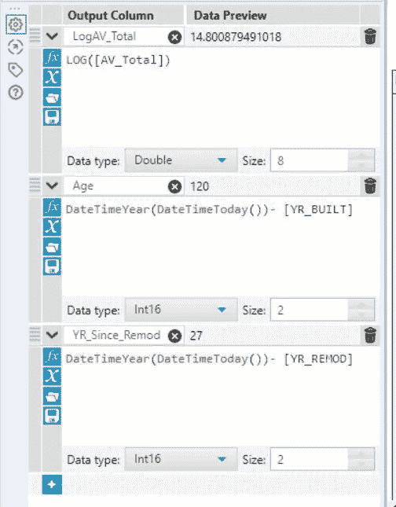

添加分析所需的新变量。

# **结论:**

Python 拥有丰富的库和支持(书籍和在线支持社区)，对于任何有编程背景的人来说都是一个很好的工具。

对于没有编程背景并且正在寻找免费工具的人来说，Knime 是一个很好的选择。当我还在学习如何使用 Python 编程时，Knime 是我大学时代的首选工具。伟大和快速的工具，合并数据集，过滤出行和列，并添加新的列。

Alteryx:许多公司都在与 Alteryx 合作他们的分析和数据科学项目。Alteryx 允许您轻松地将数据源与许多现成的自动化构建模块结合起来，这使得例行的数据准备变得非常容易。

数据准备的工具选择完全是个人喜好。我建议选择一个您最熟悉的工具来加速数据准备过程，以便您有更多的时间进行数据建模。

**参考文献**:

1.  数据分析的艺术和科学”,作者 Edward R. Jones 博士，德克萨斯 A&M 分析项目
2.  *使用 SAS Enterprise Miner、Barry de Ville 和 Padraic Neville 进行分析的决策树*
3.  德克萨斯 A&M 分析计划
4.  所有截图来自 Python，Knime 和 Alteryx 作者