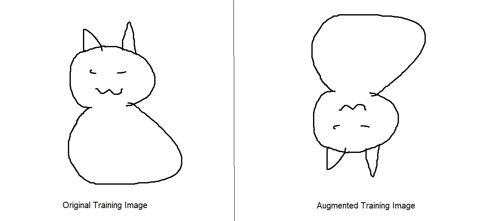

# 组织病理学癌症检测的数据准备指南

> 原文：<https://towardsdatascience.com/data-preparation-guide-for-detecting-histopathologic-cancer-detection-7b96d6a12004?source=collection_archive---------58----------------------->

## 关于如何为 Kaggle 组织病理学癌症检测的模型训练准备数据的指南。

[国家癌症研究所](https://unsplash.com/@nci?utm_source=medium&utm_medium=referral)在 [Unsplash](https://unsplash.com?utm_source=medium&utm_medium=referral) 上拍摄的照片

Kaggle 是数据科学和机器学习挑战的绝佳主持人。其中之一是[组织病理学癌症检测挑战赛](https://www.kaggle.com/c/histopathologic-cancer-detection)。在这个挑战中，我们提供了一个图像数据集，我们应该在这个数据集上创建一个算法(它说的是算法，而不是明确的机器学习模型，所以如果你是一个天才，有一个替代的方法来检测图像中的转移性癌症；去吧！)来检测转移癌。

这篇文章是关于如何准备 Kaggle 数据集的指南，该指南涵盖了以下四个方面:

*   如何从 Kaggle 将数据集下载到您的笔记本中
*   如何扩充数据集的图像。
*   如何平衡目标分布，并为训练/测试/验证拆分数据。
*   如何在 Keras 中为模型训练构建数据？

# 在笔记本中下载数据集

使用下面的命令下载 kaggle 包。我在谷歌的 Colab 上运行它们，但是你应该可以用你的命令行/Jupyter 笔记本来运行它们。

为了使用 Kaggle 的 API 用你的账号下载数据，你需要做以下两件事。

*   转到您的帐户设置，滚动到 API 部分，单击**过期 API 令牌**删除以前的令牌(如果您有任何令牌)，然后单击**创建新的 API 令牌**。这将下载一个 **'kaggle.json'** 文件。
*   将此文件上传到您的项目目录。

然后运行下面的代码，该代码使用 json 文件授予访问权限，并下载数据集。

解压缩 zip 文件。**这需要几分钟的时间，因为它包含大约 6–7 GB 的数据。**

**此时，你应该有两个文件夹，和两个 csv 文件。**

*   包含训练集图像的“train”文件夹
*   包含测试集图像的“测试”文件夹
*   一个“train _ labels”CSV 文件，包含每个图像的 id 及其相应的标签(0 表示无癌症，1 表示有癌症)。
*   一个“sample _ submission”CSV 文件，它是一个示例，说明如果您想参加 Kaggle 竞赛，您应该如何提交您的结果。

# 数据扩充

什么是数据增强，我们为什么要这样做？从本质上来说，数据扩充是一种通过对数据进行细微更改来增加图像数据集大小的方法。我们的目标是将我们的模型推广到更多通过图像增强引入的例子。**更重要的是**，图像增强还允许我们的模型**概括不同类型图像的不同版本。**

看下图。假设左边被画得可怕的猫来自训练数据集，但是右边的猫在测试数据集中。从字面上看，它们是相同的图像，只是右边的图像被翻转了。人类能够很容易地注意到这一点，但是模型可能无法成功完成这项任务，并且无法在测试数据集中识别它。理想情况下，您希望您的模型不关心图像的变化，并正确地对图像进行分类，这就是为什么您引入图像的增强版本，以便模型可以更好地概括。

增强图片的示例

这是一个函数的代码，它通过对图像应用各种变换来放大图像，例如改变图像的对比度、增加图像的亮度、应用随机旋转/移动。这里的代码引用自。

然后，我们使用此功能来扩充“train”文件夹中提取的图像。下面的代码生成 X 数量的新图像(基于一个名为 *'images_to_generate'* 的变量，您可以更改该变量)，方法是从我们的 train 集中随机选择图像，应用上面的增强功能，然后将图像保存在 train 文件夹中，并使用“增强的”+其以前的 ID 作为新名称。最后，我们还将标签和名称附加到 train_labels csv 文件，并保存一个新的 csv 文件，该文件也包含增强图像的 ID 和标签。

# 平衡目标分布

在机器学习中，我们希望确保我们的模型能够很好地处理我们扔给它的所有类型的数据！如果我们盲目地使用所有可用的训练数据，可能出现的一个问题是**不平衡的类别/目标分布的情况。这意味着你的数据集包含一个或多个类比其他类更多的观察值。如果我们在这个完整的数据集上训练我们的模型，我们的模型将在预测具有更多数据点的类方面变得非常好，而在分类其他类方面表现不佳。让我们看看在我们的癌症检测模型的情况下会发生什么！**

如果我们观察我们的训练数据集，我们会意识到它是不平衡的。运行下面的代码显示，我们有大约 130000 张没有癌症的图像，以及大约 90000 张有癌症的图像。如前所述，使用不平衡数据集进行训练可能会导致我们的模型在识别一个类时变得非常出色，而在其他类上却失败得很惨。在这种情况下，少数类是检测到癌细胞的一类，我们真的不想在对癌症图像进行分类时失败；因为这样做会导致人们带着未确诊的癌症继续生活，而他们应该接受治疗！

输出:

为了解决这个问题，我们可以从无癌症(0)类中删除图像，如下所示。为了更快的训练，我丢弃了多余的图像，但是我们可以简单地保持 95000:93099 的比例。下面的代码删除图像并保持类的分布相等。

还有一步，我们需要将我们的数据分成训练、测试和验证集。训练集用于训练我们的模型，验证集用于调整模型的超参数，测试集用于检查模型的性能。下面的代码片段按照 60:20:20 的比例对训练:测试:验证进行了划分。

在上面的例子中，我们有一个丰富的数据集，我们可以从中删除数据点来平衡类分布；然而，如果我们没有丢弃数据的奢侈呢？如果我们需要尽可能多的数据呢？

有几种方法可以做到这一点:

*   您可以对 minority 类进行过采样。在我们的例子中，这将简单地从我们的训练集中随机抽取带有检测到的癌细胞的图像样本，并将这些样本附加到我们的训练集中。您可能对此有点怀疑，但这种技术至少确保了您的模型不会严重依赖多数类进行训练，并且还学会了对少数类进行分类。
*   对于非基于图像的数据集，您可以创建假数据。这可以通过使用像[核密度估计](https://scikit-learn.org/stable/modules/density.html)这样的技术来完成，在这种技术中，您可以了解数据集中要素的分布，并从这些分布中抽取样本来生成新数据。

这只是两种方法，你可以在这里找到更多的[。](/methods-for-dealing-with-imbalanced-data-5b761be45a18)

# Keras 生成器的目录结构

机器学习模型使用存储在计算机/服务器内存中的数据。有时，数据集小到足以容纳在内存中；但在大多数实际情况下，并非如此。为了克服这一点，我们可以使用生成器([它们也执行图像增强](/keras-data-generators-and-how-to-use-them-b69129ed779c)，但我手动执行了上面的操作)来拍摄我们的图像，并将它们成批地传递给机器学习模型，而不是一次全部传递。为此，我们需要将图像存储在特定的目录结构中。本例中的目录应采用以下格式。

假设您在项目基本目录中，它应该是:

—培训数据文件夹

— — — class_0 文件夹

— — — class_1 文件夹

—测试数据文件夹

— — — class_0 文件夹

— — — class_1 文件夹

—验证数据文件夹

— — — class_0 文件夹

— — — class_1 文件夹

“培训数据”文件夹有两个子文件夹，其中包含每个类别的图像。测试和验证数据文件夹的结构相似。下面的代码创建了这些目录。

一旦我们创建了目录，我们就可以将相应的映像转移到这些目录中。下面的代码可以做到这一点。**在 colab 上这样做大约需要 30 分钟，因为我们必须传输 160000 张图像**。

# 结尾注释

太好了！此时，您应该已经设置好数据集，可以输入到您的模型中。完整的 A-Z 库可以在[这里](https://github.com/DarthQadir/Histopathlogic-Cancer-Data-Preprocessing)找到！

希望您发现这篇文章和笔记有助于理解挑战的预处理数据，以及一般的预处理。

# 参考

*   [https://www.kaggle.com/c/histopathologic-cancer-detection](https://www.kaggle.com/c/histopathologic-cancer-detection)
*   [https://www . ka ggle . com/qit vision/a-complete-ml-pipeline-fast-ai](https://www.kaggle.com/qitvision/a-complete-ml-pipeline-fast-ai)
*   [https://towards data science . com/keras-data-generators-and-how-to-use-them-b 69129 ed 779 c](/keras-data-generators-and-how-to-use-them-b69129ed779c)
*   [https://github . com/DarthQadir/Cancer-Data-Preprocessing-Medium-Article/blob/master/Cancer _ Detection _ Preprocessing . ipynb](https://github.com/DarthQadir/Cancer-Data-Preprocessing-Medium-Article/blob/master/Cancer_Detection_Preprocessing.ipynb)
*   [https://scikit-learn.org/stable/modules/density.html](https://scikit-learn.org/stable/modules/density.html)
*   [https://towards data science . com/methods-for-handling-unbalanced-data-5b 761 be 45 a 18](/methods-for-dealing-with-imbalanced-data-5b761be45a18)