# 数据预处理和解释结果:机器学习的核心:第 1 部分- EDA

> 原文：<https://towardsdatascience.com/data-preprocessing-and-interpreting-results-the-heart-of-machine-learning-part-1-eda-49ce99e36655?source=collection_archive---------42----------------------->


卢克·切瑟在 [Unsplash](/?utm_source=unsplash&utm_medium=referral&utm_content=creditCopyText) 上的照片

## 为什么以及如何分析数据和结果？

机器学习是当今世界越来越感兴趣的主题。越来越多的人，一些有经验的，一些新的，正在探索这个领域，因为它有趣的机会，应用和证明的能力。我是新来的一员。我进入这个领域是因为它能够完成非常有趣的应用。作为一名新手，我开始关注不同的机器学习模型及其工作方式。很久以后，我意识到，机器学习不仅仅是关于模型。模型是大脑，但是大脑从哪里学习呢？简单的答案是，根据数据。我们给模型的数据表现得越好，它学习得就越好。因此，数据处理和分析是机器学习的一个非常重要的部分。

现在，我们只讨论了输入，那么输出呢？我们还需要解释输出。已经观察到，如果数据集具有不平衡的数据，则在垃圾邮件检测之类的分类问题的情况下，模型可能无法正确地学习每个类别。在这种情况下，如果强表示集合在测试集合中数量很大，并且模型预测主要表示类别的每个样本，则由于集合的不平衡，准确性可能很好。但是这个模型和无技能分类器一样好。所以，我们不能部署这样的模型。我们需要在部署前分析结果。

这些事实是这篇博客背后的动机。

## 如何分析数据？

我们都听说过探索性数据分析(EDA)和主成分分析(PCA)这两个术语。这些方法被广泛用于可视化、分析、处理和解释数据变化和关系。在这篇文章中，我们将通过这些概念。为此，我们将使用 [Kaggle 乳腺癌数据集](https://www.kaggle.com/uciml/breast-cancer-wisconsin-data)。

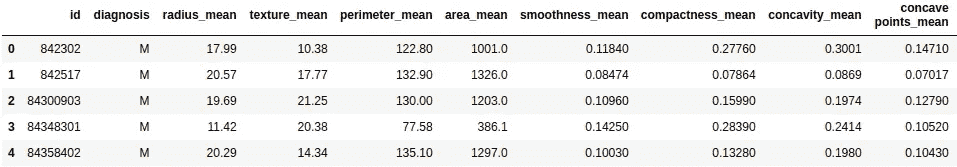

数据集结构

这个数据集有 32 列。它有 30 个特性列、1 个索引列和 1 个“诊断”列，这是我们的目标列。

```
Y=pd.DataFrame(df['diagnosis'].values,columns=['diagnosis'])
X=df.drop(['diagnosis','id'],axis=1)
```

因此，我们得到了包含 30 列的特性集和包含 1 列的目标集。目标列有两个目标类，“M”和“B”。那么，我们开始吧。

## 探索性数据分析和数据预处理

## 相关图

我们的特征集的每一列被我们的模型用作值的向量。现在，我们如何将两个特征值或向量联系起来。为此，我们使用两个特征向量的点积，这给出了特征向量之间的协方差。协方差的值可以从正无穷大变化到负无穷大。这种协方差让我们了解两个考虑的特征之间的关联程度。符号表示变化的方向。换句话说，说明一个特征是随着另一个特征增加还是减少。它由下式给出:

> Cov(x，y)= Sum((x-均值(x))(y-均值(y))) / n

其中 x 和 y 是两个特征。

现在，我们不直接使用协方差，我们使用相关性，即两个向量之间的余弦角。相关值从-1 到+1 不等。它只是给出了变化的方向。它是在协方差除以两个特征的标准差的乘积时获得的。相关性由下式给出:

> 相关性=corr(x，y)= Cov(x，y) / std(x)。标准(y)

关联是无量纲的，与尺度无关。了解特征之间的相关性很重要，因为我们不希望使用两个相关性非常高的不同特征，因为它们通常表示同一条信息。我们也不想使用与目标值相关性很小的特征，因为它们对预测没有太大影响，但会增加模型的复杂性。

这是相关图的样子:

```
import seaborn as sb
import matplotlib.pyplot as plt
C_mat = df.corr()
fig = plt.figure(figsize = (15,15))sb.heatmap(C_mat, vmax = .8, square = True)
plt.show()
```

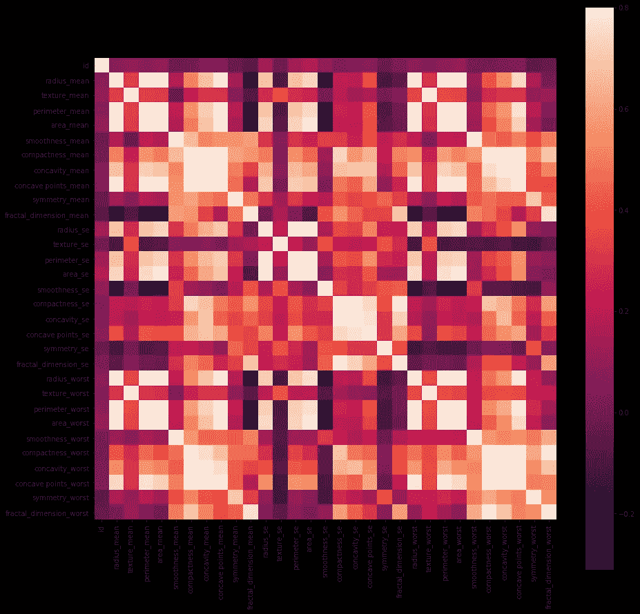

这里我们可以看到代表两个特征之间相关性的标度和阴影。

## 对偏斜度的依赖

有几种分布描述了要素值在平面上的分布情况。在本节中，我们关注两种类型的分布:正态分布和偏态分布。在正态分布中，数据总体上是均匀分布的。在偏态分布中，数据可能在几个区域累积，而不是均匀分布在所有区域。偏斜分布通常是要素的一个问题，会影响模型的性能。我们可以使用直方图来研究这个问题。

```
df.hist(figsize = (35,35))
plt.show()
```

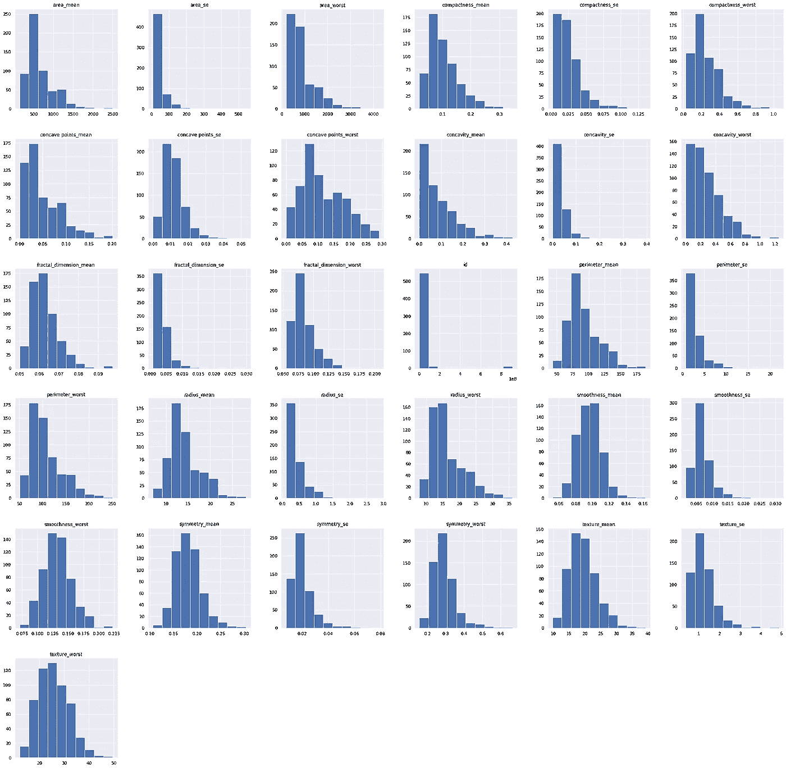

这些图很容易反映特征的分布。我们可以看到许多特征具有正态分布，而其他特征也具有偏态分布。所以，让我们做点什么吧。

如果我们仔细分析，我们可以发现“分形维数 se”和“面积 se”具有偏态分布。

```
import seaborn as sns
sns.distplot(df['fractal_dimension_se']);
sns.distplot(df['area_se']);
```

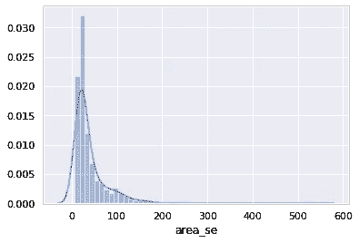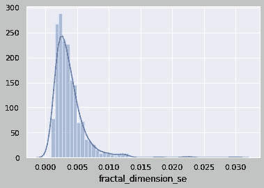

很明显，使用对数函数可以将偏态分布转换为正态分布。

```
import numpy as np
df['new_fractal_dimension_se']=np.log(df['fractal_dimension_se'].values)
df['new_area_se']=np.log(df['area_se'].values)
```

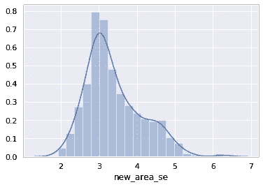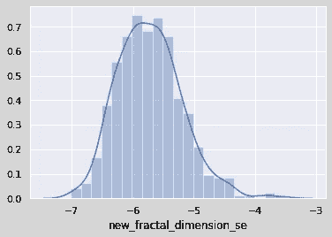

我们可以用数据集中新创建的正态分布要素替换实际的倾斜分布要素。

## 价值观的宁滨

通常在数据集中，我们会发现年龄、年份、人数等特征。这些特征本质上通常是数字的。但是它们与目标值的相关性很低，这可能是由于值的多样性。通过在几个范围内对这些特征进行宁滨，可以将这些特征转换成分类特征。例如，如果年龄在 0 到 100 的范围内，我们可以生成 5 个箱:

> 0-20 岁:小孩
> 
> 20-40 岁:年轻
> 
> 40-60 岁:中年
> 
> 60-80 岁:老年人
> 
> 80-100 岁:非常老

这种类型的数据预处理被称为宁滨，对于稀疏或长范围的数据非常流行。

## 数据分布

## 数字特征

有时查看连续数字特征相对于彼此的分布是非常重要的。这通常有助于我们估计某个特征对预测的有用程度。有几个情节可以做到这一点。我们会发现一些。

1.  **成对绘图**

```
import seaborn as sns
sns.set()
cols = ['radius_mean', 'texture_mean', 'perimeter_mean',
       'area_mean', 'smoothness_mean', 'compactness_mean', 'concavity_mean',
       'concave points_mean', 'symmetry_mean', 'fractal_dimension_mean',
       'radius_se', 'texture_se', 'perimeter_se', 'smoothness_se']
sns.pairplot(df[cols], size = 2.5)
plt.show();
```

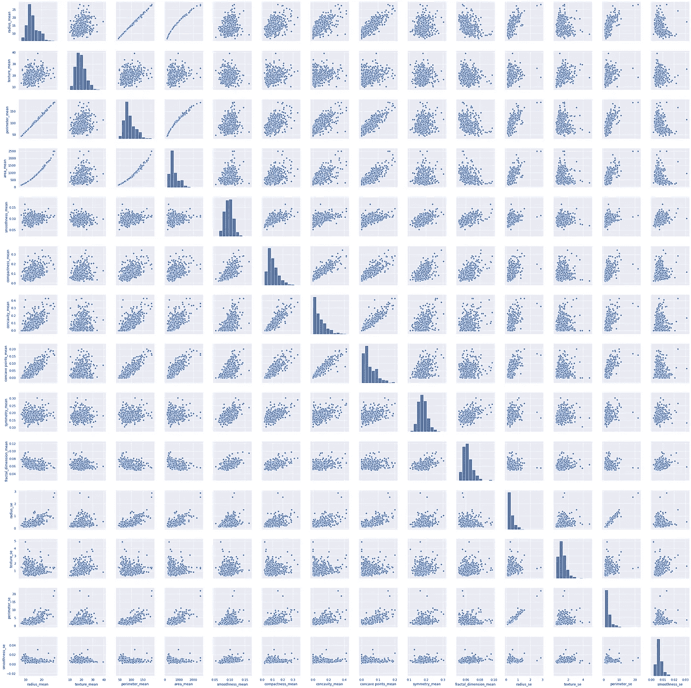

由于篇幅限制，我们在这里只展示了几个特性。

**配对图:仅用于数值。对角线元素显示特征的分布，另一个图形使用散点图显示两个特征的分布。**

我们也可以使用散点图单独完成这项工作。

```
data = pd.concat([df['radius_mean'], df['new_conacvity_se']], axis=1)
data.plot.scatter(x='new_conacvity_se', y='radius_mean',);
```

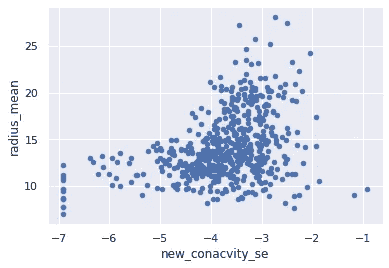

该图显示了 2D 平面上半径平均值和新相关系数之间的分布。

2.**基于目标特征的配对绘图。**

```
import seaborn as sns
sns.pairplot(df_1, hue="diagnosis")
```

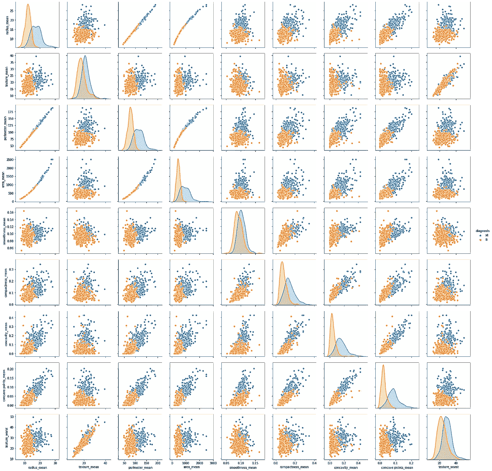

**这些图显示了基于两个特征的点的分布，以及如何根据目标列区分它们，对角线显示了基于一个特征的两类目标列(M 和 B)的重叠程度。**

3.**聚类分析**

这种类型的分析是基于聚类算法来完成的，主要是 K 均值聚类。这里，采用特征，并且应用 K 均值聚类来检查点分布的边界，如果基于这两个特征来预测目标，则该边界可以是分类边界。让我们看几个例子:

```
from sklearn.cluster import KMeans
import sklearn.metrics as sm
X_v=X.values
model = KMeans(n_clusters=2)
model.fit(X_v) 
```

因此，这里我们的特征集被提供给 k=2 的 k 均值聚类算法。这将创建两个集群，它们将成为两个目标类。现在让我们按功能检查除法。

```
import numpy as np
import matplotlib.pyplot as plt
colormap = np.array(['red','blue'])
plt.scatter(X['radius_mean'], X['compactness_mean'],c=colormap[model.labels_], s=40)
plt.title('K Mean Classification')
plt.show()
```

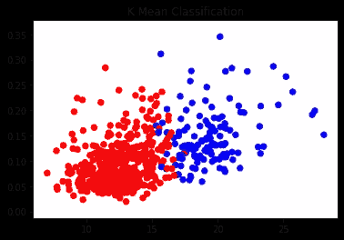

```
import numpy as np
import matplotlib.pyplot as plt
colormap = np.array(['red','blue'])
plt.scatter(X['radius_mean'], X['concave points_mean'],c=colormap[model.labels_], s=40)
plt.title('K Mean Classification')
plt.show()
```

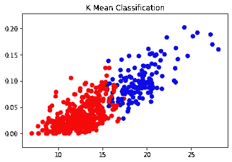

如果我们检查这些聚类，我们将能够在这两个聚类之间画出一条分类线。

## **分类特征**

分类数据是指具有类、箱或分部的数据。它们不是连续的数字。关于分类特征，最重要的是要知道它们的分布。换句话说，假设“M”和“F”是性别特征中的两个类别，那么“M”实例的数量远大于“F”实例的数量是很常见的。在这种情况下，有一个问题，因为模型不学习代表不足的类。我们可以使用以下类型的分类特征图来了解这一点。

```
import matplotlib.pyplot as plt
feature = "diagnosis"
ax = df[feature].value_counts().plot(kind='bar',
                                    figsize=(10,10), 
                                    color='blue')
ax.set_xlabel(feature, fontsize=20)
ax.set_ylabel("Count",fontsize=20)
```

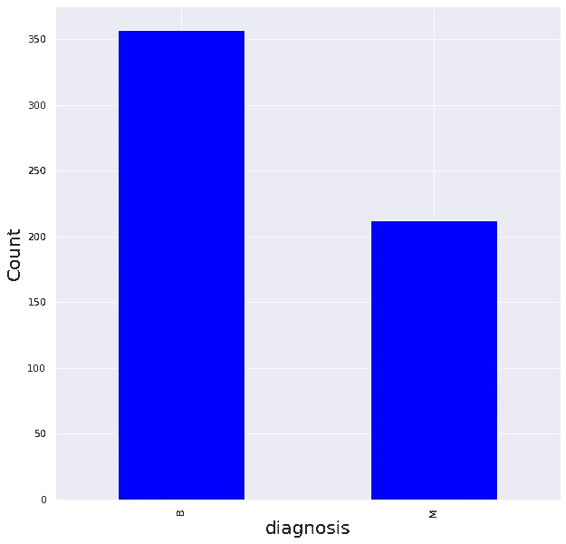

这里的两个条形表示我们的目标列中“B”和“M”类的计数。

研究连续数值数据的分类特征的变化是非常重要的。我们通常使用箱线图和柱状图来分析这种关系。

**1。箱线图**

```
data = pd.concat([df['texture_mean'], df['diagnosis']], axis=1)
f, ax = plt.subplots(figsize=(10, 10))
fig = sns.boxplot(x='diagnosis', y="texture_mean", data=data)
```

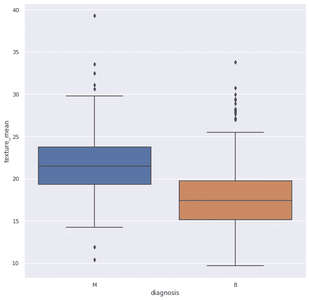

这显示了连续 teture_mean 特性根据我们的目标列中的两个类别的分布。这些图形通常反映了特定类别的分类数据中数据的连续值的分布。实心框位于第一和第三个四分位数之间。柱是分布中多次出现的最高点和最低点，孤立点是异常值。它们必须被移除，因为它们降低了模型的准确性。两个方框显示了连续数据相对于两个类别的变化。

**2。条形图**

```
import seaborn as sns
sns.set(style="whitegrid")ax = sns.barplot(x="diagnosis", y="area_mean", data=df)
```

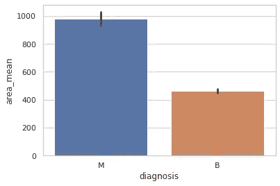

这些图类似于箱线图。它们还反映了不同类别的分类特征中连续数据行为的差异。它侧重于均值和标准差。条形的高度是类别中连续特征分布的平均值，条形代表标准差。

## 结论

我们在这里已经看到了几种数据分析和预处理的方法。在接下来的[部分](https://medium.com/@myac.abhijit/data-preprocessing-and-interpreting-results-the-heart-of-machine-learning-part-2-pca-feature-92f8f6ec8c8)，我们将看看 PCA、特征选择和结果分析。我希望这有所帮助。

Github 链接在这里是。