# 数据预处理和解释结果:机器学习的核心:第 2 部分-主成分分析，特征选择和结果分析

> 原文：<https://towardsdatascience.com/data-preprocessing-and-interpreting-results-the-heart-of-machine-learning-part-2-pca-feature-92f8f6ec8c8?source=collection_archive---------35----------------------->


卢克·切瑟在 [Unsplash](/?utm_source=unsplash&utm_medium=referral&utm_content=creditCopyText) 上的照片

## 如何选择特征进行预测？

在[第 1 部分](https://medium.com/@myac.abhijit/data-preprocessing-and-interpreting-results-the-heart-of-machine-learning-part-1-eda-49ce99e36655)，我们已经看了我们的数据集和探索性数据分析的概念。在这一部分，我们将看看主成分分析或 PCA 和特征选择程序。我们开始吧。

到目前为止，我们已经单独可视化了几个特征以及它们之间的相关性。但是对我们来说，将整个数据可视化是非常重要的。为此，我们需要将这 30 维数据投影到 2D 特征地图中。因此，需要降维。这就是 PCA 的用武之地。

在我们进入主成分分析之前，让我们探讨一下方差。

## 差异

> **方差是对集合分散或展开程度的度量，这是“平均值”(均值或中值)所不具备的。例如，如果我告诉你一个数据集的方差为零，你就知道它的每个成员都是相同的。如果方差很高，特别是与平均值的比率，这就告诉你数据在其成员之间有很大的不相似性。**

如果方差非常低，我们基本上可以从该特性或特性集获得所有相似类型的数据。机器学习通常针对不同类别中数据点的不同行为。因此，如果它非常低，点预计会聚集在相同的点周围，这导致它们很难区分。因此方差通常被认为是最大似然数据集的信息。

方差由下式给出:

> 方差= Sum [i=1 到 n]((x { I }-均值(x)))

在 PCA 中，我们试图创建 n 个复合特征，它们能够最好地表示包含在我们的数据集的 30 个特征中的信息。这 n 个特征称为主成分。n 的值取决于用户。这 n 个特征都不是原始特征。这些特征被开发为不同特征的组合。

在我们开始理解和应用 PCA 之前，我们必须注意一件事。PCA 总是在缩放的数据上进行。那么，让我们来看看缩放。

## 缩放比例

我们使用的数据有几个特点。现在，这些特征根据特征具有不同的范围，例如一些特征具有 0 到 1 之间的十进制值，而其他特征具有 100-1000 之间的值。

如果我们使用像逻辑回归这样的分类器，就会产生很多问题。

> y = w1x 1+w2x 2+……………………+wnxn+b

逻辑回归画一条线，用这个公式表示。现在，如果 x1 从 0 到 1，x2 从 100 到 1000，显然 x2 会有很大的压力和重量。为了避免这种情况，进行了缩放，使得所有的值都在固定的范围内。它只是将值更改为一个比例，但保持分布不变。

有两种主要的缩放类型

1.  **标准比例:**由下式给出

> 标度=(x-均值(x))/标准差(x))

它给出-1 到+1 之间的值。

2 **。最小-最大缩放:**由下式给出

> Scale=(x- min(x))/(max(x)-min(x))

它给出 0 到 1 之间的值。

## 主成分分析

让我们回到 PCA。我们将在这里使用标准的定标器。让我们先来看看应用程序，然后我们再来看解释。

```
from sklearn.preprocessing import StandardScaler
scaler = StandardScaler()
scale=scaler.fit(X)
X_scaled=scaler.transform(X)
X_scaled_df=pd.DataFrame(X_scaled,columns=X.columns)
from sklearn.decomposition import PCA
pca = PCA(n_components=2)
PC = pca.fit_transform(X_scaled_df)
p_Df = pd.DataFrame(data = PC
             , columns = ['principal component 1', 'principal component 2'])
p_Df.head()
```

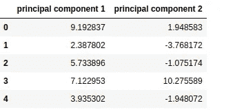

降维后，这两个分量形成为我们的 n 分量是 2。现在，我们将把这作为我们的特征集，并相应地加入我们的目标集，我们将尝试可视化。由于它有两个数据特征，现在可以很容易地在 2D 平面上表示出来。

```
Y_l=Y.iloc[:]['diagnosis'].tolist()
joined=p_Df
joined['Diagnosis']=Y_l
joined.head()
```

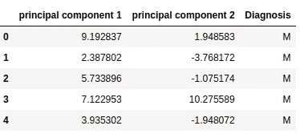

```
import matplotlib.pyplot as plt
fig = plt.figure(figsize = (10,10))
ax = fig.add_subplot(1,1,1) 
ax.set_xlabel('PC 1', fontsize = 12)
ax.set_ylabel('PC 2', fontsize = 12)
ax.set_title('PCA', fontsize = 15)
diags=['M','B']
colors=['r','b']
for diag, color in zip(diags,colors):
    i = joined['Diagnosis'] == diag
    ax.scatter(joined.loc[i, 'principal component 1']
               , joined.loc[i, 'principal component 2']
               , c = color
               , s = 50)
ax.legend(diags)
ax.grid()
```

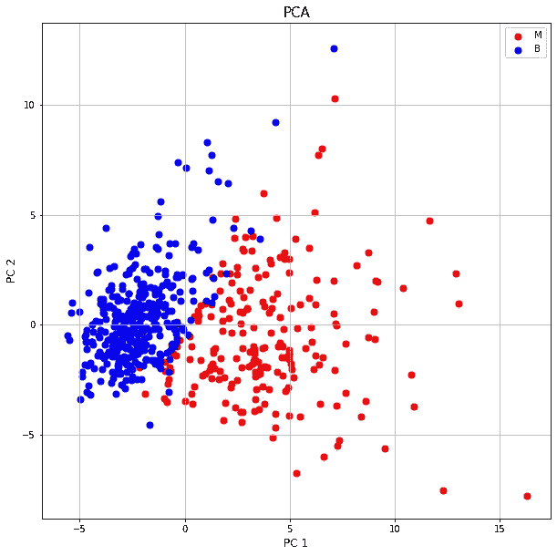

这是得到的主成分分析分布。如果我们以最好的方式表示 2D 的 30D 特征集，这就是我们的完整数据集表示。但是，这总是不可行的。让我们看看为什么。

PCA 是基于无监督算法的。问题是，这些成分是如何获得的？答案来了。

我们有一个 30 维的数据集。这意味着我们可以在一个 30 维的平面上绘制我们的点，每个维度代表一个特征。比方说，然后我们根据我们的目标分类给这些点着色。“M”是红色的。“B”是蓝色的。现在，在这一时刻，我们试图绘制一个 2D 平面，它最适合于根据目标类来划分点。我们使用 2D，因为 n_components 是 2。现在我们开始在 2D 平面上对这些 30D 点进行投影。因此，我们将 30 长度的元组减少到 2 长度的元组。现在，如果我们思考，我们会非常清楚，由于维数减少，我们也会丢失一些信息。因此，方差减小。x 轴和 y 轴值是主分量。因此，我们的目标是如何减少方差损失。为了做到这一点，我们通常从许多选择中挑选出可投影的 2D 平面。

详细地说，首先，选择一个最能区分这些点的 2D 平面。投影这些点并计算方差损失，然后选择与前一个平面正交的另一个平面并再次计算其方差。如此继续下去，直到获得许多选择，然后使用损失最小的平面。

毕竟，主成分分析并不总是很有信心代表所有的信息。这可以用方差比来测试。

```
pca.explained_variance_ratio_array([0.44272026, 0.18971182])
```

这没有给出非常清楚的表示，因为这两个分量仅表示这里所表示的总信息的 44+18=62%。这不是一个准确的表示，因为它仅表示总信息量的 62%。也就是说，它不能用两个主成分来表示。这是一个估计值，但据说如果比率之和小于 85%，则表示不太正确，因为缺少很多信息。

尽管如此，还是可以从这个操作中提取很多信息。比如，如果我们看这个图表，我们可以看到，如果我们画一条直线，那么它可以很容易地分类。因此，对于这个问题，逻辑回归将比 KNN 型分类器发挥更好的作用。

这几乎是关于 PCA 的所有内容，让我们进入下一个主题特性选择。

## 特征选择

我们有时会面临有很多特点的问题。它们甚至是像 99 100 个特征这样的大数字。现在，这些特征中的一些在模型预测中不是很有用。但是它们增加了特征集的维数，从而使其难以分析，增加了训练的时间，也降低了准确性。所以这些特征必须被去除。因此，在本节中，我们将讨论完成这项任务的几种方法。

## 随机森林特征重要性

在这种方法中，我们将数据拟合到一个随机森林模型，并获得特征重要性。从而获得最佳特征。正如我们所知，随机森林是基于决策树算法的，因此它们可以非常容易地模拟非线性，并提供非常清晰的特征重要性的图像。让我们看看应用程序。

```
from sklearn.ensemble import RandomForestClassifier
rfc = RandomForestClassifier()
X_n=X.values
Y_n=Y.values
rfc.fit(X_n,Y_n)
importance = rfc.feature_importances_
```

从而拟合决策树模型，获得特征重要度。

```
import matplotlib.pyplot as plt; plt.rcdefaults()
import numpy as np
import matplotlib.pyplot as pltobjects = X.columns
y_pos = np.arange(len(objects))
performance = importancefig, ax = plt.subplots(figsize=(20, 20))
plt.barh(y_pos, performance, align='center', alpha=0.5)
fontsize=14,
plt.yticks(y_pos, objects,fontsize=20)
plt.xticks(fontsize=20)
plt.xlabel('Contributions')
plt.title('Feature Contributions',fontsize=20)plt.show()
```

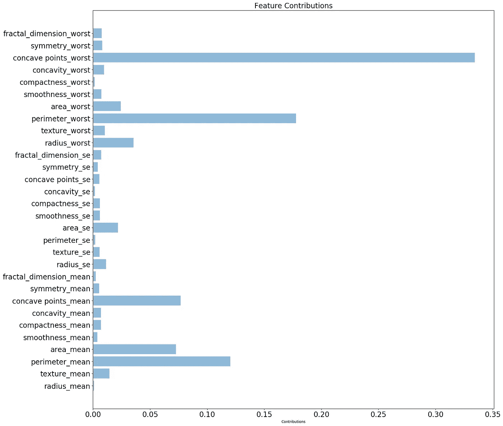

这是从随机森林算法中获得的特征重要性。

## 逻辑回归特征重要性

这是另一种在将数据拟合到逻辑回归模型后使用特征重要性的方法。如果数据本质上是线性的，这种方法非常有效。众所周知，逻辑回归的分类线由一个线性方程给出，如:

Y=w1x1+w2x2+w3x3…………+wnxn

这里的权重是相应的特征重要性。

```
from sklearn.linear_model import LogisticRegression
model = LogisticRegression(solver='liblinear', random_state=0)
model.fit(X_n, Y_n)
Weights=np.hstack((model.intercept_[:,None], model.coef_))
k=X.columns
k.append('bias')
```

因此，模型是合适的，并且在权重列表中获得了重要度。

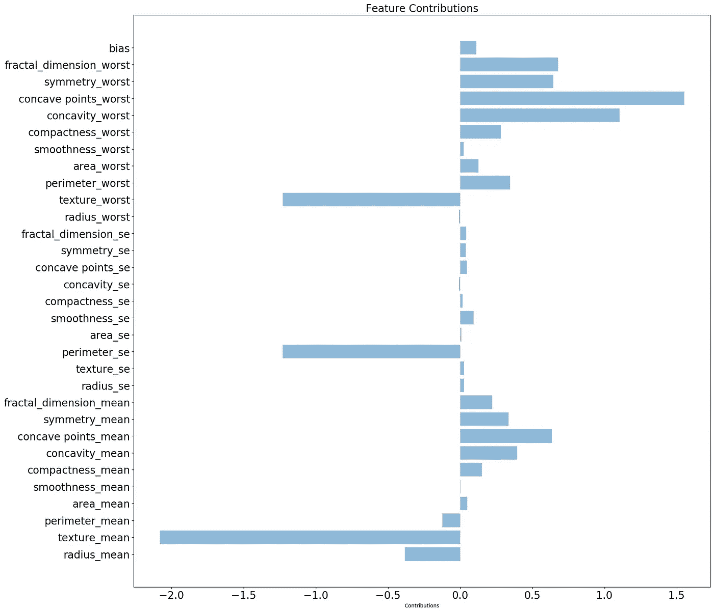

这是由逻辑回归生成的特征重要性分布。

## Lasso 回归要素重要性

这是一种非常常用的方法，用于获取特征重要性。这是通过将数据拟合到 lasso 回归模型并获得特征重要性来实现的。Lasso 回归适用于 L1 正则化的策略。

L1 正则化用于稀疏数据，其中有许多特征，但并非所有特征都是预测所必需的。在这种情况下，L1 正则化将不是非常重要的特征的特征重要性归零。Lasso 使用相同的策略。

需要注意的一点是 Lasso 不能用于分类“M”和“B”类，它们必须转换成整数。

让我们检查一下应用程序

```
from sklearn.linear_model import Lasso
import numpy as np
lasso = Lasso(alpha=0.0001)
i=0
y_d=[]
while i<len(Y_n):
    if Y_n[i][0]=='M':
        y_d.append([1])
    else:
        y_d.append([0])
    i+=1
y_d=np.array(y_d)
lasso.fit(X_n, y_d)l=(lasso.coef_)
```

因此，我们将数据拟合到 lasso 模型，并加载特征重要性。

```
import matplotlib.pyplot as plt; plt.rcdefaults()
import numpy as np
import matplotlib.pyplot as pltobjects = X.columns
y_pos = np.arange(len(objects))
performance = lfig, ax = plt.subplots(figsize=(20, 20))
plt.barh(y_pos, performance, align='center', alpha=0.5)
fontsize=14,
plt.yticks(y_pos, objects,fontsize=20)
plt.xticks(fontsize=20)
plt.xlabel('Contributions')
plt.title('Feature Contributions',fontsize=20)plt.show()
```

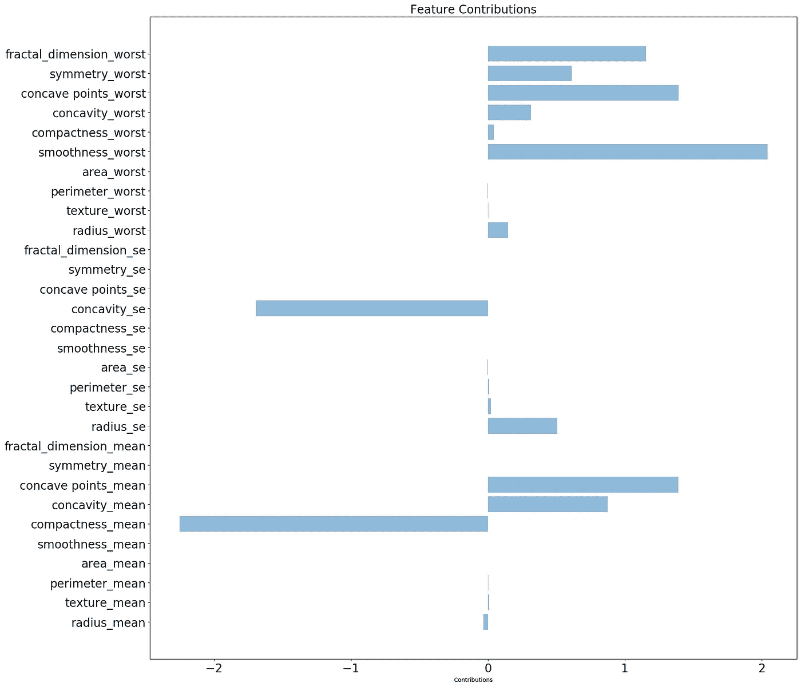

这是 lasso 获得的特征重要性列表，我们可以看到一些特征的权重被降低到零，所以在模型的训练中，它们不会起任何作用，因为它们的权重为 0。

## 递归特征消除

递归特征消除是迄今为止设计的选择最佳特征的最佳方式。它基于一种递归算法。它首先考虑所有特征，建立模型预测，然后找到最不重要的特征。现在，它删除这些特征，重建模型，并再次检查删除特征的效果。这个过程包括一个 k 倍交叉验证步骤，以消除集合中任何种类的不平衡问题。我们设置流程使用的估计器或模型。

实施:

```
from sklearn.ensemble import RandomForestClassifier
from sklearn.model_selection import StratifiedKFold
from sklearn.feature_selection import RFECV
rfc = RandomForestClassifier(random_state=101)
rfecv = RFECV(estimator=rfc, step=1, cv=StratifiedKFold(10), scoring='accuracy')
rfecv.fit(X_n,Y_n)
```

因此，我们使用随机森林分类器作为估计器。我们在每一步都使用 10 倍交叉验证。

```
features=rfecv.n_features_
features
-> 24
```

这用于获得消除后最终获得的特征的数量。我们可以看到，在剔除之后，获得了 30 个特征中的 24 个。

```
n_p=np.where(rfecv.support_ == False)[0]
```

这获得了在该过程中已经消除的特征。让我们想象一下结果。

```
feat=X.columns
to_drop=[]
for i in n_p:
    to_drop.append(feat[i])
x_imp=X.drop(to_drop,axis=1)
import matplotlib.pyplot as plt; plt.rcdefaults()
import numpy as np
import matplotlib.pyplot as pltobjects = x_imp.columns
y_pos = np.arange(len(objects))
performance = nfig, ax = plt.subplots(figsize=(20, 20))
plt.barh(y_pos, performance, align='center', alpha=0.5)
fontsize=14,
plt.yticks(y_pos, objects,fontsize=20)
plt.xticks(fontsize=20)
plt.xlabel('Contributions')
plt.title('Feature Contributions',fontsize=20)plt.show()
```

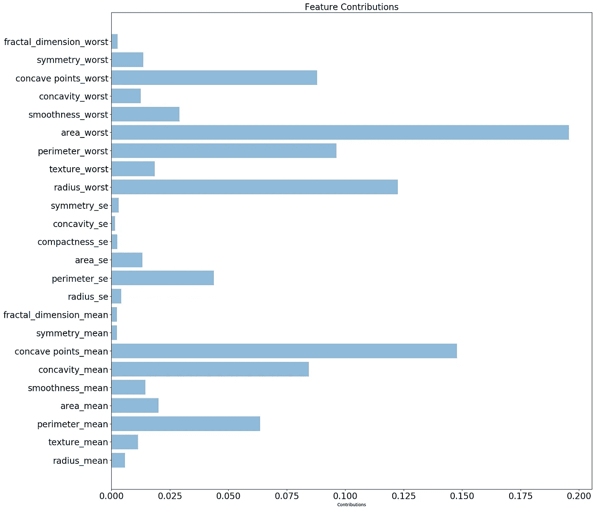

这些是 RFE 之后最后留下的特征和它们的重要性。

我们已经介绍了几乎所有用于获得重要特性的重要过程。

那么，让我们进入下一部分，结果分析。

## 结果分析

机器学习的另一个非常重要的部分是结果分析或解释。现在，通常情况下，我们理解结果意味着高准确性，但在机器学习的情况下并非如此。在机器学习中，准确性取决于许多其他因素。问题是为什么？让我们来看一个例子。假设有一个包含 100 封电子邮件的数据集，其中有 10 封是垃圾邮件。因此，我们形成 80%的训练集和 20%的测试集。现在，假设训练集有 9 封垃圾邮件，测试集有 1 封垃圾邮件。我们训练了我们的模型，但是由于垃圾邮件的实例较少，它没有正确地学习它。因此，该模型将所有内容分类为非垃圾邮件。现在，如果我们使用我们的测试数据集来评估我们的模型，那么它将给出 90%的准确性，因为 9 个实际上不是垃圾邮件。但是我们的模式实际上失败了。所以，我们不能只把准确性作为一个评价指标。

已经开发了几种方法来测量结果，最常用的是 ROC-AUC 曲线和精确回忆。

## ROC- AUC 曲线

ROC 或接收器操作特性曲线用于可视化二元分类器的性能。它显示了真阳性率和假阳性率之间的权衡。

> 真阳性率=真阳性/(真阳性+假阴性)
> 
> 假阳性率=假阳性/(真阴性+假阳性)

现在，它是如何工作的？分类模型实际上产生一个预测百分比，该百分比表示给定样本属于给定类别的可能性有多大。预测百分比可以是 0 到 100 之间的任何值。现在，它有一个阈值。在阈值以下，样本被分类为 0 类，在阈值以上，它被认为是 1 类。所以，假阳性，真阳性都取决于这个阈值。如果我们降低阈值，分类为 1 类的样本数量增加，因此假阳性增加，否则假阴性增加。ROC 曲线实际上滚动这个阈值，并相应地指出所有的真阳性和假阳性率。

AUC 代表“ROC 曲线下的面积”也就是说，AUC 测量整个 ROC 曲线下的整个二维面积。AUC 提供了对所有可能的分类阈值的综合绩效衡量。因此，AUC 越大，模型正确标记类别的机会就越大。所以，更多的是准确性。

我发现[有一个很棒的帖子](/understanding-auc-roc-curve-68b2303cc9c5)，它解释了我在这里使用的图片。

> **一个优秀的模型具有接近 1 的 AUC，这意味着它具有良好的可分性度量。差模型的 AUC 接近 0，这意味着它具有最差的可分性度量。事实上，这意味着它是往复的结果。它预测 0 是 1，1 是 0。当 AUC 为 0.5 时，意味着模型没有任何类别分离能力。**

根据型号的容量，可能有 4 种情况。

案例 1:

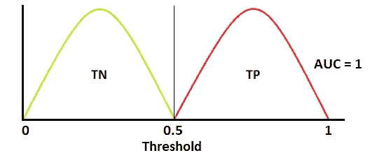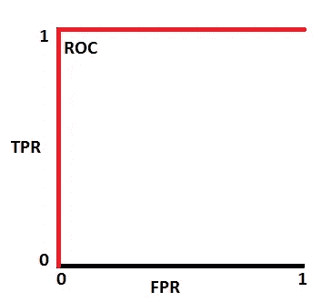

这是模型正确预测每个点的理想情况。在实际数据中，正类和负类是不相交的集合，也就是说，一个点可以是真正的，也可以是真负的，但不能同时是真正的和真负的。在这里，我们可以看到模型正确地覆盖和分类了所有的点。因此，曲线下的面积是完整的 2D 盒面积，即 1，精度是 100%

案例二:

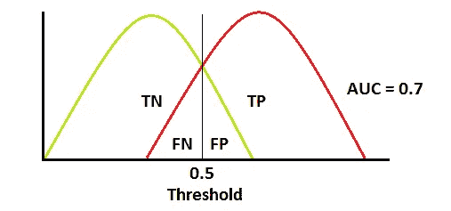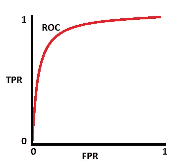

这些图表显示了模型的实际行为。在这里，我们可以看到有一个重叠部分，其中模型预测了一些错误的样本，即样本正类作为负类，反之亦然。重叠部分越小，模型的精确度越高。这里我们可以看到 AUC 是 0.7，而不是 1。

案例 3:没有技能分类器

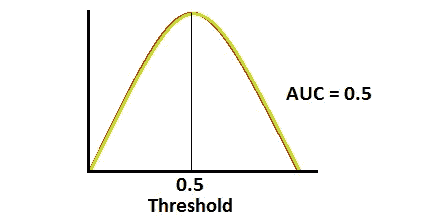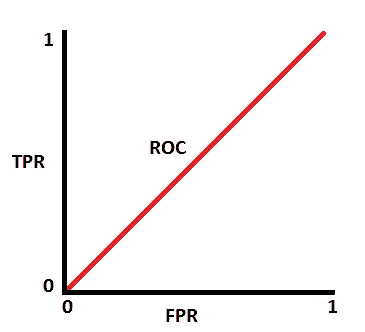

这是一个模型基本没学到东西的案例。所以，它一直在平等的基础上预测两个类。所以，一半时间它分类正确，一半时间它是错误的。

案例 4:

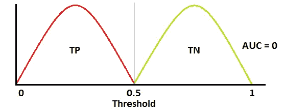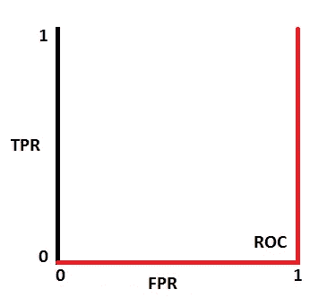

在这种情况下，该模型将所有正类分类为负类，将负类分类为正类。所以，它做了一个完全错误的分类。因此，AUC 值为 0，准确率为 0%

这就是 ROC-AUC 曲线。让我们转向精确回忆。

## 精确召回

这些度量在用于评估二元分类模型的应用机器学习中也是有用的。

精度由下式给出:

> 精度=真阳性/(真阳性+假阳性)

召回由以下人员发出:

> 召回= TP / (TP + FN)

这两个指标在不平衡数据集的情况下非常有用。

如果数据集有太多的正类实例而几乎没有负类实例，那么模型将倾向于预测正类，因此假阳性更多，因此精度低。如果数据集有太多的负类实例而几乎没有正类实例，那么模型将倾向于预测负类，因此会有更多的假阴性，因此召回率低。

因此，在这两种情况下，这些指标可以给我们一个非常清晰的概念。让我们看看精确回忆曲线。

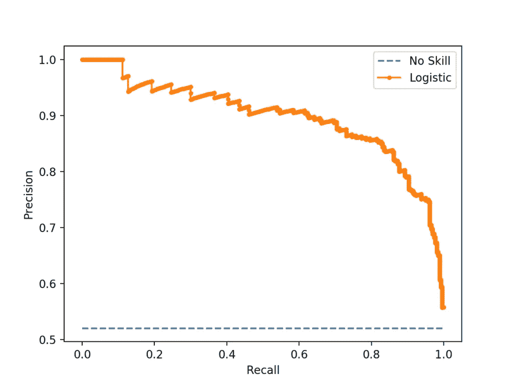

这就是精确回忆曲线的样子。精确回忆不考虑真正的否定。所以只关注正面类。现在，这些图表有一个无技能分类器基线作为参考。在 0.5 处是一条直线。曲线是在其基础上测量的，就像如果模型分类最好，则它是一个凸形的并且远离基线，否则它更接近。

我们已经研究了不同类型的性能矩阵。所以让我们在乳腺癌数据集上实现它。

我在这里使用了逻辑回归。

数据集的逻辑回归结果。

```
from sklearn.model_selection import train_test_split
X_train, X_test, y_train, y_test = train_test_split(x, y, test_size=0.33, random_state=42)
from sklearn.preprocessing import StandardScaler
scaler = StandardScaler()
scale=scaler.fit(X_train)
X_train_scaled=scale.transform(X_train)
from sklearn.linear_model import LogisticRegression
model = LogisticRegression(solver='liblinear', random_state=0)
model.fit(X_train_scaled, y_train)
```

因此，这里的数据适合我们的模型，模型准备好进行预测。

```
x_test_scaled=scale.transform(X_test)
y_pred=model.predict(x_test_scaled)
from sklearn.metrics import accuracy_score
accuracy_score(y_test, y_pred)
```

我们的模型给出了 97%的准确率。这是一个非常高的精度，这意味着我们的主成分分析足够好。

**ROC-AUC 曲线**

让我们获得 ROC- AUC 曲线:

```
from sklearn.metrics import roc_curve
from sklearn.metrics import roc_auc_score
import numpy as np
i=0
y_pred_i=[]
y_test_i=[]
while i<len(y_pred):
    if y_pred[i]=='M':
        y_pred_i.append([1])
    else:
        y_pred_i.append([0])
    i+=1
y_pred_n=np.array(y_pred_i)
i=0
while i<len(y_pred):
    if y_test[i]=='M':
        y_test_i.append([1])
    else:
        y_test_i.append([0])
    i+=1
y_test_n=np.array(y_test_i)roc_auc_score(y_test_n, y_pred_n)
```

ROC 曲线下的 ROC AUC 分数或面积为 0.98

让我们检查图表。

```
from sklearn import metrics
import matplotlib.pyplot as plt
fpr, tpr, _ = metrics.roc_curve(y_test_n,  y_pred_n)
auc = metrics.roc_auc_score(y_test_n, y_pred_n)
plt.plot(fpr,tpr,label="breast_cancer, auc="+str(auc))
plt.legend(loc=4)
plt.show()
```

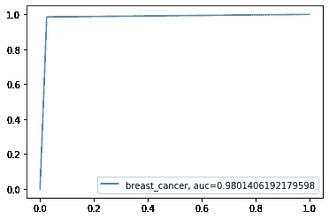

这是我们得到的 ROC 曲线。

现在，我们来看看精确回忆曲线。

```
from sklearn.metrics import precision_recall_curve
lr_precision, lr_recall, _ = precision_recall_curve(y_test_n, y_pred_n)
plt.plot(lr_recall, lr_precision, marker='.', label='Logistic')
plt.xlabel('Recall')
plt.ylabel('Precision')
plt.legend()
plt.show()
```

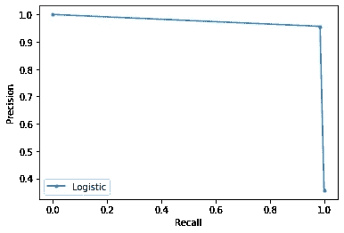

这是获得的精度-召回曲线。正如我们所看到的，它离基线很远。因此，我们的数据集非常好，精度令人满意。

## 结论

在本文中，我们已经看到了 PCA、特征选择方法和性能度量。这里是 [Github 链接](https://github.com/abr-98/EDA-and-PCA-demo)。希望这些文章有所帮助。