# CNN 的数据预处理和网络构建

> 原文：<https://towardsdatascience.com/data-preprocessing-and-network-building-in-cnn-15624ef3a28b?source=collection_archive---------2----------------------->

## 学习建立一个典型的端到端管道来训练 CNN


艾莉娜·格鲁布尼亚克在 [Unsplash](https://unsplash.com?utm_source=medium&utm_medium=referral) 上的照片

在本文中，我们将经历训练卷积神经网络的端到端管道，即组织数据到目录、预处理、数据扩充、模型建立等。

我们将在图像处理中常用的**数据预处理技术**上花费大量时间。这是因为在大多数深度学习项目中，预处理大约需要你 50–80%的时间，知道一些有用的技巧会对你的项目有很大帮助。我们将使用 Kaggle 的 [**flowers 数据集**](https://www.kaggle.com/alxmamaev/flowers-recognition) 来演示关键概念。为了直接进入代码，Kaggle 上发布了一个附带的[笔记本](https://www.kaggle.com/tanyadayanand/end-to-end-pipeline-for-training-cnns-resnet)(请**使用 CPU** 运行代码的初始部分，使用 **GPU** 进行模型训练)。

[](https://www.kaggle.com/tanyadayanand/end-to-end-pipeline-for-training-cnns-resnet) [## 用于培训 CNN、ResNet 的端到端管道

### 使用 Kaggle 笔记本探索和运行机器学习代码|使用来自多个数据源的数据

www.kaggle.com](https://www.kaggle.com/tanyadayanand/end-to-end-pipeline-for-training-cnns-resnet) 

# 导入数据集

让我们从导入必要的库和加载数据集开始。这是每个数据分析过程中必不可少的一步。

```
***# Importing necessary libraries*** import keras
import tensorflow
from skimage import io
import os
import glob
import numpy as np
import random
import matplotlib.pyplot as plt
%matplotlib inline***# Importing and Loading the data into data frame
#class 1 - Rose, class 0- Daisy*** DATASET_PATH = '../input/flowers-recognition/flowers/'
flowers_cls = ['daisy', 'rose']
***# glob through the directory (returns a list of all file paths)*** flower_path = os.path.join(DATASET_PATH, flowers_cls[1], '*')
flower_path = glob.glob(flower_path)***# access some element (a file) from the list***
image = io.imread(flower_path[251])
```

# 数据预处理

## 图像—通道和尺寸

图像有不同的形状和大小**。**他们也来自**不同的来源**。例如，一些图像是我们所说的“自然图像”，这意味着它们是在**真实世界**中以**颜色**拍摄的。例如:

*   花的图片是自然的图像。
*   x 光图像是*而不是*自然图像。

考虑到所有这些变化，我们需要对任何图像数据进行一些预处理。RGB 是最流行的编码格式，我们遇到的大多数“自然图像”都是 RGB 格式的。此外，数据预处理的第一步是**使图像尺寸相同。让我们继续讨论如何改变图像的形状和形式。**

```
***# plotting the original image and the RGB channels***
f, (ax1, ax2, ax3, ax4) = plt.subplots(1, 4, sharey=True)
f.set_figwidth(15)
ax1.imshow(image)

***# RGB channels*
*# CHANNELID : 0 for Red, 1 for Green, 2 for Blue.*** 
ax2.imshow(image[:, : , 0]) *#Red*
ax3.imshow(image[:, : , 1]) *#Green*
ax4.imshow(image[:, : , 2]) *#Blue*
f.suptitle('Different Channels of Image')
```

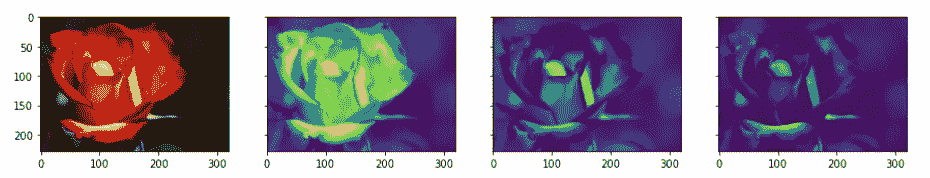

## **形态变换**

术语*形态变换*是指涉及图像的**形状和形式**的任何修改。这些非常常用于图像分析任务。虽然它们适用于所有类型的图像，但对于非自然的图像(来自真实世界的图片以外的来源)来说，它们尤其强大。典型的变换是侵蚀、扩张、张开和闭合。现在让我们看看实现这些形态变换的一些代码。

**1。阈值处理**

一种更简单的操作，我们把亮度高于某个阈值的所有像素转换成 1；具有小于阈值的值的像素被转换为零。这产生了一个二进制图像*。*

```
***# bin_image will be a (240, 320) True/False array*
*#The range of pixel varies between 0 to 255*
*#The pixel having black is more close to 0 and pixel which is white is more close to 255*
*# 125 is Arbitrary heuristic measure halfway between 1 and 255 (the range of image pixel)*** 
bin_image = image[:, :, 0] > 125
plot_image([image, bin_image], cmap='gray')
```

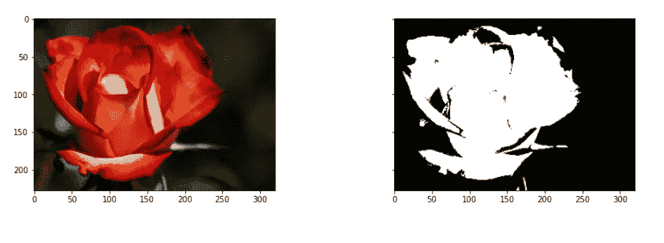

**2。侵蚀、扩张、打开&关闭**

**侵蚀**缩小亮区，放大暗区。**另一方面，膨胀**正好相反——它缩小黑暗区域，扩大明亮区域。

**开口**是侵蚀后的扩张。开口可以去除小亮点(即“盐”)，连接小暗裂纹。这往往会“打开”(亮)特征之间的(暗)间隙。

**关闭**是扩张后侵蚀。闭合可以去除小暗斑(即“辣椒”)，连接小亮裂。这有助于“封闭”(亮)特征之间的(暗)间隙。

所有这些都可以使用`skimage.morphology`模块来完成。基本的想法是让一个特定大小的**圆盘**(下面的 3)在图像周围移动，并使用它应用这些变换。

```
from skimage.morphology import binary_closing, binary_dilation, binary_erosion, binary_opening
from skimage.morphology import selem

***# use a disk of radius 3***
selem = selem.disk(3)

***# oprning and closing***
open_img = binary_opening(bin_image, selem)
close_img = binary_closing(bin_image, selem)
 ***# erosion and dilation***
eroded_img = binary_erosion(bin_image, selem)
dilated_img = binary_dilation(bin_image, selem)

plot_image([bin_image, open_img, close_img, eroded_img, dilated_img], cmap='gray')
```

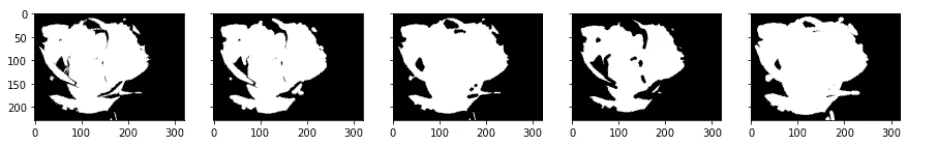

## **正常化**

归一化是预处理部分中最关键的步骤。这是指重新调整像素值，使它们位于一个限定的范围内。这样做的原因之一是有助于传播梯度的问题。我们将讨论多种归一化图像的方法。

```
***#way1-this is common technique followed in case of RGB images*** 
norm1_image = image/255
***#way2-in case of medical Images/non natural images***
norm2_image = image - np.min(image)/np.max(image) - np.min(image)
***#way3-in case of medical Images/non natural images*** 
norm3_image = image - np.percentile(image,5)/ np.percentile(image,95) - np.percentile(image,5)

plot_image([image, norm1_image, norm2_image, norm3_image], cmap='gray')
```

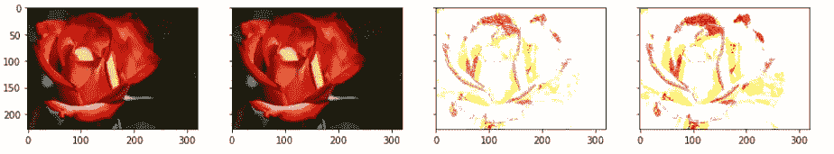

## **增强**

这就把我们带到了数据预处理的下一个方面——数据扩充。很多时候，我们拥有的数据量不足以很好地完成分类任务。在这种情况下，我们执行**数据扩充**。例如，如果我们正在处理将宝石分为不同类型的数据集，我们可能没有足够数量的图像(因为高质量的图像很难获得)。在这种情况下，我们可以执行扩充来增加数据集的大小。增强通常用于基于图像的深度学习任务，以增加训练数据的数量和方差。增强只能在训练集上进行，而不能在验证集上进行。

如你所知，**汇集**增加了**不变性。**如果一张狗的照片在图像的左上角，通过池化，您将能够识别出狗是否在左上角的左/右/上/下。但是训练数据由像 ***翻转、旋转、裁剪、平移、照明、缩放、添加噪声、*** 等数据增强组成。模型学习所有这些变化。这大大提高了模型的准确性。因此，即使狗出现在图像的任何角落，模型也能够以很高的准确度识别它。

可能有多种类型的增强。基本类型使用以下变换类型之一来变换原始图像:

1.  线性变换
2.  仿射变换

```
from skimage import transform as tf
 ***# flip left-right, up-down***
image_flipr = np.fliplr(image)
image_flipud = np.flipud(image)

plot_image([image, image_flipr, image_flipud])
```

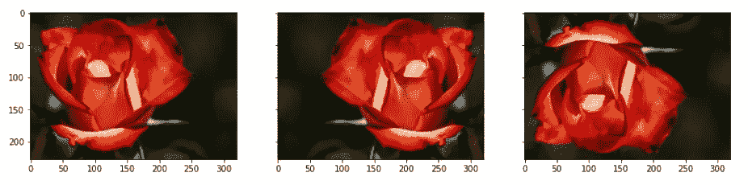

```
***# specify x and y coordinates to be used for shifting (mid points)***
shift_x, shift_y = image.shape[0]/2, image.shape[1]/2

***# translation by certain units***
matrix_to_topleft = tf.SimilarityTransform(translation=[-shift_x, -shift_y])
matrix_to_center = tf.SimilarityTransform(translation=[shift_x, shift_y])

***# rotation***
rot_transforms =  tf.AffineTransform(rotation=np.deg2rad(45))
rot_matrix = matrix_to_topleft + rot_transforms + matrix_to_center
rot_image = tf.warp(image, rot_matrix)

***# scaling*** 
scale_transforms = tf.AffineTransform(scale=(2, 2))
scale_matrix = matrix_to_topleft + scale_transforms + matrix_to_center
scale_image_zoom_out = tf.warp(image, scale_matrix)

scale_transforms = tf.AffineTransform(scale=(0.5, 0.5))
scale_matrix = matrix_to_topleft + scale_transforms + matrix_to_center
scale_image_zoom_in = tf.warp(image, scale_matrix)

***# translation***
transaltion_transforms = tf.AffineTransform(translation=(50, 50))
translated_image = tf.warp(image, transaltion_transforms)

plot_image([image, rot_image, scale_image_zoom_out, scale_image_zoom_in, translated_image])
```

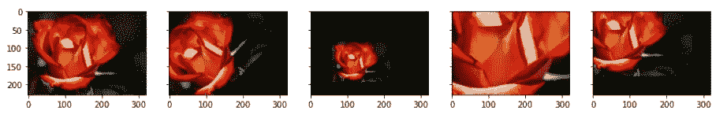

```
***# shear transforms***
shear_transforms = tf.AffineTransform(shear=np.deg2rad(45))
shear_matrix = matrix_to_topleft + shear_transforms + matrix_to_center
shear_image = tf.warp(image, shear_matrix)

bright_jitter = image*0.999 + np.zeros_like(image)*0.001

plot_image([image, shear_image, bright_jitter])
```

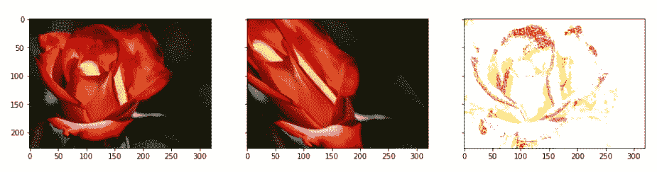

# 网络建设

现在让我们构建和训练模型。

## **选择架构**

在本节中，我们将使用' **ResNet** '架构。由于 ResNets 在行业中已经变得相当普遍，所以有必要花一些时间来理解其架构的重要元素。先说这里提出的 原架构 [**。还有，在 2016 年，ResNet 团队已经在原架构**](https://arxiv.org/pdf/1512.03385.pdf) **[**这里**](https://arxiv.org/pdf/1603.05027.pdf) 提出了一些改进。利用这些修改，他们已经训练了超过 1000 层**的**网络(例如 [ResNet-1001](https://github.com/KaimingHe/resnet-1k-layers) )。**

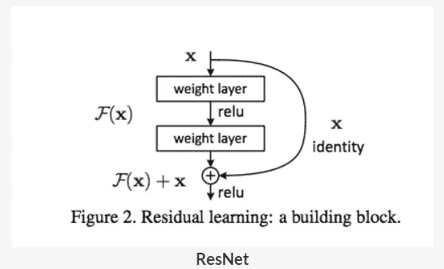

这里使用的“ResNet builder”模块基本上是一个 Python 模块，包含了 ResNet 的所有构建模块。我们将使用该模块导入 ResNet 的变体(ResNet-18、ResNet-34 等。).resnet.py 模块取自 [**此处**](https://www.kaggle.com/tanyadayanand/resnet) 。它最大的好处是“跳过连接”机制允许非常深的网络。

## 运行数据生成器

数据生成器支持预处理—它将图像归一化(除以 255)并裁剪图像的中心部分 **(100 x 100)** 。

没有特别的理由将 **100** 作为尺寸，但是已经选择了它，以便我们可以处理所有大于 100*100 尺寸的图像。如果图像的任何尺寸(高度或宽度)小于 100 像素，则该图像将被自动删除。你可以根据需要把它改成 150 或者 200。

现在让我们设置**数据发生器**。下面的代码设置了一个定制的数据生成器，与 keras API 自带的[略有不同。使用定制生成器的原因是为了能够根据手头的问题修改它(可定制性)。](https://keras.io/preprocessing/image/)

```
import numpy as np
import keras

class **DataGenerator**(keras.utils.Sequence):
   ** 'Generates data for Keras'**

    def __init__(self, mode='train', ablation=None, flowers_cls=['daisy', 'rose'], 
                 batch_size=32, dim=(100, 100), n_channels=3, shuffle=True):
       ** *"""*
 *Initialise the data generator*
 *"""***
        self.dim = dim
        self.batch_size = batch_size
        self.labels = {}
        self.list_IDs = []

        ***# glob through directory of each class*** 
        for i, cls **in** enumerate(flowers_cls):
            paths = glob.glob(os.path.join(DATASET_PATH, cls, '*'))
            brk_point = int(len(paths)*0.8)
            if mode == 'train':
                paths = paths[:brk_point]
            else:
                paths = paths[brk_point:]
            if ablation **is** **not** None:
                paths = paths[:ablation]
            self.list_IDs += paths
            self.labels.update({p:i for p **in** paths})

        self.n_channels = n_channels
        self.n_classes = len(flowers_cls)
        self.shuffle = shuffle
        self.on_epoch_end()

    def __len__(self):
        **'Denotes the number of batches per epoch'**
        return int(np.floor(len(self.list_IDs) / self.batch_size))

    def __getitem__(self, index):
        **'Generate one batch of data'**
        ***# Generate indexes of the batch***
        indexes = self.indexes[index*self.batch_size:(index+1)*self.batch_size]

        ***# Find list of IDs***
        list_IDs_temp = [self.list_IDs[k] for k **in** indexes]

        ***# Generate data***
        X, y = self.__data_generation(list_IDs_temp)

        return X, y

    def on_epoch_end(self):
        **'Updates indexes after each epoch'**
        self.indexes = np.arange(len(self.list_IDs))
        if self.shuffle == True:
            np.random.shuffle(self.indexes)

    def __data_generation(self, list_IDs_temp):
        **'Generates data containing batch_size samples' *# X : (n_samples, *dim, n_channels)***
       ** *# Initialization***
        X = np.empty((self.batch_size, *self.dim, self.n_channels))
        y = np.empty((self.batch_size), dtype=int)

        delete_rows = []

       ** *# Generate data***
        for i, ID **in** enumerate(list_IDs_temp):
            ***# Store sample***
            img = io.imread(ID)
            img = img/255
            if img.shape[0] > 100 **and** img.shape[1] > 100:
                h, w, _ = img.shape
                img = img[int(h/2)-50:int(h/2)+50, int(w/2)-50:int(w/2)+50, : ]
            else:
                delete_rows.append(i)
                continue

            X[i,] = img

            ***# Store class***
            y[i] = self.labels[ID]

        X = np.delete(X, delete_rows, axis=0)
        y = np.delete(y, delete_rows, axis=0)
        return X, keras.utils.to_categorical(y, num_classes=self.n_classes)
```

首先，我们将训练数据存储在 nn 目录中(如果有 nn 类的话)。对于给定的批量大小，我们希望生成批量数据点，并将它们提供给模型。

第一个`for`循环“遍历”每个类(目录)。对于每个类，它将每个图像的路径存储在列表`paths`中。在训练模式中，它将`paths`子集化，以包含前 80%的图像；在验证模式下，它对最后 20%进行子集划分。在消融实验的特殊情况下，它只是对每一类的第一个`ablation`图像进行子集划分。

我们将所有图像(所有类别)的路径存储在一个组合列表`self.list_IDs`中。字典`self.labels`包含标签(作为`path: class_number (0/1)`的键:值对)。

在循环之后，我们调用方法`on_epoch_end()`，该方法创建一个长度为`self.list_IDs`的数组`self.indexes`，并对它们进行混洗(在每个时期的末尾混洗所有的数据点)。

`_getitem_`方法使用(混洗)数组`self.indexes`从路径列表`self.list_IDs`中选择`batch_size`个条目(路径)。

最后，方法`__data_generation`返回一批图像作为对 X，y，其中 X 的形状为`(batch_size, height, width, channels)`，y 的形状为`(batch size, )`。注意`__data_generation`也做一些预处理——它标准化图像(除以 255)并裁剪图像中心 100 x 100 的部分。因此，每个图像具有形状`(100, 100, num_channels)`。如果图像的任何尺寸(高度或宽度)小于 100 像素，该图像将被删除。

## **消融实验**

这些指的是获取一小块数据并在其上运行您的模型——这有助于判断模型是否正在运行。这被称为**消融实验。**

构建网络的第一步是让网络在数据集上运行。让我们试着仅在几幅图像和一个时期上拟合网络。注意，因为指定了`ablation=100`，所以使用每类 100 个图像，所以总批次数为`np.floor(200/32)` = 6。

注意，`DataGenerator`类“继承”自`keras.utils.Sequence`类，因此它拥有基础`keras.utils.Sequence`类的所有功能(比如`model.fit_generator`方法)。

```
***# using resnet 18***
model = resnet.ResnetBuilder.build_resnet_18((img_channels, img_rows, img_cols), nb_classes)
model.compile(loss='categorical_crossentropy', optimizer='SGD',
              metrics=['accuracy'])

***# create data generator objects in train and val mode*
*# specify ablation=number of data points to train on***
training_generator = DataGenerator('train', ablation=100)
validation_generator = DataGenerator('val', ablation=100)

***# fit: this will fit the net on 'ablation' samples, only 1 epoch***
model.fit_generator(generator=training_generator,
                    validation_data=validation_generator,
                    epochs=1,)
```

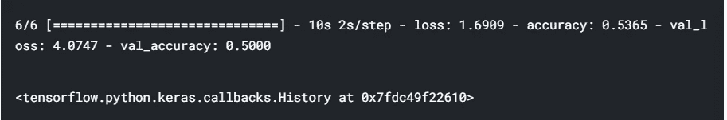

## **过拟合训练数据**

下一步是尝试在训练数据上过度拟合模型。为什么我们要故意夸大我们的数据呢？简单地说，这将告诉我们网络是否能够学习训练集中的模式。这将告诉您模型的行为是否符合预期。

我们将使用 ablation=100(即在每类的 100 个图像上训练)，因此它仍然是一个非常小的数据集，并且我们将使用 20 个时期。在每个时期，将使用 200/32=6 批。

```
***# resnet 18***
model = resnet.ResnetBuilder.build_resnet_18((img_channels, img_rows, img_cols), nb_classes)
model.compile(loss='categorical_crossentropy',optimizer='SGD',
              metrics=['accuracy'])

***# generators***
training_generator = DataGenerator('train', ablation=100)
validation_generator = DataGenerator('val', ablation=100)

***# fit***
model.fit_generator(generator=training_generator,
                    validation_data=validation_generator,
                    epochs=20)
```

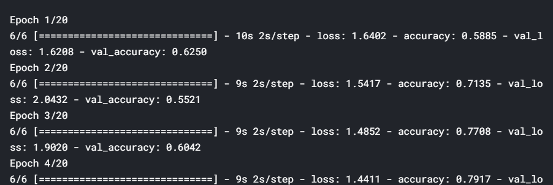

训练精度随着每个历元不断增加

结果表明，训练精度随着每个历元不断提高。验证准确性也会增加，然后趋于平稳，这是“良好拟合”的标志，即我们知道该模型至少能够从一个小数据集学习，因此我们可以希望它也能够从整个数据集学习。

总而言之，对任何模型的一个好的测试是检查它是否能够**过度适应训练数据**(即训练损失随着时期持续减少)。这种技术在深度学习中特别有用，因为大多数深度学习模型都是在大型数据集上训练的，如果它们无法过度适应小版本，那么它们就不太可能从大版本中学习。

## **超参数调谐**

我们在数据集的一小块上训练模型，并确认模型可以从数据集学习(通过过度拟合来指示)。在修复了模型和数据扩充之后，我们现在需要找到优化器的学习率(这里是 SGD)。首先，让我们列出想要优化的超参数:

1.  学习速度和变化+优化器
2.  增强技术

基本思想是随着超参数的各种值的增加，跟踪验证损失。

**Keras 回调**

在你继续之前，让我们讨论一下**回调**。回调基本上是您希望在培训的特定情况下执行的操作。例如，我们希望在每个时期结束时执行存储丢失的操作(这里的实例是一个时期的结束)。

形式上，回调只是一个函数(如果您想要执行单个操作)，或者一个函数列表(如果您想要执行多个操作)，它们将在特定事件(一个时期的结束、每个批次的开始、准确性达到稳定状态时等)时执行。).Keras 通过类`keras.callbacks.Callback`提供了一些非常有用的回调功能。

Keras 有很多内置的回调函数(这里列出的)。**在 keras** 中创建自定义回调的一般方法是:

```
from keras import optimizers
from keras.callbacks import *

***# range of learning rates to tune***
hyper_parameters_for_lr = [0.1, 0.01, 0.001]

***# callback to append loss***
class **LossHistory**(keras.callbacks.Callback):
    def on_train_begin(self, logs={}):
        self.losses = []

    def on_epoch_end(self, epoch, logs={}):
        self.losses.append(logs.get('loss'))

***# instantiate a LossHistory() object to store histories***
history = LossHistory()
plot_data = {}

***# for each hyperparam: train the model and plot loss history***
for lr **in** hyper_parameters_for_lr:
    print ('**\n\n**'+'=='*20 + '   Checking for LR=**{}**  '.format(lr) + '=='*20 )
    sgd = optimizers.SGD(lr=lr, clipnorm=1.)

 ***# model and generators***
    model = resnet.ResnetBuilder.build_resnet_18((img_channels, img_rows, img_cols), nb_classes)
    model.compile(loss='categorical_crossentropy',optimizer= sgd,
                  metrics=['accuracy'])
    training_generator = DataGenerator('train', ablation=100)
    validation_generator = DataGenerator('val', ablation=100)
    model.fit_generator(generator=training_generator,
                        validation_data=validation_generator,
                        epochs=3, callbacks=[history])

 ***# plot loss history***
    plot_data[lr] = history.losses
```

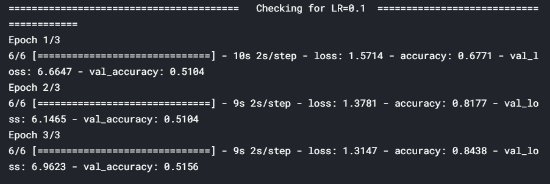

在上面的代码中，我们创建了一个自定义回调，在每个时期结束时将丢失的数据追加到一个列表中。注意，`logs`是`keras.callbacks.Callback`的一个属性(一个字典)，我们用它来获得键‘loss’的值。这个字典的其他一些关键字是`acc`、`val_loss`等。

为了告诉模型我们想要使用回调，我们创建了一个名为`history`的`LossHistory`对象，并使用`callbacks=[history]`将其传递给`model.fit_generator`。在这种情况下，我们只有一个回调`history`，尽管您可以通过这个列表传递多个回调对象(多个回调的示例在下一节中——参见`DecayLR()`的代码块)。

这里，**我们调整了学习率超参数**，并观察到与 0.01 和 0.001 相比，0.1 是最佳的学习率。然而，在整个训练过程中使用如此高的学习率并不是一个好主意，因为损失可能在稍后开始在最小值附近振荡。因此，在训练开始时，我们为模型使用高学习率来快速学习，但是随着我们进一步训练并向最小值前进，我们逐渐降低学习率。

```
***# plot loss history for each value of hyperparameter***
f, axes = plt.subplots(1, 3, sharey=True)
f.set_figwidth(15)

plt.setp(axes, xticks=np.arange(0, len(plot_data[0.01]), 1)+1)

for i, lr **in** enumerate(plot_data.keys()):
    axes[i].plot(np.arange(len(plot_data[lr]))+1, plot_data[lr])
```

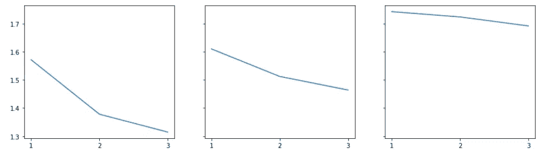

上面的结果表明 0.1 的学习率是最好的，尽管在整个训练中使用如此高的学习率通常不是一个好主意。因此，我们应该使用**学习率衰减**——从高学习率开始，并随着每个时期衰减。

我们使用另一个**自定义回调** ( `DecayLR`)来衰减每个时期结束时的学习率。衰减率被指定为 0.5 ^历元。另外，注意这次我们告诉模型**使用两个回调**(作为列表`callbacks=[history, decay]`传递给`model.fit_generator`)。

尽管我们在这里使用了自己的自定义衰减实现，但是您也可以使用内置在 [keras 优化器](https://keras.io/optimizers/)中的实现(使用`decay`参数)。

```
***# learning rate decay***
class **DecayLR**(keras.callbacks.Callback):
    def __init__(self, base_lr=0.001, decay_epoch=1):
        super(DecayLR, self).__init__()
        self.base_lr = base_lr
        self.decay_epoch = decay_epoch 
        self.lr_history = []

    ***# set lr on_train_begin***
    def on_train_begin(self, logs={}):
        K.set_value(self.model.optimizer.lr, self.base_lr)

 ***# change learning rate at the end of epoch***
    def on_epoch_end(self, epoch, logs={}):
        new_lr = self.base_lr * (0.5 ** (epoch // self.decay_epoch))
        self.lr_history.append(K.get_value(self.model.optimizer.lr))
        K.set_value(self.model.optimizer.lr, new_lr)

***# to store loss history***
history = LossHistory()
plot_data = {}

***# start with lr=0.1***
decay = DecayLR(base_lr=0.1)

***# model***
sgd = optimizers.SGD()
model = resnet.ResnetBuilder.build_resnet_18((img_channels, img_rows, img_cols), nb_classes)
model.compile(loss='categorical_crossentropy',optimizer= sgd,
              metrics=['accuracy'])
training_generator = DataGenerator('train', ablation=100)
validation_generator = DataGenerator('val', ablation=100)

model.fit_generator(generator=training_generator,
                    validation_data=validation_generator,
                    epochs=3, callbacks=[history, decay])

plot_data[lr] = decay.lr_history
```

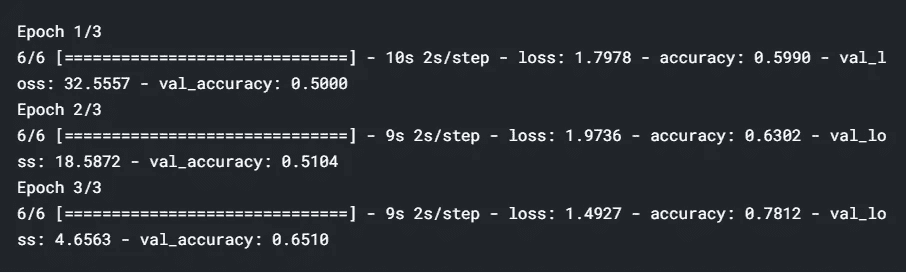

```
plt.plot(np.arange(len(decay.lr_history)), decay.lr_history)
```

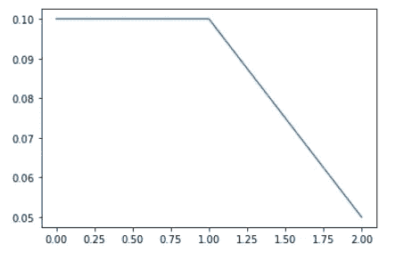

**增强技术**

现在让我们编写一些代码来实现数据扩充。扩充通常是通过数据生成器完成的，即扩充的数据是动态地批量生成的。你可以使用内置的 keras `ImageDataGenerator`或者编写你自己的数据生成器(如果你想的话，可以定制一些特性等)。下面的代码显示了如何实现这些。

```
import numpy as np
import keras

***# data generator with augmentation***
class **AugmentedDataGenerator**(keras.utils.Sequence):
    **'Generates data for Keras'**
    def __init__(self, mode='train', ablation=None, flowers_cls=['daisy', 'rose'], 
                 batch_size=32, dim=(100, 100), n_channels=3, shuffle=True):
        **'Initialization'**
        self.dim = dim
        self.batch_size = batch_size
        self.labels = {}
        self.list_IDs = []
        self.mode = mode

        for i, cls **in** enumerate(flowers_cls):
            paths = glob.glob(os.path.join(DATASET_PATH, cls, '*'))
            brk_point = int(len(paths)*0.8)
            if self.mode == 'train':
                paths = paths[:brk_point]
            else:
                paths = paths[brk_point:]
            if ablation **is** **not** None:
                paths = paths[:ablation]
            self.list_IDs += paths
            self.labels.update({p:i for p **in** paths})

        self.n_channels = n_channels
        self.n_classes = len(flowers_cls)
        self.shuffle = shuffle
        self.on_epoch_end()

    def __len__(self):
        **'Denotes the number of batches per epoch'**
        return int(np.floor(len(self.list_IDs) / self.batch_size))

    def __getitem__(self, index):
       ** 'Generate one batch of data'**
        ***# Generate indexes of the batch***
        indexes = self.indexes[index*self.batch_size:(index+1)*self.batch_size]

        ***# Find list of IDs***
        list_IDs_temp = [self.list_IDs[k] for k **in** indexes]

       ** *# Generate data***
        X, y = self.__data_generation(list_IDs_temp)

        return X, y

    def on_epoch_end(self):
   **     'Updates indexes after each epoch'**
        self.indexes = np.arange(len(self.list_IDs))
        if self.shuffle == True:
            np.random.shuffle(self.indexes)

    def __data_generation(self, list_IDs_temp):
 **'Generates data containing batch_size samples' *# X : (n_samples, *dim, n_channels)***
        ***# Initialization***
        X = np.empty((self.batch_size, *self.dim, self.n_channels))
        y = np.empty((self.batch_size), dtype=int)

        delete_rows = []

       ** *# Generate data***
        for i, ID **in** enumerate(list_IDs_temp):
            ***# Store sample***
            img = io.imread(ID)
            img = img/255
            if img.shape[0] > 100 **and** img.shape[1] > 100:
                h, w, _ = img.shape
                img = img[int(h/2)-50:int(h/2)+50, int(w/2)-50:int(w/2)+50, : ]
            else:
                delete_rows.append(i)
                continue

            X[i,] = img

          **  *# Store class***
            y[i] = self.labels[ID]

        X = np.delete(X, delete_rows, axis=0)
        y = np.delete(y, delete_rows, axis=0)

 ***# data augmentation***
        if self.mode == 'train':
            aug_x = np.stack([datagen.random_transform(img) for img **in** X])
            X = np.concatenate([X, aug_x])
            y = np.concatenate([y, y])
        return X, keras.utils.to_categorical(y, num_classes=self.n_classes)
```

**要优化的指标**

根据具体情况，我们选择合适的指标。对于二元分类问题，AUC 通常是最好的度量。

AUC 通常是比准确性更好的指标。因此，让我们监控 AUC，并根据验证数据选择基于 AUC 的最佳模型，而不是针对准确性进行优化。我们将使用回调`on_train_begin`和`on_epoch_end`来初始化(在每个时期的开始)和存储 AUC(在时期的结束)。

```
from sklearn.metrics import roc_auc_score

class **roc_callback**(Callback):

    def on_train_begin(self, logs={}):
        logs['val_auc'] = 0

    def on_epoch_end(self, epoch, logs={}):
        y_p = []
        y_v = []
        for i **in** range(len(validation_generator)):
            x_val, y_val = validation_generator[i]
            y_pred = self.model.predict(x_val)
            y_p.append(y_pred)
            y_v.append(y_val)
        y_p = np.concatenate(y_p)
        y_v = np.concatenate(y_v)
        roc_auc = roc_auc_score(y_v, y_p)
        print ('**\n**Val AUC for epoch**{}**: **{}**'.format(epoch, roc_auc))
        logs['val_auc'] = roc_auc
```

# 最终运行

现在让我们来训练最终的模型。请注意，我们将继续在`models/best_models.hdf5`保存最佳模型的权重，因此您需要创建一个目录`models`。请注意，模型权重通常保存在 hdf5 文件中。

**保存最佳模型**是使用`ModelCheckpoint`附带的回调功能完成的。我们基本上指定了保存模型权重的`filepath`，`monitor='val_auc'`指定了您正在基于验证准确性选择最佳模型，`save_best_only=True`仅保存最佳权重，`mode='max'`指定了验证准确性将被最大化。

```
***# model***
model = resnet.ResnetBuilder.build_resnet_18((img_channels, img_rows, img_cols), nb_classes)
model.compile(loss='categorical_crossentropy',optimizer= sgd,
              metrics=['accuracy'])
training_generator = AugmentedDataGenerator('train', ablation=32)
validation_generator = AugmentedDataGenerator('val', ablation=32)

***# checkpoint*** 
filepath = 'models/best_model.hdf5'
checkpoint = ModelCheckpoint(filepath, monitor='val_auc', verbose=1, save_best_only=True, mode='max')
auc_logger = roc_callback()

***# fit*** 
model.fit_generator(generator=training_generator,
                    validation_data=validation_generator,
                    epochs=3, callbacks=[auc_logger, history, decay, checkpoint])
```

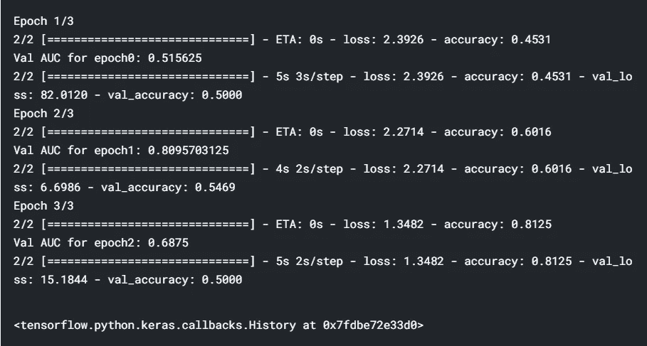

```
plt.imshow(image)
```

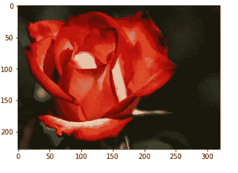

```
***#*standardizing *image
#moved the origin to the centre of the image***
h, w, _ = image.shape
img = image[int(h/2)-50:int(h/2)+50, int(w/2)-50:int(w/2)+50, : ]

model.predict(img[np.newaxis,: ])
```


嘿，我们有一个非常高的概率为 1 类，即玫瑰。如果你还记得的话，0 班是黛西，1 班是罗斯(在博客上面)。因此，模型已经学习得很好了。我们已经建立了一个在 3 个时期结束时具有良好 AUC 的模型。如果您使用更多的纪元来训练，您应该能够达到更好的 AUC 值。

如果你有任何问题、建议或批评，可以通过 LinkedIn 或评论区联系我。