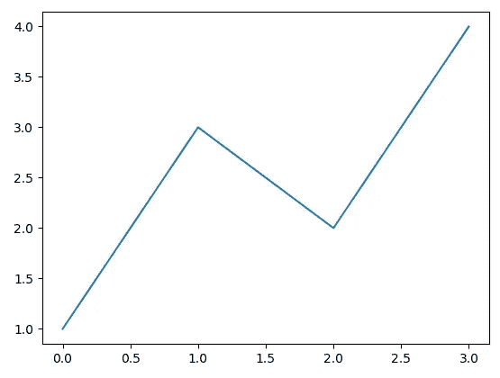
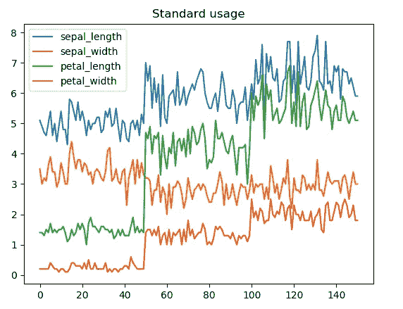
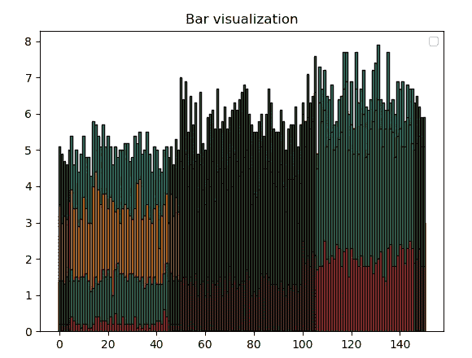
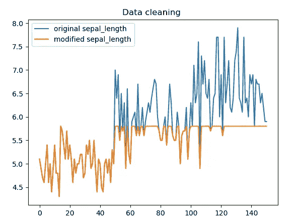
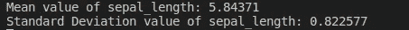
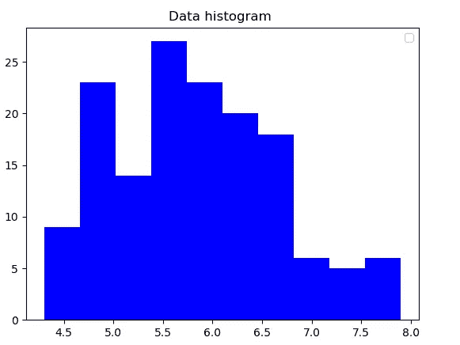
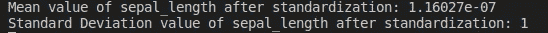
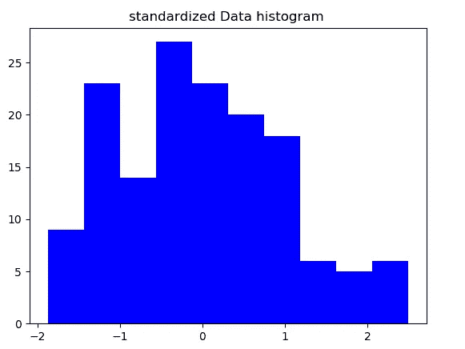

# C++中的数据预处理和可视化

> 原文：<https://towardsdatascience.com/data-preprocessing-and-visualization-in-c-6d97ed236f3b?source=collection_archive---------16----------------------->

## 关于如何使用 C++实现机器学习的基本功能的工作代码示例

> “我们相信上帝。所有其他人都必须带数据。”— W. Edwards Deming，统计学家、教授、作家、讲师和顾问。

卢克·切瑟在 [Unsplash](https://unsplash.com/s/photos/data?utm_source=unsplash&utm_medium=referral&utm_content=creditCopyText) 上的照片

D 数据预处理是将原始数据转换成计算机可理解格式的过程，它是任何机器学习操作的第一步。数据收集通常控制松散，可能会导致超出范围的值。数据准备和过滤步骤可能需要相当长的处理时间。

## 数据预处理包括:

*   从文件中读取数据。
*   数据清理。
*   实例选择。
*   数据标准化。
*   数据转换。
*   特征提取和选择。

要了解更多详情，您可以查看以下视频

数据预处理的产物就是最终的**训练集**。在本文中，我将介绍使用 C++时的一些数据预处理步骤，以及使用 Matplotlib-Cpp 库的数据可视化。

这篇文章是解决机器学习算法在 C++中实现的系列文章的一部分，在整个系列中，我们将使用 Iris 数据集[这里](https://archive.ics.uci.edu/ml/datasets/iris)。

*   [什么时候应该学习使用 C++的机器学习？](https://medium.com/ml2b/when-should-you-learn-machine-learning-using-c-6edd719f95ff?source=friends_link&sk=8b66a55c047b99bbd1c720e59fe6a770)
*   每个 C++开发人员必读的 8 本书。
*   [c++中的数据预处理和可视化。](/data-preprocessing-and-visualization-in-c-6d97ed236f3b?source=friends_link&sk=d13cdabff65a5ce56b717835108615ab)
*   [使用 C++进行机器学习数据操作。](/data-manipulation-using-c-389d6c4493b1?source=friends_link&sk=b16fffc79fcdfbd63f60d919eb86d835)
*   [使用 C++](/naive-bayes-implementation-from-scratch-using-c-51c958094041) 从零开始的朴素贝叶斯。
*   [线性回归在 C++中的实现](https://medium.com/ml2b/linear-regression-implementation-in-c-acdfb621e56)。

请注意，已经有一些库可以轻松完成这项工作，但是本系列的目的是学习如何从头开始开发这些算法。如果您有兴趣了解更多关于 c++ ML 库的信息，您可以阅读这篇文章:

 [## C++机器学习库介绍

### 我喜欢使用 C++，甚至在我发现了用于机器学习的 Python 编程语言之后。C++…

www.analyticsvidhya.com](https://www.analyticsvidhya.com/blog/2020/05/introduction-machine-learning-libraries-c/) 

在本文中，我将使用 i [ris 数据集](https://archive.ics.uci.edu/ml/datasets/iris)作为我们可以对其执行每个操作的数据示例，同时请注意，我将在本教程中使用 C++11。

# 从文件中读取数据:

从[这里](https://archive.ics.uci.edu/ml/machine-learning-databases/iris/iris.data)下载 iris.data 文件后。让我们用简单的读文件指令从文件中读取数据，并在单独的向量中解析每种类型的数据。

从文件中读取数据

在这段代码中，我们使用 ifstream 从一个文件创建了一个简单的输入流。

我们还使用多个向量来读取数据集中的每种信息，然后将所有数据添加到一个二维向量中。

在 iris 数据集中，除了 iris 类数据是字符串类型之外，所有数据都来自相同的数据类型，因此我必须将其转换为 enum 类型，并将其作为 float 进行处理，以匹配 Iris_Dataset 向量中的其余数据。

但是，您总是可以使用其他方式加载不同类型的数据，例如，您可以创建一个结构并在其上加载数据，或者为 iris 数据集创建一个类并在该类上加载数据。

现在，我决定用这种简单的方法来处理相同数据类型的数据。

# 数据可视化:

图像胜于文字，直观地表示数据对于理解数据、收集数据信息和识别异常值非常重要。

虽然这在使用 C++开发机器学习算法时似乎不太重要，因为大多数情况下，您将使用 python 等其他语言的数据来测试和实现算法，然后可以将算法转换为 C++，但我相信这对于在实现过程中可视化数据(例如用于调试目的)非常重要。

在本文中，我将使用 [**Matplotlib-CPP**](https://github.com/Cryoris/matplotlib-cpp) ，它是 Matplotlib 的 python APIs 的简单包装器。请查看[文档](https://readthedocs.org/projects/matplotlib-cpp/downloads/pdf/latest/)以了解更多关于该库的信息。

使用 Matplotlib-CPP 很简单，您只需要包含头文件“matplotlibcpp.h”并将其与 python 库链接。下面是来自 GitHub 库的一个最小的例子:

来自 [matplotlib-cpp](https://github.com/lava/matplotlib-cpp/blob/master/examples/minimal.png) 的最小示例

现在，我将只使用标准绘图 API 表示四个 iris 属性的数据:

用绘图法绘制虹膜数据集

使用 bar API 表示数据的另一种方式是:

利用条形法绘制虹膜数据集

# 数据清理:

从数据集中检测并纠正(或删除)损坏或不准确数据的过程，例如，在数据收集阶段可能会引入一些缺失、不一致的值或异常值。

在前面的函数中，您可能注意到我使用了 replace [std::replace](https://en.cppreference.com/w/cpp/algorithm/replace) 函数来替换一些值。这一步可用于在将数据读入向量之前删除或替换任何值。例如，我怀疑“，”或“-”可能会混淆从文件中加载的值，所以我决定使用统一的读取方式，用其他值替换它们。

另一种方法是使用[迭代器](http://Iterators in C++ STL)和[λ表达式](https://dev.to/sandordargo/lambda-expressions-in-c-4pj4)移除或替换添加到向量中的数据。

这是一个去除萼片长度大于 5.8 的值的例子。

移除大于 5.8 的值

这可以通过添加一行代码来完成

# 数据标准化:

数据标准化是机器学习模型中提高模型精度的重要步骤。要了解更多关于数据标准化的重要性，您可以阅读以下文章:

 [## 机器学习的特征缩放:理解标准化与规范化的区别

### 要素缩放简介我最近在处理一个数据集，该数据集包含多个要素，跨越不同的…

www.analyticsvidhya.com](https://www.analyticsvidhya.com/blog/2020/04/feature-scaling-machine-learning-normalization-standardization/)  [## 为什么数据规范化对于机器学习模型是必要的

### 标准化是一种经常作为机器学习的数据准备的一部分而应用的技术。正常化的目标…

medium.com](https://medium.com/@urvashilluniya/why-data-normalization-is-necessary-for-machine-learning-models-681b65a05029) 

标准化数据集包括重新调整值的分布，使观察值的平均值为 0，标准偏差为 1。这将需要减去平均值并除以标准偏差。

首先，我们实现了一个计算平均值的 API:

使用模板计算平均值

这个 API 将获取任何标准类型的向量并计算平均值。可以使用类似的方法来计算标准偏差。

使用模板函数计算标准偏差

计算萼片长度的平均值和标准偏差:

CPP 中的均值和标准差计算

计算萼片长度平均值和标准偏差

我们可以在应用标准化之前将数据可视化:

原始萼片长度直方图

然后我们可以应用这一行代码来计算标准化后的值:

使用 lambda 表达式减去平均值并除以每个向量值的标准偏差

标准化后计算的平均值和标准偏差

标准化萼片长度直方图

在本文中，我们给出了一些数据预处理步骤的实现示例，我们介绍了从文件中读取数据、使用 Matplotlibcpp 进行数据可视化、数据清理，以及在数据标准化过程中对数据执行一些操作，如均值和标准差。

## 推荐书籍:

*   [c++编程语言](https://amzn.to/3dF52Ot)，作者比雅尼·斯特劳斯特鲁普
*   [安德烈·布尔科夫所著的百页机器学习书籍](https://amzn.to/3rV0NDk)
*   [完全初学者的机器学习](https://amzn.to/2PA5Coy)，作者奥利弗·西奥博尔德

或者你可以跟随这些教程

或者访问这篇文章谈 [**每个机器学习开发者必读的 9 本书**](https://medium.com/coderbyte/the-9-books-each-machine-learning-developer-must-read-e6ef8c0fb384)**&**[**每个 C++编程开发者必读的 8 本书。**](https://medium.com/coderbyte/the-8-c-programming-books-each-developer-must-read-da5ce755429f)

这篇文章是解决机器学习算法在 C++中实现的系列文章的一部分，在整个系列中，我们将使用 Iris 数据集[这里](https://archive.ics.uci.edu/ml/datasets/iris)。

*   [什么时候应该学习使用 C++的机器学习？](https://medium.com/ml2b/when-should-you-learn-machine-learning-using-c-6edd719f95ff?source=friends_link&sk=8b66a55c047b99bbd1c720e59fe6a770)
*   每个 C++开发人员必读的 8 本书。
*   [c++中的数据预处理和可视化。](/data-preprocessing-and-visualization-in-c-6d97ed236f3b?source=friends_link&sk=d13cdabff65a5ce56b717835108615ab)
*   [使用 C++进行机器学习数据操作。](/data-manipulation-using-c-389d6c4493b1?source=friends_link&sk=b16fffc79fcdfbd63f60d919eb86d835)
*   [使用 C++](/naive-bayes-implementation-from-scratch-using-c-51c958094041) 从零开始的朴素贝叶斯。
*   [线性回归在 C++中的实现](https://medium.com/ml2b/linear-regression-implementation-in-c-acdfb621e56)。

也请查看我的最新文章:

 [## ML 模型的版本控制:为什么需要它，它是什么，如何实现它— neptune.ai

### 版本控制在任何软件开发环境中都很重要，在机器学习中更是如此。在 ML 中…

medium.com](https://medium.com/coderbyte/version-control-for-ml-models-why-you-need-it-what-it-is-how-to-implement-it-neptune-ai-497ff85b2b1a)  [## 加入我的介绍链接媒体-艾哈迈德哈希什

### 作为一个媒体会员，你的会员费的一部分会给你阅读的作家，你可以完全接触到每一个故事…

medium.com](https://medium.com/@ahmhashesh/membership) 

感谢你到此为止，查看其他已发表的故事:

 [## 压缩变换简介

### 长时记忆模型和近期工作综述

medium.com](https://medium.com/ml2b/introduction-to-compressive-transform-53acb767361e)  [## 变压器综合指南

### 关注是你所需要的，甚至更多

pub.towardsai.net](https://pub.towardsai.net/comprehensive-guide-to-transformers-6c73a9e6e2df)