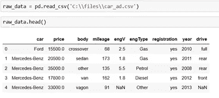
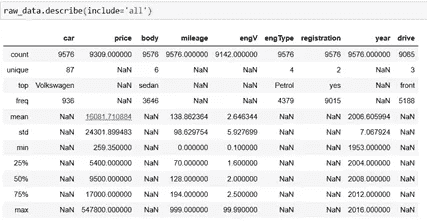
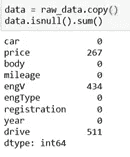
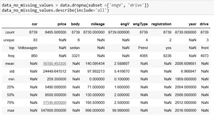
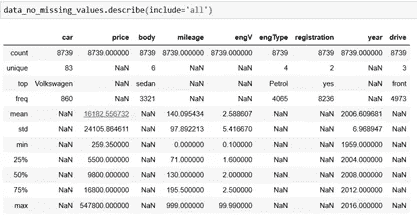
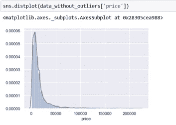
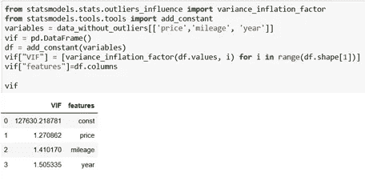
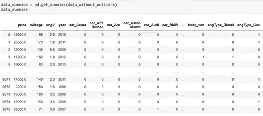

# Python 中机器学习的数据预处理

> 原文：<https://towardsdatascience.com/data-preprocessing-for-machine-learning-in-python-2d465f83f18c?source=collection_archive---------20----------------------->

# 介绍

数据预处理是机器学习中至关重要的一步，对模型的准确性至关重要。数据包含噪音、缺失值、不完整，有时其格式不可用，无法直接用于机器学习模型。但是如果我们使用有问题和肮脏的数据呢？最后的结果会是什么，这个决定是否可信？预处理数据是关键—预处理的目标是获得更有意义的可信数据。这些技术允许我们将原始数据转换成干净和可用的数据集，并通过重新缩放、标准化、二进制化等使数据更有意义。

# 数据预处理概念

在下面的例子中，我们将使用一个包含汽车的文件，它可以从[https://www.kaggle.com/antfarol/car-sale-advertisements](https://www.kaggle.com/antfarol/car-sale-advertisements)下载。我们将使用 Python 进行数据预处理，并使用几个重要的库:

*   pandas——一个提供快速、灵活和富有表现力的数据结构的包，旨在使处理“关系”或“带标签”的数据既简单又直观；
*   sci kit-learn——一个提供许多非监督和监督学习算法的库，建立在 NumPy、pandas 和 Matplotlib 之上；
*   stats model——允许用户探索数据、估计统计模型和执行统计测试的软件包；
*   matplotlib——绘图库；
*   seaborn——一个用 Python 制作统计图形的库。它构建在 matplotlib 之上，并与 pandas 数据结构紧密集成。

有许多方法和概念可以使用，但在本例中，我们将只看到其中的一部分:

1.  处理缺失值
2.  处理异常值
3.  多重共线性
4.  处理分类值
5.  标准化

# 加载数据

第一步是加载数据。我们可以阅读。csv 文件，使用方法 head，我们可以看到数据集中的前 5 行。

# 发现数据

现在，让我们来发现数据。我们可以使用 describe 方法-如果使用此方法，我们将仅获得数字特征的描述性统计数据。我们可以通过使用 include='all '来包含所有这些内容。

我们可以看到每个列的唯一值和最常见的类别。例如，我们可以看到列 registration 包含 9015 个值 yes，并且它有两个唯一的值。此外，我们还可以看到平均值、标准差、最大值和最小值等等。

# 处理缺失值

检查缺失值的一种简单方法是使用 isnull 方法。我们将获得一个包含真(1)和假(0)值的数据框，因此我们将对这些值求和，并可以看到哪一列中有缺失值。

我们可以用两种方法处理缺失值:

1.**消除缺失值**:

a.**删除行**:我们可以删除缺失值不可接受的行。这可以通过使用 dropna 方法来完成。这样，我们将排除包含缺失值的行。

b.**删除列:**如果该列有 95%或更多的缺失值，则可以且需要将其删除，因为缺失值的估计值不可信，因为它是从 5%(或更少)的数据中计算出来的，因此是不相关的。

2.**估计缺失值**:如果只有可接受百分比的值缺失，我们可以估计这些值。这可以通过用相应特征的平均值、中间值或最频繁值填充值来完成。

此外，有多种方法可用于输入缺失值。我们可以使用简单估算、迭代估算或分类估算。分类输入器用于输入分类特征。

在这之后，如果我们调用方法 **describe** 我们可以看到，在 price 列中，我们拥有与 car 和 body 相同的计数。我们缺少的值将替换为此列中所有值的平均值。

# 处理异常值

如果我们正在处理回归，这是一个非常重要的话题。我们将绘制列价格的分布图。为了获得最佳结果，我们正在寻找正态分布。但是，价格是指数级的。如果我们使用回归，这将是一个问题。我们可以在上表中看到，价格的最小值是 259，最大值是 547，800，平均值是 16，182。另外，我们可以看到，25%的值在 5500 以下，75%的值在 16800 以下。因此，在这种情况下，我们有离群值。异常值是指与数据中的其他观察值相距异常距离的观察值，它们会显著影响回归。因此，回归将尝试使直线更接近这些值。

通常的规则是去除所有远离平均值 3 倍标准差的东西。这是什么意思？对于正态分布的值，有一个已知的规则:68–95–99.7。该规则可以解释为:

*   68%的数据分布在区间[均值—标准差，均值+标准差]，
*   95%的数据分布在区间[均值— 2 *标准差，均值+ 2 *标准差]，
*   99.7%的数据分布在区间[均值— 3 *标准差，均值+ 3 *标准差]。

基于此，我们可以说，超出区间[mean-3 * STD，mean + 3*std]的值是异常值，这些值可以删除。

最大值离平均值仍然很远，但已经可以接受地接近了。我们现在可以绘制分布图，我们可以看到数据仍然以相同的方式分布，但离群值较少。我们也可以对里程列这样做。

# 多重共线性

在多元回归方程中，只要一个自变量与一个或多个其他自变量高度相关，就存在多重共线性。多重共线性是一个问题，因为它破坏了独立变量的统计意义。

不幸的是，使用 scikit-learn 我们不能直接确定是否存在多重共线性。我们可以通过使用 statsmodels 来做到这一点。检查多重共线性的最佳方法之一是通过 VIF(方差膨胀因子)。VIF 提出了一种方法，与变量与其他预测因子完全不相关的情况相比，该方法可以估计估计值的标准误差的平方根变大的程度。VIF 的数值告诉我们(以十进制形式)每个系数的方差(即标准误差平方)膨胀的百分比。例如，1.9 的 VIF 告诉我们，如果没有多重共线性(如果与其他预测值没有相关性)，特定系数的方差比我们预期的值大 90%。

在我们的例子中，我们可以说:如果里程数越少，价格就越高。还有，车越老，价格就越小。因此，我们可以检查这三列的多重共线性。

当 VIF 值等于 1 时，根本不存在多重共线性。介于 1 和 5 之间的值被认为是完全可以的。但是，对于什么样的值是可接受的，并没有精确的定义。我们可以在不同的资源中发现，低于 5、6 甚至 10 的值都是可以接受的。因此，在我们的示例中，我们可以看到所有的值都低于 5，它们是正常的。我们很难找到所有特性的值都低于 5 的数据。我们可以说我们的数据集没有多重共线性。如果存在多重共线性，我们应该使用 drop 方法删除该列。作为输入，我们将设置想要删除的列，并且 axis = 1 —这意味着我们将删除一列。例如，假设我们想从数据集中删除列 year。

# 处理分类值

虚拟编码是将分类输入变量转换为连续变量的常用方法。顾名思义，Dummy 是一个重复变量，它代表一个分类变量的一个级别。水平的存在由 1 表示，不存在由 0 表示。对于出现的每个级别，将创建一个虚拟变量。在 Python 中，我们可以使用 get_dummies 方法，该方法返回一个包含一个热编码列的新数据帧。

# 标准化

处理完分类值后，我们可以对值进行标准化。它们不在一个尺度上；因此，我们的模型将赋予具有较大值的列更大的权重，这不是理想的情况，因为其他列对于构建模型很重要。为了避免这个问题，我们可以执行标准化。

**注意**:在一些例子中，标准化可能不会给出更好的结果，甚至可能更糟。

我们将使用 scikit-learn 中的 class StandardScaler。StandardScaler 背后的想法是，它将转换数据，使其分布具有平均值 0 和标准差 1。

# 结论

本文的目的是展示如何使用一些数据预处理技术，并深入了解这些技术的应用场合。还有其他形式的数据清理也是有用的，但是现在，我们在制定任何模型之前覆盖那些重要的。更好更干净的数据胜过最好的算法。如果我们使用一个非常简单的算法对数据进行清理，我们会得到非常令人印象深刻和准确的结果。

如果你对这个话题感兴趣，请随时联系我。

领英简介:【https://www.linkedin.com/in/ceftimoska/ 

博客原文可从以下链接获得:[https://interworks . com . MK/data-pre-processing-for-machine-learning-in-python/](https://interworks.com.mk/data-preprocessing-for-machine-learning-in-python/)

另外，你可以在下面的链接中找到另一篇类似的博文:[https://interworks.com.mk/focusareas/data-management/](https://interworks.com.mk/focusareas/data-management/)