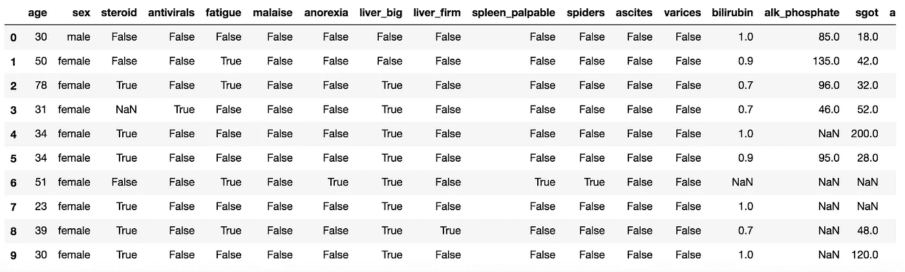

# 使用 Python Pandas 进行数据预处理

> 原文：<https://towardsdatascience.com/data-preprocessing-with-python-pandas-part-1-missing-data-45e76b781993?source=collection_archive---------3----------------------->

## 第 1 部分—缺失数据


来自 [Pixabay](https://pixabay.com/it/?utm_source=link-attribution&utm_medium=referral&utm_campaign=image&utm_content=1433427) 的[照片混合](https://pixabay.com/it/users/photomix-company-1546875/?utm_source=link-attribution&utm_medium=referral&utm_campaign=image&utm_content=1433427)照片

本教程解释了如何使用 pandas 库预处理数据。预处理是对数据进行预分析的过程，目的是将数据转换成标准和规范化的格式。

预处理包括以下几个方面:

*   缺少值
*   数据标准化
*   数据标准化
*   宁滨数据

在本教程中，我们只处理缺失值。

你可以从我的 [Github 数据科学库](https://github.com/alod83/data-science/tree/master/Preprocessing/MissingValues)下载本教程的源代码作为 Jupyter 笔记本。

# 输入数据

在本教程中，我们将使用与肝炎相关的数据集，可以从[此链接](https://datahub.io/machine-learning/hepatitis#pandas)下载。

首先，使用 pandas 库导入数据，并将它们转换成 dataframe。通过`head(10)`方法，我们只打印数据集的前 10 行

```
**import** pandas **as** pd
df **=** pd.read_csv('hepatitis.csv')
df.head(10)
```



# 识别缺失值

我们注意到数据集存在一些问题。例如,“电子邮件”列并不适用于所有行。在某些情况下，它会显示`NaN`值，这意味着该值缺失。

为了检查我们的数据集是否包含缺失值，我们可以使用函数`isna()`，该函数返回数据集的单元格是否为`NaN`。然后我们可以计算每一列有多少个缺失值。

```
df.isna().sum()
```

它给出了以下输出:

```
age                 0
sex                 0
steroid             1
antivirals          0
fatigue             1
malaise             1
anorexia            1
liver_big          10
liver_firm         11
spleen_palpable     5
spiders             5
ascites             5
varices             5
bilirubin           6
alk_phosphate      29
sgot                4
albumin            16
protime            67
histology           0
class               0
dtype: int64
```

现在我们可以计算每列缺失值的百分比，只需将之前的结果除以数据集的长度(`len(df)`)并乘以 100。

```
df.isna().sum()**/**len(df)*****100
```

它给出了以下输出:

```
age                 0.000000
sex                 0.000000
steroid             0.645161
antivirals          0.000000
fatigue             0.645161
malaise             0.645161
anorexia            0.645161
liver_big           6.451613
liver_firm          7.096774
spleen_palpable     3.225806
spiders             3.225806
ascites             3.225806
varices             3.225806
bilirubin           3.870968
alk_phosphate      18.709677
sgot                2.580645
albumin            10.322581
protime            43.225806
histology           0.000000
class               0.000000
dtype: float64
```

处理缺失值时，可以采用不同的替代方法:

*   检查数据源，例如通过联系数据源来更正缺少的值
*   删除缺少的值
*   用一个值替换缺少的值
*   保留缺少的值不变。

# 删除缺少的值

删除缺少的值可以是以下方法之一:

*   删除缺少值的行
*   删除包含缺失值的整列，我们可以通过指定要考虑的`axis`来使用`dropna()`。如果我们设置了`axis = 0`，我们将删除整个行；如果我们设置了`axis = 1`，我们将删除整个列。如果我们应用函数`df.dropna(axis=0)`，数据集的 80 行仍然存在。如果我们应用函数`df.dropna(axis=1)`，只有年龄、性别、抗病毒药物、组织学和类别这几列保留下来。但是，移除的值不会应用于原始数据帧，而只会应用于结果。我们可以使用参数`inplace=True`来存储原始数据帧`df` ( `df.dropna(axis=1,inplace=True)`)中的更改。

```
df.dropna(axis**=**1)
```


或者，我们可以只指定必须对其应用删除操作的列。在下面的示例中，只考虑与列`liver_big`相关的缺失行。这可以通过`subset`参数来实现，该参数允许指定应用删除操作的列子集。

```
df.dropna(subset**=**['liver_big'],axis**=**0,inplace**=True**)
```

现在我们可以检查列`indirizzo`是否还有缺失的值。

```
df.isna().sum()/len(df)*100
```

另一种方法是删除有一定百分比的非空值的列。这可以通过`thresh`参数来实现。在下面的例子中，我们只保留至少有 80%的非空值的列。

```
df.dropna(thresh**=**0.8*****len(df),axis**=**1,inplace**=True**)
```

# 替换丢失的值

处理缺失值的一个好策略是用另一个值替换它们。通常采用以下策略:

*   对于数值，用列的平均值替换缺少的值
*   对于类别值，用该列中最常见的值替换缺失的值
*   使用其他功能

为了替换丢失的值，可以使用三个函数:`fillna()`、`replace()`和`interpolate()`。`fillna()`函数用作为参数传递的值替换所有 NaN 值。例如，对于数值，数值列中的所有 NaN 值都可以替换为平均值。为了列出列的类型，我们可以使用属性`dtypes`如下:

```
df.dtypes
```

它给出了以下输出:

```
age                  int64
sex                 object
steroid             object
antivirals            bool
fatigue             object
malaise             object
anorexia            object
liver_big           object
liver_firm          object
spleen_palpable     object
spiders             object
ascites             object
varices             object
bilirubin          float64
alk_phosphate      float64
sgot               float64
albumin            float64
histology             bool
class               object
dtype: object
```

# 数字列

首先，我们选择数字列。

```
**import** numpy **as** np
numeric **=** df.select_dtypes(include**=**np.number)
numeric_columns **=** numeric.columns
```

然后，我们用平均值填充数值列的 NaN 值，平均值由`df.mean()`函数给出。

```
df[numeric_columns] **=** df[numeric_columns].fillna(df.mean())
```

现在，我们可以检查数字列中的 NaN 值是否已被删除。

```
df.isna().sum()**/**len(df)*****100
```

它给出了以下输出:

```
age                0.000000
sex                0.000000
steroid            0.689655
antivirals         0.000000
fatigue            0.000000
malaise            0.000000
anorexia           0.000000
liver_big          0.000000
liver_firm         0.689655
spleen_palpable    0.689655
spiders            0.689655
ascites            0.689655
varices            0.689655
bilirubin          0.000000
alk_phosphate      0.000000
sgot               0.000000
albumin            0.000000
histology          0.000000
class              0.000000
dtype: float64
```

# 类别列

我们注意到在`dtypes`中，类别列被描述为对象。因此我们可以选择`object`列。我们只想考虑布尔列。然而，`object`类型也包括列`class`，它是一个字符串。我们选择所有的对象列，然后从它们中移除列`class`。然后我们可以将结果的类型转换为`bool`。

```
boolean_columns **=** df.select_dtypes(include**=**np.object).columns.tolist()
boolean_columns.remove('class')
df[boolean_columns] **=** df[boolean_columns].astype('bool')
```

现在，我们可以用最频繁的值替换所有缺少的值。我们可以使用`mode()`函数来计算最频繁的值。我们使用`fillna()`函数来替换丢失的值，但是我们也可以使用`replace(old_value,new_value)`函数。

```
df[boolean_columns].fillna(df.mode())
```

现在我们的数据集不包含任何缺失值。

```
df.isna().sum()**/**len(df)*****100
```

它给出了以下输出:

```
age                0.0
sex                0.0
steroid            0.0
antivirals         0.0
fatigue            0.0
malaise            0.0
anorexia           0.0
liver_big          0.0
liver_firm         0.0
spleen_palpable    0.0
spiders            0.0
ascites            0.0
varices            0.0
bilirubin          0.0
alk_phosphate      0.0
sgot               0.0
albumin            0.0
histology          0.0
class              0.0
dtype: float64
```

# 插入文字

替换缺失值的另一种解决方案包括使用其他函数，例如线性插值。例如，在这种情况下，我们可以用上一列和下一列之间的插值来替换一个缺失的值。这可以通过使用`interpolate()`功能来实现。

因为我们已经管理了所有丢失的值，所以我们重新加载数据集。

```
df **=** pd.read_csv('hepatitis.csv')
df.isna().sum()**/**len(df)*****100
```

我们只选择数字列。

```
numeric **=** df.select_dtypes(include**=**np.number)
numeric_columns **=** numeric.columns
df.head(10)
```


现在我们可以将`interpolate()`函数应用于数字列，方法是将限制方向也设置为`forward`。这意味着从第一行开始应用线性插值，直到最后一行。

```
df[numeric_columns] **=** df[numeric_columns].interpolate(method **=**'linear', limit_direction **=**'forward')
```

例如，在第 6 行中，在插值之前为 NaN 的列`bilirubin`现在假定值为 0.95，这是 0.90(第 4 行)和 1.00(第 6 行)之间的插值。

```
df.head(10)
```


# 摘要

在本教程中，我们已经看到了数据预处理的一个方面，即处理缺失数据。缺失数据会改变数据分析过程，因此必须对其进行管理。

可以使用三种策略来处理缺失数据:

1.  丢弃丢失的数据:当数据集有少量丢失的数据时，可以这样做
2.  用其他值替换缺失的数据，例如平均值或最频繁出现的值
3.  让丢失的数据保持原样。

如果您想了解数据预处理的其他方面，如数据标准化和数据规范化，请继续关注…

如果你想了解我的研究和其他活动的最新情况，你可以在 [Twitter](https://twitter.com/alod83) 、 [Youtube](https://www.youtube.com/channel/UC4O8-FtQqGIsgDW_ytXIWOg?view_as=subscriber) 和 [Github](https://github.com/alod83) 上关注我。