# 使用 Scikit-Learn 进行数据预处理:标准化和缩放

> 原文：<https://towardsdatascience.com/data-preprocessing-with-scikit-learn-standardization-and-scaling-cfb695280412?source=collection_archive---------15----------------------->

## 如何预处理不同取值范围的数值特征


由 [Charles Deluvio](https://unsplash.com/@charlesdeluvio?utm_source=unsplash&utm_medium=referral&utm_content=creditCopyText) 在 [Unsplash](https://unsplash.com/s/photos/different-size?utm_source=unsplash&utm_medium=referral&utm_content=creditCopyText) 上拍摄的照片

Scikit-learn 是一个广泛使用的 Python 机器学习库。由于算法的多样性及其易于理解的语法，它在数据科学从业者中获得了极大的欢迎。除了现成的算法，scikit-learn 还提供了有用的数据预处理功能和方法。

数据预处理是机器学习或深度学习中极其重要的一步。我们不能只是将原始数据转储到一个模型中，然后期望它表现良好。即使我们构建了一个复杂的、结构良好的模型，它的性能也会和我们提供给它的数据一样好。因此，我们需要处理原始数据来提高模型的性能。

在本帖中，我们将介绍处理数值范围差异很大的数字特征(列)的方法。我们将应用标准化和缩放。让我们从这些转变背后的动机开始，然后用例子探讨它们之间的区别。

# **动机**

我们适合机器学习模型的数据集通常有许多特征。不同要素的值很可能处于不同的范围内。例如，考虑一个试图预测房价的模型。房子的面积在 200 平方米左右，而房龄通常不到 20 年。大多数情况下，卧室的数量可以是 1、2 或 3 间。所有这些特征在决定房子的价格时都很重要。然而，如果我们在没有任何缩放的情况下使用它们，机器学习模型可能会对具有较高值的特征给予更多的重视。当要素的比例相对相似时，模型往往表现更好，收敛更快。

# **标准化和标准定标器**

这个问题的一个解决方案是**标准化**。将列视为变量。如果一个列是标准化的，则从每个值中减去该列的平均值，然后用该列的标准偏差除这些值。结果列的标准偏差为 1，平均值非常接近于零。因此，我们最终得到的变量(列)几乎呈正态分布。标准化可以通过`StandardScaler.`实现

预处理过程中使用的函数和转换器在`sklearn.preprocessing`包中。让我们将这个包与 numpy 和熊猫一起导入。

```
import numpy as np
import pandas as pdfrom sklearn import preprocessing
```

我们可以创建一个表示特征的样本矩阵。然后使用 StandardScaler 对象对其进行变换。

```
a = np.random.randint(10, size=(10,1))
b = np.random.randint(50, 100, size=(10,1))
c = np.random.randint(500, 700, size=(10,1))X = np.concatenate((a,b,c), axis=1)
X
```

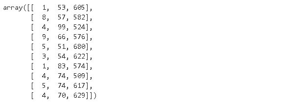

x 表示具有 3 列 10 行的数据帧中的值。列表示特征。每列的平均值和标准偏差:

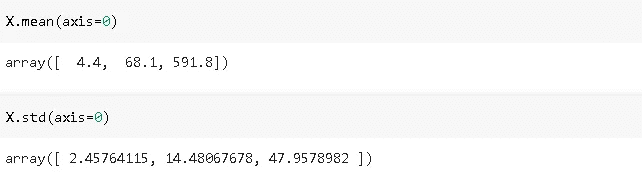

这些列在平均值和标准偏差方面有很大不同。

我们现在可以创建一个 StandardScaler 对象并使 X 适合它。

```
sc = preprocessing.StandardScaler().fit(X)
```

可以通过对 StandardScaler 对象应用 transform 方法来转换 x。

```
X_standardized = sc.transform(X)
X_standardized
```

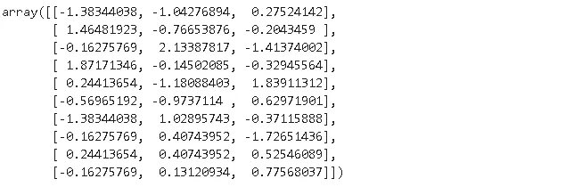

让我们来计算变换后要素的平均值和标准差。

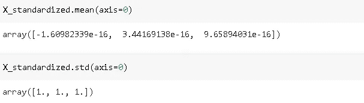

每个特征的平均值非常接近于 0，并且所有特征都具有单位(1)方差。请注意，标准差是方差的平方根。标准差为 1 表示方差为 1。

我想在这里强调非常重要的一点。考虑到我们正在进行监督学习任务，因此我们将数据集分成训练和测试子集。在这种情况下，我们只对标准的 scaler 对象进行`fit`训练集，而不是整个数据集。当然，我们需要转换测试集，但这是通过转换方法完成的。

*   StandardScaler.fit(X_train)
*   standard scaler . transform(X _ train)
*   standard scaler . transform(X _ test)

将整个数据集拟合到标准缩放器对象会导致模型了解测试集。然而，模型不应该学习任何关于测试集的东西。它破坏了列车测试分离的目的。一般来说，这个问题被称为**数据泄露。**

[](/data-leakage-in-machine-learning-6161c167e8ba) [## 机器学习中的数据泄漏

### 如何检测和避免数据泄露

towardsdatascience.com](/data-leakage-in-machine-learning-6161c167e8ba) 

当我们转换测试集时，由于转换中使用的定标器是基于训练集的，因此这些特征将不具有精确的零均值和单位标准差。测试集中的变化量与训练集中的变化量相同。让我们创建一个样本测试集并转换它。

```
X_test = np.array([[8, 90, 650], [5, 70, 590], [7, 80, 580]])
X_test
```

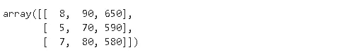

```
X_test_transformed = sc.transform(X_test)
X_test_transformed
```

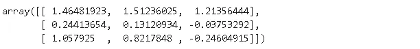

测试集各列的平均值和标准偏差:

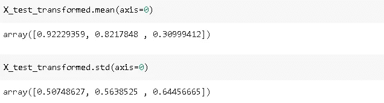

# **最小最大缩放器和鲁棒缩放器**

将数值范围提高到相似水平的另一种方法是在特定范围内缩放它们。例如，我们可以将每一列压缩到 0 和 1 之间，使得缩放前的最小值和最大值在缩放后变成 0 和 1。这种缩放可以通过 scikit learn 的`**MinMaxScaler**` 来实现。默认范围是[0，1]，但是我们可以使用 feature_range 参数来更改它。

```
from sklearn.preprocessing import MinMaxScalermm_scaler = MinMaxScaler()
X_scaled = mm_scaler.fit_transform(X)
X_scaled
```

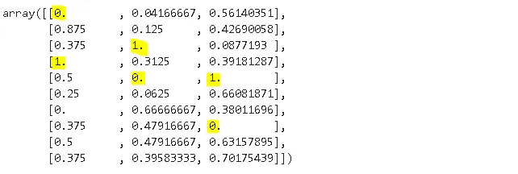

```
mm_scaler2 = MinMaxScaler(feature_range=(0,10))
X_scaled2 = mm_scaler2.fit_transform(X)
X_scaled2
```

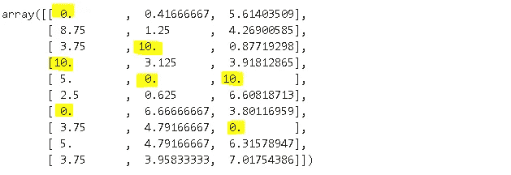

`StandardScaler`和`MinMaxScaler`对异常值不稳健。假设我们有一个值在 100 到 500 之间的特性，其异常值为 15000。如果我们用`MinMaxScaler(feature_range=(0,1))`缩放这个特性，15000 被缩放为 1，所有其他值变得非常接近下限，即 0。因此，我们最终得到了一个不成比例的比例，这对模型的性能产生了负面影响。一种解决方案是移除异常值，然后应用缩放。然而，删除异常值并不总是一个好的做法。在这种情况下，我们可以使用 scikit-learn 的`**RobustScaler**` 。

`**RobustScaler**`顾名思义，对离群值具有鲁棒性。它会移除中位数，并根据分位数范围(默认为 IQR:四分位数范围)缩放数据。IQR 是第一个四分位数(第 25 个四分位数)和第三个四分位数(第 75 个四分位数)之间的范围。`RobustScaler` 不以预定间隔限制缩放范围。因此，我们不需要像对 MinMaxScaler 那样指定一个范围。

我们可以通过在之前的数据集中添加一行异常值来查看`MinMaxScaler`和`RobustScaler`之间的差异。

```
X_new = np.append(X, np.array([[50,420,1400]]), axis=0)X_new
```

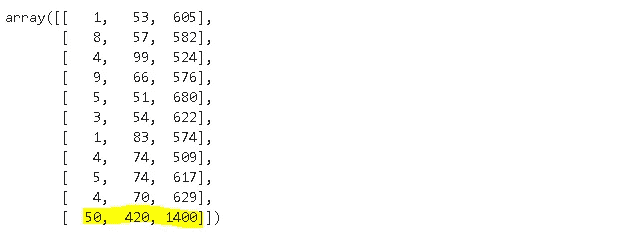

我们先用 range [0，1]来套用`MinMaxScaler` 。

```
X_new_mm = mm_scaler.fit_transform(X_new)X_new_mm
```

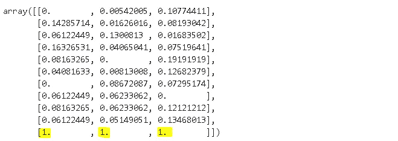

超出范围上限的异常值。因此，所有其他值都非常接近下限。

`RobustScaler`怎么样？

```
from sklearn.preprocessing import RobustScalerr_scaler = RobustScaler()
X_new_rs = r_scaler.fit_transform(X_new)X_new_rs
```

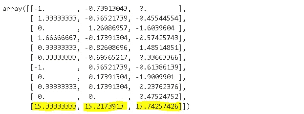

# **什么时候用哪个？**

我们已经讨论了标准定标器、最小最大定标器和鲁棒定标器。许多机器学习模型受益于具有相似规模的特征。然而，没有一个严格的规则来定义哪种转换对于特定的算法是最优的。

MinMaxScaler 和 StandardScaler 对异常值都很敏感。因此，在我们无法移除异常值的情况下，RobustScaler 是比其他两个更好的选择。

在没有异常值的情况下，MinMaxScaler 在大多数情况下表现良好。然而，深度学习算法(例如，神经网络)和回归算法支持具有正态分布的特征。对于这种情况，StandardScaler 是更好的选择。

这些是最常用的转换技术，可以满足我们的一般需求。Scikit-learn 还提供了更多具体的转换，在预处理包的[文档](https://scikit-learn.org/stable/modules/preprocessing.html)中有解释。

感谢您的阅读。如果您有任何反馈，请告诉我。