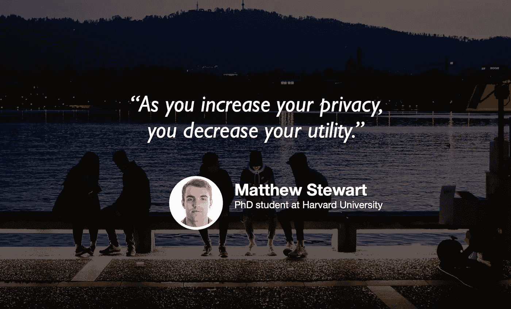

# 环境科学中的数据隐私和机器学习

> 原文：<https://towardsdatascience.com/data-privacy-and-machine-learning-in-environmental-science-490fded366d5?source=collection_archive---------74----------------------->

## [苹果](https://podcasts.apple.com/ca/podcast/towards-data-science/id1470952338?mt=2) | [谷歌](https://www.google.com/podcasts?feed=aHR0cHM6Ly9hbmNob3IuZm0vcy8zNmI0ODQ0L3BvZGNhc3QvcnNz) | [SPOTIFY](https://open.spotify.com/show/63diy2DtpHzQfeNVxAPZgU) | [其他](https://anchor.fm/towardsdatascience)

## 马修·斯图尔特在 [TDS 播客](https://towardsdatascience.com/podcast/home)

*编者按:迈向数据科学播客的“攀登数据科学阶梯”系列由 Jeremie Harris 主持。Jeremie 帮助运营一家名为*[*sharpes minds*](http://sharpestminds.com)*的数据科学导师初创公司。可以听下面的播客:*

2015 年的一个周四下午，我在手机上收到了一条自发通知，告诉我在当前的交通状况下，开车去我最喜欢的餐馆需要多长时间。这令人担忧，不仅因为这意味着我的手机在没有明确询问的情况下就已经知道了我最喜欢的餐馆，还因为这表明我的手机对我的饮食习惯了如指掌，知道我特别喜欢在周四出去吃饭。

随着我们的手机、笔记本电脑和亚马逊 Echos 收集越来越多的关于我们的数据，甚至更多，数据隐私正成为研究、政府和行业应用越来越大的担忧。这就是为什么我想与哈佛大学的博士生和数据科学撰稿人 Matthew Stewart 谈谈，以了解数据隐私背后的一些关键原则。Matthew 是一位多产的博客作者，他在哈佛的研究工作专注于机器学习在环境科学中的应用，这也是我们在这一集讨论的话题。

以下是我最大的收获:

*   进入机器学习的博士课程变得越来越难，但如果你对研究生院级别的机器学习或数据科学死心塌地，你可以选择一个你有专业知识的主题(如环境科学、地质学或物理学)，并找到一种用数据科学工具解决它的方法。
*   随着机器学习工具变得越来越用户友好，Matthew 的经历真正表明了主题专业知识变得多么重要。他更像是使用数据科学工具的环境科学家，而不是解决环境科学问题的数据科学家。这也是我们在行业中越来越多地看到的趋势，也是建立个人项目以解决你深刻理解的主题的一个很好的理由。
*   像 k-anonymity(我们在播客中定义和讨论的)这样的简单数据隐私方法有严重的缺点，包括它们不允许我们客观地量化它们提供的隐私程度。出于这个原因，替代策略，特别是包括不同的隐私变得越来越重要。
*   随着公司和政府开始更加关注数据隐私问题，我们消费的公开数据被私有化将变得更加普遍。因此，理解不同私有化技术在实践中的工作原理是负责任地使用这些数据的关键。

你可以在推特上关注马修，这里是 T1，你可以在推特上关注我，这里是 T2，这里是 T3。