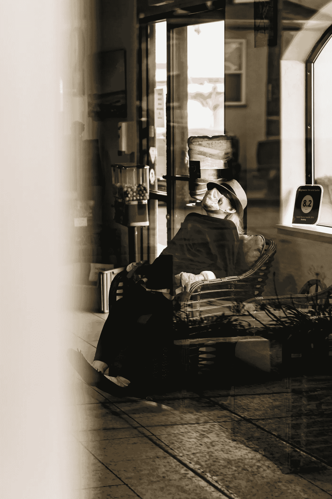
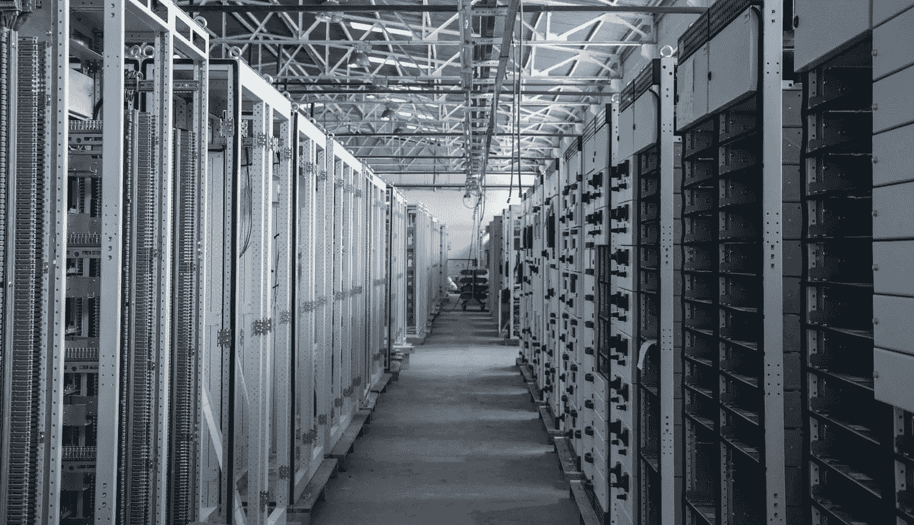

# 疫情中的数据隐私

> 原文：<https://towardsdatascience.com/data-privacy-in-a-pandemic-901e828b850a?source=collection_archive---------73----------------------->

## [数据隐私](https://towardsdatascience.com/tagged/data-privacy)

## 分析新冠肺炎接触追踪的不同方法

由[蒂姆·莫斯霍尔德](https://unsplash.com/@timmossholder?utm_source=unsplash&utm_medium=referral&utm_content=creditCopyText)在 [Unsplash](https://unsplash.com/s/photos/corona?utm_source=unsplash&utm_medium=referral&utm_content=creditCopyText) 上拍摄的照片

世界各地的国家开始逐渐重新开放，政府正在考虑所有的选择，希望控制未来的疫情。

他们的圣杯:联系追踪应用

专家已经对这些应用的安全性和有效性提出了担忧。但在此之前，我们先来讨论一下模拟。

对于我们很多人来说，这可能是第一次听说[联系寻人，](https://www.webmd.com/lung/news/20200504/what-is-contact-tracing-and-how-does-it-work#1)但这并不是什么新鲜事。公共卫生官员使用接触追踪已经有几个世纪了。最值得注意的是，遏制性病/性传播感染。

首先，他们隔离感染者以防止进一步传播，然后他们追踪与他们接触过的每一个人。他们做所有这些*而不透露个人的身份*。最后一部分对这一行动至关重要，追踪接触者不需要透露身份，隐私是至关重要的。

那么，政府和私人公司做了什么来把这个过程带到数字世界呢？好吧，让我们讨论一下正在使用的两种方法。

照片由[i̇smail·埃内斯·艾汉](https://unsplash.com/@ismailenesayhan?utm_source=unsplash&utm_medium=referral&utm_content=creditCopyText)在 [Unsplash](https://unsplash.com/s/photos/centralized-server?utm_source=unsplash&utm_medium=referral&utm_content=creditCopyText) 上拍摄

# 集中方法

在集中式方法中，用户的手机将他们的 GPS 位置以及他们在那里的时间发送到中央服务器。英国国民医疗服务系统和法国都决定走这条路。

集中式方法的最大缺陷是:安全性和隐私，以及电池。

政府知道他们的公民在任何给定时刻的确切位置曾经是老大哥的噩梦，让乔治·奥威尔夜不能寐。一个疫情之后，全球数百万人自愿提供这些信息。作为一个美国人，不信任政府是文化的一部分，但在一些年轻人的反乌托邦小说中，提供近乎实时的位置是毫无疑问的。

英国和法国辩称该应用程序是安全的，数据不会被用于除了追踪联系人之外的任何目的。在一个理想的世界里，通过 GDPR 向欧盟公民提供的保护(甚至不确定这如何与英国退出欧盟合作)将给予他们必要的法律保障。但是，如果政府撒谎并非法使用数据，谁来让他们负责？同一个政府？

除了老大哥，专家们还提出了对恶意行为者获取数据的担忧。英国的联系追踪应用程序目前正在怀特岛进行测试。与此同时，他们还共享了 cybsecurity 专家的信息，以获得反馈。正如任何人可能已经猜到的那样，[网络安全专家发现了一些安全漏洞。雪上加霜的是，他们的一个建议是转向分散的方法，这是他们上个月](https://www.businessinsider.com/cybersecurity-experts-find-security-flaws-in-nhs-contact-tracing-app-2020-5)[已经拒绝的](https://news.yahoo.com/nhs-rejects-apple-google-coronavirus-150047833.html)。

要让任何联系追踪应用程序工作，无论是集中还是分散，手机都必须持续广播信息。加上手机一整天都要这样做，这会对电池造成损害。然而，集中式方法有一个额外的缺点，特别是对于 iOS 设备。苹果不允许应用程序在后台广播蓝牙信息。苹果已经向各公司明确表示，它不会放松这些限制。为了解决这个问题，iOS 上的一些应用需要[保持开放才能工作](https://www.theguardian.com/australia-news/2020/may/15/covid-safe-app-australia-how-download-does-it-work-australian-government-covidsafe-covid19-tracking-downloads)。

新加坡试图在使用集中方法和解决公众关切之间达成平衡。新加坡开源了他们的应用，并声明除非[他们转正](https://www.bloomberg.com/news/articles/2020-05-23/singapore-contract-trace-app-is-opt-in-as-long-as-possible-fm)，否则数据不会共享给中央服务器。

如果这是真的，新加坡可以成为其他仍然坚持使用中央集权方式的国家的榜样。剩下的最后一个问题是选择加入/选择退出的困境。

作为世界上最大的民主国家，印度已经要求公民下载该应用程序，如果他们想继续工作或避免可能的惩罚。即使是新加坡，尽管选择加入，也表示它可能不会永远是可选的。美国阿拉巴马大学系统“鼓励”教职员工和学生使用他们的应用程序，但不确定他们是否会要求在校园内使用。由于世界各地的数据保护法仍然相当有限，个人可能会发现自己被迫下载这些应用程序。如果不是他们的政府，他们的雇主或杂货店或任何其他他们希望合作的企业。

由于这些举动，印度[的一名程序员绕过了应用](https://www.buzzfeednews.com/article/pranavdixit/india-aarogya-setu-hacked)。现在，他们可以带着一个不断显示“安全”的徽章自由行走，而无需广播任何数据。这是最好的情况。专家们都担心[个人发出假阳性](https://www.brookings.edu/techstream/inaccurate-and-insecure-why-contact-tracing-apps-could-be-a-disaster/)。这样做，到头来弊大于利。

照片由[像素](https://www.pexels.com/es-es/foto/mujer-telefono-inteligente-vehiculo-efecto-desenfocado-4429299/?utm_content=attributionCopyText&utm_medium=referral&utm_source=pexels)上的[赖爷子](https://www.pexels.com/es-es/@ketut-subiyanto?utm_content=attributionCopyText&utm_medium=referral&utm_source=pexels)拍摄

# 分散处理方法

苹果和谷歌的合作引领了这种去中心化的方法。两家公司最近都发布了各自手机的更新，增加了这一选择加入 API。

API 的工作方式非常简单，用户的手机会创建经常变化的识别码。如果手机在相当长的时间内检测到附近有另一部手机，这两部手机将交换当前的识别码。如果用户被诊断患有新冠肺炎病毒，该应用程序将通过服务器广播他们之前 2 周的代码。每个人的手机都会定期检查这个服务器，如果发现与被感染代码匹配的，就会收到通知。

通过这种方法，电池仍然是一个问题，因为蓝牙需要一直打开，但在 iOS 设备上，它不会像集中式方法那样必须打开。

到目前为止， [Switzerland](https://www.engadget.com/switzerland-swisscovid-coronavirus-contact-tracing-app-pilot-153813626.html?guccounter=1) 是第一批在他们的应用中测试这种 API 的公司之一，澳大利亚政府已经表示他们也将[在他们现有的应用中实现这种 API](https://www.theguardian.com/australia-news/2020/may/15/covid-safe-app-australia-how-download-does-it-work-australian-government-covidsafe-covid19-tracking-downloads)，德国[在之前致力于集中式方法](https://news.yahoo.com/coronavirus-german-contact-tracing-app-174902502.html)之后也采用了这种 API。

## 所以，分散的方法是完美的，对不对？

嗯，不幸的是，没有。抛开隐私和安全问题，功效仍然是一个问题。

如果新冠肺炎的诊断是由用户输入的，那么肯定会有一些恶意软件发出假阳性，对公众对该应用的信任产生负面影响。

你没带手机的时候呢？或者你的手机没电了？或者穷人和老年人可能根本没有可以安装该应用程序的[手机？](https://appleinsider.com/articles/20/05/13/nhs-admits-contact-tracing-app-wont-work-on-older-iphones)

我赞扬苹果和谷歌致力于将安全和隐私置于设计中心的 API。我也要赞扬开发联系人追踪应用程序的软件工程师。然而，这是新技术；我们还不确定它到底有多有效。即使它完美地工作，你被通知你可能已经暴露于该病毒，可能是在你已经暴露了其他人之后。

接触追踪应用程序不能替代有效的治疗或疫苗，也不能替代广泛的检测和限制传播的个人防护设备。像其他人一样，我希望这些天的任何事情都会减缓疫情，但重要的是，我们不要从这些应用程序中获得虚假的安全感，最终使病毒传播得更远。

感谢您阅读我的帖子。我很想听听你们的想法，无论是在这里的评论中还是在 [Twitter (@SoyCarlosEO)](https://twitter.com/SoyCarlosEO) 上。